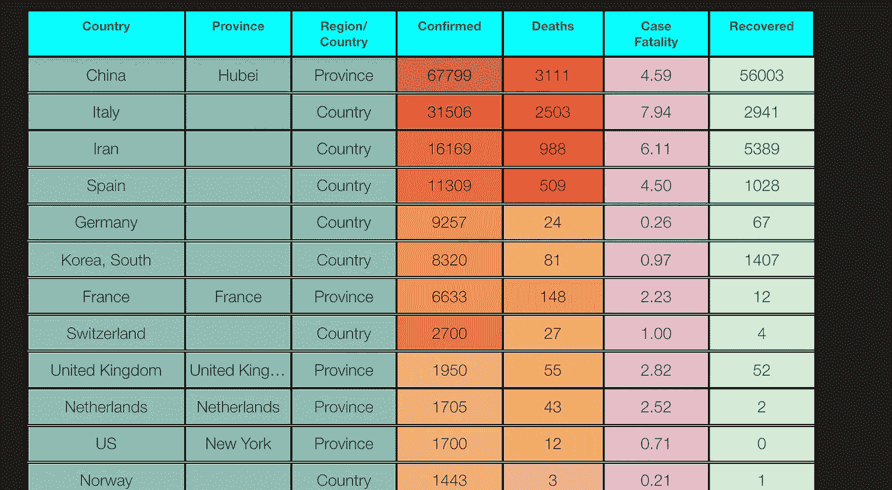
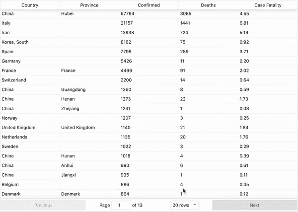

# 反应表展示数据的能力。

> 原文：<https://medium.com/analytics-vidhya/the-competency-of-react-tables-in-exhibiting-data-1bb35bec7c79?source=collection_archive---------20----------------------->

在疫情冠状病毒中，清晰和详细的数据是不可避免的。表格是存储和访问数据的好方法。

[直播](https://coronatable.netlify.com/)现场。[链接](https://github.com/ransing/corona-table)到 git。

> *免责声明:*API 统计可能无法反映实际确诊病例，并导致对病死率的大幅估计。点击阅读更多关于数据[不准确的信息。](https://fortune.com/2020/02/24/coronavirus-statistics-who-data-transparency/)



表格最基本的用途是 Microsoft excel。为了在网络上显示这些信息，我们需要新技术，谢天谢地，新技术正在迎头赶上。

React 是最受欢迎的 javascript 库之一，显然需要在 React 的表格中呈现信息。

谢天谢地，React 中有几个表库。下面我们来列举一下，并设置一个最流行的库(react-table)。

React 中的一些表格库:

1.  r [eact-table](https://www.npmjs.com/package/react-table)
2.  r[eact-数据网格](https://github.com/adazzle/react-data-grid)
3.  r[eact-数据表](https://github.com/nadbm/react-datasheet)

4.r [eact 虚拟化](https://github.com/bvaughn/react-virtualized)

请在这个已编译的[列表](https://bashooka.com/coding/react-table-components/)中找到其他几个库。

现在让我们更深入地研究反应表

*为什么要 react-tables？*

除了是使用最广泛的库之一，它还提供了一个非常好的方法来开始使用基本的基本特性。它支持分页、排序和过滤。钩子的可用性使用户能够构建定制的特性。然而，它也有一些缺点。最常见的是缺乏现成的或内置的用户界面。因此，对于支持触摸的设备上的个人风格和高级滚动功能，

让我们继续构建一个基本的表。对于下面的例子，我们将使用一个[新冠肺炎](https://covid19.mathdro.id/api) api。我们将使用/确诊病例的具体 JSON。

步骤如下:

首先，我们将创建一个 react 应用程序(使用 npm)。

`npx create-react-app covid19-table`

在您的应用程序准备就绪后，我们可以继续安装 react-table 作为依赖项。

`npm install react-table`

在组件或文件中，您必须显示一个表格

`import ReactTable from ‘react-table’;`

如果您使用 react-table 6 或更早的版本，您可以导入以下 CSS:

`import ‘react-table/react-table.css’;`

对于我们的数据来源，我们使用上面的 JSON api。我们需要导入这些数据并将其添加到我们的状态中。

对于一个类组件，我们可以使用`componentDiDMount()`来获取所有数据并设置状态。对于功能组件，我们可以使用`hooks`和`useEffect()`

然后我们需要渲染`<ReactTable><ReactTable/>`

在这个组件中，我们可以像下面这样插入数据

对于列，我们可以将列设置为一个变量，并添加一个具有最少所需键的(对象)数组。既然是列，我们可以用`Header:`这个键给列命名。我们还需要另一个键`accessor:`，它将与来自 api 的信息相匹配(`state`)。在我们的例子中，这是一个列的样子。

```
const columns = [{Header: ‘Country’,accessor: ‘countryRegion’}]
```

我们再给它加一把钥匙。

```
{Header: ‘Confirmed’,accessor: ‘confirmed’},
```

值“已确认”是已确认的新冠肺炎病例的关键字，它返回一个数字。

现在，我们应该可以在页面上看到一个表格。

表设置的整个文件的代码:

呈现的表将自动具有对任何列进行排序的能力。它还配有[分页](https://www.digitalocean.com/community/tutorials/how-to-build-custom-pagination-with-react)。默认排序是按照从 API 获取数据的顺序进行的。



如有任何反馈，请访问 [viraj.info](http://viraj.info) 。