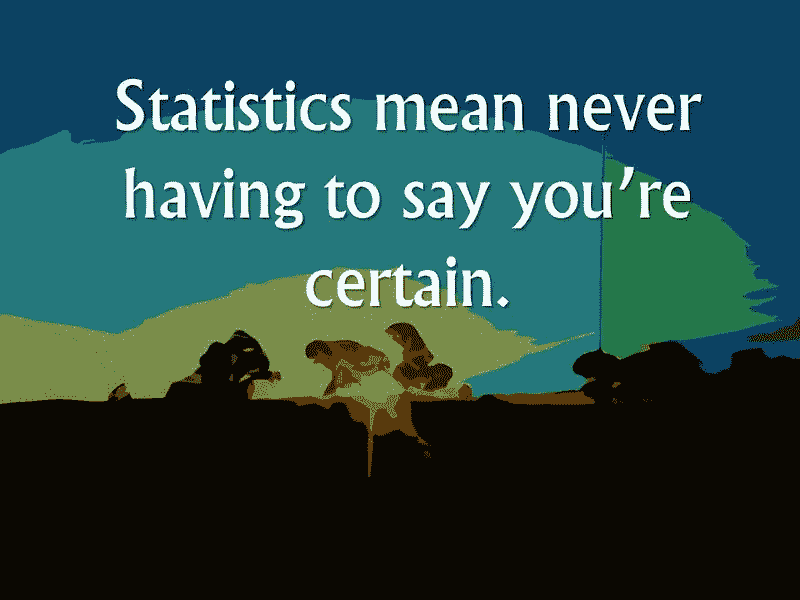
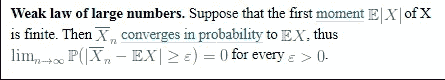
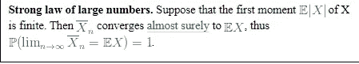

# 大数定律初学者完全指南|关于大数定律的 5 个事实

> 原文：<https://medium.com/analytics-vidhya/the-complete-beginners-guide-to-law-of-large-numbers-5-facts-about-law-of-large-numbers-e33cf0e10ffe?source=collection_archive---------6----------------------->

**大数定律**

[**大数定律**](https://www.youtube.com/watch?v=MntX3zWNWec) (LLN)定义为在确定的实验中选择个别的大数或变量并预测其结果。随着实验次数的增加，结果的比率也增加。根据定律，组合结果的平均值应该接近预期值，这定义了大数定律。

# 大数定律的真实例子:

示例 1-假设大卫去了一个 [***娱乐场***](https://www.bestcasinosites.net/blog/law-of-large-numbers.php)*并且通过在轮盘上旋转来玩一个游戏，因此与玩许多次相比，结果肯定会更少。*

*例子 2-想象你 ***扔硬币*** ，正面&反面的结果是 1/2，但是实验多次结果会不同。因此，如果你掷 50 次硬币，有 25 次正面和 25 次反面的可能性。*

***抛硬币***

# ***关于大数定律的 5 个事实:***

****1-历史*** :该定理由瑞士数学家雅各布·伯努利于 1713 年首先证明，并延续至今。*

***2 局**:大数法则主要用于通过记录众多的结果和比赛次数以及得分来决定棒球&板球的策略。*

****3 -人工智能*** :计算机&超级计算机通过大数定律，利用机器学习，高度依赖百万数据。在统计数据的帮助下，医疗保健、科学、自动驾驶汽车等几个平台越来越受欢迎，也越来越好。*

****4-统计量*** :这个定理可以帮助你证明得到无数的统计量和概率。*

****5 -预测*** :利用大数定律可以做预测。最大的例子之一就是赌博。*

# *大数定律的类型*

*大数定律有两种版本:弱定律和强定律。*

*什么是弱大数定律？*

> *弱定律也称为[钦钦](https://en.wikipedia.org/wiki/Aleksandr_Khinchin)定律或伯努利定理指出，如果变量的样本均值增加样本均值的概率，则该概率收敛于预期均值。与强定律相比，弱定律很容易证明，它给出的结果接近精确结果，但不那么精确。*

**

***弱大数定律的例证***

*什么是强大数定律？*

> *强大数定律可以定义为样本平均均值几乎精确到预期均值。它几乎类似于大数定律，给出的定理非常精确。强定律有点难&冗长，主要用于计算高级定理。现在数学家们把这个定律变得更简单了。*

**

***强大数定律的例证***

# *什么是平均律？*

****平均法则*** 是一种概率或信念，即事件或最终结果会在任何时间很快发生，也许会，也许不会。这是一个被认为接近精确结果的期望。明天可能会下雨，也可能不会，你可能会难过，也可能不会。在真实场景中，它既不是确定的，也不是永久的。*

# *什么是赌徒谬误？*

****赌徒谬误*** 是赌徒遵循的一种错误观念，只因为结果不是最近发生的，而是未来有可能发生，就相信遵循平均法则。玩的时候纯粹是运气，没有这种算计。请不要遵循这种方法，因为当我们失败时，人类大脑内部的**(神经元)会被激活，尤其是在赌博和失败时，然后就变成了 [***赌徒的谬误***](https://www.bestcasinosites.net/blog/law-of-large-numbers.php) 去冒险。***

# ***中心极限定理(CLT)与大数定律(LLN)的区别***

***1-通俗地说， [***中心极限定理***](https://www.youtube.com/watch?v=Pujol1yC1_A) 相比大数定律时需要的数据更少。***

***2- ***中心极限定理*** 不收敛于数而是收敛于一个分布。***

***3-收敛对我来说意味着，随着时间的推移，均值取非期望值的概率几乎为零，因此，分布实际上不是正态分布，而是几乎为零，除了在期望值处。***

# ***心理学中的大数定律***

******

*****心理学中的大数定律*****

***人们经常认为大数定律在现实生活中也是可行的，我在某种程度上同意这一点，因为实际上当你对某件事情做了无数次之后，你会发现最终的结果非常有收获。所以为了成为大师，任何东西都要练习几次，这是非常明显的。***

***例— ***大数定律与股市*** 。***

***十分常见的情况是，80%的人认为股票应该在价格下跌时买入，在价格上涨时卖出。但这种情况不会发生，你应该总是在盈亏平衡点上购买，应该总是根据市场风险来计算他们的风险管理。这就是大数定律的工作原理，所以基本上，当一个交易者交易了无数次，并且用他熟练的技术和计算跟踪了不同的结果，直到他创造了他自己的数据集，模式和技术。***

# ***保险中的大数定律***

******

*****保险中的大数定律*****

***保险公司高度依赖大数定律，通过遵循这个定理，这些公司可以计算他们未来的风险，利润，损失，遵循稳定运行这些大公司。***

****让我们举一个例子* -想象一下，500 个人向大都会人寿保险公司为他的财产支付保险费。即使他们为 10%的订户(即 50 人)因火灾造成的财产损失向您支付费用，他们仍然有 450 人的保险费。这就是他们如何计算他们的风险管理和大数法则的作用。***

# ***人工智能中的大数定律***

******

*****人工智能中的大数定律*****

******人工智能*** 如今是一个大炒作，但当你谈论大数定律时，它肯定会发挥作用，特别是在处理数百万**大数据**和**机器学习**时强大的大数定律。它有助于处理日常生活中的数据组织。就连 IBM 沃森 T21 也是借助大数定律建立起来的，并最终在国际象棋比赛中击败了世界冠军加里·卡斯帕罗夫。***

*****机器学习中大数定律的含义是什么？*****

***1-培训数据***

***2-测试数据***

***3-模型技能评估***

******结论*** :终极理论是做出准确的预测。就连爱因斯坦也花了 4 年时间才证明，在日全食之前，通过太阳附近的光线弯曲后来被证明是引力。20 世纪 30 年代，罗纳德·费雪爵士，一位英国科学家提出了设计实验的指导方针，使用统计学&概率作为判断结果的方法。所以现在如果你看到这个世界上的一切都已经被计算过，并且与数学有关从黑洞到分子。这取决于你如何看待它。***