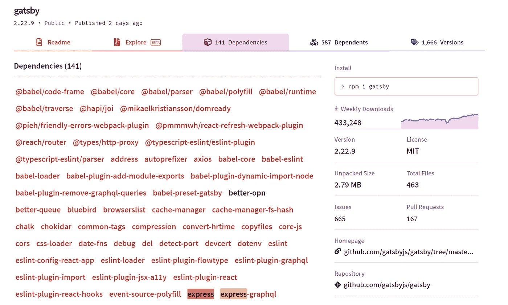

# Npm 完全指南

> 原文：<https://medium.com/analytics-vidhya/the-complete-guide-to-npm-ac52fbc43f6c?source=collection_archive---------8----------------------->


[Npm](https://www.npmjs.com/) (节点包管理器)是 [Node.js](/swlh/node-js-explained-dad7b23d027d) 生态系统的标准包管理器。它是最大的在线软件包库，包含超过一百万个软件包。此外，它还是一个命令行界面工具，开发人员使用它来管理他们的 Node.js 项目。全世界的开发者都使用 npm 来共享他们的软件。React、Vue、Express 和 Angular 都是很好的例子。

# 假人的 Npm

*本节使用类比来解释 npm。如果你理解软件包的概念，你可以跳过。*

假设您想要制造一台笔记本电脑。你会自己创造 CPU、内存、屏幕、软件、摄像头吗？不。您可能会从不同的制造商(骁龙、AMD、英特尔等)订购大部分部件。).你不用从头开始创造一切，而是使用由不同实体组成的各种组件。这本质上是软件包的目标。不需要每个后端开发者都创建一个框架来处理 HTTP 请求；事实上，大多数开发人员使用现有的框架，如 Express、Fastify、Meteor 等。

## 现实生活中的例子

Gatsby(静态反应站点生成器)依赖于 Express。



[https://www.npmjs.com/](https://www.npmjs.com/)

快递靠曲奇。


[https://www.npmjs.com/](https://www.npmjs.com/)

Cookie 不依赖于任何库(使用普通 javascript)。


[https://www.npmjs.com/](https://www.npmjs.com/)

# 统计数据

Npm 被社区广泛使用。下图描绘了过去两年最流行的 web 框架每天的下载量。


h[ttps://www . NPM trends . com/](https://www.npmtrends.com/)

# package.json

一个标准的 Node.js 项目包含一个名为 package.json 的文件。它是一个 json 清单文件，包含应用程序的所有相关数据。就像餐馆的经理，他掌握着餐馆、工人和不同供应商的信息。

下面是一个简短的 basic package.json 的样子:

```
"name": "vreangular", // see what I did there?
"version": "0.0.1",
"description": "",
"author": "Evan Boo",
"license": "MIT",
"dependencies: {...},
"devDependencies: {...},
"scripts": {...},
```

名称、作者、许可证、描述—如果您想要发布存储库，这很重要。

版本 —如果你正在维护一个开源的 npm 包，你应该根据语义约定更新它。3 . 7 . 2–3 是主要版本，7 是次要版本，2 是修补程序。

**脚本**

这里我们展示了项目的脚本:构建、测试、林挺、部署等。每个项目都可以定制适合独特用例的脚本。开发人员可以添加和使用自定义脚本来增强开发能力。例如，在特定目录中执行端到端测试。

```
"scripts": {
  "prebuild": "rimraf dist",
  "build": "nest build",
  "start": "nest start",
  "lint": "tslint -p tsconfig.json -c tslint.json",
  "test": "jest",
}
```

**依赖关系**

构建项目所需的。它们是在一个简单的对象中指定的，该对象将包名映射到一个版本范围。版本范围是符合特定语法的字符串。

```
"dependencies": {
  "@hapi/joi": "^17.1.1",
  "@nestjs/common": "^7.0.7",
  "@nestjs/config": "^0.4.0",
  "@nestjs/core": "^7.0.7"
}
```

**依赖关系**

开发项目而不是构建项目所需的依赖项。例如，测试框架没有捆绑到最终的代码构建中，而是只在开发中使用。

```
"devDependencies": {
  "@nestjs/cli": "^7.1.2",
  "@nestjs/schematics": "^7.0.0",
  "@nestjs/testing": "^7.0.7",
  "@types/express": "^4.17.4"
}
```

# 包锁. json

对于 npm 修改`**node_modules**`树或`**package.json**`的任何操作，都会自动生成`**package-lock.json**`。它描述了生成的确切树，以便后续安装可以生成相同的树。这用于保存包的**精确**副本，以确保程序在不同的机器上运行相同。


该文件旨在提交到源存储库中，有多种用途:

*   描述依赖关系树的单一表示，这样可以保证队友、部署和持续集成安装相同的依赖关系。
*   保持项目中 node_modules 的确切状态，而无需将整个 node_modules 文件夹提交到源代码控制中。

# 节点 _ 模块

当您运行 npm install 时，npm 会将所需的包安装到项目根目录下一个名为`node_modules`的文件夹中。对于大型项目来说，文件夹的大小通常在 150Mb 以上，对于拥有许多项目的开发人员来说，这是一个非常头疼的问题。


node_modules 中的目录

npm 可以在本地或全局模式下安装软件包。如果使用了标志-g，npm 会将软件包安装到当前用户的根目录中。要在 windows 中查找全局安装的 npm 模块，请打开 windows 搜索，然后键入%appdata%。有一个名为 npm 的文件夹—全局软件包位于其中。

当全局安装软件包时，我们按用户安装，而不是按项目安装。有些情况下不建议这样做，例如使用同一个包的不同版本处理多个项目，例如使用 Angular 5 和 Angular 9。


它确实是一个大文件夹

# Npm 命令

## 安装项目依赖项

npm 可以在一个命令中安装一个项目的所有依赖项。这个命令通常在我们克隆一个新项目时使用。

`npm install`

该脚本将始终根据当前 package.json 安装依赖项。如果规范发生变化，并且您再次运行该命令，它将根据新规范安装软件包。

## 执行脚本

`npm run script_name`其中脚本名定义在 package.json ( *build，test:e2e 等。).*

## 安装开发依赖项

`npm install jest -D` -D 将包保存为一个开发依赖项，并且不在构建中捆绑它。

## 列出全局包

向我们显示当前用户的所有全局包。
`npm list --global`

# 故事


[https://yarnpkg.com/](https://yarnpkg.com/)

谈 npm 不能不提纱。Yarn 是脸书工程师创造的一个替代客户。值得注意的是，Yarn 并不是存储节点包的不同存储库，而是处理存储库工作的不同客户端。

# 结论

喔！我们今天讨论了许多概念。快速回顾:

1.  Npm 主要是一个包含 Node.js 项目的存储库。
2.  包对于构建可重用代码和共享代码非常有用。
3.  package.json 是 node.js 项目的清单。
4.  package-lock.json 存储确切的包版本。
5.  node_modules 是包含项目所有依赖项的文件夹
6.  Yarn 是一个由脸书工程师构建的替代客户端，用于处理 Node.js 包。

感谢您的阅读！