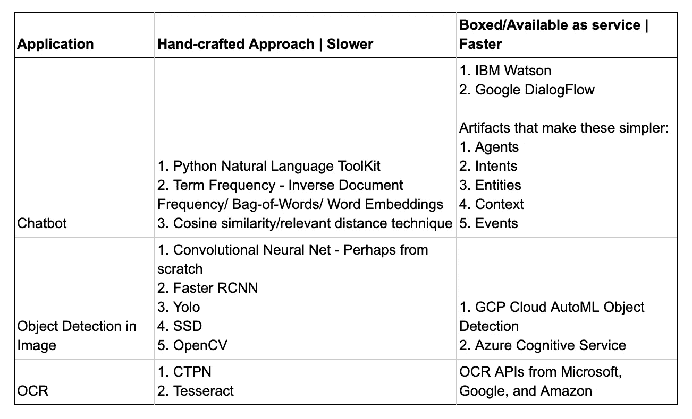

# 数据科学与工程的融合

> 原文：<https://medium.com/analytics-vidhya/the-convergence-of-data-science-and-engineering-ab300849af22?source=collection_archive---------21----------------------->


这是一篇观点文章。在过去的 10 年里，我几乎完全是在和数据打交道。我有幸与一些最敏捷、最具创新性、最勤奋的工程师一起工作，为我们精通数据的客户构建定制应用和见解。

我写这篇文章的目的是从我的角度阐述数据科学领域在过去的 3-5 年里发生了什么。

这是 25 年前宝马 7 系轿车在引擎盖下的样子和现在的样子。


25 年前，一个普通司机不得不开着引擎盖度过的时间——可能每个月一个小时？今天所花的时间——也许每 3 到 4 年花一个小时。几十年来，现代内燃机已经变得那么好了。汽车中所有大小部件的设计和制造精度都非常高。一辆现代普通轿车的使用寿命要比一辆老式昂贵轿车的使用寿命长得多。此外，确保汽车保养的工程服务和主题专业知识也以商品化的价格提供。

现代数据科学——人工智能——机器学习也是一样。

# 定义

请允许我稍微离题一下。由于没有 ISO 这样的权威机构来定义这些术语，以下是我的定义。我将数据科学作为一个总括术语。如果它是一个列表，它将包含这些项目，['描述性分析'，'商业智能'，'预测性分析'，'人工智能'，'机器学习'，'规定性分析'，'自然语言处理'，'视觉计算'，'统计学']。清单上还有更多项目。人工智能是产品或服务的最终用户的体验。它在演示上看起来不错，在对话中听起来也很花哨。它可能是 API 背后的一个基本规则引擎，也可能是一个遗传算法，该算法正在寻找运行工厂的最佳参数组合，从而节省数百万美元的运营支出。只要这项服务的用户得到一种神奇的印象，它就是人工智能。同样的事情，在雇人构建这样的系统的时候，从实现端来说，叫做机器学习。现在，回到正题。

# 该组织

组织的规模决定了他们在构建这样的系统时所扮演的角色。一个大的组织可能会提供专门的角色。接下来重要的是一个组织在数字化光谱中的位置。行业/组织的数字化程度越高，提供的专业角色就越多。

我不打算捅马蜂窝，招聘人员从 1 岁/最近加入的初创公司招募空缺，这些公司希望聘请在 SQL、Scala、Spark、Python、R、时间序列分析、自然语言处理、卷积神经网络等领域拥有 10 年以上经验的博士。

一个只有 100 名员工的非技术公司会被称为数据科学家。组织希望她从使用 ETL 工具编写他们的商业智能管道开始，因为他们正朝着数据成熟度的规模前进。接下来，她会使用电子表格、Qlik 或 Tableau 做描述性报告和仪表板。随着他们的数据需求增加，她现在不得不探索和采用像 Redshift 这样允许水平扩展的分析数据仓库。她将建立一个简单的数据集市模型，并使用 SQL 将报表连接到它。现在，他们希望她预测他们的产品线在未来两个季度的收入。她建立了一个像 JupyterHub 这样的笔记本平台，用 Python 来构建 ARIMA 模型。然后，她需要使用 Flask 将它打包到一个 REST API 中，这个 API 是使用 Kubernetes 服务部署的。同一个人有望满足所有的数据要求。根据轶事证据(我喜欢矛盾修饰法)，不管引用的名称是什么，这是 90%的情况下提供的角色。

一家拥有 1000 名员工的数据成熟型非科技公司的工资单上会有这些人——产品分析师、业务分析师、数据工程师、机器学习工程师、应用数据科学家、决策科学家、研究分析师等。这些特定角色占列表的 5%。

剩下的 5%的空缺来自那些 1 岁的创业公司。公平地说，对于 1 岁的初创公司，我也在看似成熟的组织中看到过这样的职位描述。我把它们归因于人才获取和招聘经理之间的完全脱节。

# 商品

与汽车相反，数字世界发展得更快。预期。类似的转变发生在过去的 5-7 年里，而不是 5-7 年。

从发表研究论文到该算法在云供应商上作为商品功能供公众消费的交付时间很短。复杂的数学算法现在封装在像 ScikitLearn 和 Scipy 这样的库中。

作为实现者，需要知道算法对问题陈述的适用性。一旦知道了这一点，她就以算法期望的格式给算法一个干净的输入。她需要知道内部发生了什么，但只是在缩小的层面上。最后，她必须记录输出。她在这里的目标是确保她的投资回报率高于基线。如果有些地方看起来不太对劲，她应该能够指出有问题的部分。所有现代图书馆都确保这些步骤变得简单。它们清楚地显示了进出的内容，同时保持了中间部分的充分模糊。

这里有一些数学服务商品化的例子-

**统计分析和建模**

构建 ARMA/时间序列模型来预测收入并不一定要成为统计学家。作为一名工程师，人们可以研究统计数据垂直切片，这将有助于他们解决当前的问题。人们必须提前研究的几件事是，他们的数据是否代表平稳的时间序列。这将有助于一个孤立的趋势。然后，人们必须研究并注意周期性和季节性，因为它们可能是其系列的组成部分。

虽然经过了简化，但这就是代码看起来的样子——仔细选择了参数。

```
from statsmodels.tsa.arima_model import ARIMAmodel = ARIMA(df_log, order=(2,1,2))results = model.fit(disp=-1)
```

人们可以通过使用来自脸书的用于时间序列预测的名为 Prophet 的库来进一步简化他们的工作。

```
from fbprophet import Prophetprophet = Prophet()prophet.fit(df)future = prophet.make_future_dataframe(periods=12 * 6, freq=’M’)forecast = prophet.predict(future)
```

效果很好。好到足以得到与手工制作的模型“相当接近”的结果。

**其他应用**



问题是，你公司的核心竞争力与特定模式的联系有多紧密？如果不是，最好采用不太实际的方法。人们将能够更快地展示积极的成果，从而更有可能得到上级的认可，用于生产应用程序用例。

如果你查看上面的表格，即使是较慢的方法也远远不能用 Java 或 c 自己编写算法。这是因为当数据从左到右处理时，它们在每组输出和输入之间提供了更多的旋钮。

# 转变

像 AWS、GCP 和 Azure 这样的云供应商加速了数据科学向工程的转变。机器学习功能在 BigQuery 等分析数据库上是现成可用的。它们非常有用。SQL 是标准语言。数据已经存在于这样的数据库中。在 Python 中，人们不必把它拿出来争论。可以与 Numpy、Pandas 甚至 ScikitLearn 上的功能相媲美的功能都可以用作 SQL 函数。用户定义的函数使它更上一层楼。此外，还有托管机器学习服务，我还没有充分尝试过，但我确信这将进一步帮助数学和工程的可访问性。

满足业务目标。否则，要么是研究项目，要么是爱好。大多数公司希望尽可能快地应用程序，让客户的生活更简单。降低他们的成本。展示现有产品的优势，让利益相关者满意。让他们知道什么是有效的，什么是无效的，这很重要。我读到 70%的机器学习项目最终都被放弃了。从“科学”到工程的转变正在帮助这个数字下降。

使用商品工具的工程师或分析师通过在正确模型的帮助下进行正确的定位，可以帮助公司减少 60%的营销费用。通常，从这一点开始，边际收益递减。为了削减额外 1%的营销支出，花在专业工具和个人身上的钱会增加。

就所施加的技术挑战而言，从简单到复杂的 80%的业务用例可以被工程覆盖。剩下的 20%可能需要数学研究。但是，除非你是一个资金充裕的大企业，否则你可能会考虑更便宜的解决方案来实现所有利益相关者的业务目标。一家较小的公司可以选择聘请一名博士/专家来完成一些关键任务，但他们会希望他们也做描述性分析和管道设计吗？

趋同已经发生了。现代数据科学现在为我们 95%以上的人服务。

# 个人

一个拥有数据背景的工程师可以很好地利用这种新发现的可访问性。这些库有可靠的文档。有经验丰富的专业人士发布的清单，指出在常见情况下应该做什么和不应该做什么。由专家发表和评论的关于各种各样主题的研究论文是可用的。它们就像灯塔一样。介于两者之间的所有内容都可以在上找到——Stack Overflow、Medium、YouTube、Stats。StackExchange 等。

任何有好奇心和驱动力的人都可以深思熟虑地使用这样的库和包，让它们适应自己的用例。工程师们习惯于利用公开可用的软件包将它们堆叠成乐高积木来构建解决业务问题的东西。考虑到优秀的工程师远远多于数学、统计和精算背景的候选人，不管后者的质量如何，像我这样的招聘经理可以填补数据科学家的职位。

现代数据科学家可以使用以下 SQL 在事务数据上构建模型，并立即开始运行预测-

```
CREATE OR REPLACE MODEL mTRANSFORM(ML.FEATURE_CROSS(STRUCT(f1, f2)) as cross_f,ML.QUANTILE_BUCKETIZE(f3) OVER() as buckets,label_col)OPTIONS(model_type=’linear_reg’, input_label_cols=[‘label_col’])AS SELECT * FROM t
```

参考— [大查询回归—创建模型](https://cloud.google.com/bigquery-ml/docs/reference/standard-sql/bigqueryml-syntax-create)

迄今为止，我的经验告诉我，行为比学位更重要。随着新信息的出现，改变自己想法的能力是很重要的。好奇心有助于驱使一个人去解决问题。必须具备很强的沟通技巧。它们有助于搜索网页的能力。面对引用数据点的人的能力使对话朝着正确的方向发展。优秀的数据科学候选人通常博览群书。技术诀窍、编码技能和领域知识的融合有助于适用性。这个软件一直保持着，让数据科学家变得非常高效。这些前面提到的特征使得个人毫不费力地使用这样的软件变得容易。