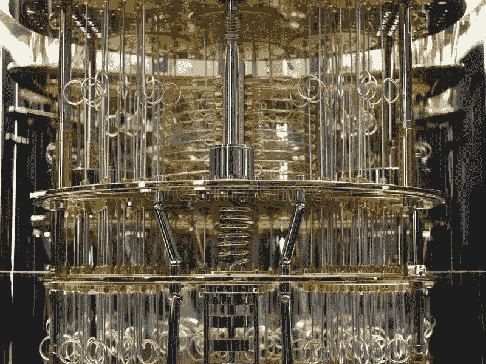
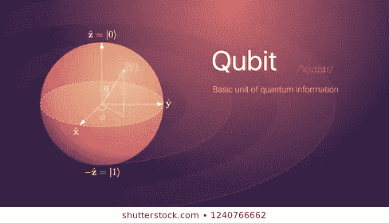
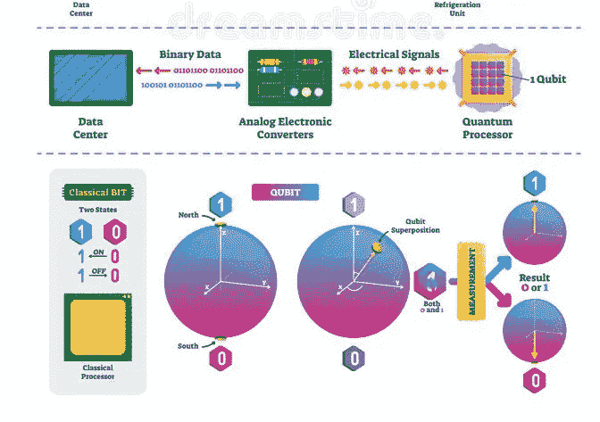
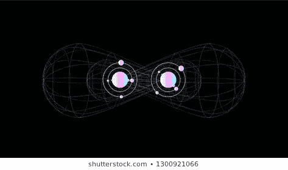
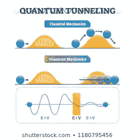
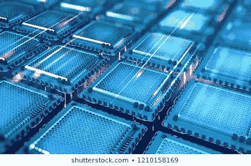

# 量子计算的关键

> 原文：<https://medium.com/analytics-vidhya/the-crux-of-quantum-computing-f9f1f6d72e56?source=collection_archive---------22----------------------->

量子计算已经是 21 世纪最突出的话题之一。它在比传统计算机短得多的时间内处理大量数据的超强能力是它与众不同的主要特征。

你有没有想过量子计算可以实现颠覆整个世界的可能性？

量子计算机的能力超过了世界上所有的超级计算机。

谷歌、英特尔和 IBM 等科技巨头一直在进行一场开发最高效量子机器的漫长竞赛。谷歌在它的一篇论文中发表说，谷歌设备在大约 100 分钟内完成了计算。3 分钟，这甚至需要超级计算机数千年才能完成。

**谷歌 Bristlecone** 是谷歌最新开发的 72 量子位量子芯片。

## 现在，什么是“ ***量子位*** ”？

从**量子力学**的核心概念开始，‘**量子**这个词本质上的意思是‘能量的一个离散量’，而’**力学**这个词的意思是‘机制’。量子力学是量子计算背后概念的核心，根据科学定义，量子计算在原子和亚原子水平上处理光和物质行为。

所有这些粒子都不是分数。它们总是离散的量。量子计算使用这种方法来解决各种问题和计算。

所有的经典计算机都使用“比特”来处理数据。同样，量子计算机使用“量子位”，也就是“量子比特”。

显著的区别是，传统的位不是 0 就是 1，“开”就是“关”，“高”就是“低”等等。然而，量子位的值也可以定义在常规的 0 和 1 之间。

两个常规状态(0 和 1)之间的不同值的整个范围定义了量子位。它可以同时携带 0 和 1 的值。各种常数用于定义量子位中 1 和 0 之间的每个状态。

基本方程***| x>= a | 0>+b | 1>***可以表示 a 和 b 为常数的情况。

这激发了“叠加”的基本原理。

## 现在，到底什么是‘叠加’？

用外行的话来说，同时存在于多个位置的能力就是叠加。关于科学的方法，量子位存在于 0 和 1 之间的任何状态的能力，远离 0 借给他们‘叠加’的力量。

例如，如果我们必须用所有可能的解决方案扫描一个样本空间，那么经典计算机将首先做出所有可能的组合，然后根据提供的约束条件测试它们中的每一个，最后得出结论。如果计算量足够大，这可能需要几年时间。然而，量子计算机会一次扫描整个空间，并立刻给你答案。

量子计算机的这种功能类似于人眼。

比如我们要一次性观察不同的物体，说出哪个最长，那么我们就可以直接看着物体，一次性说出解决方案。

我们必须始终按照要求限制量子位的使用数量，因为量子位越多，复杂性就越大。所有的量子算法结合起来形成复杂的叠加。

经典比特和量子比特之间的关系是 2^n.的形式，这意味着 n 量子比特可以存储相当于 2^n 经典比特存储的数据。将这一概念延伸开来，300 个量子位可以存储与 2^300 经典位一样多的数据，这相当于空间中存在的原子总数。

难以置信，不是吗？

## 现在，你听说过‘量子纠缠’吗？

这是量子计算机表面可能性的另一个主要贡献因素。这意味着任何两个物体之间的相互作用。这基本上意味着，如果任何一个物体发生变化，那么它也会立即反映在另一个物体上，即使它们相距数光年。

## 现在，来谈谈“量子隧道效应”的原理。

这指的是量子比特穿越墙壁的惊人能力。科学上，与具有明确限定的受限区域的电子不同，量子物体没有受限的边界。它们可以在一端消失，在另一端重新出现，仿佛进入了一条看不见的隧道。

这使他们能够一次探索整个空间。然而，经典对象仅限于 0 和 1 之间的转换。

## 最后一个是‘量子至上’。

“量子优势”主要是指量子计算机已经达到了可以执行经典计算机无法执行的所有任务的水平。

所有这些基本原理都是量子计算机工作背后的驱动力。所有这些基本原理都很难让人相信，因为我们在日常生活中不会遇到它们，不像引力这样的经典现象。

量子计算机对技术世界来说是新的，但它们拥有彻底改变我们看待世界的方式的能力。这项技术的最大障碍是要求非常低的温度。它只比绝对零度高几毫开尔文。几乎和太空一样冷。这是因为为了防止电损耗，半导体被用来制造这些量子计算机。

D-Wave 是世界上第一家销售量子计算机的公司。它正在以大约 1500 万美元的价格出售其 10 英尺高的量子计算机。许多编程语言，如谷歌的 Cirq，微软的 Q#等等。通过使用量子算法为量子计算机设计大量的电路。

就像过去的真空管一样，量子计算机现在又大又贵。希望随着逐步发展，它们将很快成为家庭使用的最佳选择。

## 量子计算的优势:

1.比传统计算机快几千倍。

2.由于量子隧道效应，功耗更低。

3.有助于针对各种病毒等找出合适的药物。

4.高效处理大量数据。

5.各种其他技术，如人工智能，当与量子计算合作时，可以创造奇迹。

## 结论:

1.量子计算机是人类的未来，拥有超快的计算速度。

2.所有的量子算法结合起来形成复杂的叠加。

3.叠加、量子隧道和量子纠缠是量子计算机的基本驱动力。

4.谷歌、IBM 等都在竞争生产最高效的量子机器。

5.量子至上是量子计算的终极目标。

感谢您的阅读。祝你有愉快的一天。