# 特伦特和罗博的奇特案例:对破坏性的利物浦助攻王的详细分析

> 原文：<https://medium.com/analytics-vidhya/the-curious-case-of-trent-and-robbo-a-detailed-analysis-of-the-destructive-liverpool-assist-kings-ec9a3a685da5?source=collection_archive---------11----------------------->

在利物浦足球俱乐部的历史上，过去的两年充满了启示和荣誉。进攻足球，令人兴奋的回归，由一个充满活力和喧闹的 Kop 支持，最后但同样重要的是，俱乐部最近所有成功背后的热情的人，于尔根·克洛普。所有这些都使俱乐部成为欧洲的主要火力，最重要的是，通过在 2019-2020 赛季赢得俱乐部的英超联赛冠军，帮助他们克服 30 年的追求。

这种成功很大程度上要归功于世界上最具杀伤力的后卫组合之一亚历山大·阿诺和安迪·罗伯逊。他们两人在利物浦毁灭性的赛季中扮演了不可或缺的角色，在之前的冠军联赛和国内联赛中也是如此，当时红军刚刚落后曼城一分。特伦特和罗伯逊在球场两边给利物浦提供了巨大的创造性和攻击性选择。这种强大的武器在得到双方马内和萨拉赫这样的人的支持时，已经成为反对派防御的一个主要担忧因素。

这篇文章重点分析了利物浦后卫，并使用统计数据、可视化图表和一些比赛镜头剪辑来描述他们对利物浦最近成功的贡献。

> **概述**

利物浦的特伦特·亚历山大-阿诺德和安迪·罗伯逊已经证明了他们是欧洲足坛最多产的两位射手。事实上，他们两个都是现代后卫应该如何踢球的缩影，这正是尤尔根·克洛普希望从他的后卫队伍中看到的，等等。自 2018/19 赛季开始以来，防守二人组总共获得了 48 次助攻。对于任何球员来说，这些数字都令人垂涎，更不用说作为球队主要组织者的两名后卫了。

利物浦在过去两个赛季的表现是他们在球场上结合个人才华和技术灵活性的凶猛的美丽展示。阿诺德和罗伯逊在克洛普的体系下茁壮成长，克洛普完全改变了他的球队的进攻动态。克洛普通常更喜欢 4-3-3 系统，两翼球员组成一对前锋，菲尔米诺在内线连接中场和后卫。由于中场球员在两侧提供防守掩护，罗伯逊和阿诺德大部分时间都在对方半场，在边路效率更高。让我们深入玩家分析。

> **传球能力**

首先，两个后卫的控球都非常舒服。在他们夺冠的赛季中，他们都进入了触球排行榜的前五名，特伦特以 **3665 次触球**高居榜首。

在现代足球中，后卫在进攻中的工作更具挑战性，需要他们对球非常适应。像其他现代经理人一样，克洛普喜欢从后面建立，并有效地利用两翼。他对后卫创造力的依赖也使得这些位置要求更高。这对英国组合在 19-20 赛季总共完成了惊人的 4932 次传球，轻松超过联盟中任何一对后卫。

与联盟中的其他后卫相比，这两人在传球尝试次数和传球完成次数上也高居榜首，如下图所示。

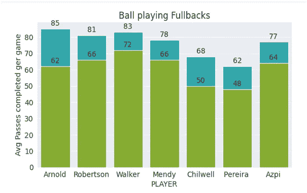

像阿兹皮、沃克和门迪这样的球员传球成功率更高，因为他们比红军搭档更倾向于防守。

与上赛季在英超联赛中传球次数最多的球员相比，特伦特和罗伯逊名列前茅。

他们不仅参与了球队的建设，而且这两名后卫向对方半场的传球次数超过了大多数英超球队的主要组织者。同样令人惊讶的是，从下图可以看出，在联盟中，只有凯文·德布劳内在对方半场 **(78%)** 的传球完成率高于阿诺德和罗伯森，阿诺德和罗伯森分别有**的 63.5%** 和**的 62.6%** 。

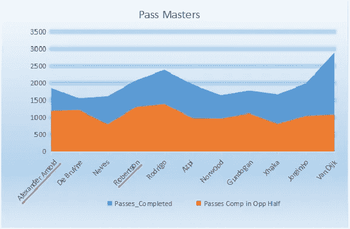

这显示了他们的进攻能力和他们在大部分进球中的大量参与，他们在对方半场的存在经常在防线后寻找萨拉赫和马内的跑动。范迪克，尽管是一名中后卫，但由于利物浦的高线和他准确的长传球选择马内和萨拉赫的远见，他在对方半场得到了很多传球。

> **穿越技术**

这两名利物浦后卫的另一个特点是他们的传中，这让他们更加特别。特伦特在禁区内精准传中的能力对于一名后卫来说是前所未有的。在他们的冠军争夺战中，他试图每 90 次传中 10 次，这远远领先于联盟中的其他组织者或后卫。他的传中潜力是他最大的特点，他的大部分助攻来自大范围。

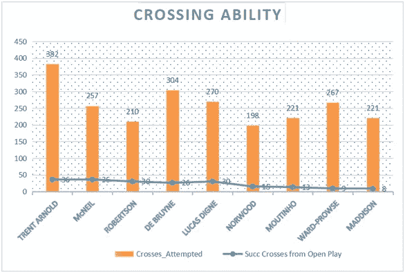

这位土生土长的后卫在公开比赛中成功传中 36 次，是全联盟最高的，只有伯恩利的组织核心麦克尼尔能与之匹敌。正如你从图表中所看到的，即使罗伯逊在尝试传中次数较少的情况下也处于顶点，但仍然以公开比赛中的 **30** 传中结束。虽然阿诺德喜欢提供和尝试各种各样的传中，但罗伯逊在侧脚传球后会选择削减或向内传中。

两个后卫都喜欢不断测试防守，把球传入禁区。经常出现的模式是从禁区附近的两侧向禁区内摆动传中。

还有另一个有趣的原因，为什么利物浦尝试了许多传中，并坚持他们的做法。除了传中本身很危险之外，他们通常会破坏对方的阵型，加上马内、萨拉赫和菲尔米诺这三个擅长篮板和出色反击的进攻三人组，这为他们在比赛中不时得分铺平了道路。

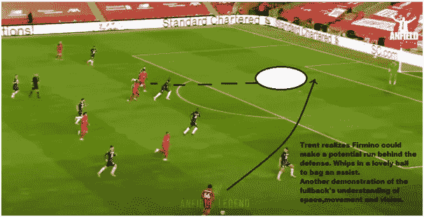

上面的例子来自对阵切尔西的比赛片段，特伦特准确的传中和菲尔米诺及时的跑动足以击败防线。尽管红军没有更高的中场或前锋，但他们有很好的定位感，这有助于他们应对许多空位传球。

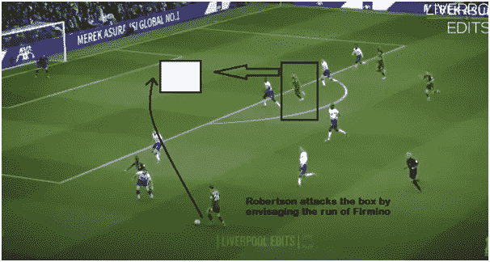

罗伯逊预见到巴西前锋跑向禁区，并提供了一个足以击败戴维森的传中。

当对方防守变得过于狭窄时，阿诺德过来将球大力低传至禁区，稍稍领先于防守队员，如下图所示。

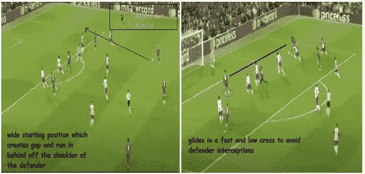

> 作为主要组织者的后卫？

声称现代后卫的角色已经改变是显而易见的，因为这是从 10 年前丹尼·阿尔维斯和马塞洛的出现开始的。但是，最近有一个次要的变化，尤其是利物浦后卫的打法，这是很有道理的。第一次转变是从作为边后卫的边后卫到作为边锋的边后卫，最近的转变是从作为边锋的边后卫到组织核心。

特伦特的传球范围很广，这在后卫中并不常见。他可以通过轻松获得穿透性传球，从任何地方创造机会，这增加了利物浦的阿森纳前进。他不仅因从深处寻找传球而受到称赞，而且还以完美的效率和精确度喷洒这些传球。

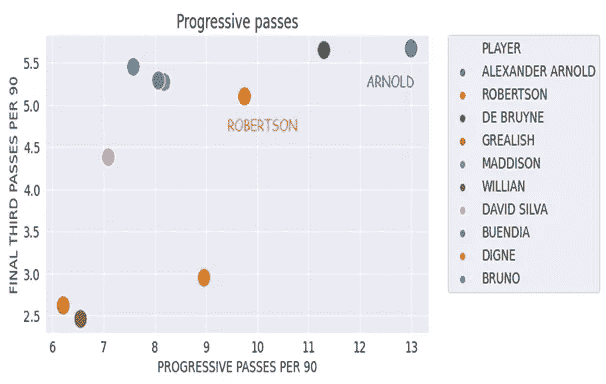

当我们分析渐进式传球统计时，我们可以很好地理解这两名后卫对英超冠军的重要性。作为一支球队的主要指挥者，你需要将传球喷到最后的三分之一，并找到你的前锋的跑动，以创造更多的进球机会。从下面的图表中，我们可以看到后卫们是如何产生影响并与联盟中的其他组织者竞争的。英国人以每 90 分钟 **5.7** 最后三分之一传球高居榜首，而苏格兰左后卫发现 **5.1** 传球进入最后三分之一区域。

传入禁区也是决定组织者能力的另一个关键因素。尽管在 19-20 赛季的排行榜上，德布鲁因和西班牙魔术师戴维·席尔瓦等人名列榜首，但特伦特和罗伯逊在这种情况下确实做出了重大贡献，他们将 **2.5** 和 **1.8** 的传球送入对方禁区。

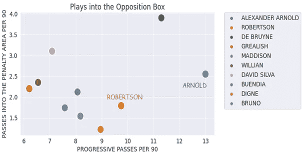

由于旁边有勤奋的中场球员，这对英国组合通常在对方半场的大部分时间里控制比赛。拥有像阿诺德和罗博这样具有技术素质和敏锐度的人，使利物浦能够在中场没有传统传球组织者的情况下运作，这反过来又有利于克洛普的侵略性压迫比赛，让他们能够占据球场的中心区域。

> **理解空间和运动**

有时，当一支球队积极地压迫对手时，他们往往会让球场的一侧超负荷。这给了他们在一个区域的数量优势，并通过赢回球来帮助他们尽快夺回控球权。甚至像利物浦这样的球队也遵循这种技术向对手施加压力，把球赢回来。

但是在控球时，默西塞德队完美地处理了这种压力。通过将如此多的球员安排在一边，紧逼的球队放弃了对面的侧翼，让他们变得脆弱，利物浦充分利用了这一点。这是他们进攻的另一个特点。从一个侧翼到另一个侧翼的跨场斜射球一直是他们的致命武器之一，亚历山大-阿诺德专门研究这一点。让利物浦人在这些时刻与众不同的是他练习传球的速度。球从一边快速射向另一边，给了罗伯逊一个巨大的空间，他进一步利用他的速度和传中技术使这一移动更加致命。从统计数据来看，这种边路切换的风格非常明显。特伦特每场比赛尝试大约 11.5 个长球，轻松超过联盟中任何其他后卫。

以下比赛序列是同一模式多次导致进球的其中一次。这次比赛的特别之处在于，他们已经两次对同城死敌进行了同样的比赛，而他们最近两次都被这种方式击败了。

法比尼奥将球推给右后卫，由于曼城的高压，他几乎没有选择找到附近的传球。

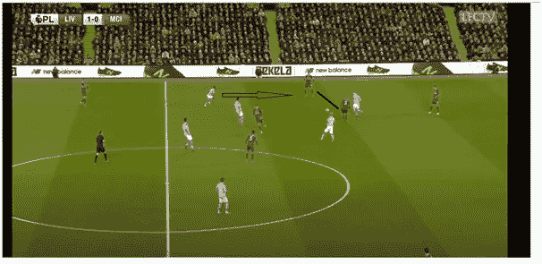

阿诺德看到对面的侧翼空无一人，迅速转向左脚，喷射出一个斜传球，为罗伯逊进攻对方开辟了空间。

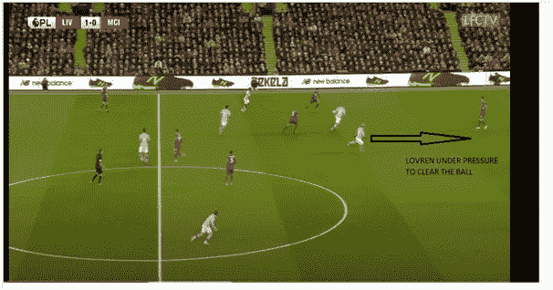

罗伯逊前面有足够的空间，他也看到埃及人跑到另一边，期待传中最终产生一个漂亮的进球。

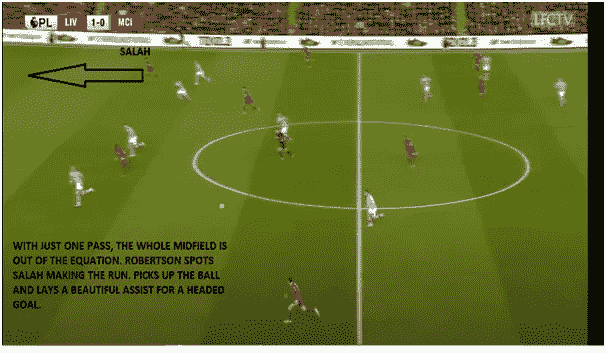

下图是 18-19 赛季的进球剪辑，遵循相同的模式，导致罗伯逊传球近距离完成菲尔米诺。

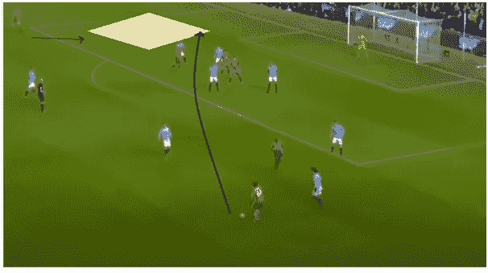

> **防御动作**

这一部分分析了他们两人在一些防守任务上的比赛片段。尽管是他们团队的主要创造者，Robertson 和 Arnold 确实在防守方面做出了贡献，也在许多 1v1 情况下肩负起责任。在他们的夺冠赛季，他们两人平均每 90 次铲球、拦截和解围加起来大约有 **5.5 次** **次。苏格兰人每场比赛完成了 **11.5 次压力**和 **1.7 次盖帽**，而英格兰右后卫设法完成了几乎相同的数字。**

下面是对阵圣徒队的比赛片段，jbjerg 打了一个高飞球来寻找接近的 Ings 和 Armstrong，但 Robertson 的身体定位使他预测到传球并成功拦截。

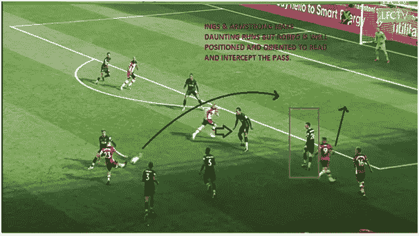

下面是对阵谢菲尔德的比赛中的一个例子，罗伯逊在冲刺和最后一搏时做得非常好，阻止了一个明显的进球机会。从他在禁区内突然冲刺帮助队友的方式，我们可以看出他的意图和渴望。

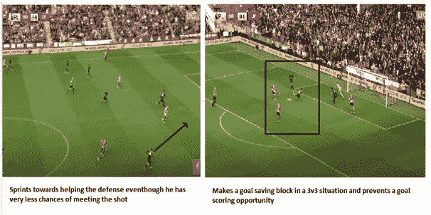

他们不仅在阅读和拦截传球方面非常迅速，而且有很好的身体定位来快速做出反应。

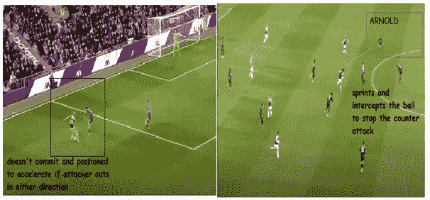

上面的例子展示了阿诺德在 1v1 情况下的一些防守智慧，以及在最后三分之一时拦截传球以阻止反击。

> **玩家对比**

由于我们已经看到了一些对他们两人的分析，现在让我们来看看谁在过去的两个赛季中做得更好。雷达图显示了这两名后卫在 19-20 赛季夺冠，18-19 赛季落后曼城一分，以及同一赛季欧洲冠军的数据。

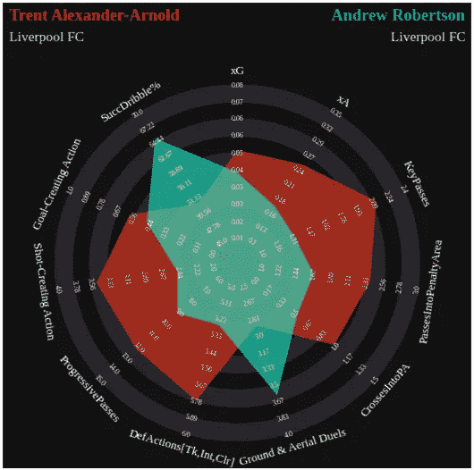

从图表中可以看出，与他的队友相比，TAA 在比赛的许多方面都更胜一筹。利物浦总是试图利用他们的速度，在他们的侧翼打出犀利的长传球，让他们的边锋追逐，而这些主要的发起者不是别人，正是他们的右后卫。亚历山大-阿诺德经常打出更多的高传球来推进他们的比赛，快速的一二传球，也比通常的后卫线更频繁地切入内线，使他成为利物浦的主要组织者。

虽然在组织进攻方面不在同一水平上，但罗伯逊带来了诸如铲球和运球等技能的价值。他是一名经典的后卫，可能不会给他的比赛带来新的维度，但在基本面方面表现出色，可以说是世界足坛最好的左后卫之一。他对红军来说非常有价值，为他的球队的进攻哲学提供了另一种动力。

> **结论**

毫无疑问，安迪·罗伯逊和亚历山大·阿诺德已经成为现代足球后卫革命的缩影。凭借这样的技术水平、对比赛的理解和定位，他们无疑是世界上最有价值的后卫组合之一。与其他后卫的角色相比，这两个人在他们的形象方面有点反常，但随着时间的推移，这种人会变得越来越受欢迎。如果这对爆炸性的组合继续保持相同水平的一致性，毫无疑问，利物浦足球俱乐部将继续收获他们的利益，并在未来赢得更多的奖杯。这很可能是进攻型后卫的终结和组织型后卫时代的开始！