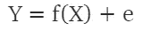
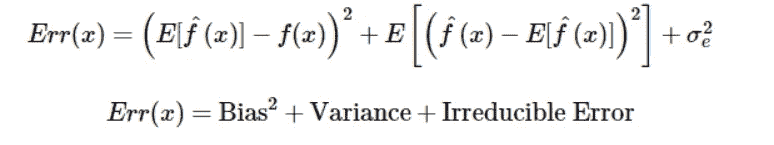
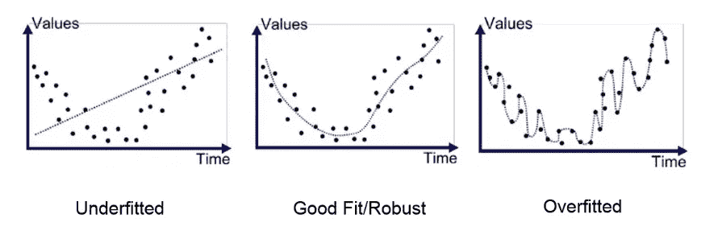
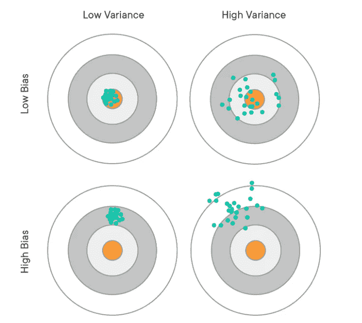
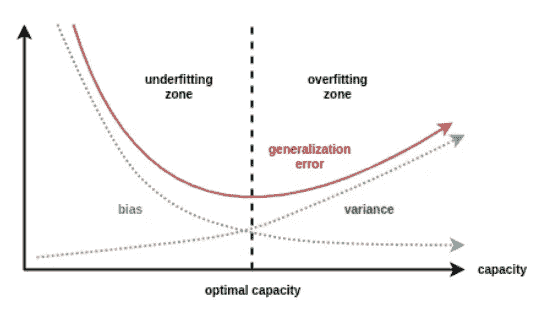

# 装配不足和过度装配的危险

> 原文：<https://medium.com/analytics-vidhya/the-dangers-of-under-fitting-and-over-fitting-495f9efa1847?source=collection_archive---------10----------------------->

对于数据科学家来说，机器学习模型是一个非常强大和有用的工具。构建模型时，重要的是要记住预测会带来预测误差。这些误差是由具有折衷关系的偏差和方差的组合造成的。理解这些基本原理只是建立精确模型和避免欠拟合和过拟合陷阱的第一步！

**返璞归真！**

对监督机器学习的核心理解是，我们正在逼近一个目标函数(f)，该目标函数将输入变量(X)映射到输出变量(Y)。该关系在数学上表示为:

其中 e 代表总误差。总误差实际上可以进一步分为三部分:

*   **的平方*偏向*的学习方法**
*   学习方法的 ***方差***
*   不可约误差

我们将详细讨论这些术语。随着我们对偏差和方差的深入研究，记住我们收集和分析的数据只是一个样本，因此是不完整的，而且有噪声，这一点很重要。模型如何对定型数据进行归纳对于确定模型如何对新数据做出反应非常重要。

**那么什么是偏见呢？**

***偏差*** ，或 ***偏差误差*** ，可以定义为我们模型的预期预测值与我们试图预测的正确值之间的差值。高偏差会导致我们的模型错过我们的特征(X)和目标输出(Y)之间的重要关系，因此它无法学习训练数据或推广到新数据。这也被称为 ***欠拟合*** 。拟合不足的模型被迫做出大量假设，这可能导致不准确的预测。

现在我们对偏见的概念有了基本的了解…

**什么是方差？**

***方差*** 是模型预测对于给定数据点的变异性。它是对训练数据中微小波动的敏感性误差。当存在高方差时，这可能导致随机噪声(e)而不是预期输出(Y)被引入到训练数据中。高方差又称 ***过拟合*** 数据。当数据过度拟合时，模型本质上学习训练数据太好，因此不能推广到新数据。

最后一个误差项是 ***不可约误差*** 。不可约误差本质上是来自我们控制之外的因素的噪声量，无法消除。

我们可以通过查看最佳拟合 的 ***线来识别欠拟合和过拟合。在下面的左图中，我们可以看到这条线很简单，没有遵循许多数据点，因此显示出高偏差。下面的右图显示了几乎每个数据点后面的一条线，即使是那些可能是噪声或异常值的数据点，也显示了很高的方差。我们的目标是在这两个极端之间找到一个平衡点，这样大部分数据点都可以用适当的噪声来解释。***

[https://medium . com/grey atom/what-is-under fitting-and-over fitting-in-machine-learning-and-how-to-deal-it-6803 a 989 c76](/greyatom/what-is-underfitting-and-overfitting-in-machine-learning-and-how-to-deal-with-it-6803a989c76)

偏差和方差之间的关系也可以很容易地使用目标示例来可视化。

目标的中心代表一个预测非常准确的模型。参数或线性机器学习模型(如线性回归和逻辑回归)通常具有较高的偏差，但方差较低(左下角)。非参数或非线性机器学习算法(如决策树和 k-最近邻)通常具有低偏差但高方差(右上)。我们的目标是创建一个误差最小的低偏差和低方差(左上)的模型。

**偏差-方差权衡**

目的是使模型能够适当地对新输入进行归纳和分类。我们可以通过一个更复杂的模型来减少方差，但这样我们就有更大偏差的风险。相反，如果我们有一个复杂度较低的模型，偏差可能较低，但我们有较高方差的风险。偏差具有响应模型复杂性的负斜率，而方差具有正斜率。

[https://djsaunde . WordPress . com/2017/07/17/the-bias-variance-trade off/](https://djsaunde.wordpress.com/2017/07/17/the-bias-variance-tradeoff/)

我们需要找到一个在偏差和方差之间折衷的“最佳点”,以便在训练数据中有足够的噪声来允许泛化，而不会对训练数据进行不准确的分类。这将允许我们找到“最适合”的模型

**怎样才能防止欠拟合和过拟合？**

对于 ***欠拟合*** :

*   确保有足够的训练数据，以便误差/成本函数(例如 MSE 或 SSE)充分最小化

对于 ***过拟合*** :

*   限制模型中特征或可调参数的数量。随着特征数量的增加，模型的复杂性也增加，从而产生更高的过拟合机会。
*   缩短训练时间，使模型不会“过度学习”训练数据。
*   将某种形式的正则化项添加到误差/成本函数中，以鼓励更平滑的网络映射(岭回归或套索回归是常用的技术)
*   交叉验证以最小化均方误差

感谢您的阅读！

**参考文献:**

1.  [https://machine learning mastery . com/over fitting-and-under fitting-with-machine-learning-algorithms/](https://machinelearningmastery.com/overfitting-and-underfitting-with-machine-learning-algorithms/)
2.  【http://scott.fortmann-roe.com/docs/BiasVariance.html 
3.  [https://elitedata science . com/over fitting-in-machine-learning](https://elitedatascience.com/overfitting-in-machine-learning)
4.  [https://medium . com/grey atom/what-is-under fitting-and-over fitting-in-machine-learning-and-how-to-deal-it-6803 a 989 c76](/greyatom/what-is-underfitting-and-overfitting-in-machine-learning-and-how-to-deal-with-it-6803a989c76)
5.  [https://towards data science . com/understanding-the-bias-variance-trade off-165 e 6942 b229](https://towardsdatascience.com/understanding-the-bias-variance-tradeoff-165e6942b229)
6.  [http://www.cs.bham.ac.uk/~jxb/INC/l9.pdf](http://www.cs.bham.ac.uk/~jxb/INC/l9.pdf)
7.  [https://djsaunde . WordPress . com/2017/07/17/the-bias-variance-trade off/](https://djsaunde.wordpress.com/2017/07/17/the-bias-variance-tradeoff/)
8.  [https://www . geeks forgeeks . org/under fitting-and-over fitting-in-machine-learning/](https://www.geeksforgeeks.org/underfitting-and-overfitting-in-machine-learning/)