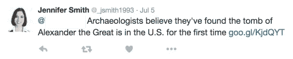

# 数据科学的阴暗面:武器化的自然语言处理

> 原文：<https://medium.com/analytics-vidhya/the-dark-side-of-data-science-weaponized-natural-language-processing-1d1b04034a53?source=collection_archive---------16----------------------->

到现在，即使是最不了解计算机的人也知道要小心点击他们通过电子邮件收到的链接，[，然而全球范围内的网络钓鱼活动数量正在上升](https://info.wombatsecurity.com/hubfs/Wombat_Proofpoint_2019%20State%20of%20the%20Phish%20Report_Final.pdf)。网络钓鱼是一种影响广泛的散弹枪式方法:普通的电子邮件(或其他消息)被发送到详尽的收件人列表中——大多数时候它们很容易被发现。如果你收到一封主动索要个人信息的电子邮件，就会出现危险信号。

还有一种更微妙的方法叫做*鱼叉式网络钓鱼*，其中邮件是针对特定目标策划的。这可以从更简单的(要求您重新设置您使用的网站的密码)到更复杂的(冒充您公司的人力资源部门，或您合作的客户/供应商公司，或假装您认识的人或朋友的朋友)。

网络钓鱼属于社会工程的范畴，即利用欺骗和操纵来获取机密信息。

普通黑客库存照片

2016 年，两位研究人员 John Seymour 和 Philip Tully 发布了一种自动化渗透测试工具(网络安全专业人员使用笔测试来评估系统的安全性)，这是一种有趣的机器学习应用，也是对恶意行为者可能使用何种工具的警告。

这个名为**SNAP _ R**(**S**social**N**network**A**automated**P**hishing with**R**econnaissance)的工具能够自动识别目标，并在 Twitter 上向他们发送定制的钓鱼消息。它建立在一类被称为*递归神经网络(RNN)* 的人工神经网络之上。简而言之，RNN 是一个带有环路的神经网络，可以让它记住更长时间的东西。当 SNAP_R 发布时，rnn 是自然语言处理的前沿工具。如果你想了解更多关于 RNNs 的知识，这篇文章是一个很好的概述。SNAP_R 特别使用了一种叫做长短期记忆(LSTM)网络的 RNN。

递归神经网络的滚动图

它还采用了马尔可夫链模型版本，这是一种非常简单的生成文本的方式。它不会处理超过一定数量的前一个单词，并根据它们决定最有可能的下一个单词是什么。

## **SNAP_R**

研究人员在推特上做出决定有几个原因:

*   之前有过自动发送鱼叉式网络钓鱼邮件的尝试，但都不太成功。
*   Twitter 上可接受的英语语法门槛要低得多(研究人员称之为“Twitterese”)
*   Tweets 有一个字符限制(注意:自从这个工具发布以来，Twitter 上的字符限制翻了一番，从 140 增加到 280，这让我想知道这个变化是否会影响工具的性能)。

[这是他们论文的链接，社会工程的数据科学武器化:Twitter 上的自动化 E2E 鱼叉式网络钓鱼](https://www.blackhat.com/docs/us-16/materials/us-16-Seymour-Tully-Weaponizing-Data-Science-For-Social-Engineering-Automated-E2E-Spear-Phishing-On-Twitter-wp.pdf)，还有[这是他们在 DEFCON 24 上的演讲](https://youtu.be/l7U0pDcsKLg)的链接。

## 识别目标

SNAP_R 获取 Twitter 用户名列表，然后扫描他们的个人资料。它根据用户个人资料中显示的信息(职位或公司)、他们与关注者的互动以及帖子指标，将用户分组。如果用户被预测为高价值或可能被网络钓鱼，该工具将继续并开始扫描其完整的发布历史记录。它还会查看他们发帖的频率，以及他们何时回复收到的推文。

## 鱼叉网络钓鱼

然后，SNAP_R 根据收集到的发布历史数据创建一条针对该用户的定制消息。它会在用户最有可能使用 Twitter 和回复消息的时候自动发送推文。该消息还包含链接或 DEFCON SECTF 问题(“社会工程捕获标志”)。你可以在 pdf 文件的[第 9 页找到具体的问题，这些问题包括‘你使用什么杀毒系统？’或者“你用的是什么操作系统？”).](https://www.social-engineer.org/wp-content/uploads/2016/11/Social-Engineer-Capture-The-Flag-DEFCON24-SECTF-2016.pdf)

LSTM 模型在网络钓鱼语言数据集上进行了预训练，然后进一步植入了目标用户的 Twitter 帖子。马尔可夫链模型的一个有趣的优点是它是语言不可知的，因为它只使用从用户发帖历史中收集的语言。

他们认为点击或回答他们的问题是一个“pwn”，或成功的妥协。

他们机器生成的推文的一个例子

## 结果

他们能够实现 30%到 66%之间的成功率(取决于他们想要如何保守地定义成功)。他们指出，以往常规大规模网络钓鱼活动的成功率在 5-14%之间，而手动鱼叉式网络钓鱼的成功率为 45%。这使得 SNAP_R 比常规的网络钓鱼更加成功，可与手动鱼叉式网络钓鱼相媲美——但它是完全自动化的！

## **最终想法**

我认为这项关于鱼叉式网络钓鱼的研究是一个了不起的项目，因为它展示了(以我的经验来看)不是一个常见的讨论话题的能力和功能，我想让人们普遍意识到社交媒体的安全性。

该技术在安全之外也有广泛的应用——想想社交媒体参与或类似模式支持的广告活动。30%的点击率是营销人员梦寐以求的！

来源:

*   [https://info . Wombat security . com/hub fs/Wombat _ proof point _ 2019% 20 state % 20 of % 20 the % 20 phish % 20 report _ final . pdf](https://info.wombatsecurity.com/hubfs/Wombat_Proofpoint_2019%20State%20of%20the%20Phish%20Report_Final.pdf)
*   [https://www . black hat . com/docs/us-16/materials/us-16-Seymour-Tully-weapolizing-Data-Science-For-Social-Engineering-Automated-e2e-Spear-Phishing-On-Twitter-WP . pdf](https://www.blackhat.com/docs/us-16/materials/us-16-Seymour-Tully-Weaponizing-Data-Science-For-Social-Engineering-Automated-E2E-Spear-Phishing-On-Twitter-wp.pdf)
*   [https://www . Social-Engineer . org/WP-content/uploads/2016/11/Social-Engineer-Capture-The-Flag-defcon 24-SECTF-2016 . pdf](https://www.social-engineer.org/wp-content/uploads/2016/11/Social-Engineer-Capture-The-Flag-DEFCON24-SECTF-2016.pdf)