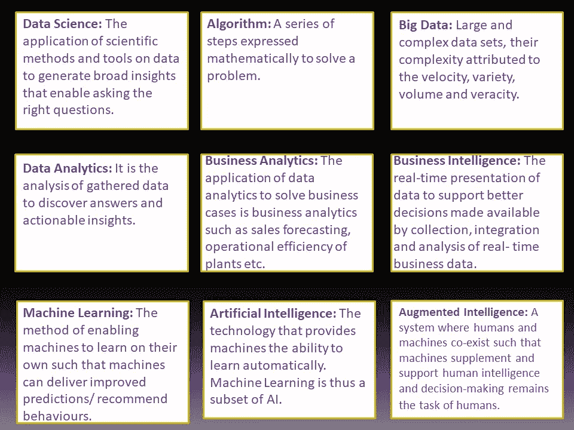
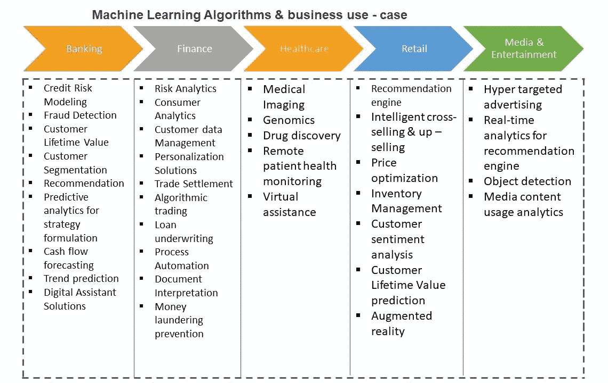

# 面向初学者的数据科学入门

> 原文：<https://medium.com/analytics-vidhya/the-data-science-primer-for-beginners-5d5e81497b12?source=collection_archive---------32----------------------->

您是否想知道“数据是新的石油”对您的企业的意义，或者利用分析、人工智能和人工智能的数字化转型如何为您的组织增加价值；但是被数据和分析世界的狂热所淹没？

如果您的回答是肯定的，那么这本初级读本可能是您需要了解并参与该领域有意义的讨论以及驾驭数据科学浩瀚海洋的知识库。

## “行话”

在数据和分析对话中使用了大量术语，这些术语经常被松散地或可互换地使用。对于初来乍到的经理来说，这让谈话变得很困难。下面定义的术语并不完全详尽，但肯定会作为帮助您开始的入门读物。

数据科学中最常用的术语

## **机器学习算法基础知识**

如前所述，机器学习(ML)是一种通过向系统提供数据输入来使系统能够自主学习的方法。从根本上说，ML 是通过以下方式解决问题的过程

1.  收集干净、可用的数据集。
2.  定义算法——即要遵循的一系列步骤。
3.  基于数据集建立模型。
4.  训练和测试模型以预测已识别问题的解决方案。

机器学习分为监督学习、非监督学习和强化学习。这些名称不言自明。让我们举一个简单的例子，教一个蹒跚学步的孩子英语字母表。在这个过程中，老师使用抽认卡、手写字母和/或描绘字母 A 到 z 的拼图。通过重复，孩子学会了区分字母。训练一台机器的过程没有什么不同。抽认卡、手写字母和拼图组成了数据集(在这种情况下被标记)，视觉显示卡片的重复是机器在未来遇到相同数据时用来预测结果的算法。这是监督学习，即需要预测的目标(例如图像的正确标签)在学习过程中被馈送给机器。

另一方面，无监督学习是一种学习系统，其中最终目标事先不知道，系统通过自己的迭代来学习它。强化学习可以比作当孩子表现良好时奖励他/她的行为，否则既不奖励也不斥责。因此，孩子(当前上下文中的机器)被激励每次都表现得更好。

广泛实施的机器学习用例

## **价值复杂性矩阵分析**

根据数据分析为组织提供的价值以及提供这些价值所涉及的复杂性，数据分析分为五类。

1.  描述性分析——低价值和低复杂性的活动。描述性分析依靠过去的数据生成部门或组织级别的报告，使经理和团队能够直观地了解他们的业务表现。这类分析有助于回答“发生了什么？”例如管理信息系统报告。
2.  诊断分析—中低价值和中低复杂性活动。诊断分析有助于评估问题“为什么会发生什么？”例如建立假设和解决问题。
3.  预测分析—中高价值和中高复杂性。预测分析有助于回答“下一步会发生什么？”例如预测建模。
4.  规定性分析—高价值和高复杂性。说明性分析有助于回答“采取什么决策来提高绩效？”例如制造业的物联网、自动驾驶汽车等。

## **从分析、ML 和 AI 中获取价值的五个关键点**

综上所述，在开始数据科学项目时，请阅读下面要记住的要点。

1.  ***了解并定义你的问题:*** 一个清晰、简洁、可衡量的问题是任何项目、数据科学或其他方面入门的根本要求。问题陈述应该非常具体，例如“如果加入，哪些代理将执行？”，“哪个客户会拖欠付款？”。同样重要的是定义将定义项目成功的度量标准。问题的清晰定义和度量标准的识别是成功的一半。
2.  对其他方法持开放态度:问题的内容和原因比问题的方式更重要。因此，永远不要试图用人工智能或人工智能来寻找答案。有必要理解其他的选择可能比 AI/ML 解决方案更好地解决你的问题。使用经典的 MECE 方法建立假设(互相排斥，集体穷举)，并在数据和智能判断的支持下拒绝/接受它们。
3.  ***做好接受概率性 vs 确定性结果的准备:*** 数据科学是数学、统计学、计算机编程和深层领域知识的融合。结果的统计概率应该在实现之前就被理解，并被业务经理接受，这样就不会对其能力感到迷惑。例如，对销售代理在下一次任务中的表现的预测可以用一定的概率来预测，并且应该照原样接受。代理可能会/可能不会按照模型预测的结果执行，这些结果可能没有考虑到，例如最近 COVID-19 爆发的黑天鹅事件。
4.  ***建立迭代和持续反馈的文化:*** 数据科学项目的迭代开发方法确保比瀑布方法更经常地联系领域专家。构建第一个模型，并在领域专家的帮助下不断执行错误分析，以改进您的模型，使其满足业务需求。这有助于整合动态的、不断变化的业务需求，并为更敏捷的团队铺平道路。
5.  ***驾驭讲故事的力量:*** 所有的项目都是以观众为中心来实施的。数据科学项目的受众可能是业务领导、最终用户、联络中心代理、入职团队等等。问题的解决方案应该以这样的方式呈现，即它容易理解，清楚地解释，并为观众提供可操作的见解。不代表清晰可辨的解决方案的项目失败了，尽管构建了导致精确结果的优秀模型。