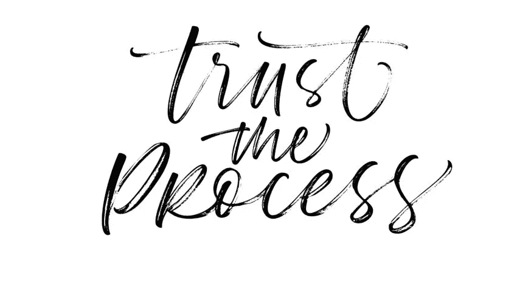
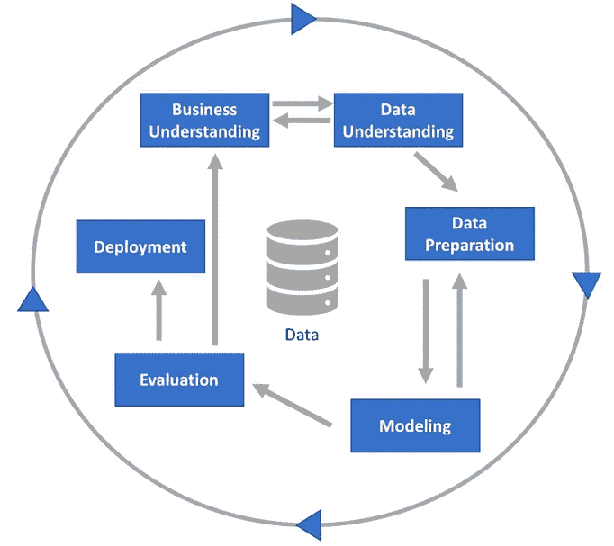
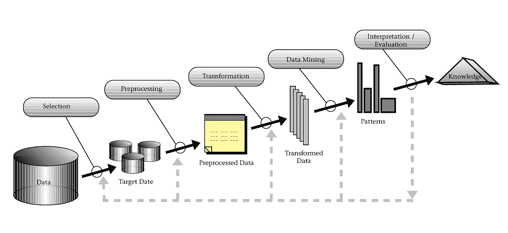
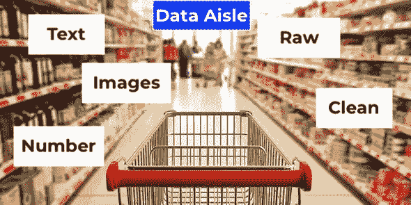
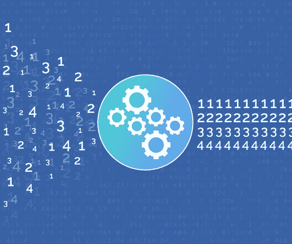
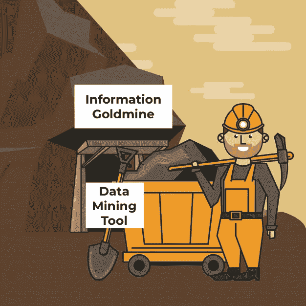

# 数据科学过程

> 原文：<https://medium.com/analytics-vidhya/the-data-science-process-a4c97ed38fce?source=collection_archive---------36----------------------->

# 介绍

如果你在过去的一年里没有生活在岩石下，你可能听说过术语*数据科学*。否则，让我赶上你的速度。[数据科学](https://simplystatistics.org/2013/12/12/the-key-word-in-data-science-is-not-data-it-is-science/)是一个跨学科领域，使用特定的流程从各种形式的数据中提取信息。许多人认为这个领域是最近几年才出现的，实际上它已经存在了将近[半个世纪](http://10.1145/3076253)！

毫无疑问，由于互联网的出现，数据科学才成为一个热门词汇；看看它的存在是如何在如此短的时间内产生了不可估量的各种类型的数据。这种大量的数据后来被雄辩地命名为“大数据”，这正是数据科学家、统计学家或任何与数据打交道的人更感兴趣的工作。

尽管数据相关职业的前景已经发生了巨大的转变，但是检索信息的过程仍然是一样的。一些人把它称为数据库中的知识发现(KDD)过程(我在以前的文章[中提到过，这里是](/ai-in-plain-english/sentiment-classification-using-xgboost-7abdaf4771f9))，而另一些人把它称为数据挖掘的跨行业标准过程(CRISP-DM)。然而，为了简单明了，从现在开始我将把它称为**数据科学过程**。

图一。CRISP-DM 工艺，图 2。 [KDD 进程](https://infovis-wiki.net/wiki/Knowledge_Discovery_in_Databases_(KDD))

# 该过程

总之，数据科学流程阐明了数据科学项目的一般**生命周期，从选择目标到通过数据科学手段实现目标。这是指 KDD 进程和 CRISP-DM，并基于我对它们的理解。**

数据科学流程**有 6 个步骤，本质上是循环的**。这意味着，在从后面的步骤中获得新信息后，可以重新访问整个过程中的任何步骤。这是为了反复调整每一步使用的方法，以更好地与目标保持一致或提高结果的准确性。

## **第一步——确定目标:**

图三。[目标设定](https://solopracticeuniversity.com/2019/10/23/how-million-dollar-attorneys-unleash-the-power-of-goal-setting/)

在开始任何项目或任何与数据相关的工作之前，一个基本步骤是**设定目标**。问这个问题，*“你想从中得到什么，为什么？”*。这一步通常需要了解一些业务和数据。

商业理解肯定会有助于引导项目背后的动机，并将其与洞察力的最终有用性联系起来。例如，如果你从事销售业务，了解客户流失率可能有助于实现长期利润最大化。因此，你通过收集客户流失率洞察来实现利润最大化的动机将是你的项目目标。

另一方面，了解您将使用的数据也将大有裨益。您在项目中使用的不同类型的数据可能会极大地影响您的工作流程，并且由于数据是项目的一个组成部分，因此它绝对是一个潜在的成败因素。因此，了解您的数据有助于管理预期，并为您的项目规划出可行的方法。

## **第二步—数据选择:**

图 4。数据选择[Pinterest]

如果您还不知道，数据对于这个过程的任何部分都是必不可少的。玩笑归玩笑，理解什么样的数据是需要的**或者什么样的数据更适合用于你的项目是非常重要的。**

除了显而易见的，如使用文本进行文本分析或使用图像进行对象检测，还有其他方面需要考虑。按照前面的一个例子，假设你想分析你的业务流失率。你收集哪种数据？你的顾客多久购买一次？(整数值)客户购买的时间有多近？(日期)或者客户到目前为止已经花了多少钱？(货币)或者这三种都有？所有这些都是需要考虑的，并且通常是根据你的项目目标量身定制的。

还需要提及的是**信息的来源和真实性**，这就提出了“你从哪里获得数据，它有多可靠？”。互联网上的数据量如此之大，人们绝对应该考虑从中提取的数据的正确性。例如，如果你从一个官方网站下载一个文件，你的数据很有可能是准确的，而不是简单地通过网络抓取从任何其他网站获取数据。如果你只是在做一个自私的项目，也许真实性并不重要。但是，如果您正在从事一个您的业务所依赖的项目，那么明智的做法是对您将要使用的数据三思而行。

## **第三步——数据预处理:**

图五。数据预处理

如果你还在上学，你在课外得到的数据往往是肮脏的，如果你不是，那么你可能知道我在说什么。虽然对于那些不知道的人来说，我所说的脏数据是指丢失的值、同一数据集中不同的格式，或者可能只是工作数据集中不必要的数据点，并且由于所有这些障碍，在这一点上实现数据挖掘工具将变得毫无用处。正如已故的威尔夫·黑伊在 1965 年表示的那样:

> 垃圾进，垃圾出

因此，在实际处理项目之前，需要对数据进行一些清理。

基本的清理操作通常需要从数据中去除噪声或收集更多信息以解释噪声，选择一种方法来处理丢失的数据，并解释时间序列数据和已知的变化。既然所有的预处理都完成了，现在是转换的时候了。

## **步骤 4 —数据转换:**

图六。[数据转换](https://www.alooma.com/blog/what-is-data-transformation)

我自己做过几个数据科学项目，总结这个步骤的最好方法是——为你的挖掘工具浓缩你的数据。基本上，通过**将你的数据分解成要素**，你可以更容易、更清晰地挖掘数据。

根据数据集的不同，有许多方法可以做到这一点。例如，如果您使用的是文本数据，比如一个句子，您可能希望去掉标点符号和停止使用的单词，只保留那些足以保留原句子含义的单词。除此之外，您还可以将文本数据转换成数值。像矢量化和记号化这样的方法在这方面会有所帮助。我在上一篇文章中讨论了文本数据的清理。[这里](/ai-in-plain-english/sentiment-classification-using-xgboost-7abdaf4771f9)是链接如果有兴趣的话！

另一方面，如果你正在处理数字数据，你可以标准化或规范化其中的一些数据，或者甚至可以将它们的数值转换成排名！如果你有太多的数字变量，你可能只考虑保留必要的。更好的是，也许将所有这些变量转换并总结成更少的变量。这个技巧是一个全新的主题，叫做[特征工程。](https://www.kdnuggets.com/2018/12/feature-engineering-explained.html)

接下来的步骤将涉及通过数据挖掘工具传递您的数据，因此重要的是确保您在此处转换的数据适合于所述工具的输入。无论是数据类型(字符串或整数)还是列的命名和数量。

## **步骤 5 —数据挖掘:**

图 7。数据挖掘

如上所述，这是您**通过数据挖掘**工具传递转换后的数据的步骤，该工具将返回潜在的有见地的信息。不言而喻，不同的数据挖掘工具有其不同的特点，这也意味着你必须**选择一个适合项目**目标的工具。因此，举例来说，如果目标是对某样东西进行分类，那么使用像逻辑回归模型这样的分类工具是可行的。

选择正确的数据挖掘工具是一个巨大的话题，因为有许多不同种类的[工具](https://datascience.foundation/sciencewhitepaper/data-mining:-models-and-methods)和[用例](https://www.datasciencecentral.com/profiles/blogs/the-7-most-important-data-mining-techniques)。有外推和预测值的工具，有将数据点聚集在一起的工具，甚至还有模拟工具，允许人们从这些工具中观察模式。由于这一步可能会变得非常复杂，所以我就不赘述了。相反，我将像这样总结整个步骤:使用数据挖掘工具对转换后的数据进行挖掘，提取出最能满足目标的信息。例如，如果您的目标是找出您的客户流失率，您可以使用数据挖掘工具来预测客户的流失率。

## **步骤 6——解释和评估:**

图 8。数据探索[Gettyimages]

在这最后一步，评估方法被用来确定你是否达到了你的目标。如果你试图预测以前发生过的事情，一种简单的方法是比较实际和预测。然而，有时事情并不那么简单，这就是[探索性数据分析(EDA)](https://www.omnisci.com/learn/data-exploration) 的用武之地。顾名思义，EDA 基本上是通过任何必要的手段来探索你所拥有的结果。可以通过绘制图表或图形来展示分布情况。只要你设法用更直观的方式描述结果。

做完 EDA 后，是时候问问自己是否达到了目标。如果还没有，那么是时候**反思和评估前面步骤**中使用的方法了。正如我早些时候提到的那样，这一过程本质上是循环的。因此，如果你对你的项目有所了解，就有可能回到这些步骤。例如，也许你意识到用当前的数据可以实现更好更精确的目标，或者你偶然发现了更好的数据来实现当前的目标。

在这一步中，人们将不断地提出问题，这些问题将有助于完善每一步中使用的每一种方法的组合，从而最终实现项目的目标。

# 结论

在讲述这一过程的过程中，我不禁对那些从事数据相关职业的人的潜力感到惊讶。对于一个数据科学家来说，这确实是一个激动人心的时代。面对如此庞大的数据量，人们只能想象从中可能挖掘出什么样的洞见。更不用说它们被泵出的速率和它们进入的各种形式。

感谢您读到这里！

记住要保持安全，并相信这个过程。