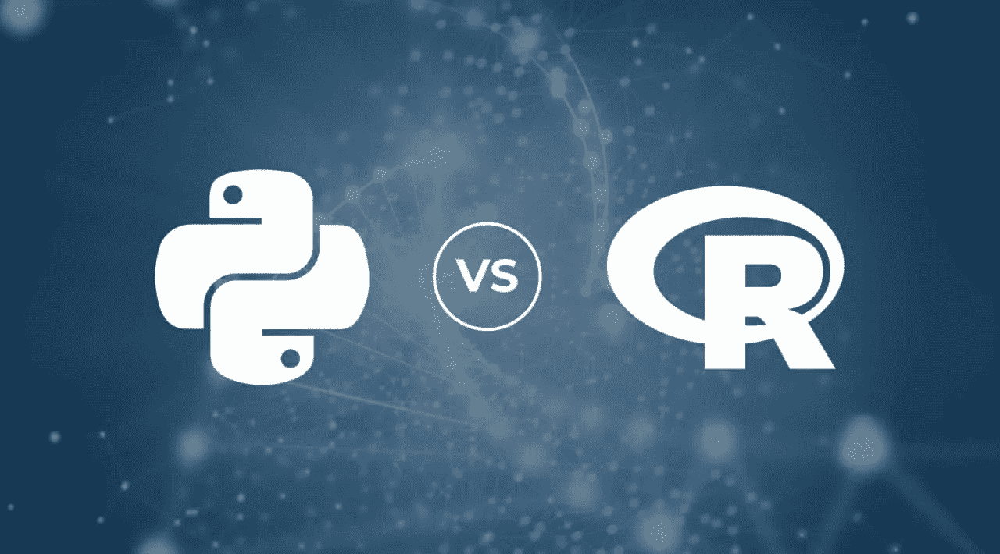

# 数据科学热潮:R 与 Python，有什么不同

> 原文：<https://medium.com/analytics-vidhya/the-data-science-rush-r-vs-python-whats-the-difference-c24d3c90733a?source=collection_archive---------17----------------------->

因克丁预测，数据科学家将是 2020 年最热门的新兴职业之一。

组织正在努力在全球范围内满足对数据科学专业人员的预期需求。数据科学行业的技能短缺被认为是一个至关重要的挑战，如果无人管理会在更大范围内威胁到企业。

对于一名 [**有抱负的数据科学专业人士**](https://www.dasca.org/) 来说，第一步也是最重要的一步是对 Python 和 R 等编程语言有一个基本的了解。尽管有些人可能更喜欢 Python 而不是 R 编程，但对于一名数据科学家来说，学习这两种编程语言是最理想的。

其他资源和社交媒体平台，如 Stack Overflow、Reddit 和 Twitter，将 Python 列为大多数数据科学家使用的首选语言，其次是 R、SAS 和 MATLAB。

尽管如此，根据 TIOBE 和 IEEE Spectrum，R 和 Python 已经被列为世界范围内最常用的两种语言。

让我们深入了解这些编程语言的复杂性。这两种语言都提供了独特的特性、工具和选项，可以根据每个人的需求最大限度地满足他们的需求。再往前，让我们先说说 Python，然后是 r。

# **Python**

目前，在 Python 包索引(PyPI)中大约有超过 183，000 个 [**Python 包**](https://www.dasca.org/world-of-big-data/article/identifying-and-removing-outliers-using-python-packages) ，这超过了在综合 R 档案网(CRAN)上记录的大约 14，385 个的 R 包。

Python 编程正在吞噬当今世界。然而，数据科学家应该转向这两种语言，以保持适销对路。

尽管 R 和 Python 都是强大的语言，但在某些领域，这两种语言比其他语言更具优势。

Python 是一种通用编程语言，被认为是部署机器学习模型的重要工具。如果与其他传统语言相比，Python 是 ML 的最佳选择。

# **为什么？**

*   简单来说就是因为它平易近人的学习曲线所以好学。它很容易阅读，尤其是对于那些刚刚开始数据科学之旅的人来说。
*   编程世界中最大的社区之一是 Python。
*   Python 是一种面向对象的编程语言，因此也被称为一种强大的工具。它还有自动化和交互工具，是构建智能自动化任务的首选。
*   说到库，Python 提供了很高的可扩展性，这是一个具有更广泛的多个库的附加功能。这些库需要不同的代码集合，为复杂的数据科学问题提供更简单的解决方案。

# **数据科学专业人士必须掌握的顶级 Python 库:** -

👉 **Tensorflow** —由谷歌在 2015 年创建，Tensorflow 在内部用于机器学习解决方案。自从 ML 发布以来，它就被定位为最常用的库。Dropbox、Airbnb、优步和 Snapchat 是一些使用 Tensorflow 的顶级公司的名字。

👉 **Keras** — Keras 对深度学习很重要。Tensorflow 确实提供了深度学习功能，但是，Keras 是一个更受欢迎的库，因为它是从头开始编写的，只为深度学习应用程序提供特定的重点。

👉Scikit-learn —由于它提供了广泛的工具，所以它是一个不错的机器学习库。它用于数据分析，如数据分类或数据结构化。

👉PyTorch 是另一个可用于深度学习应用的库。

👉 **NumPy** —这应该是 Python 的第一个下载库，尽管用户希望利用它进行数据分析或机器学习。

其他库包括用于数据可视化的 Matplotlib、用于图像处理和分类的 Caffe、用于数据操作的 Pandas 以及用于图像处理的 OpenCV。

# **R**

r 编程语言用于数据分析和统计建模。因此，如果您正在处理庞大的数据建模概念，那么您的首选工具将是 r。

它大量用于分析结构化和非结构化数据。无论如何，R 编程已经成为执行统计分析的标准工具。但是，您可以找到一些不同于其他数据科学编程语言的独特特性。

# **特性:-**

👉使用向量进行多种计算——R 是一种向量语言，可以轻松地为单个向量添加功能，而无需将其放入循环中。

👉在不使用任何编译器的情况下运行代码——它是一种解释型语言，因此，在不使用编译器的情况下运行代码是可能的。

👉由于强大的可视化库，如 [**ggplot2 和 plotly**](https://www.dasca.org/world-of-big-data/article/r-not-statistical-computing-anymore) ，用户可以利用美观的图形工具——以其令人惊叹的可视化而闻名。

r 编程对商业同样有益。怎么会？因为它是一种开放源码的编程语言，所以可以很容易地根据用户的需要进行修改和再分发。就可视化能力而言，R 是一个理想的选择。

以前，R 只在学术界使用，然而，随着数据科学的出现，这种语言也在业界广为人知。

作为初学者，学习 R 和 Python 是他们数据科学之旅不可或缺的一部分。拥有广泛的知识和工作经验不仅会增加候选人对数据科学的理解，还会进一步为他们提供使用正确工具解决数据科学问题的经验。