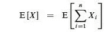
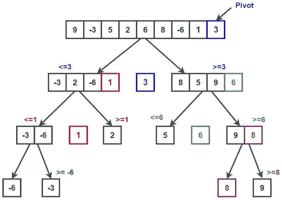
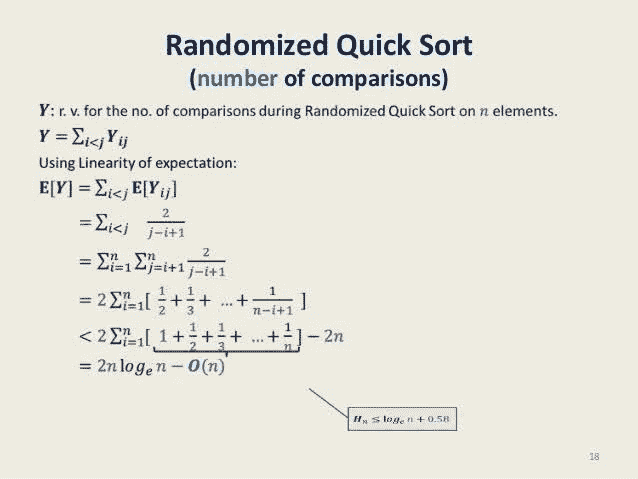

# 分解规则:快速排序示例

> 原文：<https://medium.com/analytics-vidhya/the-decomposition-rule-quick-sort-example-9b01e54729d?source=collection_archive---------15----------------------->

> 目标

*   概率概念的快速介绍。
*   用概率术语解释分解规则。
*   快速排序示例。

分解规则是一种非常基本和简单的方法，但在分析随机化算法和处理难概率问题时非常有效；但它建立在一些概率概念上。

我将快速浏览一些我们从概率中需要的重要概念，并丢弃不必要的部分。

> 样本空间:它基本上是来自我们实验的所有可能的空间。

例如，如果我们掷骰子。我们的样本空间将是(1，2，3，4，5，6)，所以你不要期望从这个实验中得到 7，我们将在这个例子的基础上继续进行。

> 事件:我们感兴趣的样本空间的子集。

用我们最近的例子，假设我们想知道得到一个偶数的概率，这叫做事件。

概率是 0.5，因为可能的偶数数是所有可能结果数的一半。

> 随机变量:它是样本空间上的函数；用来得到某一事件的概率。

所以一个随机变量会在两次掷骰子中得到#个偶数。

所以 X(1)是我们掷骰子两次至少得到一个偶数的概率。

> 期望值:结果概率加权的平均值。

两次掷骰子的期望和表示为:

> E[X] = 7

我不会深入讨论这个输出的细节，因为在解释下一个期望时会变得更容易。

> 期望的线性:随机变量的和的期望等于期望的和。

使用线性期望解决我们的最后一个问题，我们的随机变量是两次掷骰子的总和，现在我们可以使用一个更简单的随机变量，它是一次掷骰子的预期结果，我们称它为 Y。

> E[Y] = (1+2+3+4+5+6)* (1/6) = 3.5
> 
> E[X] = 3.5 + 3.5 = 7

我们刚刚做的是使用分解规则。

这使得我们很容易给规则下一个好的定义。

> 分解规则:它把我们的问题分成更简单的随机变量，利用线性期望，我们可以解决预期的问题。

## 快速排序:

1.  我们从数组中随机选择一个支点。
2.  我们的主子程序是围绕这个支点对元素进行排序(较小的元素在左边，较大的元素在右边)
3.  对左右数组递归地做同样的事情。

# 分解规则分析:

*   首先，我们应该定义我们的随机变量，让我们称之为 Y，随机变量应该定义算法在排序子程序中元素之间的比较次数。
*   然后，我们将随机变量简化为 Y_ij，它是一个指示变量(输出 0 或 1)。如果两个元素要进行比较，I 和 j 是排序数组中元素的顺序。

> 这不是很明显，但快速排序中的两个元素不能比较两次，因为我们只比较元素和我们的枢纽，然后我们分成两个数组，所以我们不会比较同一个元素两次。

*   使用图中所示的线性期望，我们可以得出结论，我们的运行时间将是 O(n log n)。

> 结论:像快速排序这样的随机化算法可以非常有效，并用于工业应用中；许多图书馆都使用它，分解规则使得分析效率更容易。