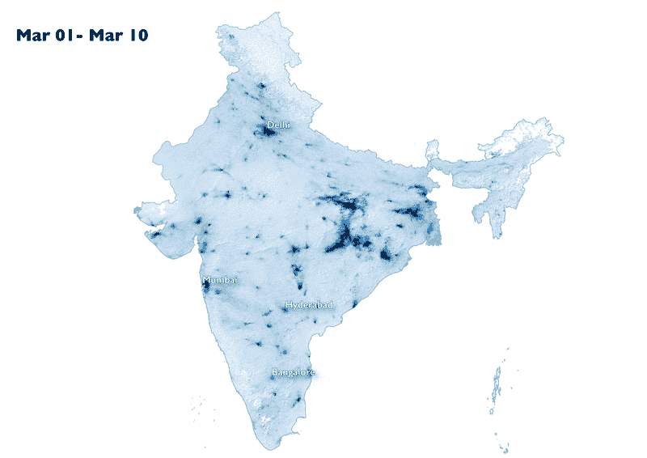
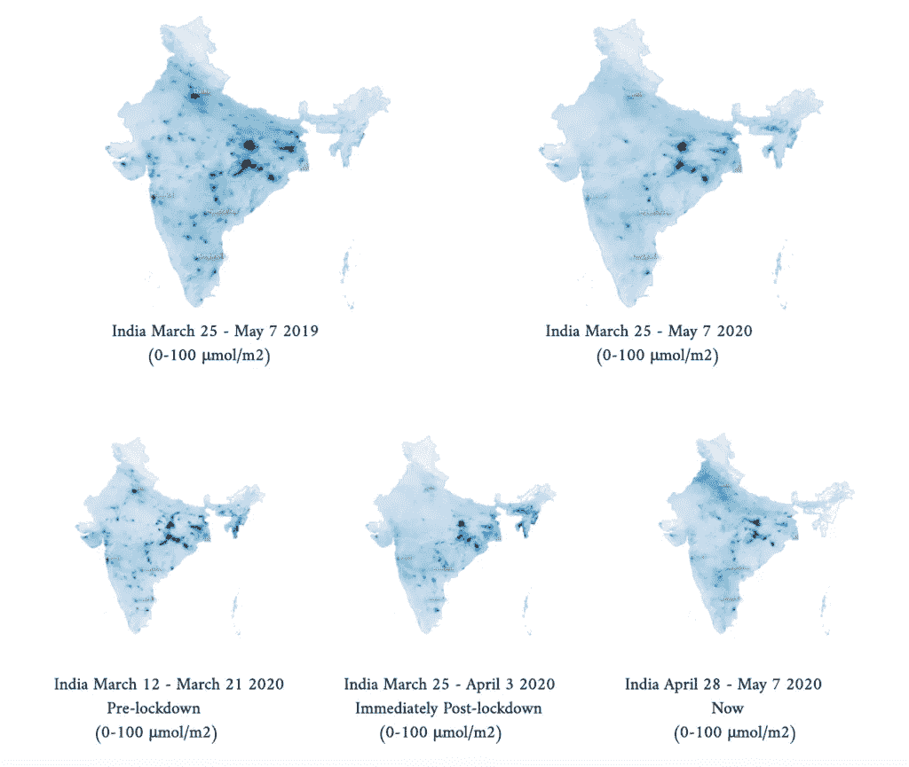
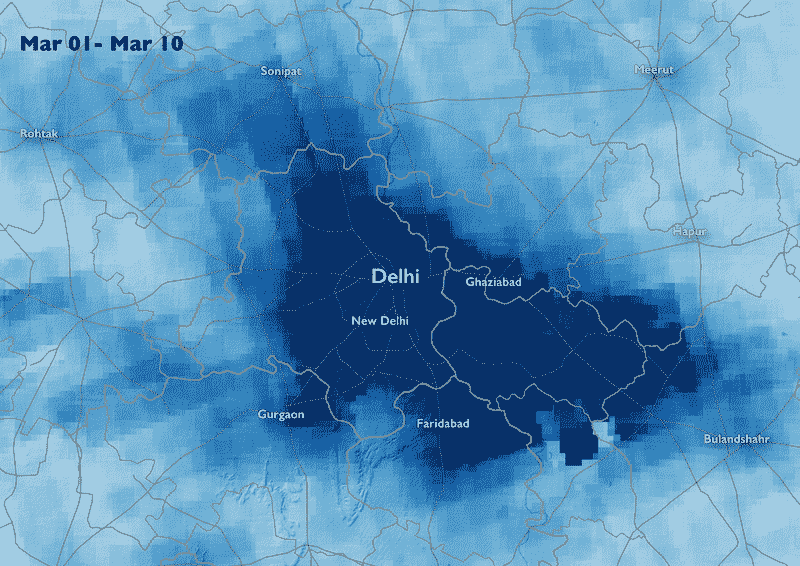
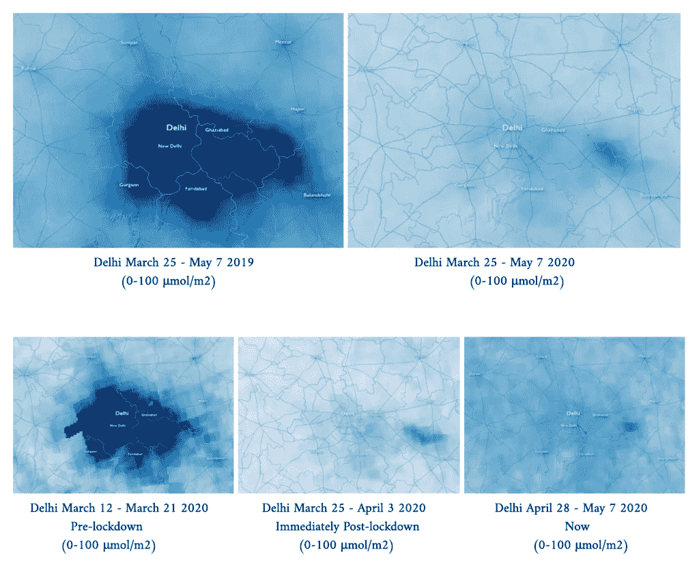
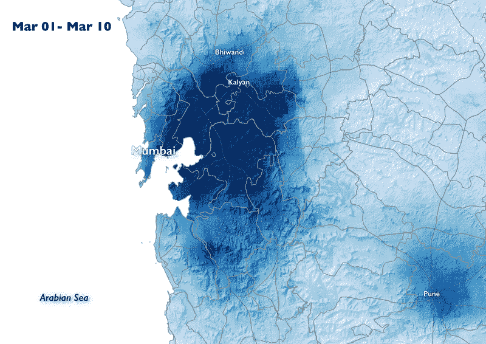
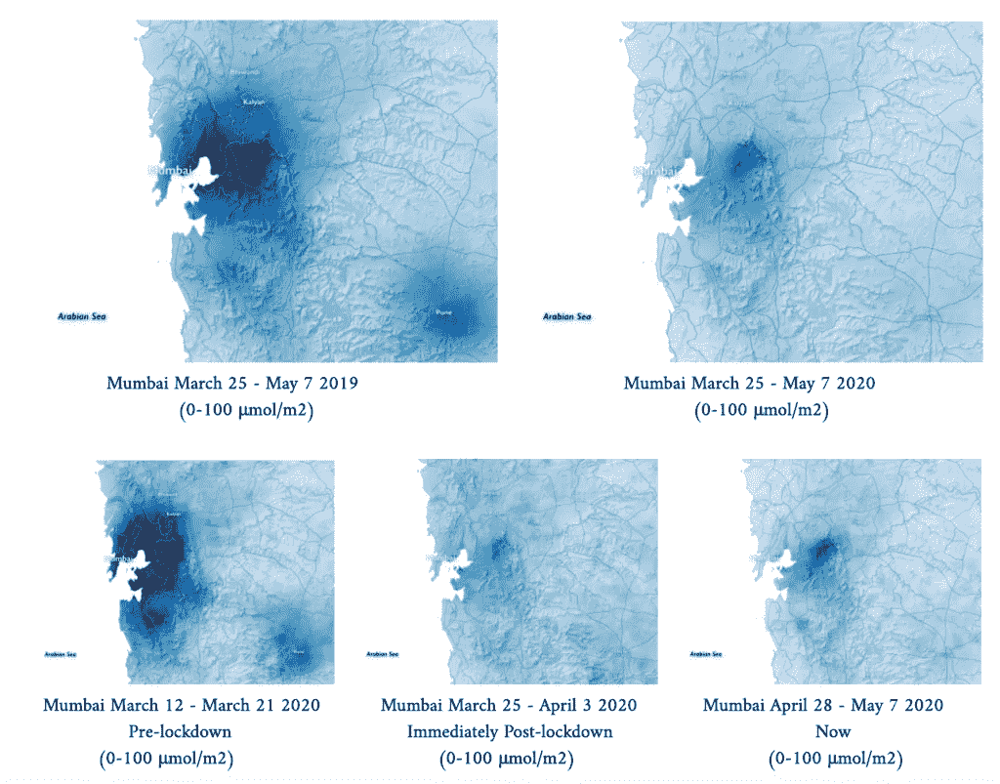
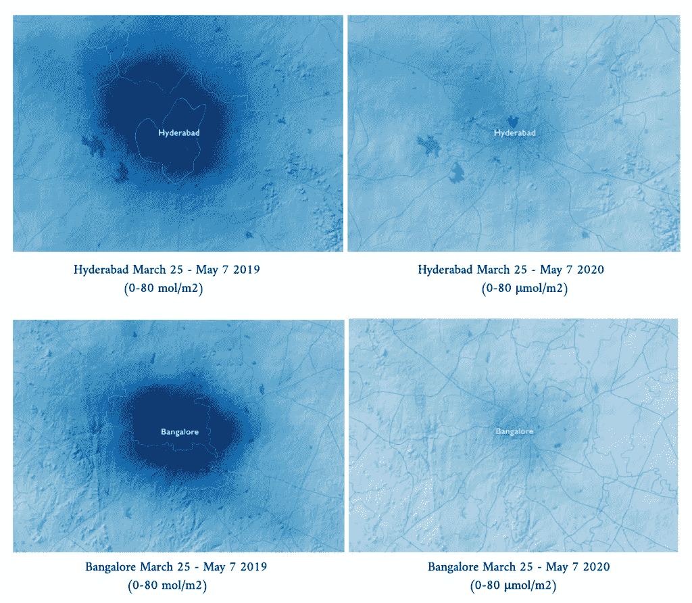

# 新冠肺炎期间印度空气污染的减少

> 原文：<https://medium.com/analytics-vidhya/the-decrease-in-indias-air-pollution-during-covid-19-a60661f0645?source=collection_archive---------34----------------------->

在毁灭性的新冠肺炎疫情，一个罕见的积极因素是全球空气污染水平显著下降。首先，专家们测量了二氧化氮(NO2)，这是六种主要空气污染物之一(除了颗粒物、一氧化碳、二氧化硫、地面臭氧和铅)。像大多数其他气体一样，NO2 有[自然和人为来源](https://greenhousemaps.com/learn/#nitrogen-dioxide)。自然来源包括闪电、海洋和火山。然而，在城市地区，NO2 的自然来源只占总 NO2 水平的一小部分；根据澳大利亚环境和遗产部 2005 年在 T2 的一份报告，二氧化氮的自然来源仅占城市二氧化氮总量的 1%。人类活动几乎是城市地区 NO2 排放的全部原因，其中道路交通是头号原因。燃烧化石燃料的飞机、发电厂和船只也是人类产生 NO2 的重要来源。有鉴于此，在严格的全球封锁期间，城市地区，尤其是印度人口稠密的城市，二氧化氮水平大幅下降就不足为奇了。

来自欧洲航天局哥白尼哨兵 5P 卫星的卫星图像测量了全球二氧化氮水平。这些测量准确地反映了排放源，因为与其他气体不同，二氧化氮的寿命很短，在它能移动很远之前就死亡了。换句话说，如果 Sentinel 5P 卫星在德里上空捕捉到一个 NO2 热点，它很有可能是从德里附近地区发出的。因此，卫星图像是测量二氧化氮排放的高度可靠的工具，尤其是在排除高云层覆盖的数据的情况下。

全球二氧化氮水平的下降首先出现在中国，在 1 月底实施严格的检疫措施后，中国的二氧化氮水平急剧下降。随着欧洲和北美国家在 2 月下旬和 3 月效仿中国，全球也观察到了类似的趋势。尤其是印度全国范围的封锁，对空气污染水平产生了惊人的影响。

随着市民被隔离在家中，道路运输和发电厂的运营已经陷入停滞，全国各地的污染水平，尤其是在通常烟雾弥漫的城市，已经下降到惊人的低水平。

下面是德里大都市地区的二氧化氮测量值，这个国家最大城市的污染水平下降幅度最大；从 3 月 25 日(隔离开始的那一天)到 5 月 2 日，二氧化氮水平平均为 90 摩尔/平方米，而从 3 月 1 日到 3 月 24 日为 162 摩尔/平方米。2019 年，3 月 25 日至 5 月 2 日的二氧化氮水平也远高于今年的水平，平均为 158 摩尔/平方米。

在大孟买和新孟买的 NO2 测量中，观察到了类似的趋势，3 月 25 日至 5 月 2 日的 NO2 水平平均为 77 mol/m2，而 3 月 1 日至 3 月 24 日的 NO2 水平为 117 mol/m2。2019 年，3 月 25 日至 5 月 2 日的二氧化氮水平平均为 122 摩尔/平方米。

在几乎所有其他印度大城市，二氧化氮水平都出现了类似的下降，突显出印度全国范围的封锁。

在此次封锁期间，全国范围内 NO2 排放量的下降具有重大的直接后果。暴露于高水平的 NO2 对人类健康具有显著的有害影响。[短期暴露于高水平的 NO2](https://www.epa.gov/no2-pollution/basic-information-about-no2#Effects) 会导致咳嗽恶化、现有呼吸系统疾病(哮喘)加重和住院，而长期暴露会导致哮喘的发展并增加对呼吸系统疾病的易感性。因此，[专家正在寻找长期暴露于高度空气污染和新冠肺炎死亡率上升之间的重要联系是有道理的。许多研究人员假设，空气污染水平的下降目前可能挽救了大量生命，不仅通过降低个人对新冠肺炎的易感性，还通过防止世界上一些因空气污染暴露而导致的](https://www.theguardian.com/environment/2020/apr/20/air-pollution-may-be-key-contributor-to-covid-19-deaths-study)[700 万例年度死亡](https://www.who.int/health-topics/air-pollution#tab=tab_1)。尽管如此，与目前排放量下降挽救的生命相比，新冠肺炎之前许多城市地区危险的高水平 NO2 可能导致更多新冠肺炎人死亡。

新冠肺炎疫情和随后由于检疫导致的空气污染水平的降低，揭示了关于持续高度空气污染的严重问题。可怕的现实是，尽管人类活动基本上完全停止，但目前的估计表明，与 2019 年相比，2020 年二氧化碳(CO2)水平只会下降大约 5.5%。客观地看，为了实现将全球气温上升限制在 1.5 摄氏度的目标，许多专家认为这将避免气候变化的最坏影响，全球二氧化碳排放量需要每年减少[7.6%](https://wedocs.unep.org/bitstream/handle/20.500.11822/30797/EGR2019.pdf?sequence=1&isAllowed=y)。同样，当隔离解除时，空气污染和二氧化氮水平预计将升至正常的不健康水平。

至关重要的是，当印度的封锁不可避免地结束，人们回到他们的正常生活中，他们不会被迫回到他们的旧行为。为了让目前空气污染水平的下降持续下去，需要实施重大的政策变革。道路运输的减少和空气污染的相应减少突出表明，燃气汽车是空气污染的主要驱动因素。电气化交通、扩大公共交通、建设更多的自行车道，以及寻找其他激励人们弃车的方法，将极大地减少印度主要的人类空气污染源的排放量。同样重要的是，这些电动汽车，以及更广泛的印度城市，是由清洁能源而不是化石燃料驱动的。

具有讽刺意味的是，这种毁灭性的呼吸道病毒引发了另一场呼吸道危机。愿印度让最近空气污染的减少成为永久的，而不是暂时的可能，这种减少在困难时期提供了一线希望。

[我最初是为转型中的印度写的这篇文章，由宾夕法尼亚大学印度高级研究中心管理。](https://casi.sas.upenn.edu/iit/jamespoetzscher)