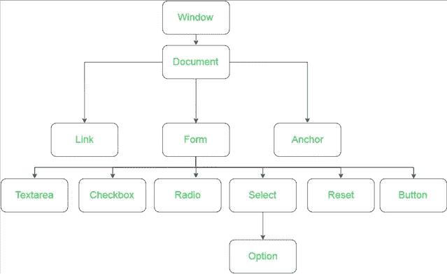

# JavaScript 简介第 1 部分:DOM

> 原文：<https://medium.com/analytics-vidhya/the-dom-javascript-intro-23bdf08a412?source=collection_archive---------22----------------------->

如果你用 JavaScript 写过代码，你应该熟悉一种叫做**文档对象模型(DOM)** 的东西。您可以将 DOM 视为对象的层次结构，窗口对象位于最顶端，其后是文档对象。window 对象本质上是一个包含 JavaScript 中所有对象的容器，后面紧跟着包含所有 HTML 元素(节点)的 document 对象。



“你可以把 DOM 想象成对象的层次结构……”(图片来源:geeksforgeeks.org)

JavaScript 是一种面向对象的函数式编程语言，在这种语言中，JavaScript 程序内部的一切都被视为对象。由于 DOM 中的窗口充当了容纳 JavaScript 程序中所有内容的容器，因此 ***文档对象*** 在 JavaScript 中起着非常重要的作用。DOM 中的文档对象允许通过 JavaScript 访问和操作其中的内容。 访问文档对象中属性的一个简单例子是文档的 URL。编写一行简单的代码，如 ***文档。URL*** 将返回当前文档的 URL(您所在的网站页面)。URL 是文档对象的属性，类似于具有性别和年龄属性的人类对象。

*注意:可以通过 Chrome 的开发者工具查看 DOM。*

**HTML 元素作为 DOM 中的节点**

DOM 包含许多 HTML 内容。当谈到 HTML 时，我们知道 HTML 构成了网页及其内容。当提到 DOM 时，**节点**是组成网页的所有组件。简而言之，***HTML 元素就是 DOM 中表示的节点*** *。* DOM 节点一般都有一个开始标签和一个结束标签(听起来很熟悉？)，其中外部节点被称为父节点。

**树状结构**

DOM 可以被认为是一种“树状结构”,因为在 DOM 中有一个清晰的层次表示。例如，检查下面的代码:

```
<body> <div> <p> 
                This is a nested paragraph, inside of a div element,            
                inside of a body element. 
            </p>   

      </div></body>
```

在上面的代码中，子节点是 p 标记，p 标记的父节点是 div 标记。最后，主体是 div 标签的父标签。每个元素相互嵌套。

**使用 JavaScript 操作 DOM**

那么，当我们更新 DOM 时会发生什么，我们如何更新 DOM 呢？

注意:要测试 DOM 的操作，有两种方法——通过 JavaScript 或者通过 Google Chrome 的开发者控制台。您可以使用开发人员控制台单击一个节点并删除，或者编写 JavaScript 代码来做同样的事情。开发人员控制台将允许您查看浏览器加载的 HTML 源代码的 DOM 表示。

以下示例是通用示例，不涉及任何特定网页。

***练习使用 Chrome DevTools:***

点击 Chrome 浏览器上的菜单栏，然后点击“查看”，然后选择“开发人员”，最后“开发人员工具”将允许您使用 DOM。确保点击“元素”。如果单击特定的 HTML 元素或 DOM 节点，看看按下键盘上的 delete 键会发生什么。元素被删除！但是 ***源代码改了吗？绝对不行！*** 如果你刷新页面，你会注意到页面又回到了原来的状态。操纵 DOM 只是操纵了浏览器上显示的内容。

***用 JavaScript 练习:***

在删除 html 元素/ DOM 节点时，可以使用 JavaScript 完成与上面完全相同的行为。

为了进行简单的删除，必须选择保存元素/节点的位置:DOM。因为 DOM 是一个对象，而对象包含属性，所以可以在 DOM 上调用方法来操作或检索对象。

现在我们调用一个方法来选择文档对象中的一个元素。我们通过用 DOM“说”JavaScript 来做到这一点。键入以下内容:

```
document.querySelector('p')
```

上面的代码将选择文档对象内的 ***p 对象*** *(段落对象)*。这里，我们通过 JavaScript 关键字“querySelector”选择 HTML 元素。因为 p 是一个对象，我们可以对它调用一个方法，从浏览器中移除 p。键入以下内容:

```
document.querySelector('p').remove()
```

上面的代码从浏览器中删除了 ***p*** 元素！的“.”使用点符号来链接调用。换句话说，我们能够通过链接完成多项操作:

1.  选择文档对象
2.  在文档对象中，我们使用“.”选择了 p 元素文档对象上的点符号。
3.  在 p 对象上，我们通过使用“.”调用了方法 p 上的点符号。

如果你点击“刷新”，你会注意到 p 并没有被删除，这只是浏览器的一个“视觉效果”，源代码保持不变。

*注意:如果你注意到，单词 remove 后面有括号()。每个方法调用后面都有一个括号。*

这是使用 JavaScript 与 DOM 对话的一个非常基本的例子。理解 DOM 和 JavaScript 协同工作以允许用户进行浏览器交互是很重要的。