# 电子商务行业——从“B-B”和“B-C”的角度

> 原文：<https://medium.com/analytics-vidhya/the-e-commerce-industry-from-a-b-b-b-c-perspective-c2aece35986f?source=collection_archive---------17----------------------->

*发货延迟|交易错误|缺货*

科技重新定义的购物时代已经过去十年了。只需点击一下，东西就会送到你家门口。公司已经开始通过上市和吸引用户*购买*来赚取数十亿美元。这个故事并没有以赚取数十亿美元而告终，而是伴随着电子商务行业的风险和几率。在这篇博客中，我们将看到如何使用数据分析的概念及其工具的应用来控制或避免几率和风险。我以前的[博客](/@vanthianb)使用数据分析缩小到当前的疫情话题及其含义。

特别谈到现在的博客，它相当于我以前作品的幻灯片。这个特殊的博客将处理一个为一个匿名电子商务公司获得的数据集[,这个匿名电子商务公司向世界各地提供几种产品。数据获取时间为 4 年(2015 年至 2018 年)。尽管该公司倾向于赚取更多利润，但它也存在包裹交付、欺诈订单、交易事务和各种其他小问题。作为一个关注点，这个博客将解决与包裹递送和欺诈订单相关的问题。](https://data.mendeley.com/datasets/8gx2fvg2k6/5)

这是对数据集的简要描述。


[来源](https://giphy.com/gifs/post-internet-computer-9Pmf3QJiDHwyftez6i)

> [我们的目标是将数据转化为信息，并将信息转化为洞察力。](https://www.tibco.com/blog/2013/06/28/13-cool-data-quotes/)

## 数据探索

在我们使用数据分析工具更深入地探索[数据集](https://data.mendeley.com/datasets/8gx2fvg2k6/5)之前，更深入地了解数据集是必不可少的。让我们来了解一下数据中有什么，以及是什么定义了这个问题。

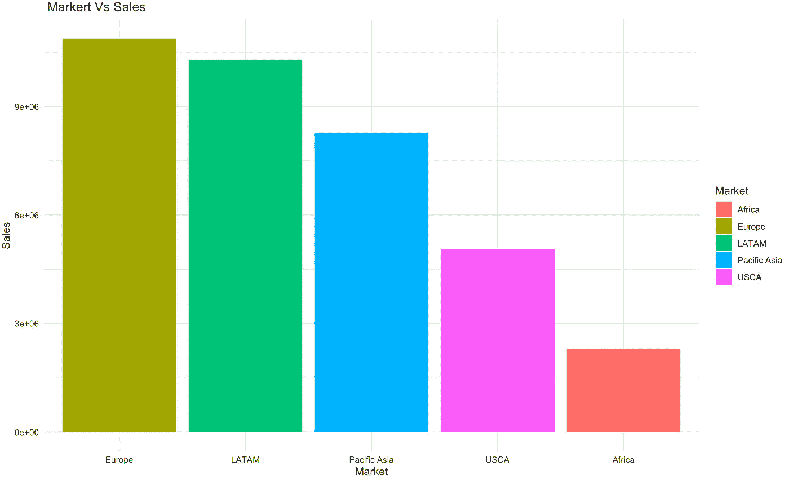

图 1:市场与销售

正如简短描述中提到的，该公司在世界各地提供各种产品。大约有五个不同的市场。左图显示了每个市场的销售额，可以得出结论，欧洲市场销售额最高，非洲市场销售额最低。拉美(南美)市场和亚太市场的表现比其他市场稍好。为了更好地了解每个市场的交易情况，我们来看看每个地区的销售情况。下图显示了每个地区的销售额。

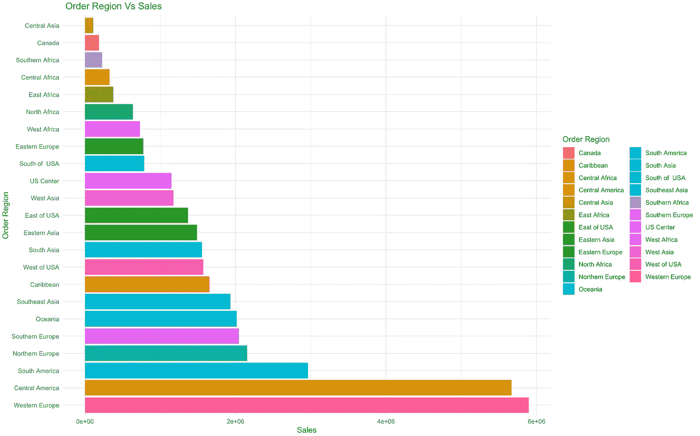

图 2:订单区域与销售额

中亚地区销售额最低，西欧地区销售额最高。从图 1 中可以看出，欧洲市场的销售额最高，因此相互影响。必须从交付和订单状态的角度调查销售额最低的原因，还需要从交易和欺诈的角度调查销售额最高的地区。此外，还可以看出，非洲地区的销售额也很低，但据报道，亚太地区的销售额高于拉美地区。

由于该公司向各个地区销售各种产品，因此对销售的产品进行了分类，并对其销售情况进行了研究，以了解其创收和阻碍因素。

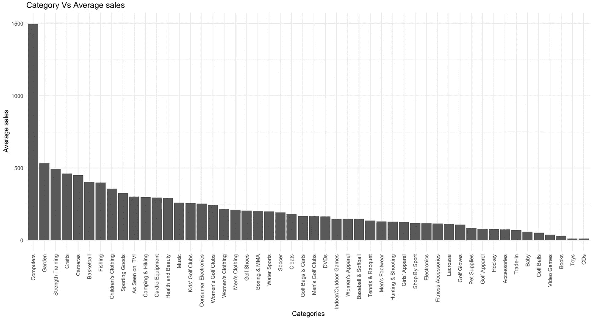

图 3:产品类别与平均销售额

上面的图是在平均销售额和产品类别之间绘制的。根据目前的趋势，与其他类别相比，计算机类别的平均销售额最高，CD 类别的平均销售额最低。电脑和其他同类产品之间的销售额急剧下降。也可以得出销售是季节性的结论；因此，顾客的购物行为受到许多因素的影响，关于这一点的[研究](https://towardsdatascience.com/a-gentle-introduction-to-customer-segmentation-375fb4346a33)可以更详细。

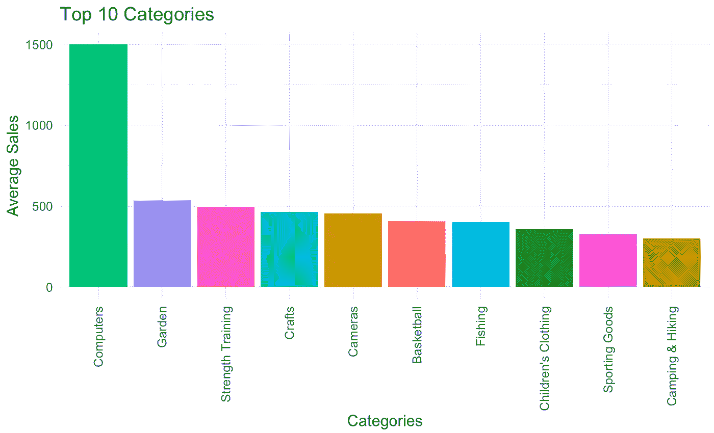

图 4:十大销售类别

关于图 3，可以确定和研究每个类别的平均销售额。左边的图缩小到图 3，以探索前 10 个最畅销的类别。前 10 名销售产品既有季节性商品也有非季节性商品，因此更多地评论了[顾客行为和销售趋势](https://www.martechadvisor.com/articles/data-management/consumer-behavior-matters-more-than-sales-trends/)。

如前所述，尽管获得了更多的利润，但由于欺诈和交付问题等因素，该公司也有损失，这将是我们这篇博客的重点领域。

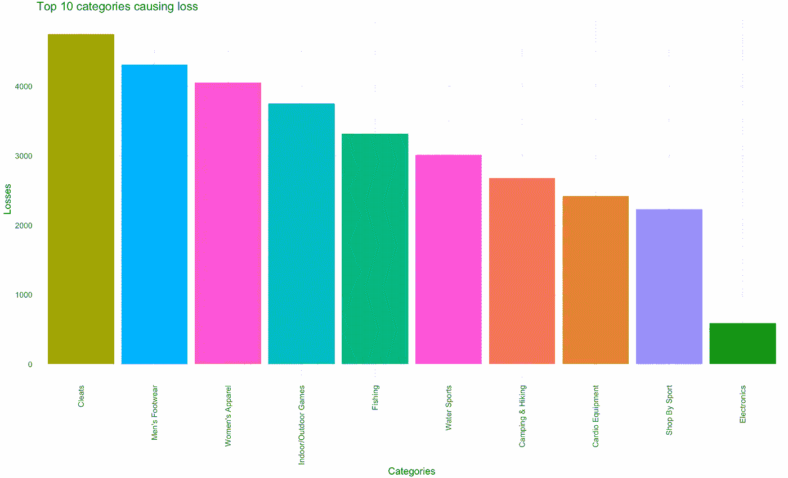

图 5:十大亏损类别

该公司面临季节性和非季节性因素的损失。尽管如此，我们的关注点仍然局限于一个假设，即公司因延迟交货和欺诈交易而遭受损失。左边的图列出了 10 大亏损产品类别以及由此导致的亏损金额。防滑钉往往报告最高的损失，并补充图 4 的结果；电子类表示低损耗。大部分运动产品都出现了亏损。必须对原因进行详细调查分析。在博客的后半部分， [*机器学习*](https://machinelearningmastery.com/start-here/) 模型被用于调查和预测延迟交付和欺诈。

现在，为了更深入地了解欺诈订单的问题，它可能发生的主要方式是通过支付。因此，让我们深入了解一下顾客喜欢的付款方式。

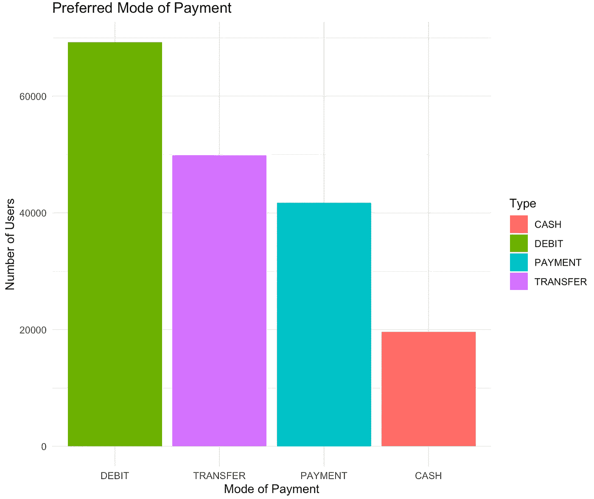

图 6:首选支付方式

由于该公司为其客户提供了四种不同的支付方式来支付其购买的商品，从图中可以看出，客户更喜欢通过他们的借记卡支付，最不喜欢通过现金支付。客户也更喜欢转账付款方式，据估计，大多数欺诈交易都是通过转账举报的。

由于不同地区的客户喜欢不同的支付方式，它对财务系统和销售有很高的依赖性。

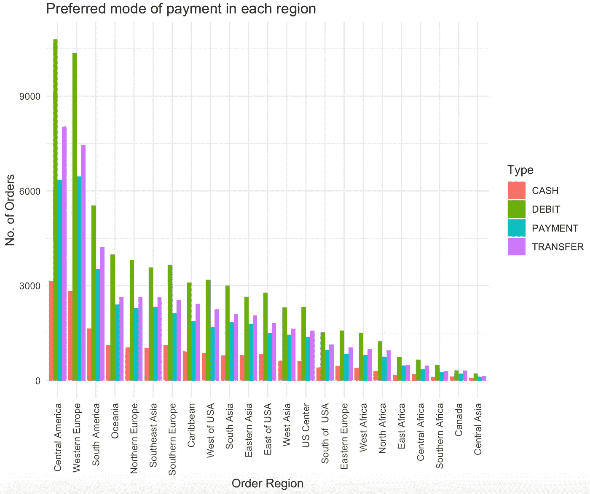

图 7:不同地区的首选支付方式

上图显示了不同地区客户的首选支付方式。借记卡是全球客户最普遍的支付方式。特别是在中美洲和西欧，人们发现通过借记和转账进行支付比其他方式更受欢迎。而在中亚，现金和转账受到同等重视。上述估计将有助于检测欺诈交易。

从 B 到 C(企业对客户)的角度来看，大多数欺诈都是通过支付方式发生的。因此，对交易和可疑欺诈案件数量的估计可以与预测潜在的欺诈案件相关联。

现在让我们深入了解欺诈案例。首先，让我们了解一下地区。

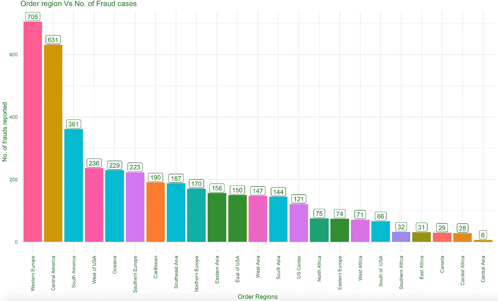

图 8:各地区报告的欺诈案件数量

上图显示了迄今为止每个地区报告的欺诈案件数量，该图指定了报告的欺诈案件的实际数量(可在[数据集](https://data.mendeley.com/datasets/8gx2fvg2k6/5)中获得)。西欧地区报告的欺诈率最高，其次是中美洲。加拿大、中非和中亚报告的欺诈率最低。与图 2 相比，欺诈案件最多的地区与销售额最高的地区相同，但销售额远远高于欺诈案件。相比之下，销售额最低的中非地区报告的欺诈案件数量略高于中亚地区(大多数中度欺诈案件)。

其次，现在把范围缩小到产品类别，

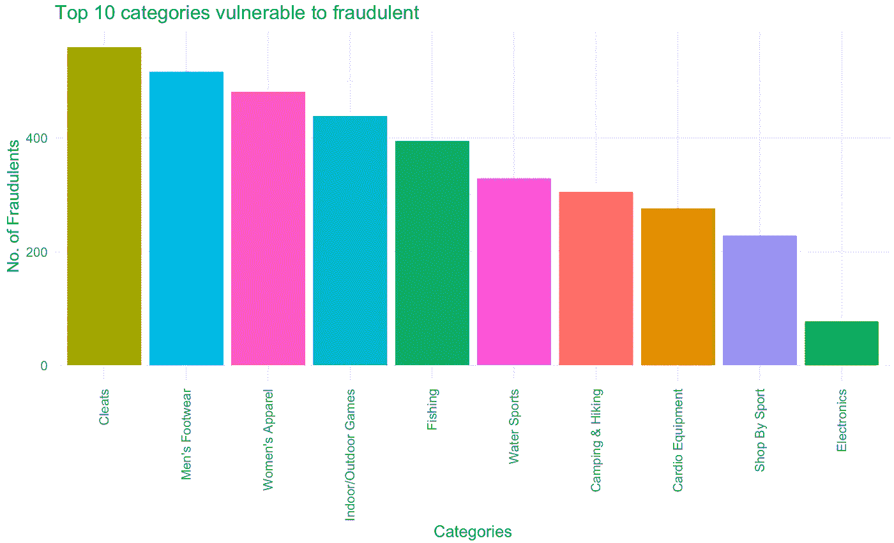

图 9:欺诈案件最多的类别

左边的图显示了欺诈案例最多的产品类别。将该图与图 5 进行比较，结果基本相同，因为欺诈对收入损失有直接影响。欺诈的原因不在讨论范围之内，但预测欺诈案例可以在提高销售利润方面占上风。

现在让我们来探讨公司面临的另一个主要问题。准时是客户的偏好，这将是任何电子商务公司的主要 USP 之一。因此，任何与交付有关的问题都将被优先处理。

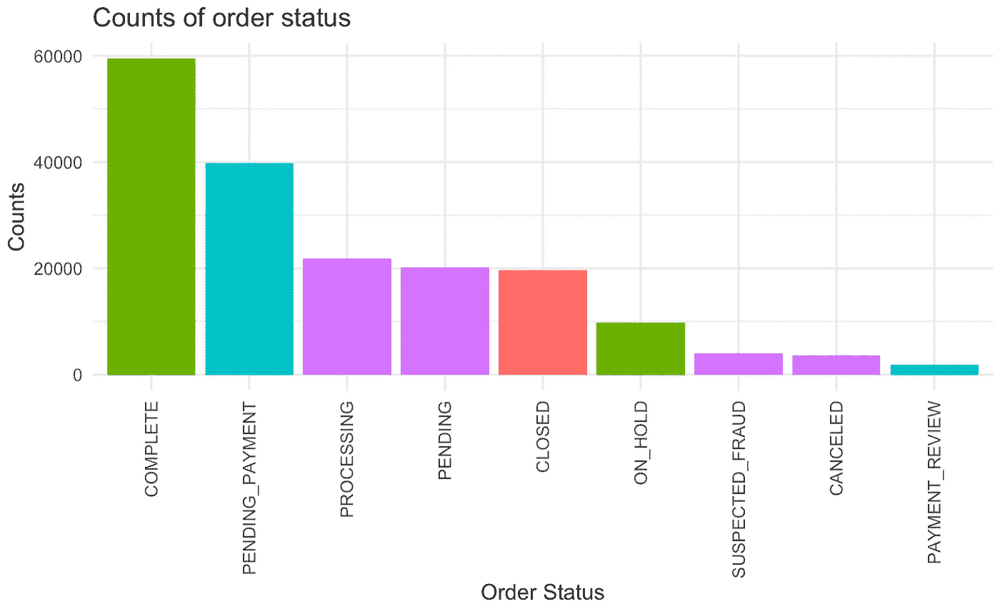

图 10:订单状态计数

根据数据，左边的图显示了已完成、待处理、正在处理等订单的数量。很明显，大部分订单已经完成，但是出现了一个关于市场交货情况的问题。

实际上，每个市场的交付状态据说各不相同，下图显示了每个地区的交付状态(根据[数据集](https://data.mendeley.com/datasets/8gx2fvg2k6/5))。可以直接推断出，该公司记录了大量的延迟交付，但很少有客户在预定的交付日期之前收到订单。在按时运送产品方面，该公司落后了，需要改进他们的交付流程。

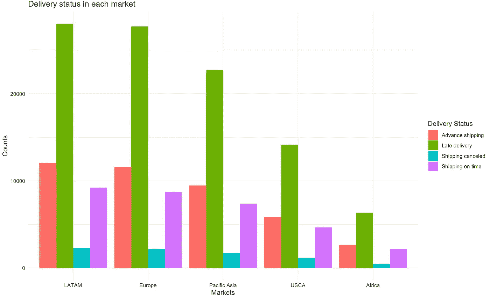

图 11:每个市场的交付状态

*“他们按时交付给客户了吗？”*

为了回答以上问题，让我们进一步了解交货情况。

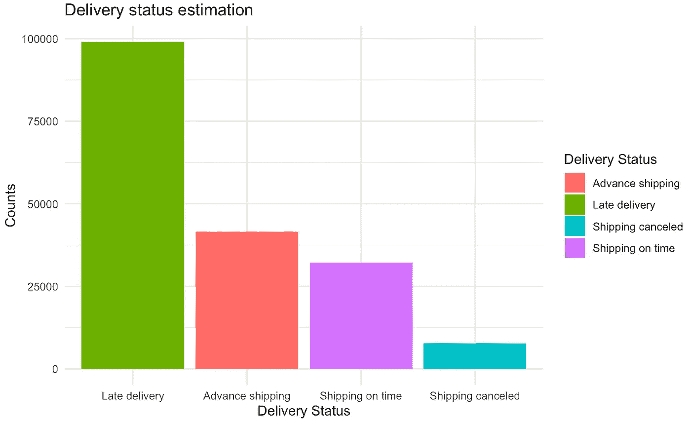

图 12:交付状态的估计

右边的图清楚地表明，该公司记录了几次较高的延迟交付。考虑到按时发货，该公司已设法提前向相当多的客户交货。相比之下，大多数客户对该公司并不满意，而且有低比例的订单也被取消。

*“延迟交付”的状态也取决于订单区域和产品可用性。*

为了明确上述概念，下面绘制了延迟交付状态与订单区域和产品的关系图。

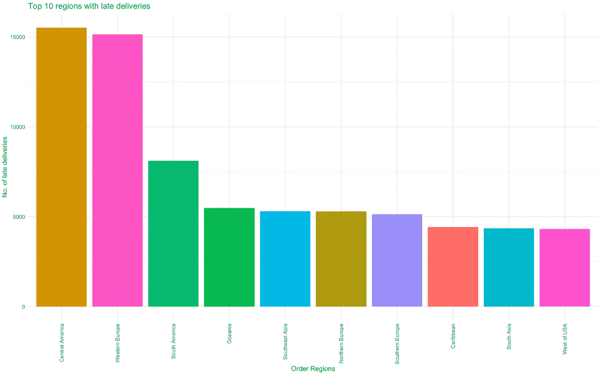

图 13:特定于订单区域的延迟交付数量

已经从数据集中识别出交货延迟的前 10 个订单区域，并且计算该图。中美洲和西欧地区报告的延迟分娩数量最高，两者之间略有差异。

现在对产品进行评估，

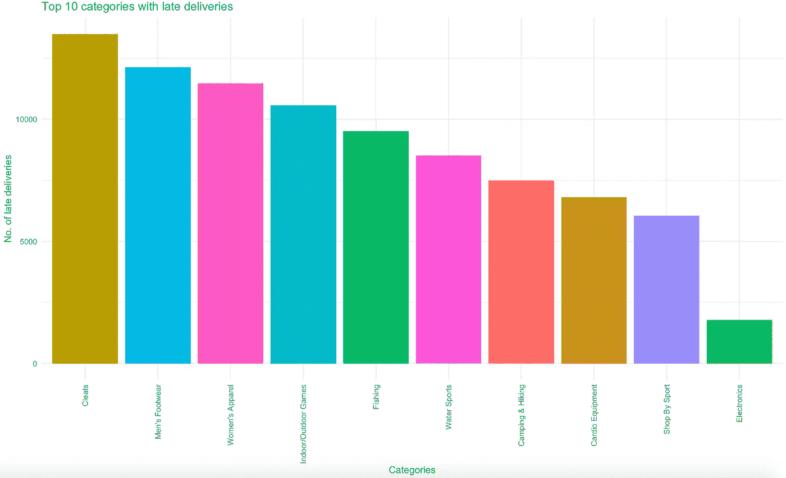

图 14:特定于订单区域的延迟交付数量

与产品相关的延迟交付状态可能类似于图 9。然而，更深入地研究一下统计数据，可以发现防滑鞋和男鞋的交付报告了最高的延迟交付状态，二者之间略有差异，电子产品的延迟交付状态最低。因此，产品的可用性也会影响交货状态。

*选择上述两个地块的前 10 个区域和产品的原因是，选择研究它们也有助于了解公司对客户满意度、仓库库存水平的影响，以及在物流需求方面需要解决的区域，以按时满足客户需求。条形图用于提供关于数据的清晰和更深入的见解，它在简化用户理解方面做得很好，尤其是对于这个特定的数据集。*

***因此，综上所述，从*** [***数据集***](https://data.mendeley.com/datasets/8gx2fvg2k6/5) ***中，绘制了上述图表，得出公司需要解决欺诈和发货交付两个重大问题的结论。上述问题可以通过开发机器学习模型来解决，这些模型可以预测延迟交付和欺诈性的事先交付，从而防止未来出现这些问题。***

现在让我们使用一些机器学习模型来预测装运的延迟和欺诈的发生。预测将根据准确性进行评级，选择的最佳预测值将使用一个标准误差规则来确定。

> 世界上大多数人会通过猜测或凭直觉来做决定。他们要么幸运，要么错误。

## 数据建模

在我们更深入地研究建模之前，让我们先了解一些用于评估模型及其性能的概念。两个主要组成部分将用于评估模型，交叉验证和一个标准误差规则。

***交叉验证***——一种用于估计机器学习模型性能的统计方法。我们将使用 K-fold 交叉验证方法，使用相对较小的数据集对模型进行重新采样，以验证和改进模型的性能。

正如 [Sunil Ray 在他的“使用交叉验证提高您的模型性能”](https://www.analyticsvidhya.com/blog/2018/05/improve-model-performance-cross-validation-in-python-r/)中所述，k-fold 交叉验证方法将给定数据集拆分为 k-fold，并且模型建立在 k-1 fold 上。然后在第 k 个折叠上评估模型的有效性。k 记录误差的平均值用于评估模型的性能度量。([博客](/swlh/the-2020-pandemic-cross-validated-c5719466fd23))

为了有效地评估模型，选择正确的 k 值很重要，这里的权衡是，

***k 值越小，偏倚越高，方差越低。***

***k 值越大，偏倚越低，方差越高。***

[根据 Hastie 和 Tibshirani](https://tgmstat.wordpress.com/2013/06/19/model-selection-model-assessment-hastie-tibshirani-2009-part-3/) ， ***一标准误*** 进行交叉验证，选择最节省的模型，其误差不超过最佳模型误差的一个标准误。

> 简约模型——最简单的模型，仅用必要的和最少的假设和变量来解释数据，但具有强大的解释能力。([博客](/swlh/the-2020-pandemic-cross-validated-c5719466fd23))

机器学习模型用于这个[数据集](https://data.mendeley.com/datasets/8gx2fvg2k6/5)，用于预测发货延迟和订单欺诈。我们的主要重点将是预测装运延迟或延迟交货，因为它有更多的实际意义。

使用的机器学习模型有 ***决策树和随机森林。*** 选择这些特定模型的主要原因是，它们对连续变量和分类变量很有效，而且它还可以自动处理缺失变量。与 SVM(支持向量机)相比，上述模型不需要调整特定参数，因为与 SVM、KNN 和逻辑回归等其他模型相比，[数据集](https://data.mendeley.com/datasets/8gx2fvg2k6/5)中有大量包含分类变量和连续变量的数据点，随机森林和决策树工作良好。

选择决策树模型的另一个主要原因是它易于计算和解释，并且在运行该模型时不必对数据进行标准化。随机森林对于任何给定的数据类型都表现良好。随机森林模型减少了过度拟合，尽管生成了更多的树用于后端分析，但它也减少了方差，从而提高了准确性。他们还使用集成学习技术，这有助于计算更准确和稳定的模型。在过度捕捞方面，决策树模型在某种程度上落后于随机森林，随机森林的唯一问题是它需要更多的计算能力和时间。在随机森林和决策树之间，随机森林模型预测输出更准确。

> 数据集以 70-30 的比例分割，其中 70%的数据用于训练，其余 30%的数据用于测试。

任何给定的数据都可以根据数据集的变量类型进行建模。

以下预测因子用于预测晚期分娩。

```
modelld = rep(0, 4)
modelld[1] <- "Delivery_status ~ Days_for_shipping_real"
modelld[2] <- "Delivery_status ~ Days_for_shipping_real + Days_for_shipment_scheduled "
modelld[3] <- "Delivery_status ~ Days_for_shipping_real + Days_for_shipment_scheduled + Late_delivery_risk "
modelld[4] <- "Delivery_status ~ Days_for_shipping_real + Days_for_shipment_scheduled + Late_delivery_risk + Shipping_mode"
```

以下预测因子用于预测欺诈状态。

```
modelfd = rep(0, 4)
modelfd[1] <- "Order_status ~ Order_item_total"
modelfd[2] <- "Order_status ~ Order_item_total+Sales_per_customer "
modelfd[3] <- "Order_status ~ Order_item_total + Sales_per_customer + Product_price "
modelfd[4] <- "Order_status ~ Order_item_total + Sales_per_customer + Product_price + Product_card_id "
```

为了理解每个预测变量之间的关系，绘制了 blow ggpair 图，

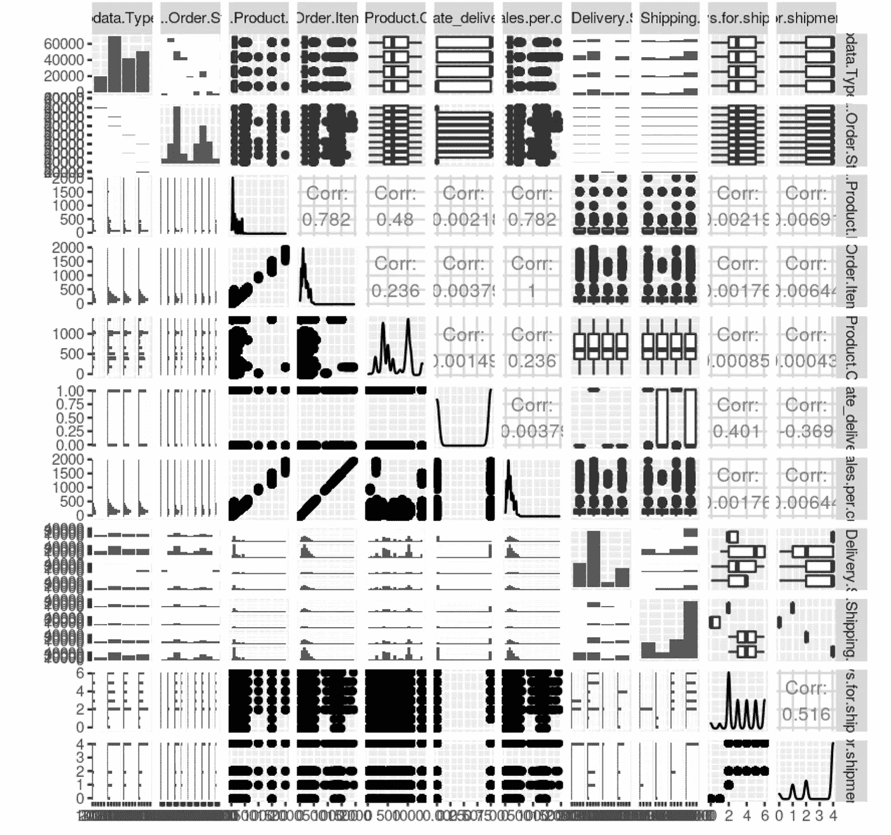

图 15:成对关系

上面的图可能看起来令人困惑，但更好的是，它给出了对因变量的预测的更好的见解。

预测值是根据它们与因变量(y)的相关性来选择的。

**使用随机森林的预测—延迟交付**

使用随机森林模型预测上面定义的延迟交货模型，并计算误差率，以确定模型的准确性

上述模型的误差曲线如下:

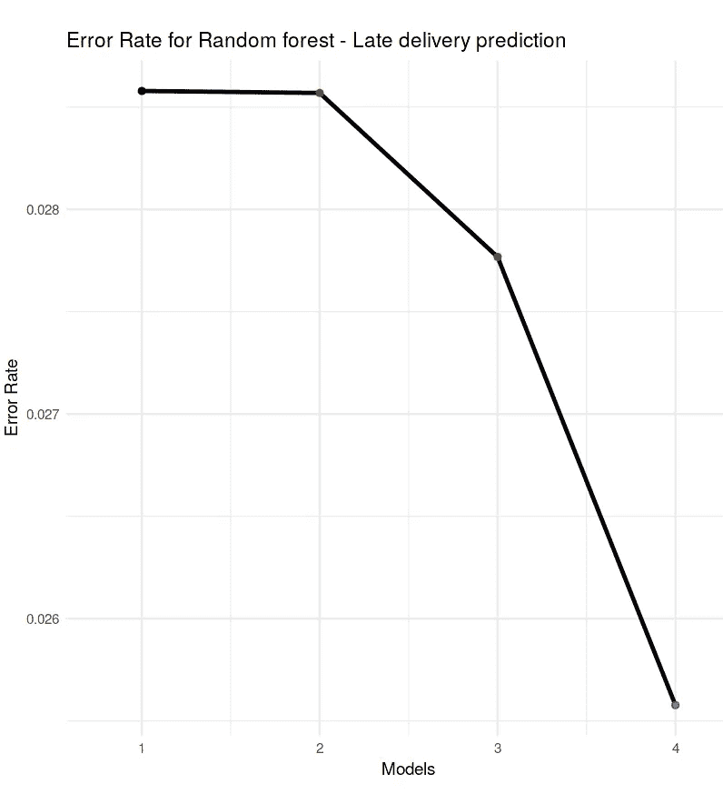

图 16:随机森林-延迟交付预测的误差图

精度为:
*modeld[1]= 0.971467
modeld[2]= 0.971901
modeld[3]= 0.974172
modeld[4]= 0.974629*

因此，随着模型复杂性的增加，精确度也会增加。

*因此可以得出结论，利用定义的模型的复合体预测延迟交货状态的准确度估计为 97.46%，并且 modeld[4]是性能最好的模型。*

上述模型的一个标准误差图，

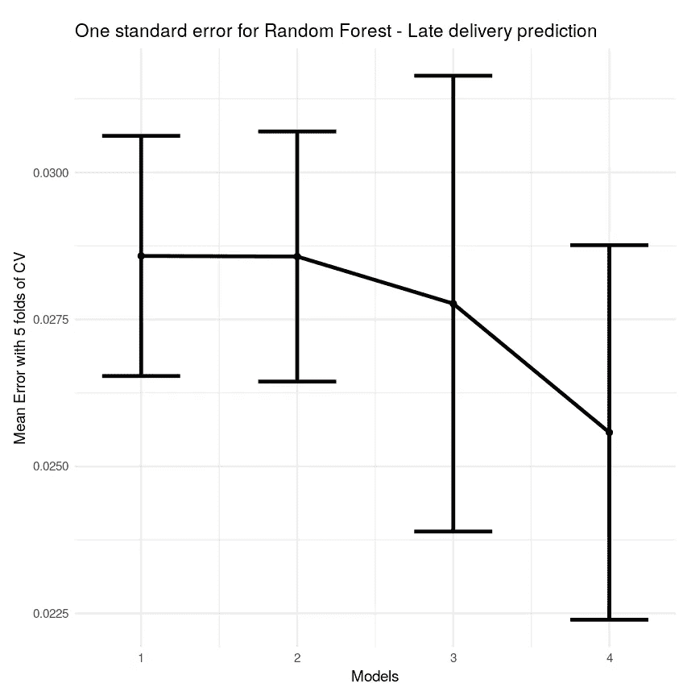

图 17:随机森林-延迟交付预测的一个标准误差图

*随着模型复杂性的增加，精确度也增加，使用一个标准误差规则，下一个最佳执行模型将是 modeld[1]，精确度为 97.14%。*

**使用决策树的预测—延迟交货**

现在，使用决策树模型来预测上面定义的用于预测延迟交货的模型，并且绘制其误差率图来确定每个定义的模型的准确性。

上述模型的误差图，

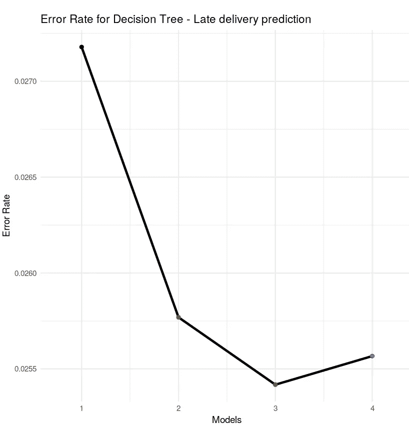

图 18:决策树的误差图—延迟交付预测

精度为:
*modeld[1]= 0.971082
modeld[2]= 0.973806
modeld[3]= 0.974279
modeld[4]= 0.974084*

在这里，复杂性增加的趋势没有显示出来，因为在*modeld[3]*和*modeld[4]*之间的精确度有轻微的变化

*因此可以得出结论，预测延迟交货状态的准确率估计为 97.42%，modeld[3]是性能最好的模型。*

上述模型的一个标准误差图，

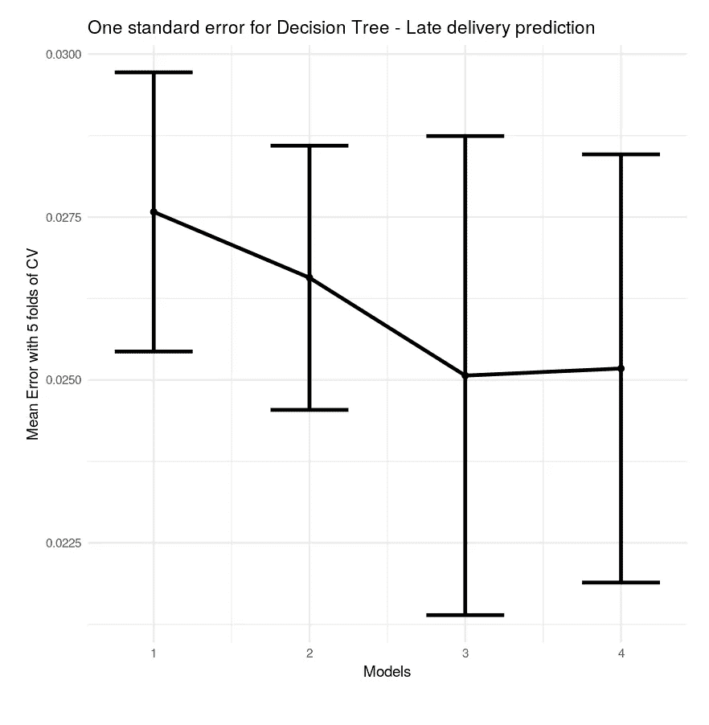

图 18:决策树的一个标准误差图——延迟交付预测

*现在，根据一个标准误差规则，可以从图中确定 modeld[3]之后的下一个最佳性能模型是 modeld[1]，其精度为 97.1%。*

通过研究上述两个模型，可以看出随机森林在预测延迟交货方面比决策树表现得更好。我们现在正在扩大使用随机森林预测欺诈案例的范围。选择随机森林的原因是为了降低复杂性，因为数据集包含更多数量的数据点，同时也是为了避免过度拟合。

**使用随机森林的预测—潜在欺诈**

上面定义的欺诈案例模型是使用随机森林模型预测的，并且计算错误率以确定模型的准确性。

上述模型的误差曲线如下:

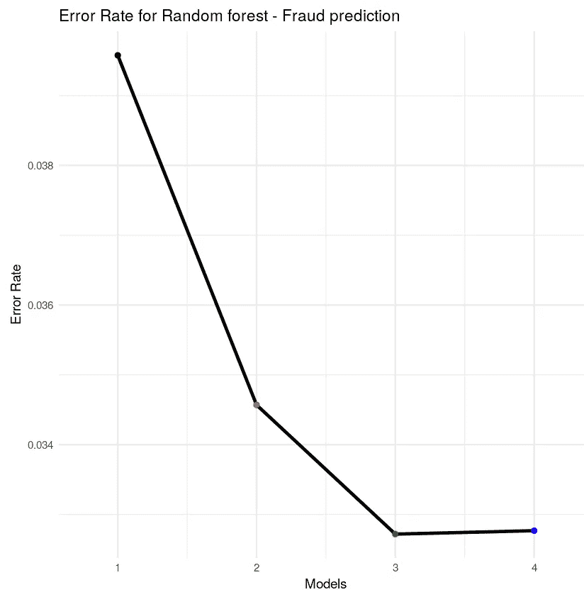

图 19:随机森林-欺诈预测的误差图

精度为:
*modelfd[1]= 0.961504
modelfd[2]= 0.965472
modelfd[3]= 0.967199
modelfd[4]= 0.967208*

这里，随着复杂度的增加，精度变得更好，并且在预测精度方面，在 *modelfd[3]* 和 *modelfd[4]* 之间存在边际差异。

*因此可以得出结论，预测潜在欺诈状态的准确度估计为 96.72%，modeld[4]是性能最好的模型。*

上述模型的一个标准误差图，

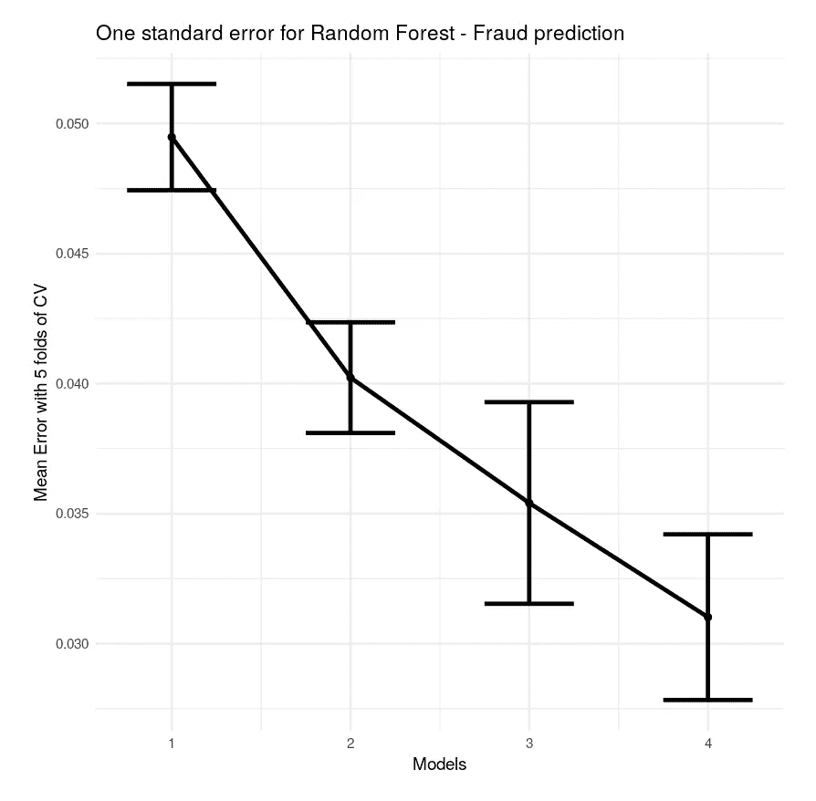

图 20:随机森林欺诈预测的标准误差图

*随着模型复杂度的增加，精度也随之提高。因为没有一个简单的模型符合一站误差规则标准偏差，所以性能最好的模型是 modeld[4]，]，其精度为 96.72%。*

*现在有了上述用随机森林和决策树模型预测延期交货的计算结果，可以推断随机森林模型比决策树模型预测得更准确。使用随机森林预测复杂模型的延迟交付的准确性为 97.46%，而在决策树的情况下，估计为 97.42%，尽管变化较小，但可以得出结论，随机森林模型比其他模型预测得更准确。在预测潜在欺诈时，可以看出，只有随机森林模型被考虑在内(原因如上所述)。预测潜在欺诈的准确率估计为 96.72%。*

*一个标准误差规则用于确定下一个性能最好的简单模型。在使用随机森林预测延迟交货时，可以看出，最简单的模型似乎是预测延迟交货的次佳模型，但是在使用随机森林预测欺诈的情况下，复杂模型似乎是最佳模型。*

## 结论

作为总结，对为一家匿名电子商务公司获得的[数据集](https://data.mendeley.com/datasets/8gx2fvg2k6/5)进行了分析，以识别该公司面临的关键问题，并建立、训练和测试机器学习模型来提前预测这些问题，以避免因此造成的收入损失。该公司面临的主要问题是，他们的大部分货物都没有按时到达，而且该公司还报告了许多欺诈交易。

总结整个过程，[数据集](https://data.mendeley.com/datasets/8gx2fvg2k6/5)通过保留市场上任何电子商务公司可能面临的一般问题进行分析。计算产生和损失的收入金额，然后将其缩小到收入损失的问题:发现有欺诈性支付案例报告，因此建立了一个机器学习模型来在发生之前预测它们。为了解决延迟交付的主要问题，该公司制定了糟糕的物流计划，因为报告了许多延迟交付的案例。这将对公司的收入利润和声誉产生非常不利的影响。

为了找到主要问题(延迟交付)的解决方案，必须对问题的原因进行详细分析。从 B-B(企业对企业)的角度来看，延迟交货的常见原因是:仓库中缺少库存、供应商向卖方交付产品的延迟、库存可用但在不同的仓库中，以及库存管理软件中也可能出现这种情况。从 B-C(企业对客户)的角度来看，它可以完全由交货合作伙伴承担，也可以部分由库存和交货合作伙伴承担。

作为数据分析师，对公司的建议是:

迫切需要优化采购流程，以便仓库有现成的产品来满足客户需求；因此，必须针对订单数量和需求(季节性和非季节性)执行适当的采购计划。该公司还需要在物流方面下功夫，将货物按时交付给客户，从而避免延迟交付。该公司还可以选择垂直整合他们的流程，以便拥有更优化的工作流程。为预测延迟交付而开发的机器学习模型预测准确率高达 97.46%，因此员工可以通过更快的交付选项启动订单以避免延迟，3PL(第三方物流)合作伙伴也可以相应地优化路线。为了防止潜在的欺诈案件，该公司可以使用机器学习模型来预测这些案件，准确率为 96.72%，以阻止可能具有欺诈性的交易。

最后，通过使用实用的数据分析工具分析问题，可以使用上述机器学习模型来增强和优化电子商务运营。

***为了满足 B-B & B-C*** 的需求，让我们更好地开展行业工作

* *以上结果取决于这个特定的[数据集](https://data.mendeley.com/datasets/8gx2fvg2k6/5)。

> 目标是将数据转化为信息，将信息转化为洞察力。-–[*卡莉·菲奥莉娜*](https://hbr.org/2015/09/carly-fiorinas-legacy-as-ceo-of-hewlett-packard)

## 附录

**RFM 分析**

*参考* [*迭戈的《乌赛》*](https://towardsdatascience.com/a-gentle-introduction-to-customer-segmentation-375fb4346a33) *关于客户细分与研究的文章和* [*阿拉文·赫布里*](https://rfm.rsquaredacademy.com/) *关于 RFM 的文章分析*

RFM 代表 **R** 频率， **F** 频率， **M** 一个数值。

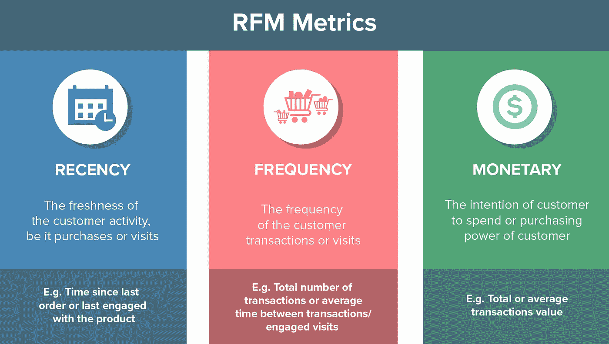

图 21: [RFM 分析](https://clevertap.com/blog/rfm-analysis/#:~:text=RFM%20stands%20for%20Recency%2C%20Frequency,retention%2C%20a%20measure%20of%20engagement.)

它们是用于确定客户行为和产品或公司参与度的指标。这些数据可以用来执行 RFM 分析，以便根据客户的购买价值和最后一次购买的日期对客户进行分类。这将有助于确定他们对公司的参与度，从而增加公司的客户基础和价值。它还对创收底线以及库存清理(以避免仓库管理费用)产生直接影响

**代码**

```
library(tidyverse)
library(ggplot2)
library(gganimate)
library(dplyr)
library(ggcorrplot)
library(corrplot)
library(ggpubr)
library(party)
library(data.table)
library(mltools)
library(randomForest)
library(matrixStats)
library(caret)
library(e1071)
library(ROCR)
library(pROC)
library(klaR)
library(caTools)#Loading datasetslibrary(readr)
project <- read_csv("Desktop/Project/Data/project.csv")
View(project)
numdata <- select_if(project,is.numeric)
View(numdata)
attach(project)
pdata<- read_csv("../input/dataco-smart-supply-chain-for-big-data-analysis/DataCoSupplyChainDataset.csv")
head(pdata,1)#Datavisulations#Market Vs Sales
project%>% dplyr::select(Market,Sales) %>%
  group_by(Market)%>% 
  summarise(sales = sum(Sales))%>%
  arrange(desc(sales))%>%
  ggplot(aes(x =reorder( Market,-sales),y =sales,fill = Market)) + 
  geom_bar(stat = "identity")+
  labs(x = "Market", y = "Sales", title = " Markert Vs Sales")+ 
  theme_minimal()

#Region Vs Sales
project%>% dplyr::select(`Order Region`,Sales) %>%
  group_by(`Order Region`)%>% 
  summarise(sales = sum(Sales))%>%
  arrange(desc(sales))%>%
ggplot(aes(x = reorder(`Order Region`,-sales),y = sales, fill = `Order Region`))+
         geom_bar(stat = "identity")+
         labs(x = "Order Region", y = "Sales", title = " Order Region Vs Sales")+ 
         coord_flip()+
         theme_minimal()#Mean Sales
project%>% dplyr::select(`Category Name`,Sales) %>%
  group_by(`Category Name`)%>% 
  summarise(sales = mean(Sales))%>%
  arrange(desc(sales))%>%
ggplot() +geom_bar(aes(x = reorder(`Category Name`,-sales), y = sales),stat = "identity")+
  labs(x = "Categories", y =" Average sales", title = "Category Vs Average sales")+
  theme_minimal()+
  theme(axis.text.x = element_text(angle = 90, vjust = 0.5, hjust=1))#Mean Price
project%>% dplyr::select(`Category Name`,`Product Price`) %>%
  group_by(`Category Name`)%>% 
  summarise(sales = mean(`Product Price`))%>%
  arrange(desc(sales))%>%
ggplot() +geom_bar(aes(x = reorder(`Category Name`,-sales) , y = sales),stat = "identity")+
  theme_minimal()+
  theme(axis.text.x = element_text(angle = 90, vjust = 0.5, hjust=1))

#Payment 
project$Type <- as.factor(project$Type)
project%>% dplyr::select(Type) %>%
  group_by(Type)%>%
  count(n = n())%>%
  ggplot() + 
  geom_bar(aes(x = reorder(Type,-n), y=n ,fill = Type),stat = "identity")+
  labs(x = "Mode of Payment", y = "Number of Users", title = "Preferred Mode of Payment")+
  theme_minimal()#Payment and region
project$`Order Region` <- as.factor(project$`Order Region`)
project%>% dplyr::select(`Order Region`,Type) %>%
  group_by(`Order Region`,Type)%>% 
  count(n = n())%>%
  ggplot() +
  geom_bar(aes(x = reorder(`Order Region`,-n),y = n, fill = Type),position = position_dodge(width = 0.9),stat = "Identity")+
  labs(x = "Order Region", y = "No. of Orders", title = "Preferred mode of payment in each region")+
  theme_minimal()+
  theme(axis.text.x = element_text(angle = 90, vjust = 0.5, hjust=1))#Top 10 Sales
v<-project %>% dplyr::select(`Category Name`,`Product Price`) %>%
  group_by(`Category Name`)%>% 
  summarise(sales = mean(`Product Price`))%>%
  arrange(desc(sales))
v%>% dplyr::top_n(10)%>%
  ggplot() + 
  geom_bar(aes(x = reorder(`Category Name`,-sales), y = sales,fill =  `Category Name`),show.legend = FALSE,stat = "identity")+
  labs(x = "Categories", y = "Average Sales", title = "Top 10 Categories")+
  theme_minimal()+
  theme(axis.text.x = element_text(angle = 90, vjust = 0.5, hjust=1))#Top 10 Loss
l<-project%>% dplyr::select(`Benefit per order`,`Category Name`)%>%
  group_by(`Category Name`)%>%
  filter(`Benefit per order` <= '0')%>%
  summarise(count = n())%>%
  arrange(desc(count))
l%>% dplyr::top_n(10)%>%
  ggplot()+
  geom_bar(aes(x = reorder(`Category Name`,-count), y = count, fill = `Category Name`),show.legend = FALSE,stat = "identity")+
  labs(x = "Categories", y = "Losses", title = "Top 10 categories causing loss")+
  theme_minimal()+
  theme(axis.text.x = element_text(angle = 90, vjust = 0.5, hjust=1))#Fraud Vs Products
u<-project%>% dplyr::select(`Order Status`,`Category Name`)%>%
  group_by(`Category Name`)%>%
  filter(`Order Status` == "SUSPECTED_FRAUD")%>%
  summarise(count = n())%>%
  arrange(desc(count))
u%>% dplyr::top_n(10)%>%
  ggplot()+
  geom_bar(aes(x = reorder(`Category Name`,-count), y = count, fill = `Category Name`),show.legend = FALSE,stat = "identity")+
  labs(x = "Categories", y = "No. of Fraudulents", title = "Top 10 categories vulnerable to fraudulent")+
  theme_minimal()+
  theme(axis.text.x = element_text(angle = 90, vjust = 0.5, hjust=1))#Fraud and Region
m<- group_by(project, `Order Region`) %>% filter(`Order Status` == "SUSPECTED_FRAUD") %>%
  summarise(count = n()) %>%
  arrange(desc(count))
ggplot(data = m) + 
  geom_bar(aes(x = reorder(`Order Region`, -count), y = count,fill = `Order Region`),show.legend = FALSE,stat = "identity")+ 
  geom_label(aes(x = `Order Region`, y = count,label= count), size=4,vjust = -0.1)+
  labs(x = "Order Regions", y = "No. of frauds reported",title = "Order region Vs No. of Fraud cases")+
  theme_minimal()+
  theme(axis.text.x = element_text(angle = 90, vjust = 0.5, hjust=1))

#Delivery Status
 w<-group_by(project,`Delivery Status`)%>%
  summarise(count = n())%>%
  arrange(desc(count))
  ggplot(data = w) + 
  geom_bar(aes( x = reorder(`Delivery Status`,-count),y = count, fill = `Delivery Status`),stat = "identity")+
  labs(x = "Delivery Status", y = "Counts",title = "Delivery status estimation")+
  theme_minimal()#Delivery status and market
ds<- group_by(project, Market,`Delivery Status`)%>%
  summarise(count = n())%>%
  arrange(desc(count))
ggplot(data = ds) +
  geom_bar(aes(x = reorder(Market,-count), y = count, fill = `Delivery Status`),position = position_dodge(width = 0.9),stat = "identity")+
  labs(x = "Markets", y = "Counts",title = "Delivery status in each market")+
  theme_minimal()#Late deliveries and Region
dr<-project%>% dplyr::select(`Order Region`,`Delivery Status`)%>%
  group_by(`Order Region`)%>%
  filter(`Delivery Status` == "Late delivery")%>%
  summarise(count = n())%>%
  arrange(desc(count))
dr%>% dplyr::top_n(10)%>%
  ggplot()+
  geom_bar(aes(x = reorder(`Order Region`,-count), y = count, fill = `Order Region`),show.legend = FALSE,stat = "identity")+
  labs(x = "Order Regions", y = "No. of late deliveries", title = "Top 10 regions with late deliveries")+
  theme_minimal()+
  theme(axis.text.x = element_text(angle = 90, vjust = 0.5, hjust=1))#Late deliveries and products
dp<-project%>% dplyr::select(`Category Name`,`Delivery Status`)%>%
  group_by(`Category Name`)%>%
  filter(`Delivery Status` == "Late delivery")%>%
  summarise(count = n())%>%
  arrange(desc(count))
dp%>% dplyr::top_n(10)%>%
  ggplot()+
  geom_bar(aes(x = reorder(`Category Name`,-count), y = count, fill = `Category Name`),show.legend = FALSE,stat = "identity")+
  labs(x = "Categories", y = "No. of late deliveries", title = "Top 10 categories with late deliveries")+
  theme_minimal()+
  theme(axis.text.x = element_text(angle = 90, vjust = 0.5, hjust=1))#Order status counts
m<- group_by(project, Type,`Order Status`) %>% 
  summarise(count = n()) %>%
  arrange(desc(count))
ggplot(data = m) + 
  geom_bar(aes(x = reorder(`Order Status`, -count), y = count,fill = Type),show.legend = FALSE,stat = "identity")+ 
  labs(x = "Order Status", y = "Counts",title = "Counts of order status")+
  theme_minimal()+
  theme(axis.text.x = element_text(angle = 90, vjust = 0.5, hjust=1))#Regression
head(numdata)
model = lm(data = numdata, Sales ~ `Product Price`)
ggplot(data = numdata,aes(y = Sales, x = `Product Price`))+
  geom_point()+
  geom_smooth(method = "lm",formula = y~poly(x,2), se = FALSE)+ xlim(0,500) + ylim(0,500)+
  labs(title = "Regression Plot for Product Price Vs Sales")
summary(model)#Modelsattach(pdata)
head(pdata,1)
new <- data.frame(pdata$Type, pdata$'Order Status', pdata$'Product Price', pdata$'Order Item Total', pdata$'Product Card Id', 
                  pdata$'Late_delivery_risk' ,pdata$'Sales per customer',
                  pdata$'Delivery Status', pdata$'Shipping Mode', 
                  pdata$'Days for shipping (real)',pdata$'Days for shipment (scheduled)')ggpairs(new)#Numeric converison
new$pdata.Type <- as.numeric(new$pdata.Type)
new$pdata..Order.Status. <- as.numeric(new$pdata..Order.Status.)#Redefining
new$pdata..Order.Status.[(new$pdata..Order.Status.)<9]<-0
new$pdata..Order.Status.[(new$pdata..Order.Status.)==9]<-1#Renaming
data<-data.frame("Type" = new$pdata.Type,
                 "Order_status" = new$pdata..Order.Status.,
                 "Product_price" = new$pdata..Product.Price.,
                 "Order_item_total"= new$pdata..Order.Item.Total.,
                 "Product_card_id"= new$pdata..Product.Card.Id.,
                 "Late_delivery_risk" = new$pdata.Late_delivery_risk,
                 "Sales_per_customer" = new$pdata..Sales.per.customer. ,
                 "Delivery_status") = new$pdata.Delivery.Status , 
                 "Days_for_shipping_real" = new$pdata.Days.for.shipping..(real). ,
                  "Days_for_shipment_scheduled" = new$.Days.for.shipment..(scheduled). ,
                  "Shipping_mode" = new$Shipping.Mode. )#Test and Train split
set.seed(1234)
split<- sample(2,nrow(data),replace = TRUE, prob = c(0.7,0.3))
train <- data[split ==1,]
test <- data[split==2,]#Modles
modelld = rep(0, 4)
modelld[1] <- "Delivery_status ~ Days_for_shipping_real"
modelld[2] <- "Delivery_status ~ Days_for_shipping_real + Days_for_shipment_scheduled "
modelld[3] <- "Delivery_Status ~ Days_for_shipping_real + Days_for_shipment_scheduled + Late_delivery_risk "
modelld[4] <- "Delivery_status ~ Days_for_shipping_real + Days_for_shipment_scheduled + Late_delivery_risk + Shipping_mode"modelfd = rep(0, 4)
modelfd[1] <- "Order_status ~ Order_item_total"
modelfd[2] <- "Order_status ~ Order_item_total + Sales_per_customer "
modelfd[3] <- "Order_status ~ Order_item_total + Sales_per_customer + Product_price "
modelfd[4] <- "Order_status ~ Order_item_total + Sales_per_customer + Product_price + Product_card_id "#Random Forest Late Delivery 
total.rfld = rep(0, 4)
i=1
for(i in 1:4)
{
RFLD <- train(eval(parse(text=paste(modelld[i]))), data=train, method='rf')
pred.rfld <- predict(RFLD, test)
cm= table(pred.rfld,as.factor(test$Delivery_status))
error.rfld= 1- (cm[1,1] + cm[2,2]) / (cm[1,1] + cm[2,2] + cm[1,2] + cm[2,1])
total.rfld[i]=total.rfld[i]+error.rfld
}
total.rfld
total.rfld=as.data.frame(total.rfld)
head(total.rfld,1)
rfld2<-total.rfld
rfld1=c(1,2,3,4)
df.rfld<-data.frame(rfld1,rfld2)
ggplot(df.rfld,aes(x=rfld1, y=total.rfld)) + 
  geom_line(position=position_dodge(0.9),size=1) +
  geom_point(position=position_dodge(0.9))+labs(x="Models",y="Error Rate",title ="Error Rate for Random forest - Late delivery prediction") +
  theme_minimal()#Cross-validation RFLD                                                 
folds = createFolds(train$Delivery_status, k = 5)
ld.rf = lapply(folds, function(x) 
  {
  total.error = rep(0,4)
  avg.error = rep(0,4)
  i=1
  for(i in 1:4){
    train.fold = train[-x,]
    test.fold = train[x,]
    rfcv <- train(eval(parse(text=paste(modelld[i]))), data=train.fold, method='rf')
    y.predcv = predict(rfcv, newdata = test.fold[-3])
    cm = table(test_fold[,3], y.predcv)
    accuracy = (cm[1,1] + cm[2,2]) / (cm[1,1] + cm[2,2] + cm[1,2] + cm[2,1])
    error.rfcv= 1- (cm[1,1] + cm[2,2]) / (cm[1,1] + cm[2,2] + cm[1,2] + cm[2,1])
    total.error[i]= total.error[i]+error.rfcv
  }
  return(total.error)
})
ld.rf1=c(1,2,3,4)
ld.rf
ld.rf=as.data.frame(ld.rf)
ld.rf2=data.frame(ld.rf2 = rowMeans(ld.rf[,-1]))
ldcv<-ld.rf %>% mutate(STD = apply(.[(1:4)],1,sd))
ld.rf3<-ldcv$STD
ld.rf3
df.ldcv<-data.frame(ld.rf1,ld.rf2,ld.rf3)
ggplot(df.ldcv,aes(x=ld.rf1, y=ld.rf2)) + 
  geom_errorbar(aes(ymin=ld.rf2 - ld.rf3, ymax=ld.rf2 + ld.rf3), width=0.9, position=position_dodge(0.9),size=1) +
  geom_line(position=position_dodge(0.9),size=1) +
  geom_point(position=position_dodge(0.9))+labs(x="Models", y="Mean Error with 5 folds of CV",title ="One standard error for Random Forest - Late delivery prediction") +
  theme_minimal()#Decision Tree Late Delivery
total.dtld = rep(0, 4)
i=1
for(i in 1:4)
{
  DTLD <- ctree(eval(parse(text=paste(modelld[i]))), data=train)
  pred.dtld <- predict(DTLD, test)
  cm= table(pred.dtld,as.factor(test$Delivery_status))
  error.dtld= 1- (cm[1,1] + cm[2,2]) / (cm[1,1] + cm[2,2] + cm[1,2] + cm[2,1])
  total.dtld[i]=total.dtld[i]+error.dtld
}
total.dtld
total.dtld=as.data.frame(total.dtld)
head(total.dtld,1)
dtld2<-total.dtld
dtld1=c(1,2,3,4)
df.dtld<-data.frame(dtld1,dtld2)
ggplot(df.dtld,aes(x=dtld1, y=total.dtld)) + 
  geom_line(position=position_dodge(0.9),size=1) +
  geom_point(position=position_dodge(0.9))+labs(x="Models",y="Error Rate",title ="Error Rate for Decision Tree - Late delivery prediction") +
  theme_minimal()#Cross-validation DTLD                                                 
folds = createFolds(train$Delivery_status, k = 5)
dt.rf = lapply(folds, function(x) 
{
  total.error = rep(0,4)
  avg.error = rep(0,4)
  i=1
  for(i in 1:4){
    train.fold = train[-x,]
    test.fold = train[x,]
    dtcv <- ctree(eval(parse(text=paste(modelld[i]))), data=train.fold)
    y.predcv = predict(dtcv, newdata = test.fold[-3])
    cm = table(test_fold[,3], y.predcv)
    accuracy = (cm[1,1] + cm[2,2]) / (cm[1,1] + cm[2,2] + cm[1,2] + cm[2,1])
    error.dtcv= 1- (cm[1,1] + cm[2,2]) / (cm[1,1] + cm[2,2] + cm[1,2] + cm[2,1])
    total.error[i]= total.error[i]+error.dtcv
  }
  return(total.error)
})
ld.dt1=c(1,2,3,4)
ld.dt
ld.dt=as.data.frame(ld.dt)
ld.dt2=data.frame(ld.dt2 = rowMeans(ld.dt[,-1]))
ldcv<-ld.dt %>% mutate(STD = apply(.[(1:4)],1,sd))
ld.dt3<-ldcv$STD
ld.dt3
df.ldcv<-data.frame(ld.dt1,ld.dt2,ld.dt3)
ggplot(df.ldcv,aes(x=ld.dt1, y=ld.dt2)) + 
  geom_errorbar(aes(ymin=ld.dt2 - ld.dt3, ymax=ld.dt2 + ld.dt3), width=0.9, position=position_dodge(0.9),size=1) +
  geom_line(position=position_dodge(0.9),size=1) +
  geom_point(position=position_dodge(0.9))+labs(x="Models", y="Mean Error with 5 folds of CV",title ="One standard error for Decision Tree - Late delivery prediction") +
  theme_minimal()#Random Forest Fraud Detection
total.rffd = rep(0, 4)
i=1
for(i in 1:4)
{
  RFFD <- train(eval(parse(text=paste(modelfd[i]))), data=train, method='rf')
  pred.rffd <- predict(RFFD, test)
  cm= table(pred.rffd,as.factor(test$Order_status))
  error.rffd= 1- (cm[1,1] + cm[2,2]) / (cm[1,1] + cm[2,2] + cm[1,2] + cm[2,1])
  total.rffd[i]=total.rffd[i]+error.rffd
}
total.rffd
total.rffd=as.data.frame(total.rffd)
head(total.rffd,1)
rffd2<-total.rffd
rffd1=c(1,2,3,4)
df.rffd<-data.frame(rffd1,rffd2)
ggplot(df.rffd,aes(x=rffd1, y=total.rffd)) + 
  geom_line(position=position_dodge(0.9),size=1) +
  geom_point(position=position_dodge(0.9))+labs(x="Models",y="Error Rate",title ="Error Rate for Random forest - Fraud prediction") +
  theme_minimal()#Cross-validation RFFD                                                 
folds = createFolds(train$Order_status, k = 5)
fd.rf = lapply(folds, function(x) 
{
  total.error = rep(0,4)
  avg.error = rep(0,4)
  i=1
  for(i in 1:4){
    train.fold = train[-x,]
    test.fold = train[x,]
    rfcv <- train(eval(parse(text=paste(modelfd[i]))), data=train.fold, method='rf')
    y.predcv = predict(rfcv, newdata = test.fold[-3])
    cm = table(test_fold[,3], y.predcv)
    accuracy = (cm[1,1] + cm[2,2]) / (cm[1,1] + cm[2,2] + cm[1,2] + cm[2,1])
    error.rfcv= 1- (cm[1,1] + cm[2,2]) / (cm[1,1] + cm[2,2] + cm[1,2] + cm[2,1])
    total.error[i]= total.error[i]+error.rfcv
  }
  return(total.error)
})
fd.rf1=c(1,2,3,4)
fd.rf
fd.rf=as.data.frame(fd.rf)
fd.rf2=data.frame(fd.rf2 = rowMeans(fd.rf[,-1]))
fdcv<-fd.rf %>% mutate(STD = apply(.[(1:4)],1,sd))
fd.rf3<-fdcv$STD
fd.rf3
df.fdcv<-data.frame(fd.rf1,fd.rf2,fd.rf3)
ggplot(df.fdcv,aes(x=fd.rf1, y=fd.rf2)) + 
  geom_errorbar(aes(ymin=fd.rf2 - fd.rf3, ymax=fd.rf2 + fd.rf3), width=0.9, position=position_dodge(0.9),size=1) +
  geom_line(position=position_dodge(0.9),size=1) +
  geom_point(position=position_dodge(0.9))+labs(x="Models", y="Mean Error with 5 folds of CV",title ="One standard error for Random Forest - Fraud prediction") +
  theme_minimal()#End of code
```

## 数据集截图:

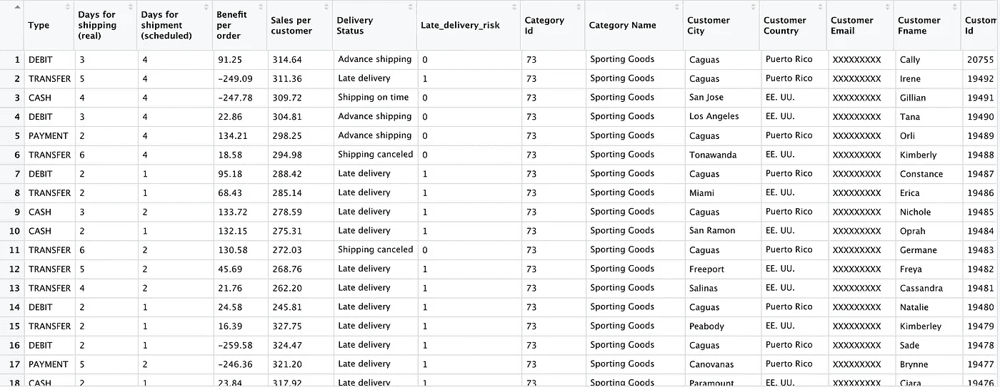

图 22:数据集截图 1

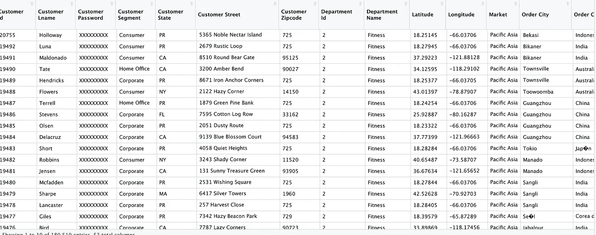

图 23:数据集截图 2

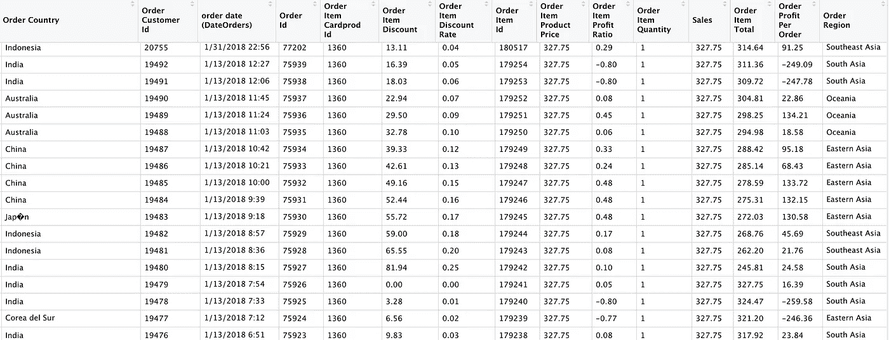

图 24:数据集截图 3

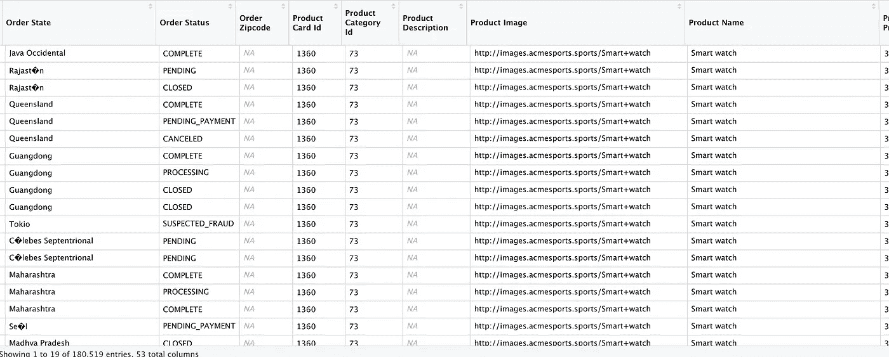

图 25:数据集截图 4