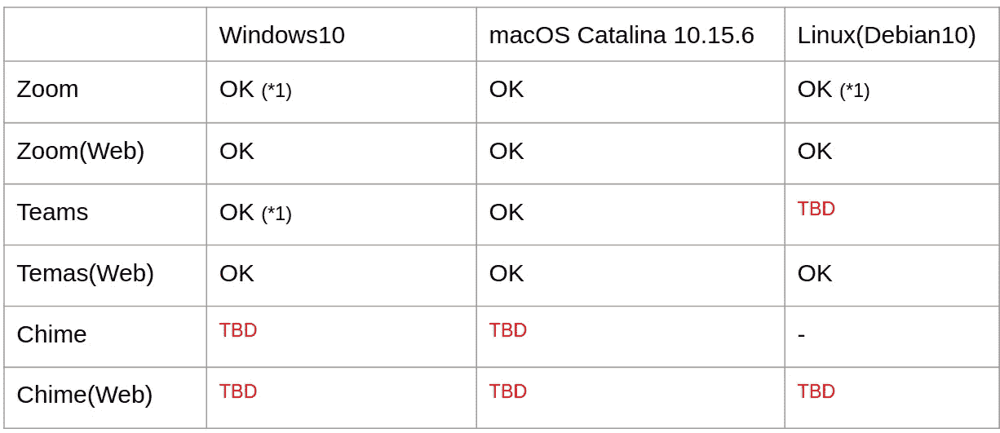
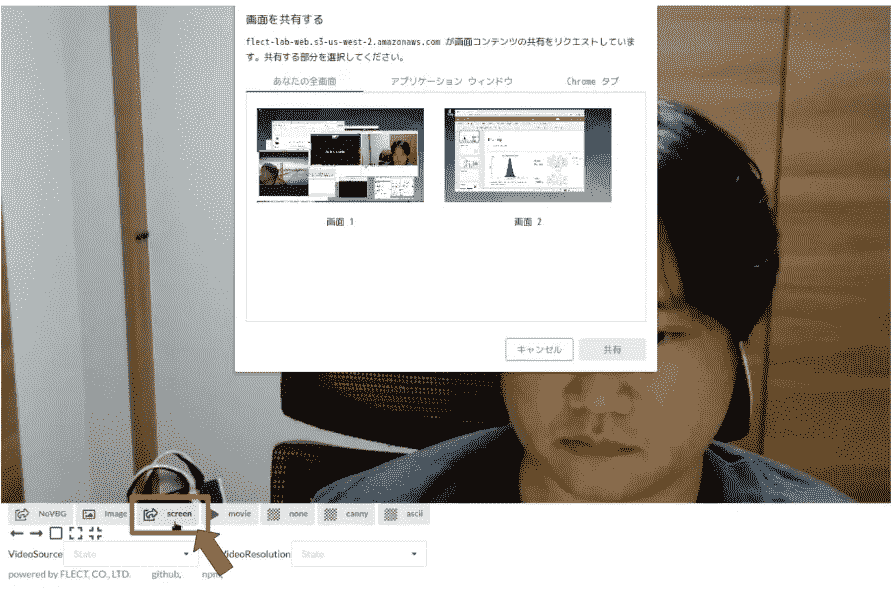
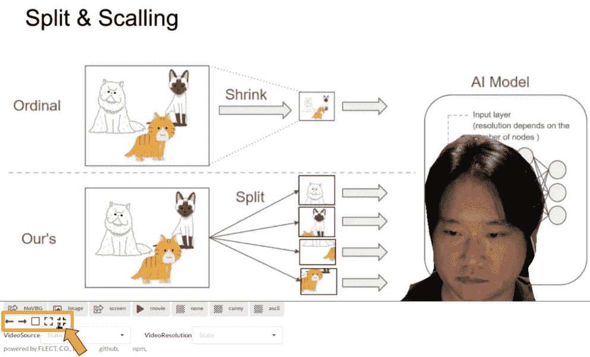
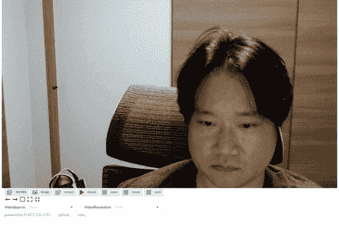
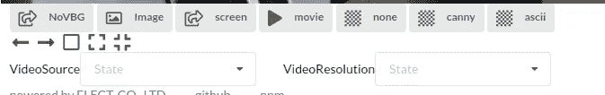

# 制作类似 mmhmm 的演示文稿的最简单方法，在缩放、团队、谐音中使用虚拟背景

> 原文：<https://medium.com/analytics-vidhya/the-easiest-way-in-the-world-to-make-mmhmm-like-presentations-in-video-conferencing-f48e594482ed?source=collection_archive---------7----------------------->

**(新篇 20/10/2020):** [face swap 和浏览器上的虚拟背景](/@dannadori/faceswap-and-virtual-background-on-your-brower-ada0e8042746)

我将向您展示世界上(可能)最简单的方法，以便在 Zoom 和 Teams 等视频会议系统中使用幻灯片作为虚拟背景进行演示。简而言之，我会告诉你如何做一个像 [mmhmm](https://www.mmhmm.app/) 这样的演示。

不需要特殊设备或软件！

该方法已经过测试，可以在以下环境中工作。如果有人尝试过未经证实的部分(描述为 TBD)，如果你让我知道你是否尝试过，我会很感激。这是一个简单的方法，所以它可能也适用于其他视频会议系统。

注:我用的是下面的浏览器。
Windows:Chrome 85 . 0 . 4183 . 102
MAC OS:Chrome 85 . 0 . 4183 . 102(* 2)
Linux:Chrome 83 . 0 . 4103 . 97
* 1 通话需要关闭自己的摄像头图像。
*2 你需要给 Chrome 权限才能分享你的屏幕。
(检查系统偏好>安全&隐私>隐私>记录监视器)

# 如何做到这一点

1.  在您的网络浏览器(Chrome)中访问以下网站。
    [https://flext-la b-web . S3-us-west-2 . amazonaws . com/001 _ virtual _ background/index . html](https://flect-lab-web.s3-us-west-2.amazonaws.com/001_virtual_background/index.html)

2.选择页面左下方的屏幕按钮，选择打开幻灯片的应用程序。

3.指定通过视频会议系统的屏幕共享功能访问上述网站的浏览器。

4.你可以在浏览器上调整你的脸在页面左下角的位置。

仅此而已。

这很容易做到，但是你真的可以做到。

# 对操作的更详细的解释

在上面的网页中，你会发现各种按钮和下拉框。

NoVBG:取消激活虚拟背景
图像:使用图像作为虚拟背景
屏幕:使用屏幕截图作为虚拟背景
电影:使用电影作为虚拟背景
无:取消激活演示者的遮罩
canny:用艺术线条遮罩演示者
ascii:用艺术线条遮罩演示者

视频源:选择视频输入源
视频分辨率:选择视频分辨率

# 还有更多…

到目前为止，我们一直假设我们将共享演示文稿，但这样一来，我们可以使用各种屏幕作为虚拟背景。这允许你用你的编辑器作为虚拟背景进行实时编码。你也可以使用你的游戏屏幕作为现场游戏的虚拟背景。如你所见，有很多应用。

# 最后

在本文中，我解释了世界上实现类似 mmhmm 的演示的最简单的方法。

mmhmm 需要安装，并且受其支持的应用程序的限制。此外，Zoom 也有类似的功能，但它需要是发送方和接收方 Zoom 客户端都支持的版本。此外，能够被设置为虚拟背景的应用的数量是有限的。

考虑到所有这些，我认为你可以说这不仅是最简单的，而且是最灵活的虚拟背景功能。这不是很好吗？

仅此而已。如果你有兴趣，请试一试。另外，如果您有任何功能改进要求，请联系我们。请给我买杯咖啡。

