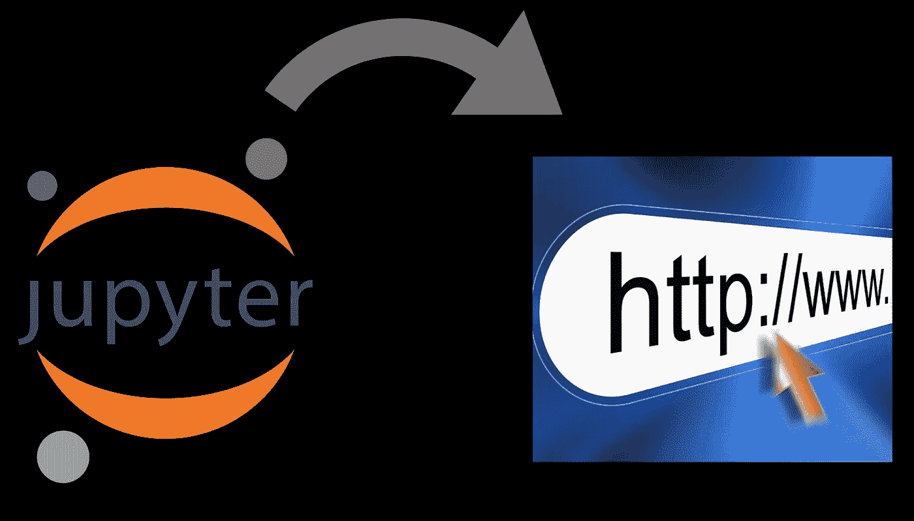
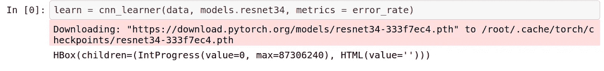

# 部署深度学习 web 应用的最简单方法

> 原文：<https://medium.com/analytics-vidhya/the-easiest-way-to-deploy-a-deep-learning-web-app-21ddc9b8d5e3?source=collection_archive---------23----------------------->

包含深度学习模型的 jupyter 笔记本可以在[https://github.com/abhhii/GuitarClassification](https://github.com/abhhii/GuitarClassification)买到。

# **简介**

所以你刚刚开始学习深度学习，终于做出了你的第一个很酷的模型。现在你想把它展示给你的朋友，这样他们就可以自己尝试了。但是，当你第一次想到与全世界分享你的酷项目时，Jupyter 笔记本并不是你所想的那样。世界上任何人都可以访问的 web app 似乎是更可行的选择。但是你不想花时间做 web 开发。解决办法:这个帖子。

# **我们的目标**

在这篇文章中，我将描述将深度学习模型部署为 web 应用程序的最简单的方法，无需任何实际编码，也不会花费您任何钱。最终的结果会是我做的这个应用程序:

[https://whats-that-guitar.onrender.com/](https://whats-that-guitar.onrender.com/)

# **将模型投入生产**

我用 fastai 库开发了我的深度学习模型。Fastai 库基于脸书的 PyTorch 框架。我的深度学习模型接受吉他的图像，并将其分类为声学、电子、拱顶、共鸣器或双颈吉他中的一种。

我使用 Resnet34 对五种类型的吉他图像进行训练。cnn_learner 对象被命名为“learn”。

在训练模型和调整参数以获得最佳结果之后，是将模型投入生产的时候了。首先我们必须导出训练好的模型，这可以通过使用 fastai 库提供的 *export()* 函数来完成。

这将在我们工作的目录中创建一个名为“export.pkl”的文件，该文件包含部署我们的模型所需的所有内容(模型、权重以及一些元数据，如使用的类或转换/规范化)。

# 使用渲染部署

Render 是一个统一的平台，通过免费 SSL、全球 CDN、专用网络和 Git 自动部署来构建和运行您的所有应用和网站。对于我们的使用，我们可以轻松地在 render 上免费部署一个 web 应用程序。我们将使用 [starter repo](https://github.com/render-examples/fastai-v3) ，它已经部署了 fastai 深度学习课程中教授的模型。

## **一次设置**

将已启动的回购从 GitHub 转入你的 GitHub 账户。点击此链接找到回购:[https://github.com/render-examples/fastai-v3](https://github.com/render-examples/fastai-v3)

创建渲染帐户。[注册](https://dashboard.render.com/register?i=fastai-v3)一个渲染账号。不需要信用卡。

## **项目前期设置**

步骤 1:上传您的训练模型文件

将我们使用 *learn.export()* 创建的训练模型文件上传到 google drive 或 Dropbox 等云服务。现在复制文件的下载链接。**注意:**下载链接通常不同于 google drive 提供的共享链接。你可以使用类似[这些](https://syncwithtech.blogspot.com/p/direct-download-link-generator.html)的服务，通过进入共享链接来获得下载链接。

第二步:为你的模型定制应用程序

编辑 *app* 目录下的 *server.py* 文件，用上面创建的链接更新 *export_file_directory* 。还要用您的分类模型的类更新 classes 变量。更新 *app/view* 目录中的*index.html*文件，以更改出现在您的应用主页上的文本。

第三步:在 GitHub 上提交和推送您的更改

提交回购后，您就可以开始部署了。

## 部署

步骤 1: **在 render 上创建一个新的 web 服务**，并使用我们刚刚分叉的 repo。您需要提供 render 权限来访问您的存储库。

步骤 2:在部署屏幕上，**为您的服务选择一个名称**，并使用 Docker 作为环境。将使用服务名创建一个不可更改的 url。

第三步:点击**保存 Web 服务。你完成了！！该服务将开始构建，并在几分钟后在您的控制面板中显示的 url 上线。**

## 测试

转到您的应用程序 url 来测试部署。一个 url 的例子看起来像:[*https://whats-that-guitar.onrender.com/*](https://whats-that-guitar.onrender.com/)

“那把吉他是什么”是我的服务名。在进一步测试应用程序时，您还可以查看服务日志。

# 包裹

这个部署不能处理大量的请求，比如每秒 1000 个请求(毕竟它是免费的..)但是把自己的作品展示给世界上任何一个人都足够了。我相信 render 对于那些想要部署深度学习模型而不想花太多时间构建 web 应用程序的人来说是一项出色的服务。

欢迎对我的吉他应用程序提出建议。

在[https://github.com/abhhii](https://github.com/abhhii)探索我的其他项目。

和平☮！