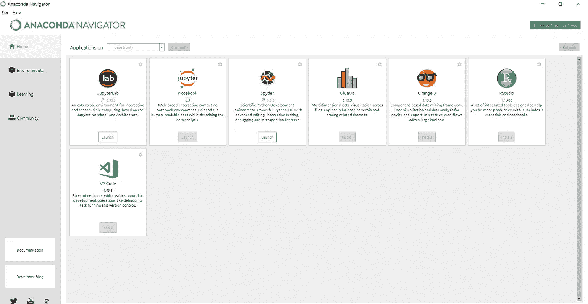
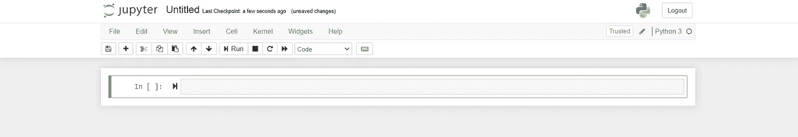
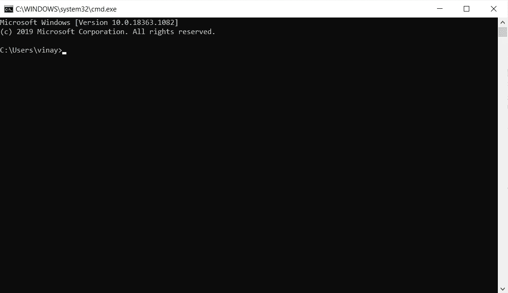
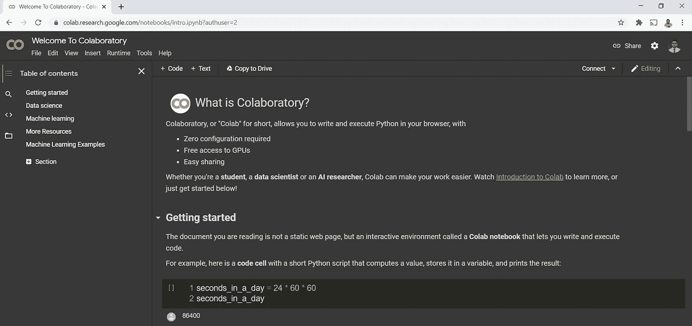

# 运行 python 最简单的方法

> 原文：<https://medium.com/analytics-vidhya/the-easiest-way-to-run-python-9213589d58c6?source=collection_archive---------25----------------------->

## 无需下载多个软件和更新路径，只需在 python 上运行一些代码

对于刚开始学习编码的初学者或从不同平台或语言转换的专家来说，为一种新语言设置界面、工具和配置总是一件麻烦的事情。获得正确的版本、具有适当的兼容性以及更新当前的配置，仅仅是为了运行代码的某个部分，就要花费大量宝贵的时间和精力。

萨法尔·萨法罗夫在 [Unsplash](https://unsplash.com?utm_source=medium&utm_medium=referral) 上拍摄的照片

1.  巨蟒领航员

程序员学习和运行代码的最常见方式之一是使用 Ananconda Navigator 和 Jupyter 笔记本。这在未来的学生、试图进入 python 的非程序员、寻求比较和实时输出的分析人员中非常流行。

作者照片

作者照片

这很简单，但是，浏览新的库和包有时会变得混乱。

2.命令提示符

作者照片

安装 python，在任何 notes 应用程序中编写代码，将文件另存为。py 扩展名，并通过命令提示符运行代码。

这种方法的问题是缺乏 GUI，必须记住所有的语法，并且仅仅通过命令行导航是不容易的

3.谷歌联合实验室

作者照片

运行 python 代码最简单的方法。它有入门模块，用于介绍和理解界面，然而，即使你不想这样做，你也可以只写或复制现有的代码，并立即运行它。

它与 google drive 有直接的接口，你可以运行复杂的机器学习算法，也可以运行简单的 if-else 语句。这是一个网络版的 jupyter 笔记本，拥有 drive 的所有优势，比如共享、可访问性、一键式错误搜索。

如果你是初学者，或者想尝试编程、机器学习、数据科学或一般的编码，Google Colaboratory 是最好的资源之一。