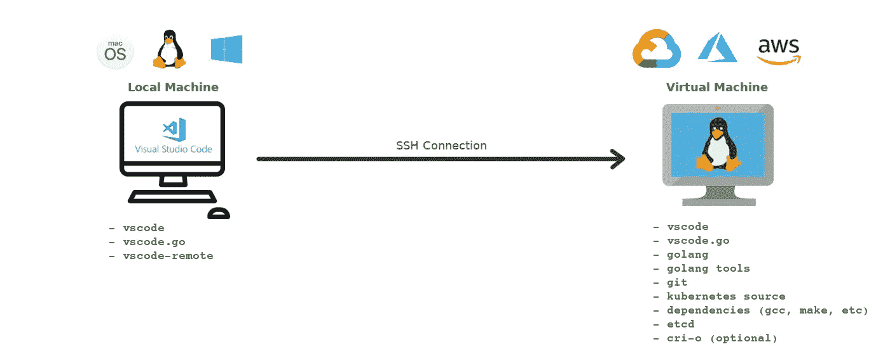
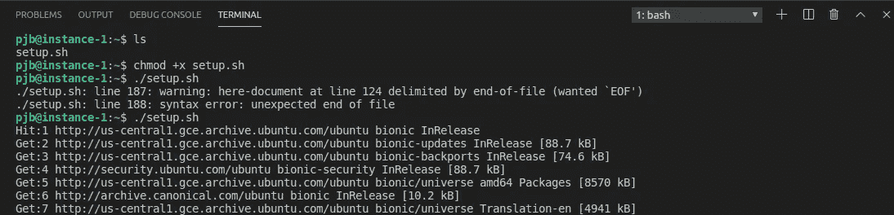

# 使用 VS 代码和远程 VM 启动并运行 Kubernetes 源代码！

> 原文：<https://medium.com/analytics-vidhya/the-easy-way-to-get-the-kubernetes-source-code-up-and-running-using-vs-code-and-a-remote-vm-689b0ecb9d0c?source=collection_archive---------5----------------------->


由[达斯汀·李](https://unsplash.com/@dustinlee?utm_source=unsplash&utm_medium=referral&utm_content=creditCopyText)在 [Unsplash](https://unsplash.com/?utm_source=unsplash&utm_medium=referral&utm_content=creditCopyText) 拍摄

## 关于如何使用云虚拟机和 Visual Studio 代码远程扩展从头开始设置 Kubernetes 开发环境的演练。

你可能是一个新的贡献者，只是想要一个快速和隔离的环境，或者只是不想在你的机器上安装你只在编码时需要的东西。在任何一种场景中，您都可以受益于在云虚拟机上运行整个开发环境，并使用 VS Code Remote extension 使它像在本地运行一样。

这是最终状态的样子:



来自[www.flaticon.com](http://www.flaticon.com)的 [Freepik](https://www.flaticon.com/authors/freepik) 制作的 mac 图标

注意，本地机器可以是 MacOs、Linux 或 Windows。本例中的开发机器将是 Linux Ubuntu。

# 0.创建虚拟机

我不打算在这上面花太多时间，因为三个主要的云提供商有很多关于如何在 [azure](https://docs.microsoft.com/en-us/azure/virtual-machines/linux/quick-create-portal) 、 [gcp](https://cloud.google.com/compute/docs/quickstart-linux) 和 [aws](https://aws.amazon.com/getting-started/tutorials/launch-a-virtual-machine/) 中创建 linux 虚拟机的说明。

下面的步骤假设您有一个虚拟机，您知道它的公共 IP，并且设置了 SSH 密钥，这样您就可以进入它了。

出于本文的目的，虚拟机位于谷歌云中。然而，没有什么能阻止你在其他云提供商甚至其他地方托管的容器上使用虚拟机。

# **1。设置本地机器**

## **Visual Studio 代码**

[在你的实际机器上安装 Visual Studio 代码](https://code.visualstudio.com/download)。我们将使用这个 IDE 作为您的机器和实际开发机器之间的主要桥梁。

## 安装 Go 扩展

安装 ms-vscode.go 扩展。可以使用 VS 代码快速打开快捷键(`Ctrl+P`)，粘贴下面的命令，回车。

```
ext install ms-vscode.go
```

不要忘记点击安装:


## 安装 VS 代码远程扩展包

安装 [vs 代码远程扩展包](https://marketplace.visualstudio.com/items?itemName=ms-vscode-remote.vscode-remote-extensionpack)。这里也一样，`Ctrl+P`:

```
ext install ms-vscode-remote.vscode-remote-extensionpack
```

注意，这个扩展有一些变化。我更喜欢使用这个包，因为它在一个单独的扩展中包含了远程访问容器、WSL 和 SSH 服务器(我们将会用到)的能力。


## 连接到远程虚拟机

再次使用`Ctrl+P`并键入命令:

```
> Remote-ssh Add New SSH Host
```

然后填写虚拟机的用户名和 IP/FQDN:


按照下面的格式:

```
ssh myusername@IP
```

选择您的本地 ssh 配置选项，如果有疑问，可能是第一个选项:


要打开远程浏览器，单击安装远程开发扩展时出现在左侧栏上的新图标。或者，使用`Ctrl+P`:

```
> View: Show Remote Explorer
```


远程浏览器应该在 SSH 目标部分显示虚拟机 IP。右键单击主机，并在当前窗口中选择连接到主机。


确认虚拟机的指纹:


一旦连接上，您就可以开始访问远程机器。默认情况下，当您尝试打开一个文件夹(`Ctrl+K Ctrl+O`)时，它会显示虚拟机中的文件夹:


打开终端时也会发生同样的情况(`Ctrl+``):


# 2.设置虚拟机

现在我们已经连接了远程机器，我们可以开始设置 Kubernetes 环境了。

我已经创建了下面的脚本，它将在虚拟机中安装所有的需求。这个脚本是为 Ubuntu 编写的，所以如果你使用的是不同的发行版，你可能需要对它做一些改动。

请注意，该脚本定义了 GO 版本和 repo/fork 位置，因此要对它们进行相应的调整:

要简单地下载和执行，使用 VS 代码终端(`Ctrl+``)执行以下命令:

```
wget [https://gist.githubusercontent.com/pjbgf/a8e02c81a9af62af3ca9b06196d84c70/raw/cbfb440e5298c99907c3891b1cfd733e6d7fb510/setup-kubernetes-contributors-developmroment.sh](https://gist.github.com/pjbgf/a8e02c81a9af62af3ca9b06196d84c70#file-setup-kubernetes-contributors-development-enviroment-sh) -O setup.shchmod +x setup.sh
./setup.sh 
# to also install crio add a --crio at the end of the line above
```



在没有 crio 的情况下，这在 Google Cloud VM 中的 n1-standard-4 (4 个 vCPUs，15 GB 内存)上通常需要大约 3 分钟

## 构建源代码

所有依赖项和源代码都应该正确安装在虚拟机中。现在，您可以简单地重新加载概要文件，这将加载对 PATH 和新的 GOPATH 环境变量的更改。

进入项目文件夹并编译它:

```
source ~/.profile
cd $GOPATH/src/k8s.io/kubernetes
make
```


在上面提到的相同规格下，这需要大约 8 分钟。

# 3.优化 Visual Studio 代码

为了充分利用 VS 代码，我们需要对它的默认设置做一些修改。

## 开始:安装/更新工具

为了获得丰富的 IDE 体验，需要安装几个 go 工具。他们将提供诸如自动完成，格式化等东西。要安装它们，使用`Ctrl+P`并键入`Go: Install/Update Tools`:


您可以选择所有选项，然后单击确定。或者，你可以手动安装它们。

## VS 代码设置

**大项目和文件变更**

VS 代码将自动监控项目中所有文件的变化。如果您打开了一个文件，并且它检测到对该文件的外部更改，它将为您刷新这些更改。这是一个很好的特性，但是，当被监控的文件数量太大时，它会使 VS 代码运行缓慢。

通过打开文件夹(`Ctrl+K Ctrl+O`)并定义 kubernetes 文件夹来打开项目时:


你肯定会在右下角给你这条信息:


不要按照说明增加操作系统级别的文件句柄数量。这个项目有太多的文件，监控所有的文件是浪费资源。为了便于理解，下面是项目编译后每个文件夹中的文件数量:


相反，我们将通过打开设置(`Ctrl+,`)并更改`Files: Watcher Exclude`设置来从文件监视器中排除其中一些。为了便于访问，请在过滤器文本框中写下“观察”:


添加这 6 个与 kubernetes 相关的异常应该会让你跑得更轻松。请记住，对这些文件的外部更改不会被自动检测到。

**Go 配置**

将设置过滤器更改为“go”并启用“使用语言服务器”和“自动完成未导入的包”。

将“Go: Format tool”更改为“goimports”，因为当前默认选项(goreturns)不支持 [go 模块](https://blog.golang.org/using-go-modules)。


# 好了

基本上就是这样了。现在你应该能够浏览源代码了，比如“转到”或者“查看”定义，“查找所有引用”等等。您还应该能够编译和运行单节点集群来测试您的更改。

要运行基于源代码的单节点集群，请运行:

```
API_HOST=0.0.0.0 hack/local-up-cluster.sh
```


这可能需要几分钟时间。加载完成后，打开另一个远程终端，检查 kube-dns 是否启动并运行:


如果您热衷于本地端口转发您的远程集群，Code Remote extension 也支持这个功能。只需确保您的 kubeconfig 在本地机器上配置正确。

# 从这里，哪里？

现在你有了一个 Kubernetes 环境，你可以做任何事情。:)

如果你刚刚开始成为一名贡献者，我当然会建议你阅读[贡献者指南](https://github.com/kubernetes/community/tree/master/contributors/guide)，然后尝试从 github 中挑选一个“[好的第一期](https://github.com/kubernetes/kubernetes/issues?q=is%3Aopen+is%3Aissue+label%3A%22good+first+issue%22)”项目。另外，确保你加入了 [Kubernetes Slack 频道](https://slack.k8s.io/)。