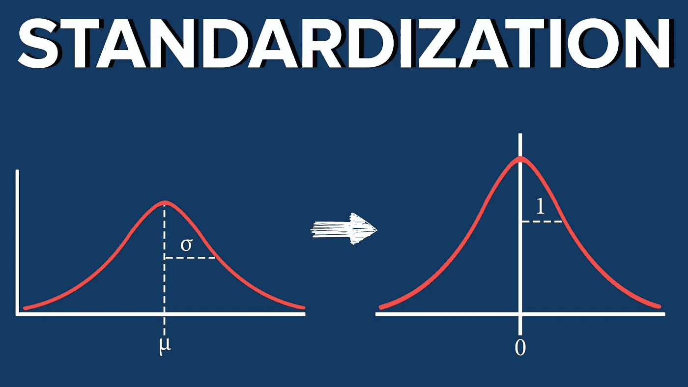
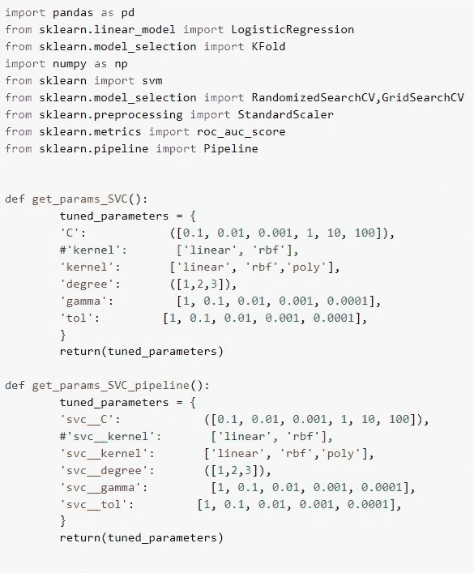
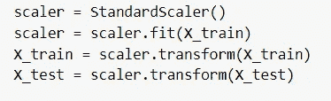
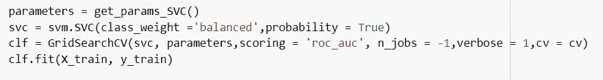
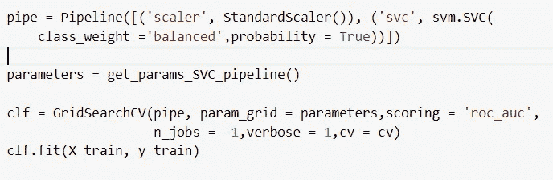
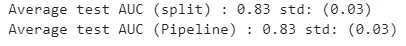
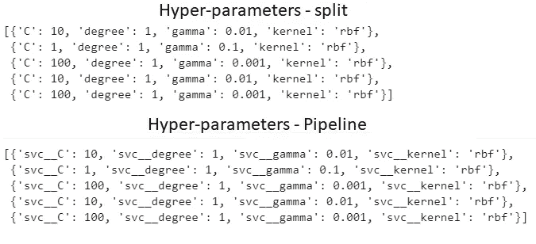
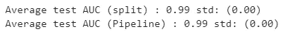
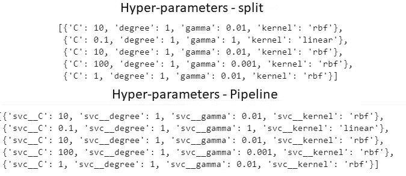

# 你在犯这个错误吗？如何在您的模型中执行数据规范化。

> 原文：<https://medium.com/analytics-vidhya/the-effect-of-data-normalization-in-your-models-should-we-use-a-pipeline-6b97510f1908?source=collection_archive---------14----------------------->

如果你已经使用 Scikit-learn 有一段时间了，你可能已经在某个地方听说过**管道**有多好和多安全。Pipeline 是一个 Scikit-learn 函数，用于聚合数据预处理和模型训练/优化之间的所有步骤。

在这篇文章中，我将引用下图中的函数和库，你可以在这里找到完整的代码:

这篇文章的一些有用的功能

使用管道的主要优势之一是数据标准化。数据标准化是许多机器学习分类器的重要步骤。对于一些基于距离的方法，如支持向量机(SVM)，最重要的是确保计算出的特征之间的距离不受大值的支配。对于其他的，如神经网络，可以大大提高训练和收敛时间。

在使用标准化方法之前，最好将数据分成训练集和测试集。使用训练集来训练该方法，并且利用变换函数将该方法应用于测试集。这可以防止数据从训练集泄漏到测试集中，这可能会严重影响我们的结果。有关代码示例，请参见下图。

标准标尺的通用惯例

通常，下一步是为我们的分类器找到最佳参数。为此，我们经常使用一种网格搜索形式，要么是 RandomizedSearchCV，要么是 GridSearchCV。参见下图中的示例。

数据标准化后的网格搜索实例

现在，不使用管道会产生一个问题。GridSearch 将只使用训练集，并将它分成 *N* 个折叠( *N* 由 *cv* 参数给出)。 *N-1 个*折叠供用户训练，剩余的 1 个折叠用于测试和查看超参数的给定组合有多好。但是，当我们标准化数据时，我们没有考虑 GridSearch 步骤中会发生的分裂(内部交叉验证)。我们使用我们的整个训练集来训练标准化者，因此，在 GridSearch 期间生成的分裂不是 100%独立的。该模型正在优化列车上的超参数，并在引入数据泄漏的地方进行验证分割，因此，我们的优化结果可能会有偏差。

您的测试集并没有受到这个小问题的影响，但是在 GridSearch 期间选择的超参数可能不会在测试集中得到推广，因为找到它们的过程并不是 100%可信的。

现在，如果我们使用 Scikit-learn 中的 Pipeline 类，这可以很容易地避免。在下图中，我们定义了 GridSearch(标准化和要优化的分类器)期间管道中将要发生的每个步骤。

上面的方法将保证 GridSearch 内部的分割以适当的方式完成，防止数据泄漏。

现在，使用或不使用管道的实际效果如何？为了展示这一点，我使用 Pima Indians 糖尿病数据库(来自 ka ggle challenge:available[here](https://www.kaggle.com/uciml/pima-indians-diabetes-database))和乳腺癌 Wisconsin (Diagnostic)数据集(也来自 Kaggle: available [here](https://www.kaggle.com/uciml/breast-cancer-wisconsin-data) )创建了两个实验设置。

对于糖尿病数据集，目标是预测给定患者是否患有糖尿病。对于乳腺癌数据集，目标是将癌症分类为恶性或良性。

我使用 5 重交叉验证拆分了两个数据集，对于每一次 k 重迭代，我使用和不使用管道对数据进行了标准化，并优化了超参数。对于每个 k 倍迭代，我记录了测试集的受试者操作特征曲线(AUC)下的面积和网格搜索产生的超参数。

下面是代码，这样你可以很容易地理解它(要在 Colab 中运行它，你需要从上面提供的链接中的 Kaggle 下载数据):

# **结果—** 皮马印第安人糖尿病数据库

5 重交叉验证的结果

为每个 k 次迭代选择的超参数

# **结果——乳腺癌威斯康星州**

5 重交叉验证的结果

如您所见，我找不到使用管道或单独规范化数据之间的任何区别。两个数据集选择的 AUC 和超参数完全相同。当然，这可能是由于数据集本身(并不复杂)或所选择的模型*。

也就是说，使用 pipeline 函数背后的理论推理无疑是正确的，它的使用不仅会使您的代码更干净、更易于维护，还会使您的代码更安全，不会出现过于乐观的结果。

*你觉得代码有问题吗？你还想看另一个实验吗？请留言或给我发电子邮件。拉莫斯@amsterdamumc.nl