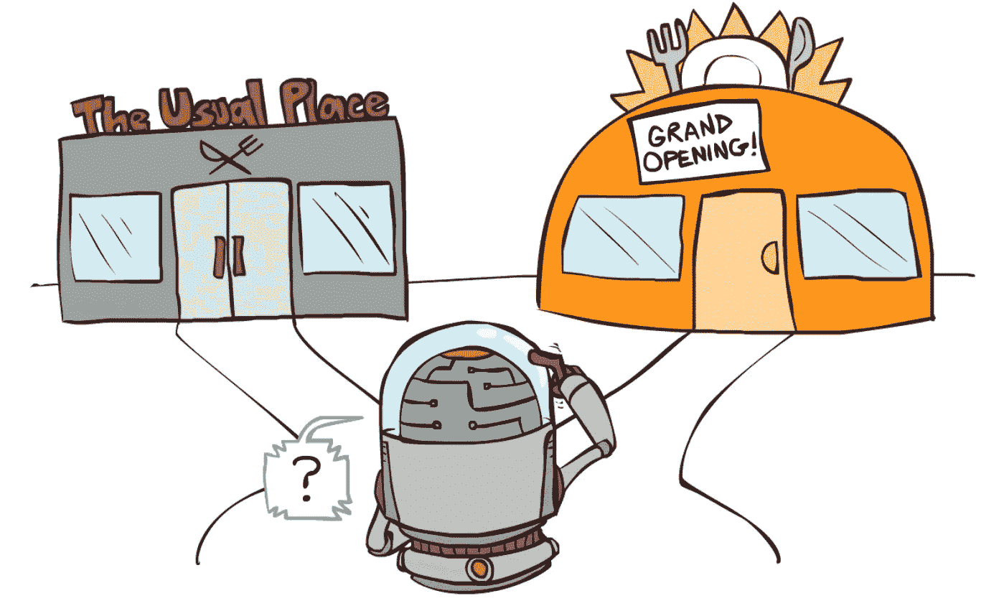
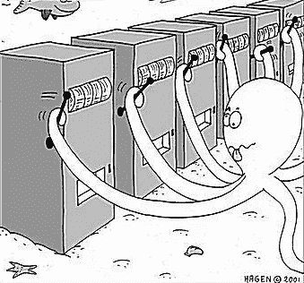
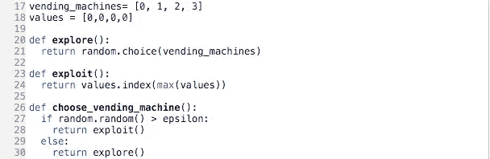

# 强化学习的ε-贪婪算法

> 原文：<https://medium.com/analytics-vidhya/the-epsilon-greedy-algorithm-for-reinforcement-learning-5fe6f96dc870?source=collection_archive---------2----------------------->

假设你和你的朋友正在决定去哪里吃饭。在过去，你总是去街角的墨西哥餐馆，你们都很喜欢。然而，这一次，你的一个朋友提到街上新开了一家黎巴嫩餐馆，据说很不错。你们没有一个人能达成共识——你应该去你知道非常好的墨西哥餐馆，还是应该去有可能变得更好或更坏的黎巴嫩餐馆？

决定？！

> 快速旁白:
> 
> 强化学习是人工智能的一个亚型，它基于计算机像人类一样通过试错来学习的想法。它旨在让计算机从经验中学习和提高，而不是被明确地指示。
> 
> 但是，计算机是如何知道这样做的呢？
> 
> 通过使用学习算法。
> 
> 学习算法是由程序员实现的数学工具，它允许代理在执行任务时有效地进行试错。学习算法解释从环境返回给代理的奖励和惩罚，并使用反馈来改善代理对未来的选择。

在强化学习中，我们的餐馆选择困境被称为**探索-利用权衡**。在什么情况下，你应该利用你认为最好的选项，而不是探索可能更好或更坏的选项(反之亦然)？

这种折衷被称为**多臂强盗问题**。

假设你妈妈给了你一袋 25 美分硬币，让你在一系列的 4 台自动售货机上使用。然而，这些自动售货机很特别(当然)，因为你看不到里面有什么。每台自动售货机都有不同百分比的不同类型的巧克力棒，每块售价 25 美分。你知道你更喜欢 kit kats 而不是 oh henry，oh henry 而不是 coffee crisp，coffee crisp 而不是 mars bars。你应该如何在四台自动售货机上消费，以最大限度地提高你对巧克力棒的总体满意度？

这是一个多臂强盗问题——当你永远无法确定拉每个选项会有什么结果时，如何将固定数量的资源用于几个不同的选项？

怎么会？？

嗯，幸运的是，我们有**ε贪婪算法**！

ε-贪婪算法通过以下方式利用探索-开发权衡

1.  指示计算机探索(即选择概率为ε的随机选项)
2.  并利用剩余的时间(即选择目前看来最好的选项)。

通常情况下，ε设定为 10%左右。

这样，随着时间的推移，计算机在选择不同的选项时，它会意识到哪些选择会给它带来最高的回报。然而，它会不时地选择一个随机的动作，以确保它没有遗漏任何东西。使用这种学习算法，计算机可以收敛到它试图学习的任何情况下的最佳策略。

好了，让我们把我们的自动售货机难题放进 python 吧！

假设我们有

*   一个名为“vending_machines”的列表，其中包含了我们面前所有不同的自动售货机。
*   一个名为“values”的列表，其中包含了迄今为止我们从每台自动售货机收到的平均值。

所以，我们可以用代码来表示ε贪婪部分:

*   我们定义了“探索”功能，它指示我们从自动售货机列表中随机选择
*   我们定义了“exploit”函数，它指示我们选择与值列表中最高数字相关的自动售货机(我们的“贪婪”行为)
*   我们定义了“choose_vending_machine”函数，它生成一个介于 0 和 1 之间的随机数。如果它大于ε，它会引导我们利用函数。否则，它会引导我们使用浏览功能。

我们有了它，最大化我们奇巧消费的完美算法(拿着，画在自动售货机上)！

所以，下次你妈妈给你一袋 25 美分硬币，而你去一堆你看不到的自动售货机时，确保带一支铅笔和一沓纸，做一些 epsilon-greedy——或者，你知道，只是去找一个不同的自动售货机:)。