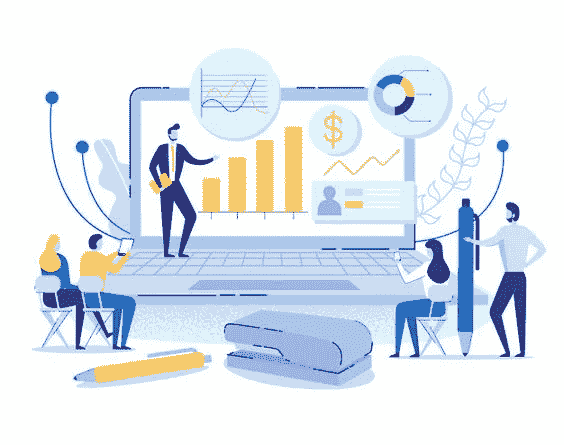
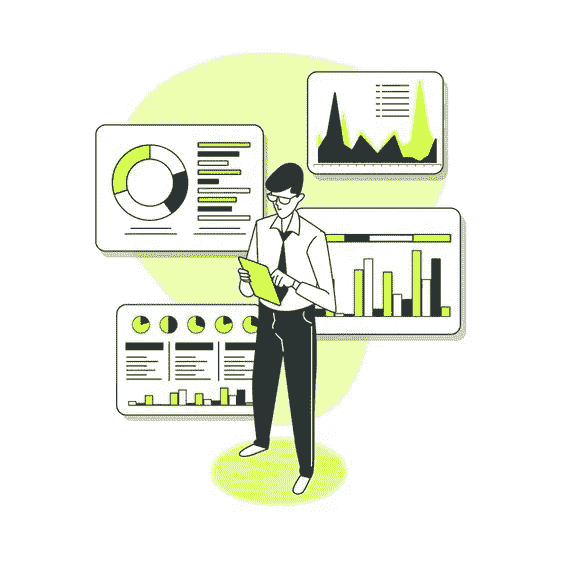
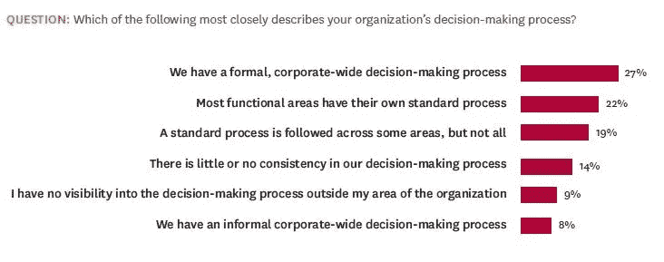
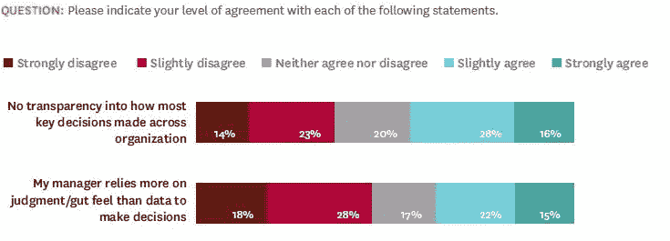
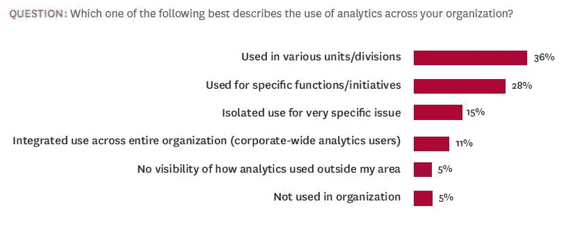
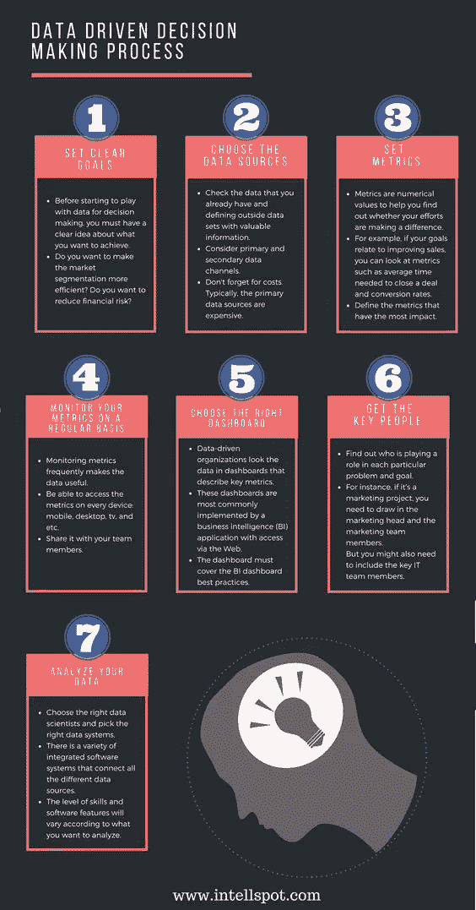

# 决策的演变:

> 原文：<https://medium.com/analytics-vidhya/the-evolution-of-decision-making-31c684a3a87d?source=collection_archive---------13----------------------->

## 领先的组织如何采用数据驱动的文化

> 领先的分析用户采用一系列策略，随着时间的推移，这些策略演变为最佳实践，以在他们的组织中创建“分析生态系统”。

在快速变化的全球商业环境中，组织做出准确及时决策的压力从未像现在这样大。识别挑战、发现机会并灵活适应的能力不仅是竞争优势，也是生存的必要条件。

人们长期以来一直宣扬依靠商业智能(BI)和分析的数据和见解来帮助做出更好、更及时的决策的好处。对来自这些工具的数据的依赖有望带来更好的财务表现。一项针对所有行业和地区的 646 名高管、经理和专业人士的全球调查显示，在决策流程和他们对这些分析/BI 工具的使用方面，出现了重大但微妙的变化。这种演变以用户为标志:

1.  **增强技能-** 随着业务节奏的不断加快，高管和业务用户正在增强他们的技能，以便他们能够将分析工具集成到他们的正常工作方式中，从而发现战略洞察力。

**2。用直觉平衡数据-** 这些业务用户在使用数据时不会自动驾驶；他们正在学习如何在使用分析和他们的管理本能之间取得精确的平衡，以及如何在分析的同时管理业务规则。

**3。打造新关系-** 随着分析的使用对决策变得至关重要，领先的企业用户正在与分析专业人士打造新的更深入的关系，将他们提升到值得信赖的内部顾问的位置。

**4。开发最佳实践-** 领先的分析用户采用一系列策略，随着时间的推移，这些策略会演变为最佳实践，从而在他们的部门或组织中创建一个“分析生态系统”。

> 在竞争日益激烈的全球市场中，人们普遍需要更及时的决策。

更快做出更好决策的必要性增加了组织及其员工的压力。由于这种压力，数据驱动文化的发展正在发生演变，通常基于分析和商业智能的使用。这一演变可以通过一系列关键发展来描述:

**1。时间压力越来越大-** 在竞争越来越激烈的全球市场中，人们普遍需要更及时的决策。

**2。标准化流程-** 决策流程越来越标准化，数据成为讨论的基础和出发点。

**3。分析领导者的出现-** 成熟的分析用户已经完善了他们的决策流程，作为数据驱动文化的一部分，并实现了卓越的财务绩效。

**4。技能拓展-** 为了满足更快、更好地做出决策的更高需求，企业用户正在开发更强的技能来使用分析工具并将它们集成到他们的工作结构中。

**5。更谨慎地使用管理判断-** 虽然对数据的依赖是最重要的，但决策过程包括加入行业实践、经验和其他形式的管理判断。

决策过程

# 决策挑战

虽然受访者的公司通常认识到需要提高决策能力，但许多公司并没有应对挑战的所有流程。五分之一的人说他们的决策过程不一致，或者充其量是一个非正式的过程。很明显，决策过程有缺陷的公司在决策时不太可能使用分析。

许多调查指出了对其组织当前决策状态的失望。一位矿业公司高管表示:“我的大多数同事依赖直觉，或者只是同意上层管理人员的意见，因为他们相信自己的成功是有原因的。”。“表达担忧时，我通常是一个人，这样做不是为了批评，而是为了指出有机会超越的领域。”他指出，过度依赖管理直觉给决策过程带来了明显的随意性。他说:“通常，做出决定是为了看看改变是否奏效，如果不奏效，我们总是可以回到原来的样子，或者尝试一些新的东西。”“用这种方法我们可能会走运；然而，负面影响的风险更大。”

判断和透明度的作用

# 分析领导者:一种新方法开始出现

有趣的是，那些最有可能从通过分析更快做出决策中受益的是最大的企业，那些年收入超过 50 亿美元的企业。引人注目的是，在使用分析的所有好处中，受访者最常提到的效果是更快的决策。

那些已经转向以事实为基础、以证据为基础的决策制定的公司——这是对管理本能的磨练——只是在做出优于那些仍然基于直觉做出决策的公司的决策。这些优秀公司所做的不同是建立一个分析生态系统，真正改变分析师所能贡献的价值，因此高管们了解所有的联系和联系以及他们决策的历史基础。因此，他们今天做出了比以前更明智、更具战略性的决策。

企业范围内的使用定义了分析领导者

# 分析正在改变个人和组织

另一个重要发现是决策者的角色正在发生变化。来自社交媒体、电子邮件、视频、演示文稿和其他非传统信息来源的海量数据赋予了高管们前所未有的理解客户和业务、预测挑战和发现机遇的能力。

分析对个人角色的影响

为了充分利用机遇和解决挑战，高管、经理和专业人士正在培养新的技能，以了解哪些数据是重要的，并更深入地研究数字，以做出并测试他们的假设和决策。与此同时，他们正在与分析专业人士建立新的更深入的关系，将他们提升到值得信赖的内部顾问的位置。

使用分析的好处

> 随着及时决策变得越来越重要，分析正在改善和改变决策的方式。

作者:玛希玛·拉索德

2020 年 11 月