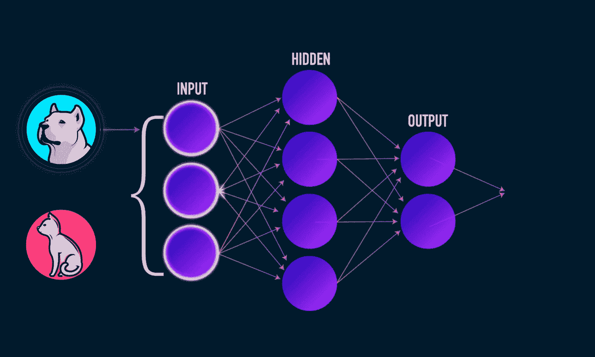

# 眼科医生的眼睛——用深度学习检测失明

> 原文：<https://medium.com/analytics-vidhya/the-eyes-of-an-eye-doctor-detect-blindness-with-deep-learning-51ce763a008b?source=collection_archive---------8----------------------->

[https://media.giphy.com/media/d1E0XQlBb5QIQEFi/giphy.gif](https://media.giphy.com/media/d1E0XQlBb5QIQEFi/giphy.gif)

## **简介**

不可否认的事实是，深度学习的进步可以在许多方面让我们的生活变得更好，其中一个产生巨大影响的领域是医疗保健，让人们更加负担得起。
深度学习在医疗保健中有各种各样的应用
，如疟疾、癌症、肺炎检测等，但你有没有想过
这在皮肤下是如何工作的？。
计算机如何分析扫描图像并进行处理？。
深度学习网络如何像医生的大脑一样思考？。在这篇博客中，我们将通过一个真实世界问题的解决方案来回答上述所有问题。

## 有什么问题？。

这里选择的问题是“糖尿病视网膜病变”，这是一种影响糖尿病患者视力的疾病，不受控制的血糖水平将导致血管损伤，当这种情况发生在眼睛后部的光敏组织(视网膜)时，视力开始恶化，并将最终完全丧失视力，有关这方面的更多信息，请参考[链接](https://www.mayoclinic.org/diseases-conditions/diabetic-retinopathy/symptoms-causes/syc-20371611)。

## 深度学习在这里能有什么帮助？。

对抗任何健康问题的最佳方式是预防它，为了预防糖尿病视网膜病变，人们必须尽早发现它，那么如何发现这种情况呢？
Ans)扫描患者的视网膜，由训练有素的医生对扫描图像进行评估，以提供诊断。
现在，如果患者请不起医生，会发生什么情况？或者，当有数百万患者需要诊断，而可用的医生数量很少时，会发生什么？。
想象一下，如果我们可以用神经网络代替医生的评估部分？或者，也许只是在医生的评估之前使用神经网络，这样医生就可以只查看严重的病例或神经网络不确定的病例，这难道不是一个很好的解决方案吗？。

来自印度的 Aravind 眼科医院正试图通过利用上述想法为数百万来自农村地区的患者提供糖尿病视网膜病变诊断，以建立一个检测失明的神经网络。他们举办了一场 kaggle [竞赛](https://www.kaggle.com/c/aptos2019-blindness-detection/overview) (APTOS 2019 失明检测)，我们将从中获取数据并构建解决方案。

## **深度学习的基础知识**

**注意**-如果你熟悉神经网络和卷积神经网络等概念，你可以跳过这一节。
神经网络:-

[https://www . quora . com/What-is-the-differences-between-artificial-neural-network-computer-science-and-biological-neural-network #](https://www.quora.com/What-is-the-differences-between-artificial-neural-network-computer-science-and-biological-neural-network#)

这里的想法是模仿人类的神经元，提出一个能像人类一样思考的算法。这看起来有点复杂，但很容易理解。
让我们看看生物神经元中发生了什么，假设你触摸一个热锅，然后你皮肤上的受体向你的大脑发送电信号，这些电信号被称为树突的触手状结构接收，这些来自不同来源的信号在细胞核中进行处理，然后通过轴突发送到其他神经元或大脑。
科学家们希望利用这一想法，建立一个简单的算法，该算法可以将一些数字作为输入，在类似神经网络的结构中处理这些数字，并给出输出。有不同类型的神经网络，其中一种适用于图像数据的神经网络是卷积神经网络，我们将使用它来解决手头的问题。

神经网络和 CNN 的深入工作是巨大的，不可能在一篇博客文章中涵盖，如果你有兴趣学习它们，我会给你留下一些有用的资源。现在把 CNN 想象成一个结构，它以数字形式接收图像，然后对这些输入数字执行一些操作，得到一个输出。

现在可能会有一些问题来自 CNN 的上述直觉，如
**1。图像是如何用数字表示的？。**
Ans。我们存储在计算机中的一切都是以 0 和 1(二进制)的形式存储在内部的，让我们来看一个表示的图像。

[https://mitchellkscscomputing . WordPress . com/2015/10/21/how-bitmap-images-is-presented-in-binary/](https://mitchellkscscomputing.wordpress.com/2015/10/21/how-bitmap-images-are-represented-in-binary/)

在上面的插图中，观察图像是如何在位图上表示的，深色方块用 1 表示，浅色单元用 0 表示。
图像的分辨率也决定了位图的大小，例如上图的分辨率为 8×8(8 行 8 列),同样，分辨率为 128×128 的图像会有一个 128 行 128 列的位图。

**2。我们如何将图像文件转换成？jpg 或者。png 格式转换成数值形式？。**
俺们。多亏了 opencv，这个任务在 python 中只有一行答案，只需键入 numeric _ rep = cv2 . im read(path)。
函数 imread 将从指定的路径读取图像，并将其转换为数值数组，该数组现在存储在变量‘numeric _ rep’中。

**3。CNN 结构如何根据输入预测输出？。**
Ans。这里有两个阶段，第一个是训练阶段，它与训练人类大脑的任务有关，例如，我们通过展示狗和猫的多个例子，在儿童中注册一个像狗或猫的动物。同样，我们给出狗或猫的图像的数字表示作为输入，这些数字然后在 CNN 结构中进行一些运算，给出一个输出(狗或猫)。这也称为**前向传播。**

https://towards data science . com/everything-you-neural-neural-propagation-machine-learning-make-easy-e 5285 BC 2 be 3a

假设第一次尝试执行的操作是随机的，我们收到的输出是“猫”，但原始输出是“狗”， 由于我们的 CNN 错误地预测了输出，我们发现了原始输出和预测输出之间的差异，并将该误差传递回 CNN 结构，这也被称为**反向传播**通过重复的正向传播和反向传播过程，CNN 学习输出标签为“狗”的图像中存在的模式。类似地，该结构学习标签为“猫”的图像中存在的模式。学习到的模式和特征的示例有颜色模式、耳朵形状、眼睛颜色、鼻子长度等。

一旦训练阶段结束，CNN 已经从训练图像中学习了模式，现在使用这些知识，我们可以预测看不见的数据的输出，这也被称为测试阶段。至此，你应该对 CNN 如何运作有了一个非常基本的概念，并且能够理解博客的其余部分。

## APTOS 2019 失明检测

**目的** -建立一个神经网络，该网络可以接受扫描的视网膜图像作为输入，并根据失明的严重程度给出一个 0-4 之间的数字，其中“0”表示“无视网膜病变”，“4”表示“增生性视网膜病变”。

**性能指标** 这些是评估我们的模型性能的不同度量，以便确定它在给定任务中有多好。

1.  加权 Kappa 分数
2.  混淆矩阵

混淆矩阵是众所周知的，但 Kappa 评分不是，但它非常类似于准确性，它也可以被理解为简单准确性测量的扩展。

κ是一个分数，它既考虑了模型相对于医生诊断的准确性，也考虑了模型和医生偶然的一致性，用κ表示，定义为

https://en.wikipedia.org/wiki/Cohen%27s_kappa

其中,“po”是评价人之间的相对观察一致(等同于准确性),“pe”是偶然一致的假设概率，使用观察数据计算每个观察者随机看到每个类别的概率。如果评价人完全同意，那么 kappa =1。如果评价人之间没有达成一致意见，除了偶然预期的以外(如‘PE’给出的)，kappa =0。

加权 Kappa 是对此的一个小变化，在这里，如果两个评价人彼此不同意，则根据两个评价人给出的评价的距离给出分数。这意味着，如果(a)真实值为 4，但模型预测 a 为 3，我们的得分会更高，如果(b)模型预测 a 为 0，得分会更低。

**挑战**
1。为训练提供的图像数量较少(3662)，深度学习通常需要大数据集才能获得好的结果。
2。图像的来源是多种多样的，图像是在各种光照条件下拍摄的，图像的质量也各不相同。
3。没有严格的延迟限制，但是该模型不应该花费超过几分钟来诊断图像。

## **探索性数据分析和特征工程**

我们提供了两个图像文件夹，一个训练和其他测试以及两个相应的 csv 文件。训练 csv 文件包含图像名称，第一列为“id_code ”,第二列为医生给出的相应诊断。由于测试 csv 文件只有图像名称，没有给出诊断列，因此让我们加载 csv 文件并查看训练 csv 的样本。

训练 csv 文件示例

在我们继续下一步之前，对我们来说重要的是将给定的训练集分层并交叉验证，这样我们将有一组看不见的数据来评估我们的模型。

**输出变量“诊断”在训练和交叉验证中的分布**

训练集中输出变量的分布

交叉验证集中输出变量的分布

从上面的分布图中，我们可以看到，训练集和验证集中每一类的点的百分比是相似的。

**我们如何知道患者患有糖尿病视网膜病变？。在**上至少有 5 样东西可以发现

[https://www.eyeops.com/](https://www.eyeops.com/)

现在让我们看看属于每个类别的**图像示例**

属于每个类别的图像的例子

上图中的第一行包含 5 个诊断为“0”(“无糖尿病性视网膜病变”)的视网膜扫描示例，最后一行包含诊断为“4”(“增生性视网膜病变”)的视网膜扫描示例。如果您更仔细地观察，第一行中的图像要清晰得多，似乎没有任何异常形状或凸起，但最后一行中的图像有可见的斑点、像动脉瘤一样的凸起、棉絮状斑点等。

图像预处理
这是任何基于图像的任务中最重要的部分，一些常见的处理步骤有颜色转换、裁剪、调整大小等。

读取图像并处理它的功能

上述功能从硬盘读取图像，将其转换为 RGB(默认情况下在 BGR 读取)，将图像大小调整为 128X128 像素，并有一个选项来启用本的预处理技术，如果启用，则应用高斯滤波器，这是一个低通滤波器，因为它有助于消除图像的噪声，并通过赋予不同的权重与原始图像合并，因为它有助于增强我们关心的特征。
**图像经过预处理后属于每一个类别，没有剪裁暗的多余部分**。

Ben 预处理后的图像

从上面的图像中可以清楚地看到，由于特征更加明显，预处理已经起作用。
'Crop_dark_extras '该功能用于移除图像中额外的黑暗空间，因为从该示例中无法获得任何有用的信息-

裁剪图像的代码

裁剪前的图像

裁剪深色附加部分后的图像

在处理每个图像之后，图像的相应数字表示被添加到 numpy 数组，训练、cv 和测试集具有不同的数组。这些数组也存储在。npy 格式，以便在需要时可以加载它们。

**转换输出变量** 最初，输出变量被编码为 one-hot like(如果输出类别为 3，则变量“y”被编码为[0，0，1，0，0])，因此这里提出的**问题是一个“多类别分类”问题，这很好，但由于这是一个医疗保健问题，并且检测“假阴性”的成本非常高，我们将把该问题重新组织为一个有序回归问题。** 当转换为有序回归问题时，如果输出类为 3，那么变量‘y’编码为[1，1，1，0，0]，这也意味着如果数据点属于类 3，那么它也属于类 1 和类 2([参考](https://arxiv.org/pdf/0704.1028.pdf))。

**更多数据！** 拥有更多的数据总是有益的，通过一些搜索，我了解到 2015 年在 Kaggle 上举行了一场类似的比赛，因此我们也将下载并预处理 2015 年的数据集。

## 系统模型化

众所周知，没有一个通用的模型适用于任何数据，因此我们将尝试多种模型架构，看看在我们的情况下什么效果最好(有关逐步解释的更多详细信息，请参考 github 上的 ipython 笔记本)。

在我们试验任何体系结构之前，让我们决定常数
**Kappa 得分的计算**
由于问题是作为一个有序回归问题提出的，因此模型的最后一层将是一个 sigmoid 层，它将为我们提供 0-1 之间的概率，并将每个类视为一个单独的二进制分类问题。例如，最后一层的输出为[0.8，0.4，0.7，0.2，0.1]，我们将概率阈值设置为 0.5，则输出为[1，0，1，0，0] 现在取最高的类，并且在它之前的所有类都被认为是 1，所以输出变成[1，1，1，0，0]，然后与原始输出变量进行比较，以确定二次加权 Kappa 得分。
**损失函数**
对每个输出类计算二进制交叉熵，并求和以获得每个数据点的损失
**优化器**
Adam

**架构实验
模型-1(具有简单架构的基线模型)**
这是为了查看一个基本解决方案的表现和达到参考 kappa 分数的情况。

带有 2019 年比赛数据的模型-1

(详细日志和代码请参考 [github](https://github.com/akashsambhangi/APTOS-blindness-Detection) 上的 ipython 笔记本。)
该模型是一个相对较小的模型，因为它只有大约 2.8M 的参数

验证集的 Kappa 分数

该模型的 kappa 得分为 0.70，表现不错。
在 Hyperas(支持 GPU 处理)的帮助下，以类似随机搜索的方式对更多此类架构进行了实验，来自此**(2019 年数据的模型-2)**的最佳架构可以达到 0.80 的 kappa 分数，这很好，但从召回矩阵中我们可以看到，3 级占主导地位，大多数点被错误分类为 3 级。

回忆最佳自有架构的矩阵

基线模型的张量板

**迁移学习技术**
目前有许多针对图像数据集进行预训练的先进架构，这些架构可用于解决我们手头的问题，同时我们还将对我们的方法进行两项增强，以获得最佳解决方案。

a) **使用图像数据生成器技术进行数据扩充**
在将列车图像输入模型之前，对列车图像进行旋转/翻转等操作。这将有助于模型更好地处理看不见的数据，并且在可用数据集较小时也很有用

可视化由 ImageDataGenerator 生成的图像

b) **利用 2015 年的比赛数据**
从现在开始所有的车型都是按照下面提到的流程，根据 2015 年的比赛数据进行预训练的。
预处理 2015 年的数据- >将训练、cv 和测试集结合起来，形成一整套训练数据(因为我们只对 2019 年的比赛数据进行验证)- >定义一个以 imagenet 权重作为起始权重的模型- >用 2015 年的数据对模型进行 5 个时期的训练，并保存权重。

**dense net 121** dense net 架构首先根据 2015 年的数据进行预训练，来自该模型的权重被用作使用 2019 年比赛数据的模型的起点。

Densenet121

从上面的单元格中，我们可以看到这里的参数数量约为 7M，这明显大于我们的基线模型。
这款车型表现非常出色，kappa 评分为 **91.34** 。
该模型的召回矩阵是对我们基线模型的巨大改进。

Densenet 121 召回表

Densenet121 型号的张量板测井

**Resnet 50** 这是一个比 Densenet 121 具有更多参数的更大架构，在 2015 年的数据上遵循相同的预训练过程。

Resnet 50

Resnet50 的张量板

与只有 700 万个参数的 Densenet121 架构相比，这里的参数数量已经增加到大约 2350 万个。
虽然该模型的性能并没有明显优于 Densenet121，因为其 kappa 得分为 **91.65** ，并且该模型的召回矩阵也非常相似。

Resnet-50 型号的召回矩阵

**efficient net** 这是一种设计工作类似于最先进架构的架构，但参数数量更少，因此计算能力更低，该架构基于 Mobilenet(它使用深度卷积等概念来减少参数数量)，Efficientnet [论文](https://arxiv.org/abs/1905.11946)关注如何有效地扩展 CNN 架构。
根据模型架构的深度和宽度，Efficientnet 分为 7 个模型，其中 Efficientnet-B0 是最小的架构，Efficientnet-B7 是最大的架构。

为了比较 Efficientnet 与 Densenet121 和 Resnet50 的性能，我们将选择参数数量相当的 **Efficientnet-B4** (在 github 代码中也试验了 Efficientnet B0 和 B3)。

效率网络 B4

**此架构使用的参数数量多于 Densenet121，少于 Resnet50，但此处实现的性能是三者中最好的，因为此模型的 kappa 得分为 92.01** ，召回矩阵也有所改进。

Effieicntnet B4 的召回矩阵

Efficientnet-B4 的 Tensorboard

在 Efficientnet 模型上验证 Kappa 分数的图

Kappa 分数显示没有过度拟合

此外，对各种模型的输出进行了 XGBoost 试验，但性能改善不明显，因此选择 Efficientnet-B4 作为最终模型。
实现从预处理原始数据到预测输出一切的管道被创建并出现在 [github 链接](https://github.com/akashsambhangi/APTOS-blindness-Detection)中。

模型摘要

**92 的 Kappa 分数意味着我们的最佳模特和医生在大约 92%的时间里意见一致，这是一个例外！！**

[https://media.giphy.com/media/9Ai5dIk8xvBm0/giphy.gif](https://media.giphy.com/media/9Ai5dIk8xvBm0/giphy.gif)

## 链接

**LinkedIn** - [点击此处](https://www.linkedin.com/in/akash-sambhangi-41498396/)
**Github** - [点击此处](https://github.com/akashsambhangi/APTOS-blindness-Detection)

## 参考

1.  Appliedaicourse.com(这是我获得机器学习和深度学习知识的地方)
2.  [https://github . com/Bt Graham/SparseConvNet/blob/ka ggle _ Diabetic _ Retinopathy _ competition/competition report . pdf](https://github.com/btgraham/SparseConvNet/blob/kaggle_Diabetic_Retinopathy_competition/competitionreport.pdf)
3.  [https://arxiv.org/abs/1905.11946](https://arxiv.org/abs/1905.11946)
4.  [https://arxiv.org/abs/0704.1028](https://arxiv.org/abs/0704.1028)
5.  [https://www . ka ggle . com/xh lulu/aptos-2019-dense net-keras-starter](https://www.kaggle.com/xhlulu/aptos-2019-densenet-keras-starter)
6.  [https://www . ka ggle . com/c/aptos 2019-失明-检测/讨论/108065](https://www.kaggle.com/c/aptos2019-blindness-detection/discussion/108065)

## **未来工作**

1.  根据 2015 年的数据预训练超过 5 个时期的最佳模型，以获得更强大的起始模型。
2.  尝试更多的图像增强技术。
3.  该模型可以部署在云上，以便可以在世界各地的农村医疗营地访问它。