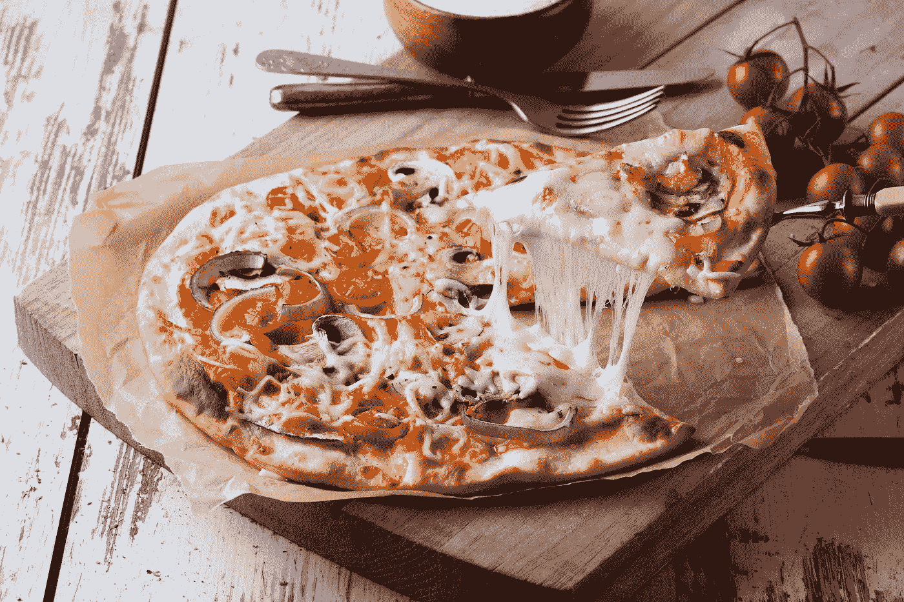

# 算法时代的公平

> 原文：<https://medium.com/analytics-vidhya/the-fairness-of-dominos-pizza-delivery-982e41c9c87a?source=collection_archive---------26----------------------->

## 在相同的条件下，算法预计会产生相同的结果。但它总是公平的吗？

开尔文·塞塞拉在 [Unsplash](https://unsplash.com/s/photos/pizza?utm_source=unsplash&utm_medium=referral&utm_content=creditCopyText) 上的照片

几个月前的一个星期天，我第一次订购了多米诺骨牌外卖。我对多米诺的印象很一般，无法与美食相比。疫情让我有了信心。