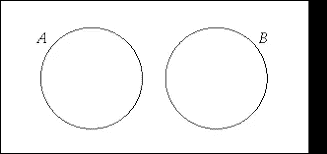
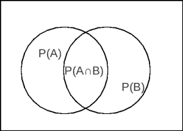
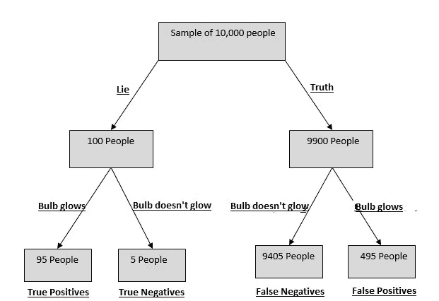
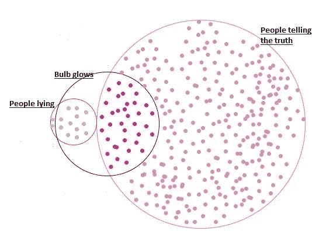

# 假阳性悖论

> 原文：<https://medium.com/analytics-vidhya/the-false-positive-paradox-cc78a4f0284f?source=collection_archive---------11----------------------->

我写这篇文章的目的是向你介绍贝叶斯概率理论，信息的力量和我们假设的缺陷，这些常常让我们付出巨大的代价。在我们理解“不可理解”的旅程中，我们从统计学的角度出发，但是这篇文章不仅仅是为统计学领域的人而写的。

# **从统计角度来看**

在现实世界中，假阳性和真阴性的概念在预测模型的可用性中起着压倒性的作用。许多系统可以容忍一些召回，但需要高精度，而其他系统可以在精度和召回两者上折衷。在面向精度的系统中，我们希望只有当我们的模型对它相当有信心并且假阳性是不可接受的时候，我们才能得到“真实”的预测。面向回忆的系统倾向于做出一个“真实的”预测，即使他们对此有点确定。这里的目标是不要对任何可能是真的样本进行错误分类。

考虑一个农场里的土豆选择器，它必须在快餐店里挑选土豆来做薯条。餐馆更喜欢大土豆，如果大土豆上市，普通消费者几乎不会购买。因此，机器必须以这样的方式训练，它不会错误地分类大土豆，但同时，如果它选择一个较小的土豆也没有问题。这是一个**召回导向系统的例子。**

土豆选择器是一个面向召回的系统

我们都欠垃圾邮件检测器很多时间。它们是精心构建的，因此不会将非垃圾邮件误归类为垃圾邮件。一些垃圾邮件进入我们的收件箱是可以容忍的，但一封非垃圾邮件最终被视为垃圾邮件则是不可容忍的。因此，它是一个**精确定位系统的例子。**

垃圾邮件分类器是一个面向精度的系统

当存在高度不均匀的类别分布时，评估分类分数和理解结果的整个过程发生变化。在我们继续下一步之前，我们需要先看看贝叶斯定理。

# **贝叶斯定理**

贝叶斯定理用于确定事件的条件概率。这个定理告诉我们，事件的概率随着提供给我们的信息而变化。

贝叶斯定理看起来确实很可怕，但是我们将尝试使用简单的步骤来实现它。

设 A 和 B 是两个互斥事件，P(A)和 P(B)是它们各自的概率，那么

> P(A 或 B) = P(A) + P(B)

a 和 B 是互斥事件

类似地，如果 A 和 B 不是互斥的，

> P(A 或 B) = P(A) + P(B) -P(A 和 B)(重叠区域被计数两次，所以我们需要减去一次)

现在让我们考虑这两个事件的发生。如果 A 和 B 是互斥的，

> P(A 和 B) = P(A) * P(B)

如果它们不是相互排斥的，

> P(A 和 B) = P(A) * P(B 给定 A) = P(B) * P(A 给定 B)

a 和 B 不是互斥的事件

这让我们想到:

P(B 给定 A) = P(A 和 B) / P(A)

> P(B 给定 A) = ( P(A 给定 B) * P(B) ) / P(A) **(这是贝叶斯定理)**

贝叶斯定理简单地转换了条件，并基于反向条件的信息给出了结果。

用一个简单的例子来说明，从一副洗好的牌中抽出两张牌，先得到一张国王和一张王后是两个独立的互斥事件，如果选择和替换牌的话。如果它们没有被替换，那么这两个事件不是互斥的，因为第二次抽牌的结果取决于第一次抽牌是否发生(第二次抽牌将来自一组 51 张牌，而不是 52 张)。

# **为什么单个事件的概率不能说明全部情况**

考虑一组人，他们将接受测谎仪的测试。如果检测到有人说谎，机器的灯泡就会发光。实验的规格是:

*   一个人说谎的概率= **P(谎言)= 1%**
*   一个人说真话的概率= **P(真话)= 99%**
*   如果一个人在说谎，机器灯泡发光的概率(机器的灵敏度)= **P(给定谎言发光)= 95%**
*   因此， **P(发光给定真理)= 5%**

测谎仪的准确性非常令人放心，但准确性本身是一个故事的一半。

假设一个人在机器上被测试，灯泡被点燃。这个人说谎的可能性有多大？

利用贝叶斯定理，

P(lie 给定 glow) = ( P(glow 给定 lie)* P(lie))/P(glow)**———1**

现在，P(发光)= P(发光给出谎言)* P(谎言)+ P(发光给出真相)* P(真相)

在等式 1 中使用它:

P(给出发光的谎言)= ( P(给出发光的谎言)* P(谎言) )/ ( P(给出发光的谎言)* P(谎言)+ P(给出发光的真理)* P(真理))

P(lie 给定发光)=(0.95 * 0.01)/(0.95 * 0.01+0.05 * 0.99)=**0.1610**

结果是，如果测谎仪响了，只有 16.1 %的可能性这个人在撒谎！

假阳性对整体阳性的贡献要大得多

为什么在如此确定的准确性之后，我们得到了这样一个欺骗的结果？

原因是存在高度不均匀的类别分布，并且假阳性虽然**比例小但数量显著大**只是推高了阳性结果的数量(设备检测到的谎言)。

我们相信该设备的准确性，但从来没有考虑到一个人实际上说谎的可能性有多小。因此，这种测试要进行不止一次，以降低假阳性率。假阳性再次显示为假阳性的几率非常低。

p(连续两次假阳性)= 0.05 * 0.05 = 0.0025

心理学以*基本比率谬误*的名义深入研究了人类乐观高估事件结果的倾向。

该设备引发的非说谎者的数量远远超过了真正的说谎者。

# **机器学习中类似的常见问题**

考虑一个有监督的学习问题，其中一个类比其他类普遍得多。假设样本属于主导类的概率为 90%。现在让我们说，我们的模型在测试数据上表现得很好，获得了令人印象深刻的 92%的分数。

现在，如果建立一个虚拟预测器，它总是预测主导类，我们仍然会达到 90%的准确率，只比理论上看起来很好的预测器差 2%。该模型仅略微优于“无逻辑”预测器。

因此，除了预测器的准确性之外，考虑类别分布的特征也很重要。

在这种情况下，总是建议将结果与虚拟预测值进行比较，以检查我们是否被高估所愚弄。

如果你发现它能提供信息，请鼓掌！