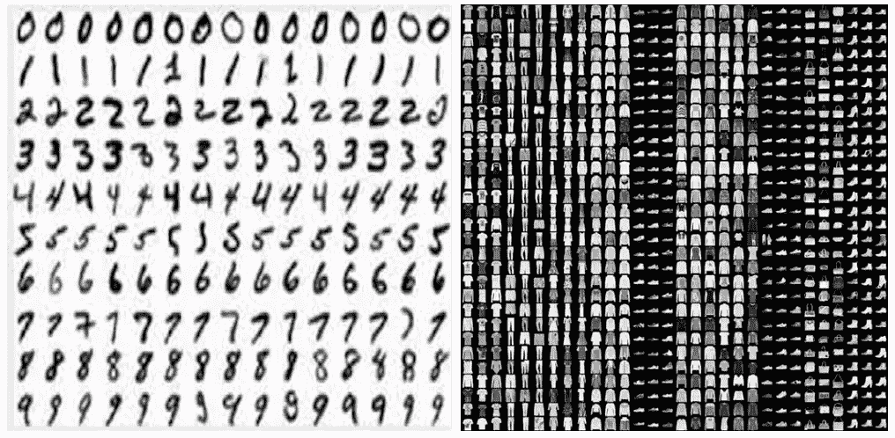
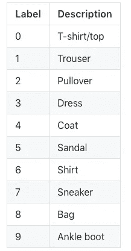
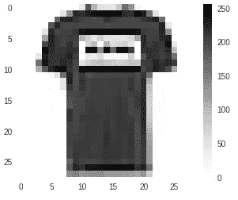
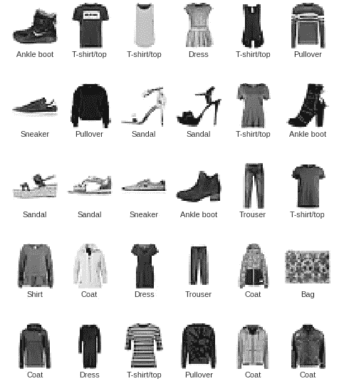
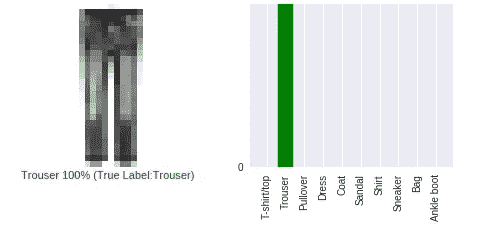
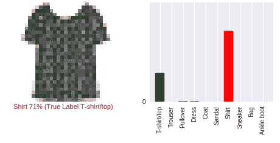
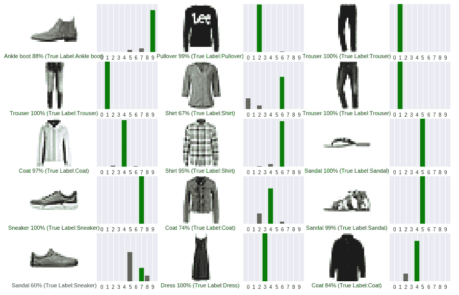

# 深度学习的时髦“Hello World”

> 原文：<https://medium.com/analytics-vidhya/the-fashionable-hello-world-of-deep-learning-8b9e3d60a37c?source=collection_archive---------0----------------------->

## 是时候离开 MNIST 手写数字数据库，拥抱 MNIST 时尚数据库了。


由[诺德伍德主题](https://unsplash.com/@nordwood?utm_source=medium&utm_medium=referral)在 [Unsplash](https://unsplash.com?utm_source=medium&utm_medium=referral) 拍摄的照片

> “如果在 MNIST 行不通，那就根本行不通”，他们表示。“嗯，如果它在 MNIST 奏效，它在其他人身上可能仍然会失败。”

> **更新 2021** :这篇文章是很久以前发表的。库的一些细节和特性可能已经改变。建议查看文档以了解相关细节

在 MNIST 手写数字数据上训练模型是机器学习界的经典。它被认为是深度学习练习的切入点。

MNIST 手写数据库已经存在了相当长的时间，并已被深入研究。这是一组 60，000 幅训练图像，加上 10，000 幅测试图像，由美国国家标准与技术研究所(位于 MNIST 的 NIST)在 20 世纪 80 年代汇编而成。目的是将手写数字(28 × 28 像素)的灰度图像分为 10 类(0 到 9)。“求解”MNIST 类似于深度学习的“Hello World”——这是你用来验证你的算法是否按预期工作的事情。在深度学习领域工作时，我们预计会反复遇到 MNIST 数据库。

# 时尚-MNIST



`[Fashion-MNIS](https://github.com/zalandoresearch/fashion-mnist)T`于 2017 年 8 月发布，作为原始 [MNIST 数据集](http://yann.lecun.com/exdb/mnist/)的直接替代，用于机器学习算法的基准测试。它共享训练和测试分割的确切图像大小和结构，因为每个示例都是 28x28 灰度图像，与来自 10 个类别的标签相关联

# [需要更换](https://github.com/zalandoresearch/fashion-mnist)

仅仅因为一个模型在 MNIST 手写数据上表现良好，并不保证它在其他数据上也会表现良好。这主要是因为我们今天拥有的图像比 MNIST 数据库中的手写数字更复杂。

*   **MNIST 太简单了:**据观察，卷积网络可以在 MNIST 数据上实现大约 99%的准确性，这可能并不总是真实的情况。
*   **MNIST 被滥用**
*   **MNIST 不能代表现代的 CV 任务**，后者往往更加复杂。

# 在时尚 MNIST 数据集上训练 Keras 中的神经网络

> 因为本文使用了 Keras，所以要确保已经安装并运行了 Keras。

现在，让我们探索并使用时尚 MNIST 数据集来训练神经网络，以检测服装类别。

*本文仅作为时尚 MNIST 数据集的介绍。详细了解 Keras 如何训练网络，请参考* [*这里*](https://towardsdatascience.com/my-journey-into-deeplearning-using-keras-part-1-67cbb50f65e6) *。*

有 10 类服装被指定了标签。



## 1.在 Keras 中加载时尚 MNIST 数据集

时尚 MNIST 数据集**预装在 Keras** 的一组四个 Numpy 数组中。

```
import keras
import numpy as np
import matplotlib.pyplot as plt
%matplotlib inlinefrom keras.datasets import fashion_mnist
(train_images, train_labels), (test_images, test_labels) = fashion_mnist.load_data()
```

**标签**不包含在数据集中，因此我们可以创建一个 label_names 列表。

```
label_names = [‘T-shirt/top’, ‘Trouser’, ‘Pullover’, ‘Dress’, ‘Coat’, ‘Sandal’, ‘Shirt’, ‘Sneaker’, ‘Bag’, ‘Ankle boot’]
```

## 2.数据探索

让我们看看训练和测试数据的形状。

```
#Training Data
train_images.shape
(60000, 28, 28)
len(train_labels) # Total no. of training images
60000
train_labels
array([5, 0, 4, ..., 5, 6, 8], dtype=uint8)#Testing Data
test_images.shape
(10000, 28, 28)
len(test_labels)
10000
test_labels
array([7, 2, 1, ..., 4, 5, 6], dtype=uint8)
```

*   训练数据由 60，000 幅图像组成，每幅图像由 28 x 28 像素表示。
*   同样，测试数据由 10，000 幅图像组成，每幅图像也由 28 x 28 像素表示。
*   测试和训练数据的标签是介于 0 和 9 之间的整数。

## 3.预处理数据

数据在输入网络之前必须经过预处理。让我们探索一下训练集的图像。

```
plt.imshow(train_images[1])
plt.grid(False)
plt.colorbar()
plt.show()
```


颜色条显示 0 到 255 范围内的像素强度。我们将把这些值重新调整到 0 到 1 的范围内。

```
#Rescaling test and train imagestrain_images = train_images / 255.0test_images = test_images / 255.0
```



浏览前 30 个训练集图像以确保图像已被缩放。

```
plt.figure(figsize=(8,10))
for i in range(30):
    plt.subplot(5,6,i+1)
    plt.xticks([]) 
    plt.yticks([]) 
    plt.grid(False)
    plt.imshow(train_images[i])   
    plt.xlabel(label_names[train_labels[i]])
```



所有的图像确实被缩放。让我们现在去模型楼。

## 4.构建网络架构

我们将配置模型的层，然后继续编译模型。

*   **设置图层**

```
from keras import models
from keras import layersnetwork = models.Sequential()network.add(layers.Dense(128, activation='relu', input_shape=(28 * 28,)))
network.add(layers.Dense(10, activation='softmax'))
```

该网络由一系列两个密集层组成。这些是紧密连接或完全连接的神经层。第一层有 128 个节点。第二层(也是最后一层)是一个 10 节点的 softmax 层，它返回 10 个概率分数的数组。每个节点包含一个分数，该分数指示当前图像属于 10 个类别之一的概率。

*   **编译模型**

模型构建完成后，我们进入编译阶段，该阶段主要包括三个基本要素:

*   损失函数: ***损失*** (预测值—实际值)是我们在训练一个神经网络的过程中试图最小化的量。
*   优化器:它根据损失函数决定网络如何更新
*   度量:测量模型的准确性。在这种情况下，我们将使用准确性。

```
network.compile(optimizer='rmsprop',loss='categorical_crossentropy',
metrics=['accuracy'])
```

## 5.训练模型

为了开始训练，我们调用方法`network.fit`，即模型“适合”训练数据。

```
network.fit(train_images, train_labels, epochs=5,batch_size=128)Epoch 1/5
60000/60000 [==============================] - 3s 55us/step - loss: 0.5805 - acc: 0.7989
Epoch 2/5
60000/60000 [==============================] - 3s 44us/step - loss: 0.4159 - acc: 0.8507
Epoch 3/5
60000/60000 [==============================] - 3s 42us/step - loss: 0.3692 - acc: 0.8679
Epoch 4/5
60000/60000 [==============================] - 3s 45us/step - loss: 0.3403 - acc: 0.8767
Epoch 5/5
60000/60000 [==============================] - 3s 44us/step - loss: 0.3185 - acc: 0.8842
```

该模型在训练数据上达到大约 **0.88(或 88%)** 的准确率。

## 6.模型评估

我们在测试数据集上评估了模型的性能

```
test_loss, test_acc = network.evaluate(test_images, test_labels)
print('test_acc:', test_acc)10000/10000 [==============================] - 0s 30us/step test_acc: 0.8683
```

测试集的准确率约为 87%,这是训练数据集上较少的可视化——这是一个明显的过度拟合的例子。

## 7.做预测

现在让我们使用训练好的模型对一些图像进行预测。

```
predictions = model.predict(test_images)
```

让我们看看我们的模型对第 10 幅图像的预测。

```
predictions[10]array([9.7699827e-05, 5.6700603e-05, 1.0853803e-01, 1.0991561e-06, 8.7915897e-01, 4.5721102e-10, 1.2143801e-02, 1.0442269e-10, 3.1952586e-06, 4.5470620e-07], dtype=float32)
```

预测是一个由 10 个数字组成的数组，代表不同类型服装的概率。我们还可以为列表中的第 10 项找到概率最高的标签。

```
np.argmax(predictions[10])
4
```

4 对应于“**外套**因此，我们的模型预测第 10 件商品是一件外套。让我们检查一下这个预测的准确性。

```
test_labels[10]4
```

事实上，它是 4，即一个“外套。”

# 分析预测

形象通过视觉化是最好的理解。让我们写一个函数，输出预测的图像和它属于那个类别的概率。

正确的预测标签为绿色，而不正确的预测标签为红色。该数字给出了预测标签的百分比。

让我们看看第 15 幅图像，它的预测和概率。

```
i = 15
plt.figure(figsize=(8,3))
plt.subplot(1,2,1)
plot_image(i, predictions, test_labels, test_images)
plt.subplot(1,2,2)
plot_value_array(i, predictions,  test_labels)
plt.xticks(range(10),class_names, rotation=90)
plt.yticks(range(1))
```



绿色标签表示“裤子”是正确的预测。

```
i = 1000
plt.figure(figsize=(8,3))
plt.subplot(1,2,1)
plot_image(i, predictions, test_labels, test_images)
plt.subplot(1,2,2)
plot_value_array(i, predictions,  test_labels)
plt.xticks(range(10),class_names, rotation=90)
plt.yticks(range(0,1))
```



对于第 1000 张图片，该模型以 71%的概率预测到一件“**衬衫**”。然而，实际上，它是一件 t 恤/上衣。红色标签表示错误的预测，正确的标签写在错误标签旁边的括号中。

## 让我们再画几张图。

```
num_rows = 5
num_cols = 3
num_images = num_rows*num_cols
plt.figure(figsize=(5*num_cols, 2*num_rows))
for i in range(num_images):
  plt.subplot(num_rows, 2*num_cols, 2*i+1)
  plot_image(i, predictions, test_labels, test_images)
  plt.subplot(num_rows, 2*num_cols, 2*i+2)
  plot_value_array(i, predictions, test_labels)
  plt.xticks(range(10))
```



对于大多数图像，我们的模型表现得非常好。然而，也有错误的预测被标为“红色”

# 结论

时尚 MNIST 是对原始 MNIST 在数据复杂性和准确性方面的改进。自发布以来，它一直是这个领域的研究人员、学生和其他爱好者讨论的话题。[晓寒——发布该数据集的高级科学家 III @腾讯人工智能实验室](http://ai.tencent.com/ailab/index.html)表示，“未来，我将继续维护时尚 MNIST，让全球更多的人可以接触到它。不管你是研究人员，学生，教授，还是爱好者。欢迎你在论文、聚会、黑客马拉松、教程、课堂上使用时尚 MNIST，甚至在 T 恤衫上使用[。所以，开始尝试时尚版的 MNIST 吧。](https://www.amazon.com/Computer-Data-Science-Machine-Learning/dp/B072LSQ8H5)