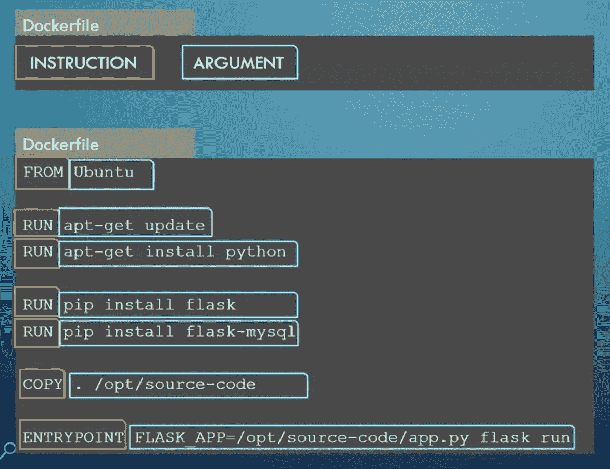
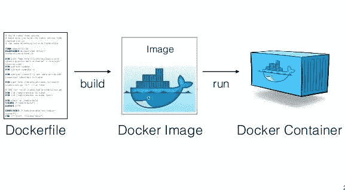
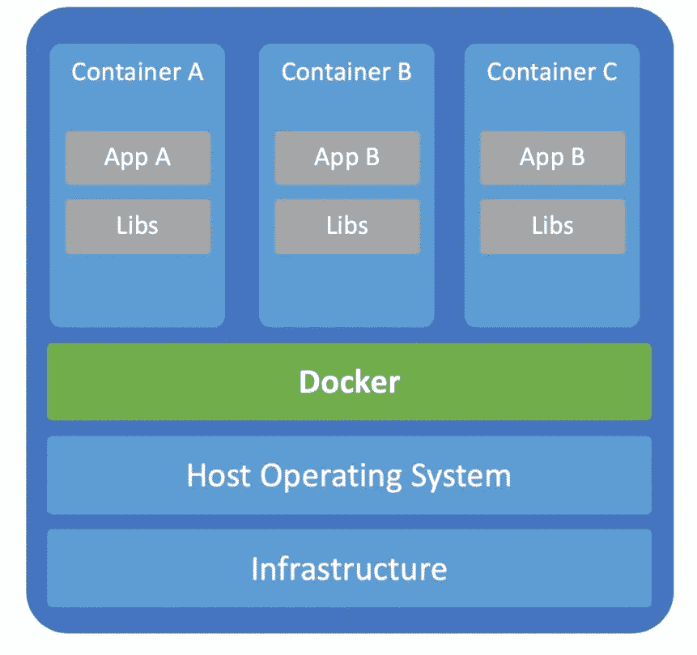
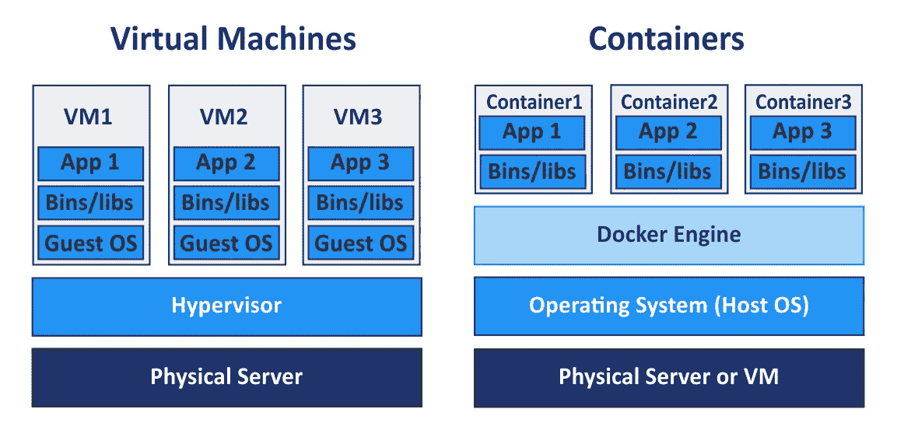

# 成为码头专家的第一步！！！

> 原文：<https://medium.com/analytics-vidhya/the-first-step-to-becoming-a-docker-expert-53c8d76cf909?source=collection_archive---------6----------------------->

最近，我有一种奇怪的倾向，想在 GitHub 上搜索一些很酷的项目，并了解它们是如何工作的。所以，在这个过程中，我发现每三个项目中，我就碰到使用 Docker。就像每个人都会做的那样，我也去我最好的朋友 ***谷歌*** 了解了这件事。通过搜索，我感觉 Docker 最近很热门。所以，在这里，让我们用非常简单的话来讨论 Docker 是什么和它做什么，而不要深入内部技术。让我们开始吧。

## Docker 到底是什么？？

> “Docker 是一个开源项目，它通过在 Linux 上提供一个额外的抽象层和操作系统级虚拟化自动化，来自动化容器中的软件应用程序的部署。”

这是谷歌给我们的，作为对我们问题的回答。让我们简化上面的定义。简单地说，Docker 是一个工具，它允许开发人员、系统管理员、运营经理等。尽可能在一致的环境中轻松部署他们的应用程序。Docker 承诺一个简单而简化的 ***构建、发布和运行*** 工作流程。仍然困惑 docker 到底是做什么的？？？没问题，我保证，在这篇文章结束时你会明白的。

## Docker 解决什么问题？？

*   假设您正在自己的机器上开发一个应用程序。你的一个朋友想为你的申请做贡献。因此，他克隆了你的源代码，试图在他的机器上运行它，结果遇到了许多依赖不匹配的问题(也称为依赖矩阵)，包不支持的问题等等。你们大多数人都很熟悉这种情况，对吧😖 😖？？。这就是 ***环境不一致的问题。*** 这里的*环境*是指应用程序在机器上运行的空间，它考虑了操作系统、应用程序使用的软件及其版本等。在很大程度上，开发人员面临这个问题是因为开发服务器和生产服务器之间的环境不同。
*   假设您必须使用两个不同版本的 Node.js 运行两个 web 应用程序。您有一个使用 Node.js 12.x 版本的 app-1 和一个使用 Node.js 10.x 版本的 app-2。在同一台机器上运行这两个应用程序很可能会导致冲突，从共享资源到使用相同的端口。

还有其他一些问题，docker 解决了！！！但这些是其中最重要的。

## Docker 是如何解决这些问题的？？

在讨论 docker 如何从技术上解决这个问题之前，让我们以一种非常简化的方式来讨论那些方法。

*   在第一个问题的情况下，我们主要关心的是 ***环境中的不一致性。*** 因此，作为一个解决方案，*我们可以制作一个文件，列出所有步骤(包括使用什么操作系统，使用什么版本的软件，应用程序的入口点是什么，等等。)并将其与源代码一起传递，以便目标机器可以重新创建确切的环境，并且会出现* ***无不一致*** *。*
*   在第二个问题的情况下，我们主要关心的是 ***共享资源中的冲突。*** 对于这个问题，作为一个解决方案，*我们需要对我们的应用程序运行的环境进行某种隔离，与整个剩余系统隔离。这样在共享资源时就不会有冲突。*

现在让我们讨论 docker 是如何实现上述方法的

***第一步:Docker 文件***

Dockerfile 是一个普通的文本文件，它包含了*重新创建*应用程序构建的精确环境的所有命令。Dockerfile 就像一个菜谱，包含了准备一道菜所需的所有配料和步骤。

这是 docker 文件的样子



用于创建 Flask 应用程序的 Docker 文件。

以上 Dockerfile 的意思是

*   用 Ubuntu OS。
*   安装 python(如果要安装特定版本的 python，我们可以提一下)。
*   安装烧瓶-MySQL。
*   将源代码复制到工作目录(将在最后的*延伸阅读*部分提到关于工作目录)。
*   应用程序的入口点和运行 flask 应用程序。

简而言之， ***Docker 文件包含一系列命令，当执行这些命令时，会重新创建预期的环境*** 。

***第二步:Docker 图像***

当上面的 Docker 文件作为`docker build dockerfileName`命令构建时，我们得到一个 Docker 映像。执行 Docker 文件中的所有命令，安装所需的软件包&软件，完成打包。这是预期环境的快照，传递给所有希望运行该应用程序的目标机器。请记住，Docker 映像只是预期环境的快照。它不是机器上正在运行的实例。docker Image*像 OOPS* 里的一个类，只是一个蓝图，只有实例化一个对象才能运行。

***第三步:Docker 容器***

当 run 命令作为`docker run dockerImageName`在 Docker 映像上执行时，这就是真正神奇的地方。创建一个 Docker 容器，它是 Docker 映像的运行实例，使用机器资源。应用程序运行在这个具有预期环境的容器中。因此，不会有环境不一致的问题。这解决了第一个问题，即环境中的*不一致性。喔喔喔🎉 🎉*

docker 的基本工作流程是



你有没有想过为什么预期环境被称为容器？？
在回答上述问题之前，先试试这个……..
看到这张照片，你想到了什么？


我想到的一些事情是:

*   一艘载有许多集装箱的船。不管有多少集装箱，全部重量都必须由船来支撑。
*   一个容器中的内容独立于另一个容器中的内容。
*   船上集装箱的数量取决于船的基础面积。

以上几点都很琐碎，很明显，对吗？？

这些是码头工人使用的想法。从上面的**船*比喻*船**

*   发货→目标机器及其资源
*   集装箱→码头集装箱
*   发货基础区域→目标机器的存储/资源容量。

因此，基本上，一台目标机器上可以运行多个 Docker 容器(运行的容器数量受到可用存储/资源容量的限制)，这些容器必须共享同一台目标机器的资源，并且一个容器内发生的事情独立于其他容器内发生的事情，这为每个容器提供了隔离。



目标机器上的容器化。

在目标机器的操作系统之上有一个 Docker 主机，它有效地处理不同容器之间的资源共享。因此，Docker 可以提供隔离，并可以防止共享资源的冲突。这也解决了我们的第二个问题…🎉*🎉*！！

这些是开始学习 docker 必须知道的基本概念和信息。

***进一步阅读可在:-***

*   *虚拟环境与容器隔离的区别:*简单来说，虚拟环境在主机上创建一个全新的 guest OS(每个虚拟环境都有自己的内核)，而在 docker 的情况下，多个容器使用相同的主机底层 OS(所有容器使用相同的主机内核)。



虚拟机虚拟服务器容器

*   *Docker 的文件系统:*它是关于容器的目录结构，什么都存储在工作目录中。
*   *Docker Compose:* 在某个时间点，我们希望在多个容器中运行的多个应用程序一起运行，以提供所需的功能。我们使用 Docker Compose 来链接多个容器并定义它们之间的依赖关系。

感谢您花时间阅读本文&我希望这篇文章能帮助您理解 Docker 的基础知识。

让我知道你对这篇文章的想法&任何疑问，建议，纠正都是受欢迎的。😃

```
if you like this article:
    clap it :))
else:
    feel free to suggest improvements & ask questions
```

**图片来源** *:* 我最好的朋友谷歌🙃 🙃

快乐学习！！！