# CW 的 Flash |数据分析方法

> 原文：<https://medium.com/analytics-vidhya/the-flash-of-cw-data-analysis-approach-303044c2a7fb?source=collection_archive---------24----------------------->


闪电侠格兰特·古斯汀(图片来源:CW)

自 2014 年开播以来，CW 的《闪电侠》已经成为全球最受欢迎的电视剧之一；使其主演格兰特·古斯汀成为家喻户晓的人物。结合了戏剧、科幻、时间旅行和平行宇宙的超级英雄系列给了该系列最大的优势，即拥有任何可能的故事情节来刺激观众。现在，是时候使用数据分析方法来看看这个节目有多好，以及人们对它的看法了。

警告:这里使用的 R 脚本对于某些读者来说可以提前使用。你必须知道 r 的基础知识。你对 Twitter API 有所了解，才能理解它并使用它。

*没有编程知识的读者请注意:请随意忽略 R 脚本和其他编程方面。带有描述和报告的情节适合所有人。*

# 资源

*   学习或更新你的 R 知识，[数据营](https://www.datacamp.com)非常有帮助。你只需要创建一个免费账户。
*   免费的在线教科书[介绍数据分析和 R](https://rafalab.github.io/dsbook/) 预测算法也很有帮助。

# r 提示

*   如有可能，使用[微软 R Open](https://mran.microsoft.com/open) 。它带有多线程数学库(MKL)和*检查点*包。
*   但是如果你遇到麻烦，不要犹豫，换成常规休息。微软 R Open 可以有一些离奇的问题[我的个人经历](/@ceshine/cxx11-is-not-defined-problem-in-mro-3-4-e51f1d27da15)。不要浪费太多时间去修理它们。换成常规 R 往往能解决问题。
*   通过起重机安装常规 R([Ubuntu 的说明](https://cran.r-project.org/bin/linux/ubuntu/README.html))。[安装*检查点*确保再现性](https://mran.microsoft.com/documents/rro/reproducibility)(不是微软 R Open 独占。)
*   使用 [RStudio](https://www.rstudio.com/) 并善用其*控制台*窗口。有些人对 R 有强烈的反感，因为它与其他主要编程语言相比有一些独特之处。事实上，许多困惑可以通过在*控制台*中的简单查询来解决。不确定向量索引是从零开始还是从一开始？告诉你是一个。查询`1:10`告诉您结果包括 10(不像 Python)。

# 烂番茄的疮疤

烂番茄是最受欢迎的影视评论聚合网站之一。闪电侠最近播出了第六季的大结局。每个季节，烂番茄都有一个自动气象仪(平均。评论家的分数)和 Flash 的观众分数。这些都是公开的，非常容易检索。


格兰特·古斯汀在加利福尼亚州圣地亚哥的圣地亚哥会议中心举行的 2017 年圣地亚哥国际动漫展上发表演讲。

让我们创造一个情节，并比较每一季的观众评分和观众评分。

```
# Create a Data Frame of Tomatometer and Audience Score of Each Seasons
library(plotly)Rotten_Tomatoes_Performence <- c("Tomatometer", "Audience Score")
Season_1 <- c(92, 89)
Season_2 <- c(94, 85)
Season_3 <- c(85, 66)
Season_4 <- c(80, 52)
Season_5 <- c(94, 60)
Season_6 <- c(91, 71)
data <- data.frame(Rotten_Tomatoes_Performence, Season_1, Season_2, Season_3, Season_4, Season_5, Season_6)
```

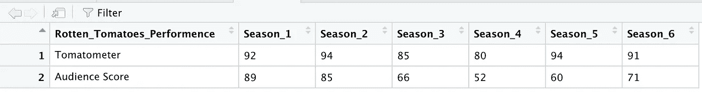

```
# Make the plot
fig <- plot_ly(data, x = ~Rotten_Tomatoes_Performence, y = ~Season_1, type = 'bar', name = 'Season 1')
fig <- fig %>% add_trace(y = ~Season_2, name = 'Season 2')
fig <- fig %>% add_trace(y = ~Season_3, name = 'Season 3')
fig <- fig %>% add_trace(y = ~Season_4, name = 'Season 4')
fig <- fig %>% add_trace(y = ~Season_5, name = 'Season 5')
fig <- fig %>% add_trace(y = ~Season_6, name = 'Season 6')
fig <- fig %>% layout(yaxis = list(title = 'Scores'), barmode = 'group')
fig <- fig %>% layout(title = "The Flash on Rotten Tomatoes")
fig
```

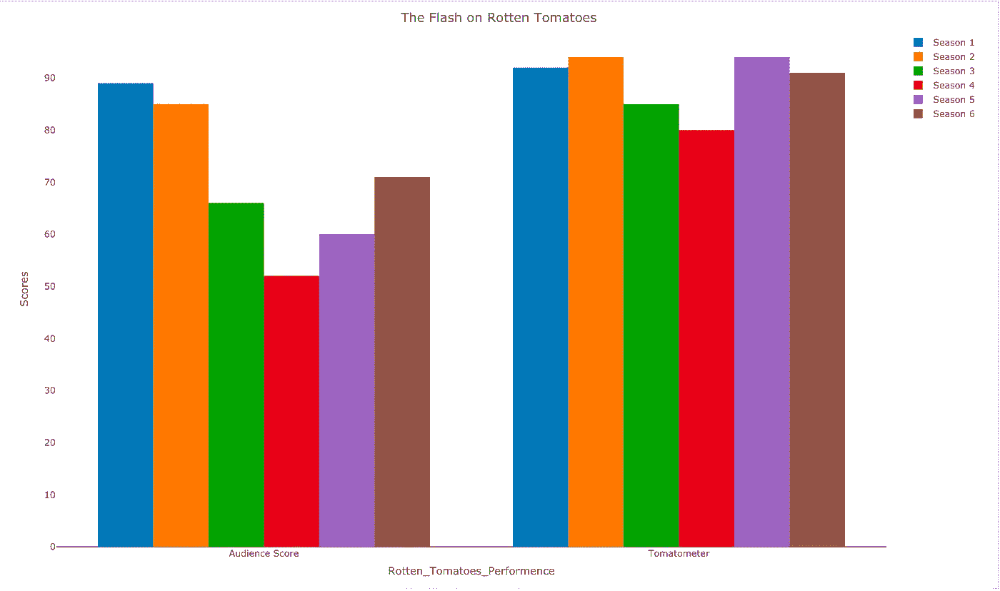

变焦，第二季的主要对手，在宣传片《闪电侠》(左)和《地球 2 号》的亨特·佐勒蒙(右)中获得普遍好评

看起来这部剧在评论家中很受欢迎。然而，我们可以看到从第二季到第四季的持续下降，第四季在评论家中得分最低。但是第五季和第六季已经显示出很高的改进。另一方面，观众对他们的分数更加挑剔。但我们可以看到第五季的进步。

# 电视观众

让我们创建一个情节，并比较每一季的平均收视率。这些数据是从 2014 年至 2020 年每个季度的多个来源检索的。

```
library(plotly)
Season <- c(1, 2, 3, 4, 5, 6)
AVG_Viewers_in_millions <- c(4.62, 4.25, 3.50, 3.50, 2.43, 1.85)
data <- data.frame(Season, AVG_Viewers_in_millions) 
```

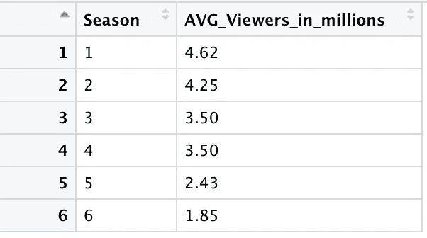

```
fig <- plot_ly(data, x = Season , y = AVG_Viewers_in_millions, type = 'scatter', mode = 'lines')
fig <- fig %>% layout(title = "Average Viewers for Each Season of The Flash",                   xaxis = list(title = 'Seasons'),                      yaxis = list (title = 'AVG Viewer(Millions)'))
fig
```

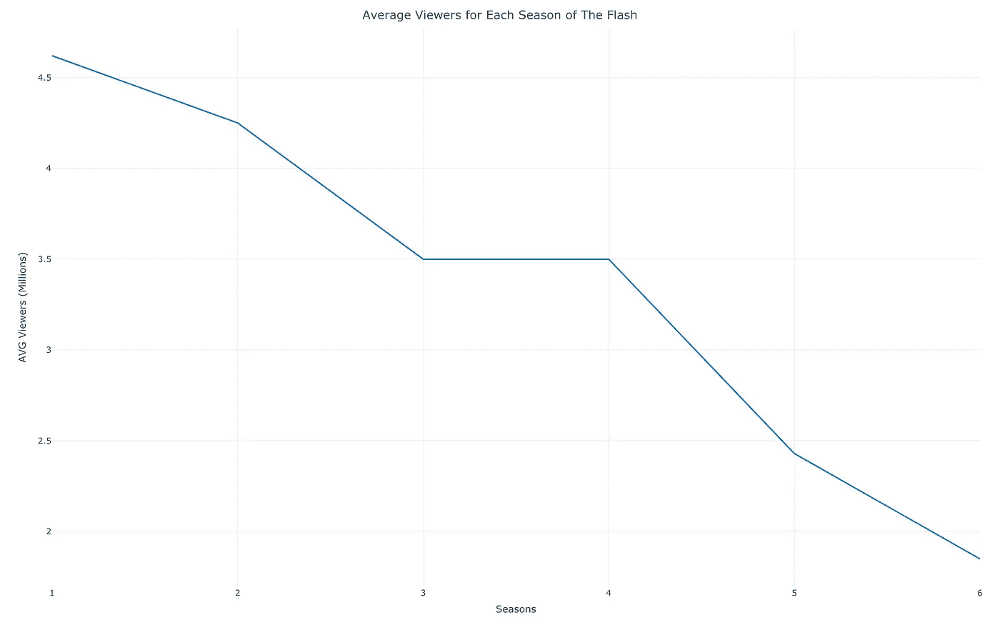

我们可以清楚地看到，随着剧集的继续，平均收视率急剧下降。看《闪电侠》的人越来越少，但一个重要的因素是，每一季结束后，它都会在网飞上出现。观众很可能不会收看 CW 电视网，而更愿意等到它在网飞播出。所以，他们可以在方便的时候观看。

# 按人口统计的评级

IMDb 是一个在线数据库，包含电影、电视剧、家庭视频、视频游戏和在线流媒体内容的信息。它还包括演员、制作人员和个人传记、情节概要、琐事、评级以及粉丝和评论。

特定节目或电影的 IMDb 投票者的人口统计(年龄组和性别)总是公开的。我们来看看哪个年龄段和性别的人最喜欢这个节目。

```
library(plotly)age_group <- c("<18", "18-29", "30-44", "45+")
male_rating <- c(7.7, 7.8, 7.6, 7.4)
female_rating <- c(8.2, 8.0, 7.8, 7.8)data <- data.frame(age_group, male_rating, female_rating)
```

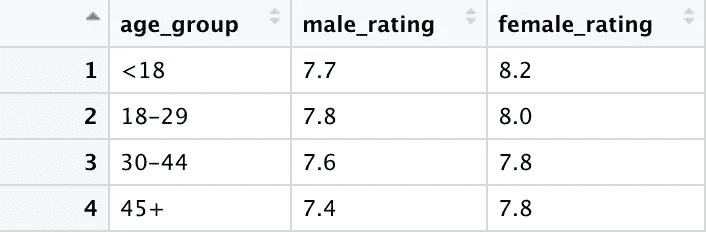

```
fig <- plot_ly(data, x = ~age_group, y = ~male_rating, type = 'bar', name = 'Males Rating')
fig <- fig %>% add_trace(y = ~female_rating, name = 'Female Rating')
fig <- fig %>% layout(yaxis = list(title = 'Score (1-10)'), barmode = 'group')
fig <- fig %>% layout(title = "The Flash on IMDb")
fig
```

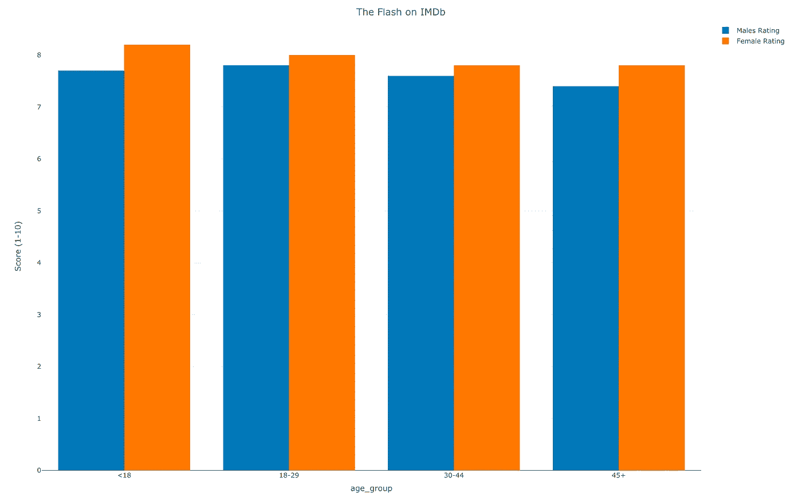

18 岁以下的女性似乎对闪光灯评价最高，而 18-29 岁的男性对该节目评价最高。但我们可以观察到，每个年龄组的男性和女性的评分似乎几乎相同。

# 按人口统计投票

现在，让我们看看每个年龄组和性别的投票数。我们可以从投票中了解哪个年龄组和性别的人最喜欢看 Flash。


《闪电侠》的女主角坎迪斯·帕顿出席了 2017 年的 PaleyFest 颁奖典礼。

```
library(plotly)age_group <- c("<18", "18-29", "30-44", "45+")
male_votes <- c(529, 64303, 57069, 14276)
female_votes <- c(127, 15256, 13149, 3851)data <- data.frame(age_group, male_votes, female_votes)fig <- plot_ly(data, x = ~age_group, y = ~male_votes, type = 'bar', name = 'Males Rating')
fig <- fig %>% add_trace(y = ~female_votes, name = 'Female Rating')
fig <- fig %>% layout(yaxis = list(title = 'Votes'), barmode = 'group')
fig <- fig %>% layout(title = "IMDb Votes for The Flash")
fig
```

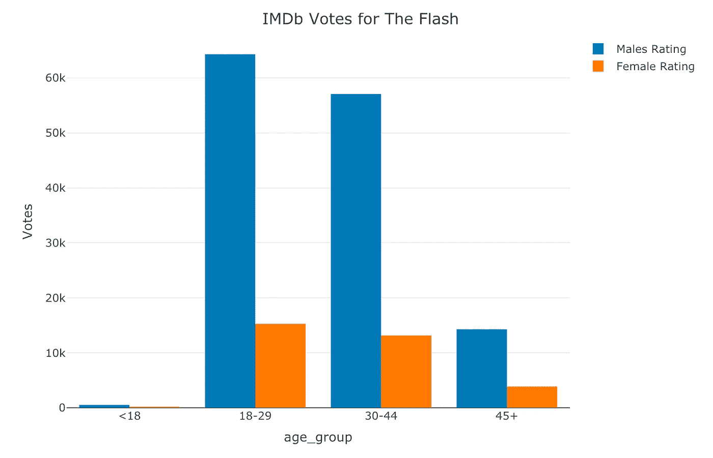

18-29 岁的男性和女性最喜欢看这个节目，其次是 30-44 岁的人群。但大多数投票是由男性完成的，18-29 岁年龄组的投票超过 60，000 张，30-44 岁年龄组的投票超过 55，000 张。

# 人们在推特上说什么？

这是我们变得更先进的地方。在数据呈现给我们之前。我们只需要放入一个数据框架并进行分析。现在，我们自己得到数据。我们将分析关于 CW 电视台《闪电侠》的推文。我们将从 Twitter 上获取公共推文，我们将对其进行清理，存储到数据框中，并将我们的数据可视化。

我们将使用#TheFlash 分析最近的 9000 条公开推文。

# 获取推文的数据和分布

首先按照本文的说明获取自己的 API key 和访问令牌，安装`twitteR`包:

[](/@GalarnykMichael/accessing-data-from-twitter-api-using-r-part1-b387a1c7d3e) [## 使用 R 从 Twitter API 访问数据

### 更新:可以在这里找到本教程的更新版本。

medium.com](/@GalarnykMichael/accessing-data-from-twitter-api-using-r-part1-b387a1c7d3e) 

你需要这四个变量:

```
consumer_key <- "FILL HERE"
consumer_secret <- "FILL HERE"
access_token <- "FILL HERE"
access_secret <- "FILL HERE"
```

这篇文章的主要访问点是 searchTwitter。它将搜索 9000 条带有#TheFlash 的近期英文公开推文。

```
setup_twitter_oauth(consumer_key, consumer_secret, access_token, access_secret)cw.tweets<- searchTwitter("#theflash",n=9000,lang="en")tweet=cw.tweets[[1]]
tweet$getScreenName()tweet$getText()cw.text=laply(netflix.tweets,function(t)t$getText())
length(cw.text)head(cw.text)#performing data cleaning and store in csv.file
cw.text = gsub("(RT|via)((?:\\b\\W*@\\w+)+)", "", cw.text)
cw.text = gsub("@\\w+", "", cw.text)
cw.text = gsub("[[:punct:]]", "", cw.text)
cw.text = gsub("[[:digit:]]", "", cw.text)
cw.text = gsub("http\\w+", "", cw.text)
cw.text = gsub("[ \t]{2,}", "", cw.text)
cw.text = gsub("^\\s+|\\s+$", "", cw.text)
cw.text <- str_replace_all(cw.text," "," ")
cw.text <- str_replace_all(cw.text,"#[a-z,A-Z]*","")
cw.text <- str_replace_all(cw.text,"@[a-z,A-Z]*","")  
cw.text <- tolower(cw.text)
head(cw.text)write(cw.text, "theflash.csv",ncolumn=1)#perform sentimental analysis 
sentiment <- get_nrc_sentiment(cw.text)
head(sentiment)netflix.text <- cbind(cw.text, sentiment)#use the graphic to present the findings#set up y = count
Totals<- data.frame(colSums(cw.text[,c(11:10)]))
names(Totals) <- "score"#set up x = sentiment
Totals <- cbind("sentiment" = rownames(Totals), Totals)
rownames(Totals) <- NULLggplot(Totals, aes(x = sentiment, y = score)) +
  geom_bar(aes(fill = sentiment), stat = "identity", position = "dodge", width = 1) +
  xlab("sentiment") + ylab("sentiment Scores") + ggtitle("The Flash Sentiment Scores for All Tweets")
```

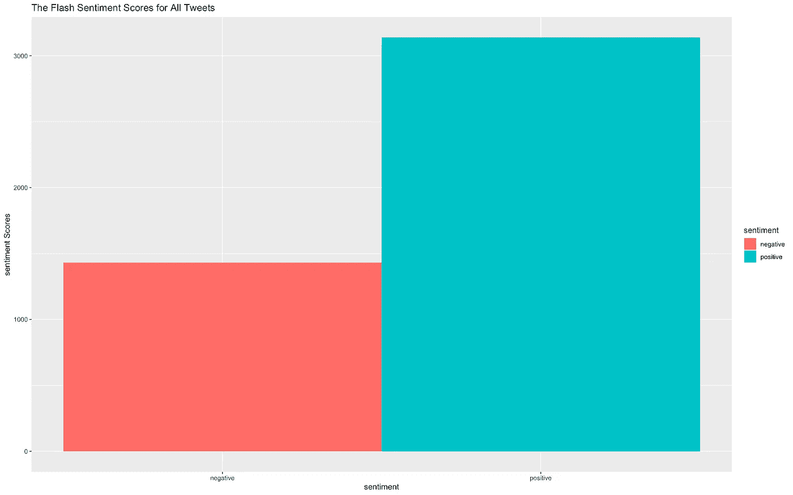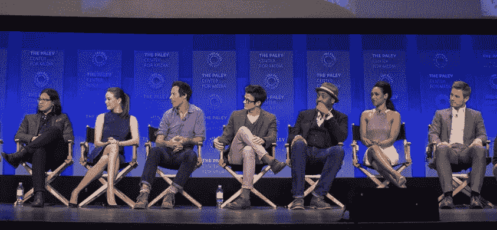

第一季在 2015 年 PaleyFest 颁奖典礼上为该剧投了《闪电侠》。从左至右:卡洛斯·瓦尔德斯、丹妮尔·帕娜贝克、汤姆·加瓦那、格兰特·古斯汀、杰西·L·马丁、坎迪斯·帕顿和里克·科斯纳特。

现在，让我们看看词频。一旦我们知道哪些单词出现得最多，我们就可以得出一些结论。

```
cw.tweets2<- searchTwitter("#theflash",n=9000,lang="en")insta_text <- sapply(cw.tweets2, function(x) x$getText())insta_text_corpus <- Corpus(VectorSource(insta_text))insta_text_corpus <- tm_map(insta_text_corpus, removePunctuation)insta_text_corpus <- tm_map(insta_text_corpus, content_transformer(tolower))insta_text_corpus <- tm_map(insta_text_corpus, function(x)removeWords(x,stopwords()))insta_text_corpus <- tm_map(insta_text_corpus, removeWords, c("RT", "are","that"))removeURL <- function(x) gsub("http[[:alnum:]]*", "", x)
insta_text_corpus <- tm_map(insta_text_corpus, content_transformer(removeURL))insta_2 <- TermDocumentMatrix(insta_text_corpus)
insta_2 <- as.matrix(insta_2)
insta_2 <- sort(rowSums(insta_2),decreasing=TRUE)insta_2 <- data.frame(word = names(insta_2),freq=insta_2)par(mar = c(8, 8, 8, 8)) # Set the margin on all sides to 2
barplot(insta_2[1:30,]$freq, las = 2, names.arg = insta_2[1:30,]$word,
        col ="red", main ="Most frequent words in Tweets about The Flash",
        ylab = "Word frequencies")
```

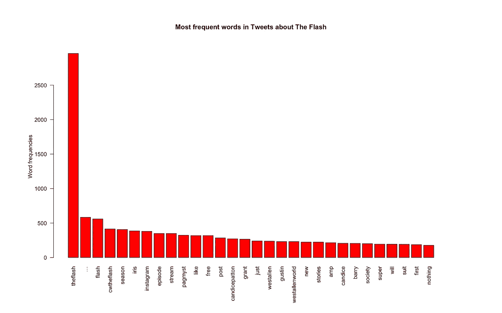

在 Arrowverse 的*CW 无限地球维基上的重大时刻。为 CW 播放闪光灯的* **格兰特·古斯汀**与为 DC 宇宙电影播放闪光灯的**埃兹拉·米勒**面对面！这两个角色在银幕上相遇时都穿着超级英雄的服装。Instagram (@GrantGust)

我们可以看到格兰特·古斯汀的名字出现在推特上很多次，女主角坎迪斯·帕顿的名字也是如此。他们的角色名巴里和艾里斯也出现了。“喜欢”这个词也出现了。大多数正面和一些负面措辞的推文；男主角和女主角正在推特用户的讨论中。他们在推特用户中很受欢迎。

现在，让我们制作一个单词云来呈现推文中的单词。

```
# Load
library("tm")
library("SnowballC")
library("wordcloud")
library("RColorBrewer")text <- readLines(file.choose()) # This let us choose the file of tweets. Remember, we created a file of all tweets when we did the sentiment analysis. We named the file theflash.csv# Load the data as a corpus
docs <- Corpus(VectorSource(text))inspect(docs)toSpace <- content_transformer(function (x , pattern ) gsub(pattern, " ", x))
docs <- tm_map(docs, toSpace, "/")
docs <- tm_map(docs, toSpace, "@")
docs <- tm_map(docs, toSpace, "\\|")# Convert the text to lower case
docs <- tm_map(docs, content_transformer(tolower))
# Remove numbers
docs <- tm_map(docs, removeNumbers)
# Remove english common stopwords
docs <- tm_map(docs, removeWords, stopwords("english"))
# Remove your own stop word
# specify your stopwords as a character vector
docs <- tm_map(docs, removeWords, c("blabla1", "blabla2")) 
# Remove punctuations
docs <- tm_map(docs, removePunctuation)
# Eliminate extra white spaces
docs <- tm_map(docs, stripWhitespace)
# Text stemming
# docs <- tm_map(docs, stemDocument)dtm <- TermDocumentMatrix(docs)
m <- as.matrix(dtm)
v <- sort(rowSums(m),decreasing=TRUE)
d <- data.frame(word = names(v),freq=v)set.seed(1234)
wordcloud(words = d$word, freq = d$freq, min.freq = 1,
          max.words=200, random.order=FALSE, rot.per=0.35, 
          colors=brewer.pal(8, "Dark2"))
```

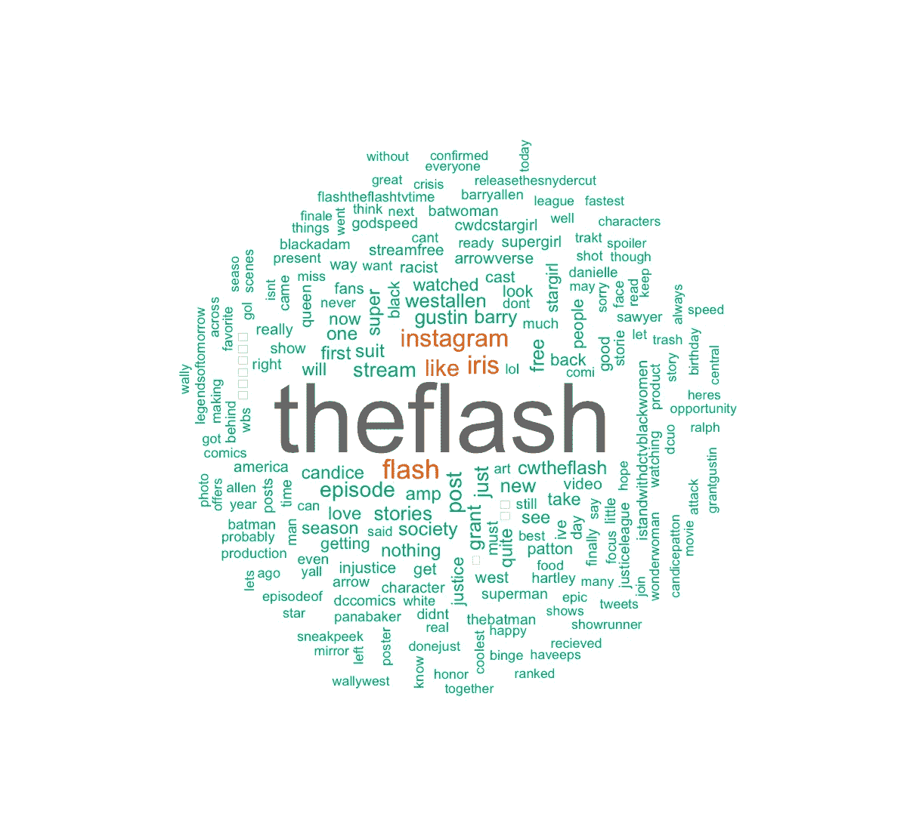

而本文只关注一个 twitter 标签(#TheFlash)并对其进行分析。我们可以做更深入的分析。我们可以使用其他 twitter 标签，如# CW flash # arrow verse flash # cwbarrayallen # CW Barry # gustinestebstflash 等，使用相同的 R 代码进行小的修改。我们可以把所有这些放在一起，得出更多更好的结论。

我们也可以通过文本挖掘来分析评论家对烂番茄的评论。我们有很多方法可以对一场演出、电影和体育赛事进行数据分析。这只是开始讨论和更多方法的开始。

# 结束了

《闪电侠》获得了评论家和观众的一致好评，并获得了 2014 年“最受喜爱的新电视剧”的人民选择奖。2020 年 1 月，CW 电视台续订了该系列的第七季，该季将于 2021 年 1 月首播。我被这个系列吸引是因为我的妹妹和弟弟喜欢它。我没有失望。就我个人而言，这部剧非常棒。我真的为即将到来的独立 Flash 电影感到兴奋，埃兹拉·米勒将继续扮演 DC 电影的 Flash。

[](https://www.cinemablend.com/news/2487291/the-flash-movie-what-we-know-so-far) [## Flash 电影:我们目前所知的

### 至少从 2013 年开始，DC 漫画迷就一直在等待这部独立的 Flash 电影。华纳兄弟宣布…

www.cinemablend.com](https://www.cinemablend.com/news/2487291/the-flash-movie-what-we-know-so-far)