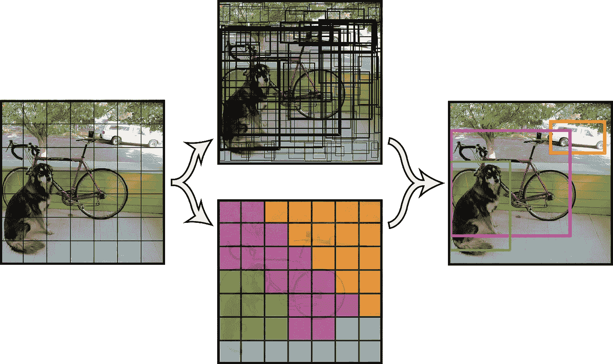

# 图像识别的基础

> 原文：<https://medium.com/analytics-vidhya/the-fundamentals-of-image-recognition-5ff241c63a25?source=collection_archive---------27----------------------->

这是什么？这些只是按照特定顺序排列的奇怪符号，如果没有正确消化，它们就没有任何意义，然而你的大脑却在不断地理解这些废话。

酷毙了。怎么会？

那么，最常见的方法认为有助于这种理解是眼睛从左到右的周期性运动，通过分析符号的顺序及其随后的发音来破译每个单词的意思。

奇怪的是，但足够理性的是，这是所有高效图像识别算法的基础。让我们开始吧。

# 实际例子

想象一下，你正走过一座艺术博物馆。此外，想象你花五分钟分析一幅画的意义和物体。唯一的问题是:你必须通过观察一平方英寸的画布来理解这幅画。

这种情况的结果会是什么？嗯，它不会包含太多，因为观察者无法通过简单地分析指定的平方英寸来解读任何真正的意义。然而，如果 30 个观察者接受同样的挑战，被告知另一个观察者的分析位置，以及每平方英寸的分析结果，他们能够集体解读这件已经很神秘的艺术品的意义吗？虽然这个问题的答案是主观的，但最常见的答案是“是”。这种像素隔离模型，以及通过联合“努力”像素分析进行的后续分析和识别，是目前许多最流行的算法采用的方法。

像素阴影和位置中的异常和相似性被作为输入来为该给定像素确定值。这些值中的模式表示图像中的对象或统一特征，然后可以作为独立实体进行分组。

# 像素隔离和分析

算法在给定图像中检测对象的主要方式是通过使用像素隔离和随后对该像素给出的值的分析。不能简单地给一台计算机一幅图像，并期望它仅仅通过集体观察来理解它。这类似于让一个婴儿看一看《奥德赛》中的一段文字，并理解它。

理论方法行不通，但系统方法可以。与人类从左向右扫视眼睛以理解页面上的单词的自然倾向类似，计算机可以使用各种方法来分离给定的一组像素化维度，并分析它们的模式。

这种技术允许对图像进行更深入的分析，并使软件具有更高的精度，如下面的工作流程所示。

虽然在更传统的使用案例中，更大的“像素网格”用于隔离照片的特定部分，但对于我们的目的来说，上面的 7×7 网格足以解释。工作流模型最左侧的图像显示了一个覆盖在原始图像上的 7x 7 网格。在每个网格框中，都会进行一些分析。在这种情况下，分析产生了一个“共同的共识”，如果你愿意，在图像上的独特项目的位置。将其与附加数据叠加，该算法能够精确地输出图像中各种对象的近似位置，这些对象的位置在初始图像分析中没有被完全估计。

一旦可以呈现图像中对象的位置，对象本身的图像就可以参考更大的图像数据集，以接收关于对象是什么的清晰的英语标签。

# 我的程序

为了测试这种图像分析方法的便利性和准确性，我使用许多相同的因素创建了自己的程序。

与上述模型不同，我的程序是使用标记的 NVIDIA 时尚数据集进行训练的。“标记”的区别实质上意味着它听起来像是被赋予预定值的数据。这些图像中的 50，000 个被选择用于算法的训练，而剩余的 10，000 个被用于测试算法的准确性。

为了达到算法的预期功能，我在我的网络中实现了一个具有三个不同激活功能的三个连续层:第一个具有“flatten”功能，第二个具有“ReLU”，第三个具有“softmax”。

第一层的功能是格式化图像，使得图像的像素化维度为随后的三层的分析和识别做好准备。

虽然这种精确的结构在所有的程序中并不一致，但是改变图像格式对于创建具有较小功能的图像识别程序是至关重要的。

# 这是什么意思？

这一领域进步的确切影响仍然有些未知。虽然积极影响的潜在程度相当高，但消极影响的程度似乎比最初预期的要严重得多。

如果我们允许图像识别技术以目前的速度发展，我们已经看到，并将继续看到政府的过度监管。在中国，这项技术被用来识别和针对宗教少数群体进行驱逐和粗暴对待。臭名昭著的香港抗议活动中的抗议者正在被识别，并通过使用面部识别帖子成为法定目标，这些帖子在行政区找到了一个方便的家。这个活动是政策控制出错的一个完美例子。如果世界想体验这一技术的积极影响，哪怕是很小的影响，就必须采取措施防止对它的极端操纵。

从传统使用的角度来看，算法进步的影响是巨大的。想象一下这样一个世界:医生不再需要花费数小时来分析患者的扫描结果以寻找异常，而是可以将这项任务委托给一个精心设计的图像识别工具，该工具可以了解这种医疗异常的根源，并据此进行诊断。我相信，有了适当的政策，这项技术，与更多的通用人工智能应用程序合作，有能力大规模地改变世界。

# 联系人:

电子邮件:mmcd.jack@gmail.com

领英:[https://www.linkedin.com/in/jack-mcdonald-a960ab194/](https://www.linkedin.com/in/jack-mcdonald-a960ab194/)

推特:【https://twitter.com/jackmmcd123 