# 物理仿真与机器学习的融合

> 原文：<https://medium.com/analytics-vidhya/the-fusion-of-physics-simulation-and-machine-learning-a5f8a382c436?source=collection_archive---------5----------------------->

# 关于这篇文章

本文介绍了最近的两项研究，融合了数值物理模拟和机器学习。

第一项研究“牛顿与机器:利用深度神经网络解决混沌三体问题[1]”正在将 DNN 应用于无法解析解决的三体问题的模拟。

第二个，“具有 ODE 积分器的哈密顿图网络[2]”能够通过哈密顿预测更精确地预测质点的轨迹，而不是直接预测从这一步到下一步的差异。

# 牛顿 vs 机器:使用深度神经网络解决混沌三体

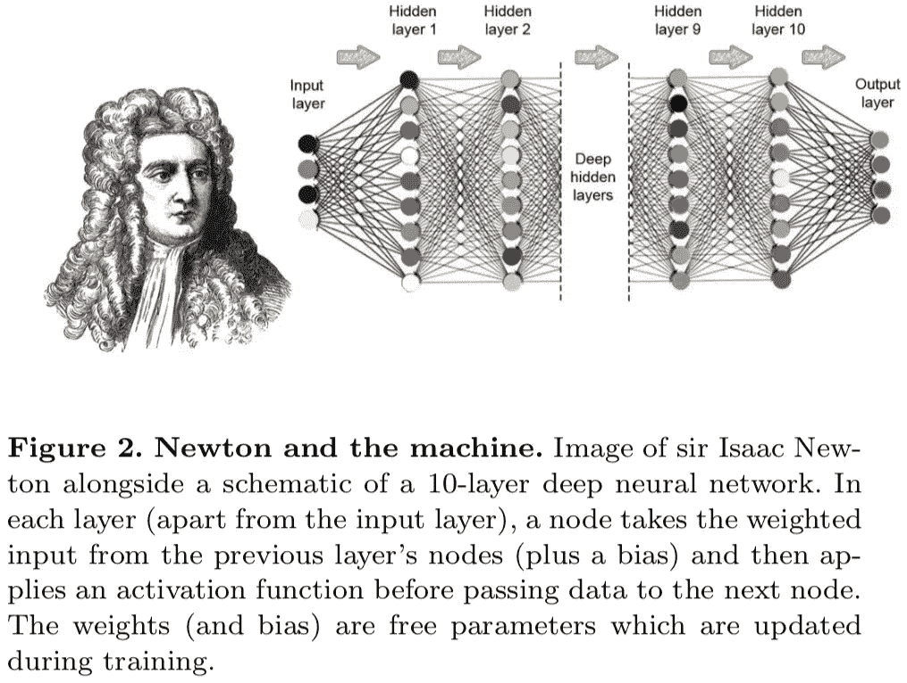

这篇文章由阿尔瓦罗·桑切斯·冈萨雷斯于 2019 年 9 月 27 日发表。摘要如下。

*研究神经网络可以逼近无法解析求解的三体轨迹。它们对模型施加物理约束，以简化问题的表述。简单的 10 层 DNN 预言了三个质点由于万有引力会如何运动，计算时间可以减少到 1/100 万。*

# **问题公式化**

存在静止质点，在时间 t=0 时具有三个相等的质量，并通过重力吸引运动。这是一个任务设置，用 DNN 预测在时间 t = T 的位置。使用名为 Brutus 的仿真软件，在改变初始位置的同时创建三个质点的轨迹数据集，并进行学习和预测。此时，x1 的初始位置每次都是固定的，只有 x2 的初始位置在绿色区域的范围内随机波动，x3 的初始位置被设置为使得重心在原点。

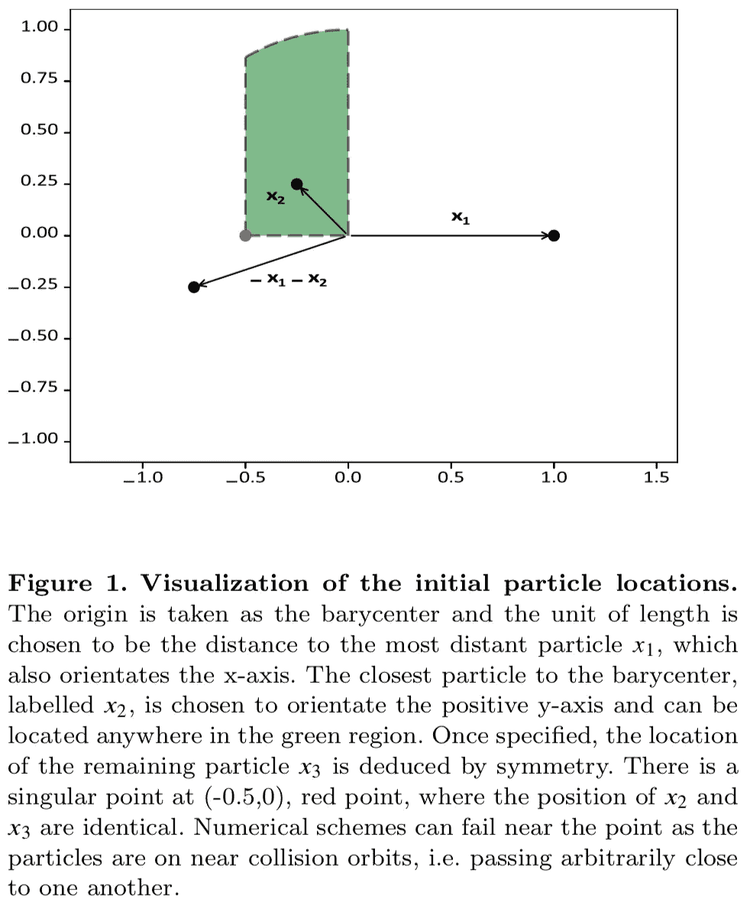

轨道数据示例如下。ANN 代表人工神经网络。

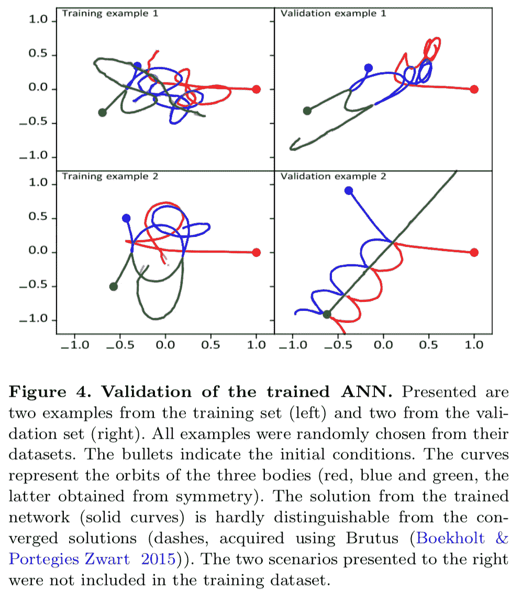

# **方法及其直观解释**

他们使用简单的 10 层神经网络，输入:初始位置信息和想要预测的时间，输出:当时质点的坐标。

x1 的初始位置被固定在坐标(1，0)，x2 被随机设置在图 1 中的绿色区域中，并且 x3 的初始位置被生成以便将重心保持在原点。所以你只需要确定 x2 的初始位置。

所以把 x2 的初始坐标和时间 t 输入神经网络就够了。输出以同样的方式完成。如果确定了 x1 和 x2，则 x3 的坐标自动确定(重心不动)。所以只输出 x1 和 x2，不需要 x3。

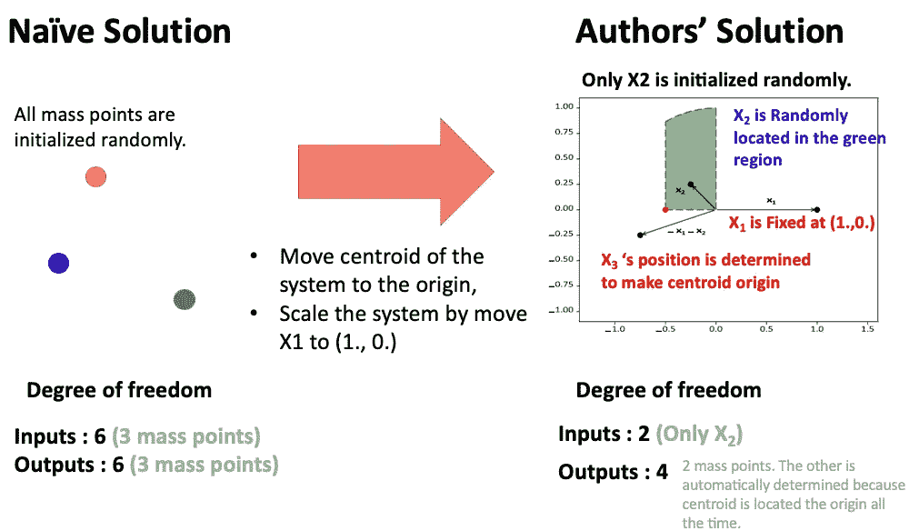

你可能认为模拟环境非常有限。但如果你解读为，加入基于质点 1 的系统的缩放变换和旋转变换，并把重心坐标带到原点，作为三体的模拟环境似乎就足够了。

换句话说，使用先验知识，模型输出被约束，使得模型输出在物理上不会变得奇怪(重心移动等)。).并且问题设置随着约束而简化。

# **结果和讨论**

学习结果如下。结果显示在预测时间的每个范围内，并且在最接近的时间预测时损失最低。在那里，MAE(预测值和正确答案值之差的绝对值)已经下降到 10 ^ -2 的数量级。因此，考虑到图 3 中的比例，这个误差似乎很小

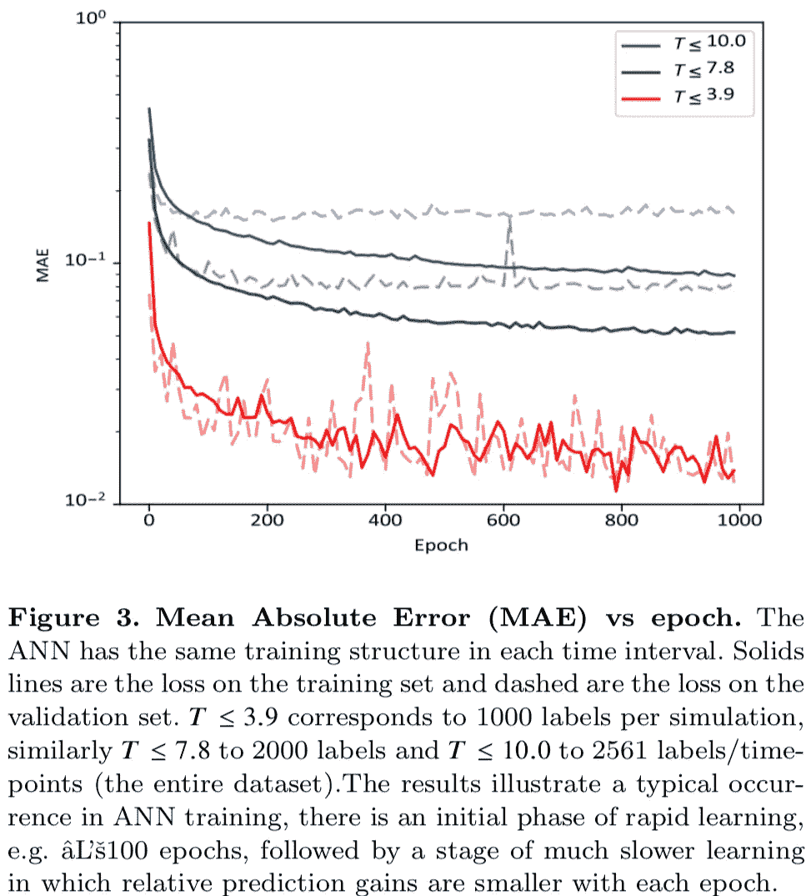

下图 5 显示了在五次 t ∈ {0.0，0.95，1.9，2.95，3.8}时，通过对左上角 x2 初始位置(-2.0，0.3)添加一点扰动，x2 轨迹如何变化。这是一个形象化的图形。DNN (ANN)和模拟(Brutus)都对初值敏感，但可以说轨道的初值敏感性很好地近似了 DNN。

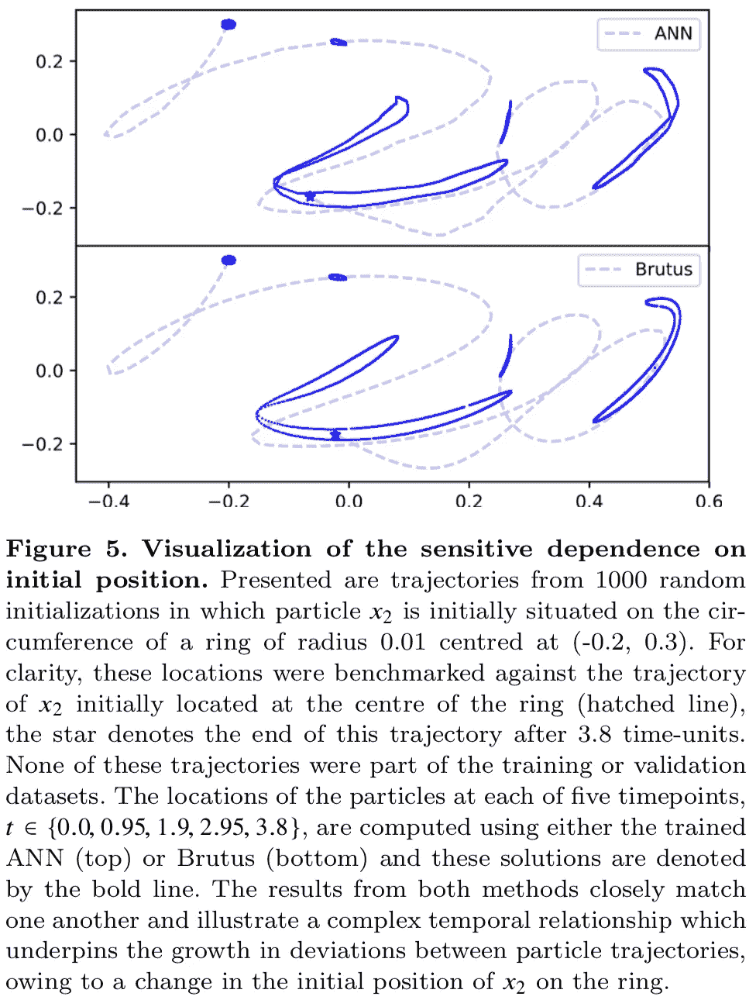

我猜，DNN 更快的原因是在 DNN 方法中直到时间 t 有一次计算，而在布鲁图中位置是逐步更新的，直到时间 t。(由于顺序处理，无法并行化)

# 具有 ODE 积分器的哈密顿图网络

这篇文章由阿尔瓦罗·桑切斯·冈萨雷斯等人于 2019 年 9 月 27 日发表。摘要如下。

***他们提出 HOGN(Hamiltonian ODE graph network)通过神经网络预测的 Hamiltonian 的导数来计算物体的动量和运动。HOGN 可以解释为通过哈密顿量的约束来学习一个物理模型，其轨迹预测的精度比没有哈密顿量时更好。***

## **问题表述**

这项研究与上面的研究一样，解决了模拟多个质量轨迹的问题。但这里不是直接预测 t 时刻的位置，而是逐个预测下一时刻(步)的动量和位置，然后加在一起预测几十到几百步后的动量和位置。这是一种使用 ODE(常微分方程)的数值模拟格式。

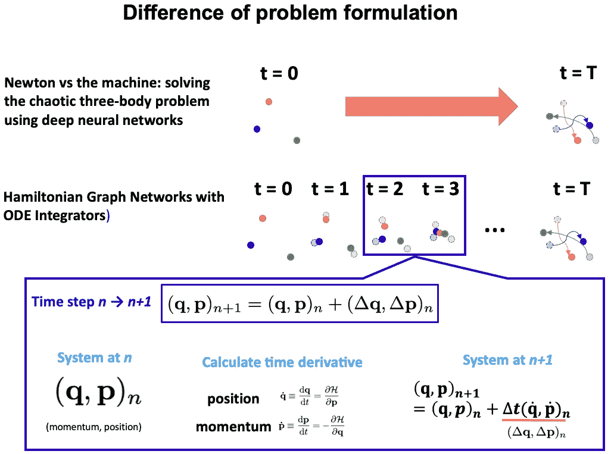

## **方法及其直观解释**

设一道题，根据物理定律预测质点系(q，p) _n 在第 n + 1 步变成(q，p) _ (n + 1)的现象。q 是位置，p 是第 n 步的动量。他们通过三种方法解决这个问题:DeltaGN、OGN 和 HOGN。

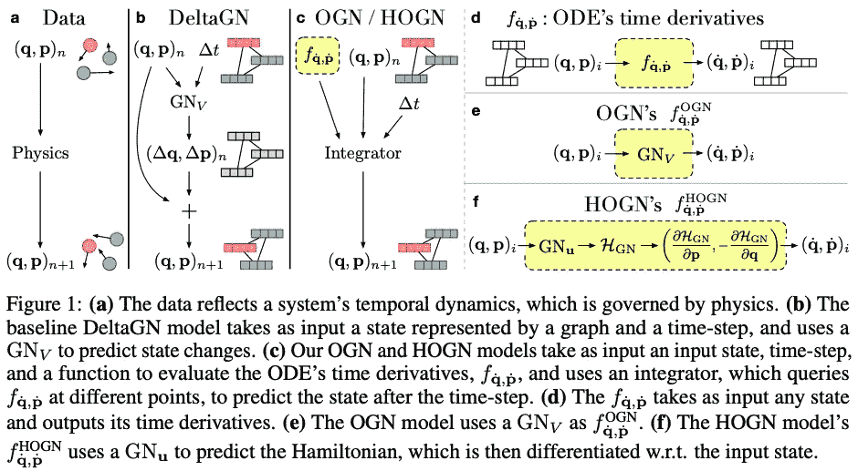

δgn 直接从(q，p) _n 和步长之间的时间δt 预测δq，δp。并将它们加到(q，p) _n 上，得到下一步的位置和动量。

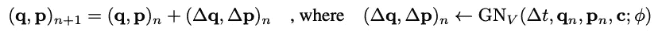

OGN (ODE 图网络)和 HOGN(哈密顿 ODE 图网络)通过使用龙格-库塔方法的积分来预测下一步。

在 OGN，q 和 p 微分值通过图形网络进行预测，并通过使用龙格-库塔法的积分进行预测。通过明确包括积分，该模型受到使用 ODE 的数值模拟约束。

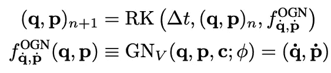

在 HOGN 中，不是预测微分值，而是预测哈密顿量。通过哈密顿量计算位置和动量的微分值，然后通过龙格-库塔法的积分过程预测下一步的位置和动量。这样，您可以对模型施加约束，这些约束不仅在数值模拟中，而且在物理中。

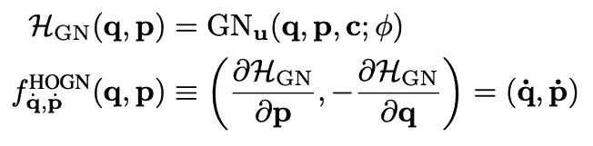

下表总结了这三种模型。

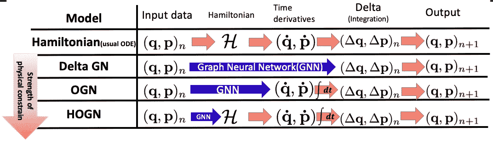

## **结果和讨论**

首先，弹道精度的结果。

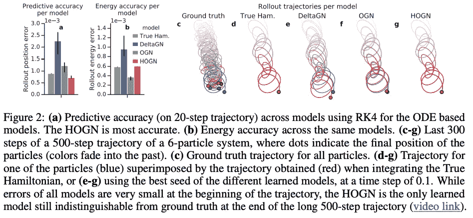

在图 2 (a)、(c )-(g)中，预测精度表明，使用哈密顿量和 HOGN 的数值模拟精度最高，而 DeltaGN 和 OGN 的精度不好。(原始数据的模拟和使用哈密顿量的数值模拟水平不同的原因，很可能是因为使用的求解器不同。)

检查能量在系统中是否守恒(物理上应该是守恒的)，HOGN 比 OGN 差一点，但和用哈密顿量数值模拟一样准确。

接下来，检查模型是否作为物理现象预测而构建。首先，让我们看看用δt 进行预测的情况，它不同于在学习阶段使用的预测。灰色突出显示的部分是学习阶段使用的δt。如果使用学习阶段没有使用的δt，δgn 会有很大的误差。

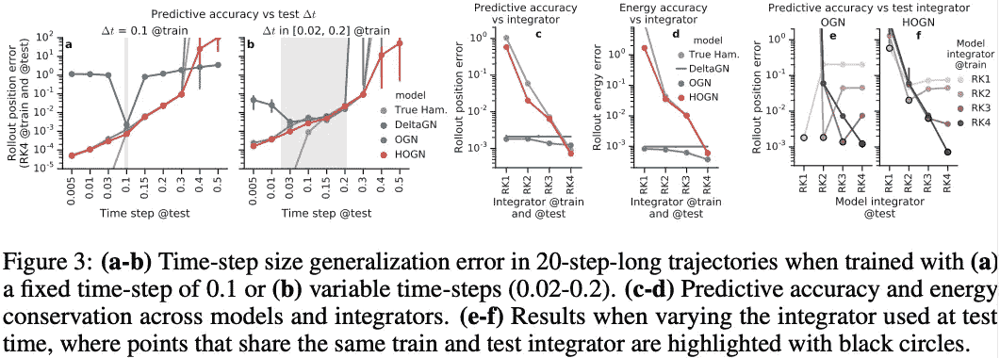

但是 OGN 和霍根具有与使用哈密顿量的物理模拟相同的行为，尽管δt 略有不同(图 3 ab)。

让我们看看下一个龙格-库塔方法的顺序改变时会发生什么。一般来说，增加阶数会提高积分的精度，因此数值模拟的精度也会提高。当然，使用哈密顿量的模拟是这样的，但 HOGN 也是这样的。另一方面，改变顺序不会显著提高 OGN 的精度(图 3 c-d)。

最后，让我们看看 OGN 和霍根在学习和测试之间改变龙格-库塔方法顺序的情况。在 ODE 中，增加阶数增加了准确性，但 HOGN 也表现出这样的倾向。另一方面，无论除了学习时的阶次之外的阶次的大小如何，OGN 的精度都劣化。

鉴于这些情况，OGN 似乎不是一个物理模型，而是另一个函数的近似值。(图 3 e-f)

# **为什么那些事？**

我认为这项研究很重要，原因如下。

*   首先，这些研究的应用范围不限于轨迹计算。它可以应用于所有需要时间顺序计算的系统，如流体计算。

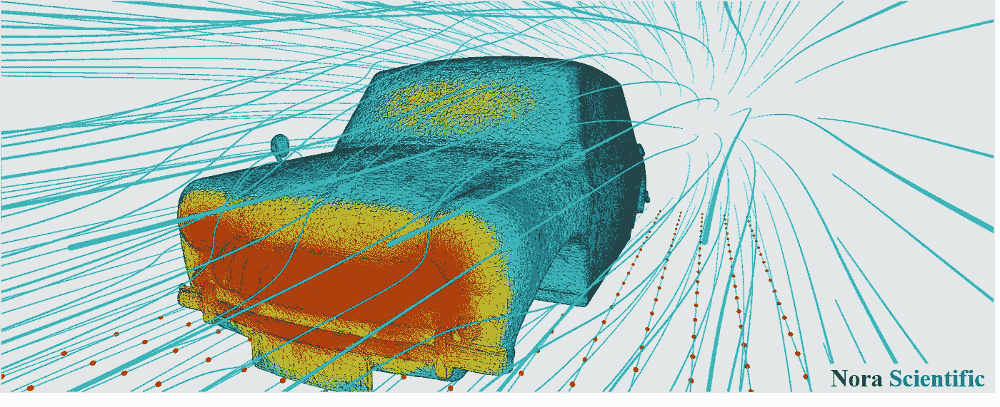

图片来自[https://fsp.norasci.com/](https://fsp.norasci.com/)

*   第二，一个大的多体系统如星云，其中哈密顿量是用 N(N-1)个相互作用来计算的，可以用 NN 来近似。研究速度可能会加快

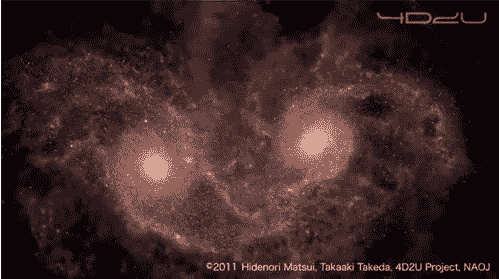

2500 亿 x 250 亿身体问题。该系统需要对哈密顿量进行大量计算

# **结论**

在本文中，我们介绍了两项使用神经网络来近似物理模拟的研究。如果可以用简单的神经网络高速导出近似解，就可以在笔记本电脑上进行研究，而不需要使用超级计算机，从而扩大研究范围。

这次是对质点的模拟，但似乎对物理性质模拟的第一性原理计算做了同样的事情。这也是一个高成本的物理模拟，所以如果能通过这里介绍的方法提高速度，材料信息学可能会更有效率。

## 推特

 [## 阿基拉

### 机器学习工程师/数据科学家/物理学硕士/…

twitter.com](https://twitter.com/AkiraTOSEI) 

# **参考**

1.  菲利普·g·布林等《牛顿与机器:使用深度神经网络解决混沌三体》。arXiv :1910.07291，2019
2.  带有常微分方程积分器的哈密顿图网络。 *arXiv:* 1909.12790，2019