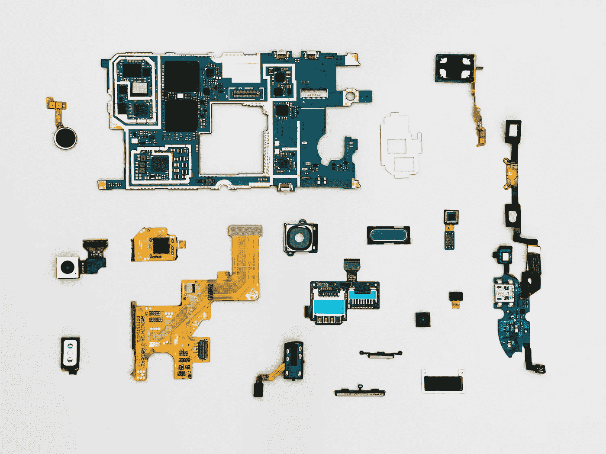
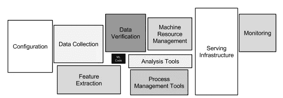
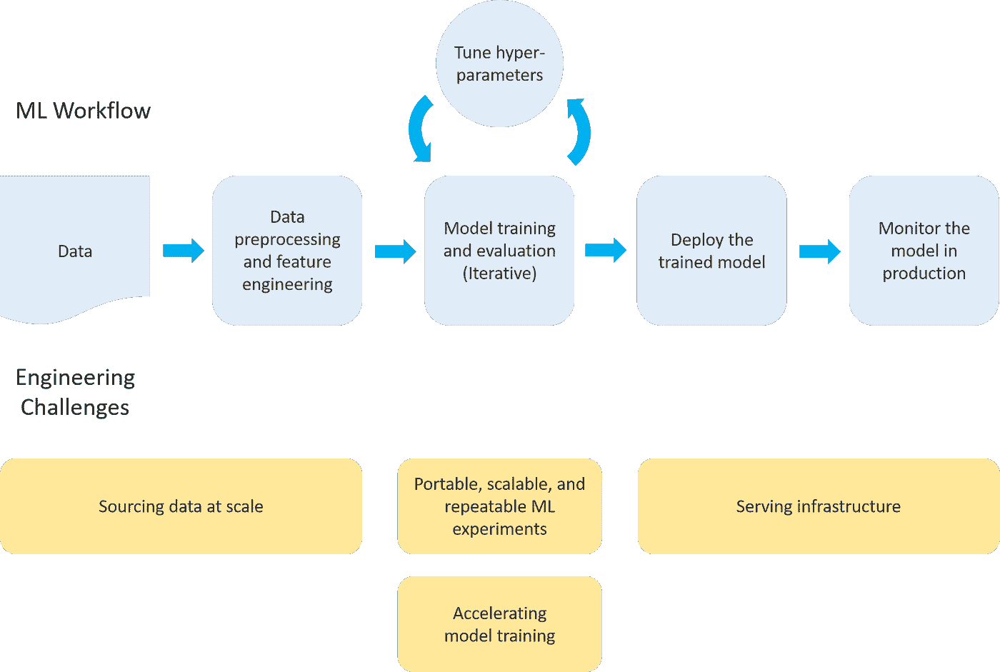

# 机器学习的未来将包括更少的工程

> 原文：<https://medium.com/analytics-vidhya/the-future-of-machine-learning-will-include-a-lot-less-engineering-20be0cfc8305?source=collection_archive---------12----------------------->

AI 是一个系统工程问题。

构建一个有用的机器学习产品需要创建大量的工程组件，其中只有一小部分涉及 ML 代码。构建一个生产 ML 系统所涉及的大量工作包括构建数据管道、配置云资源和管理服务基础设施。

传统上，ML 的研究主要集中在创建越来越好的模型，推动语言建模和图像处理等领域的发展。很少有人关注在系统层面设计和实现生产 ML 应用程序的最佳实践。尽管受到的关注越来越少，但 ML 中的系统级设计和工程挑战仍然非常重要——创造有用的东西需要的不仅仅是构建好的模型，还需要构建好的系统。

**现实世界中的 ML**

2015 年，谷歌的一个团队[1]制作了如下图形:

它显示了现实世界中专门用于建模的 ML 系统(小黑盒)中的代码量与 ML 应用程序的支持基础设施和管道所需的代码量的对比。[1]这张图表并不令人惊讶。对于大多数项目来说，构建一个生产系统所涉及的大部分令人头痛的问题并不是来自于经典的 ML 问题，比如过度拟合或拟合不足，而是来自于在系统中构建足够的结构，以允许模型按照预期的方式工作。

**生产 ML 系统**

构建一个生产 ML 系统可以归结为构建一个工作流——从数据摄取到模型服务的一系列步骤，其中每一步都协同工作，并且足够健壮以在生产环境中运行。

工作流从某个数据源开始，包括创建模型端点所需的所有步骤-预处理输入数据、特征工程、训练和评估模型、将模型推送到服务环境，以及在生产中持续监控模型端点。

这个工作流程的**特征工程>训练>调整**部分通常被认为是机器学习的“艺术”。对于大多数问题来说，设计特征、构建模型架构和调整超参数值的可能方法是如此之多，以至于数据科学家/ML 工程师依赖于直觉和实验的某种混合。建模过程也是机器学习的乐趣所在。

**建模 vs 工程**

这个建模过程在不同的用例及问题领域中是独一无二的。如果你正在训练一个模型来推荐网飞上的内容，那么这个建模过程将会与你正在为客户服务构建一个聊天机器人有很大的不同。不仅底层数据的格式不同(稀疏矩阵与文本)，而且预处理、模型构建和调优步骤也大不相同。虽然建模过程在用例与问题领域中是独一无二的，但是工程挑战却是相同的。

无论您将什么类型的模型投入生产，围绕该模型构建生产工作流的工程挑战在很大程度上都是相同的。

**这些跨越 ML 领域的工程挑战的同质性是一个巨大的机遇。**在未来(今天的大部分时间)，这些工程挑战将在很大程度上实现自动化。将 Jupyter 笔记本中创建的模型转化为生产 ML 系统的过程将变得更加容易。不必创建专门构建的基础设施来解决这些挑战，而是数据科学家/ML 工程师已经使用的开源框架和云服务将在幕后自动化这些解决方案。

**大规模采购数据**

所有生产 ML 工作流程都从数据源开始。来源数据所涉及的工程挑战通常与规模有关——我们如何从各种太大而不适合内存的来源导入和预处理数据集。

开源机器学习框架通过开发数据加载器在很大程度上解决了这个问题。这些工具(包括 TensorFlow 的 [tf.data API](https://www.tensorflow.org/guide/data) 和 PyTorch [DataLoader 库](https://pytorch.org/tutorials/beginner/data_loading_tutorial.html))将数据逐段加载到内存中，并且可以用于几乎任何大小的数据集。它们还提供可扩展到生产环境的动态功能工程。

**加速模型训练**

ML 社区中的许多工作都致力于减少训练大型模型所需的时间。对于大型培训工作，通常的做法是将培训操作分布在一组机器上(培训集群)。使用专门的硬件(GPU 和现在的 TPU)来进一步减少训练模型所需的时间也是常见的做法。

传统上，修改模型代码以将训练操作分布在多个机器和设备上并不简单。要真正看到使用机器集群和专用硬件带来的效率提升，代码必须智能地分离矩阵运算，并结合每个训练步骤的参数更新。

现代工具使这一过程变得更加容易。 [TensorFlow Estimator API](https://www.tensorflow.org/guide/estimator) 从根本上简化了配置模型代码以在分布式集群上训练的过程。使用 Estimator API，设置一个[单参数](https://www.tensorflow.org/api_docs/python/tf/estimator/RunConfig)会自动将训练图分布到多个机器/设备上。

像 [AI 平台训练](https://cloud.google.com/ml-engine/docs/training-overview)这样的工具提供了按需资源供应，以在分布式集群上训练模型。使用 [bash shell 命令](https://cloud.google.com/sdk/gcloud/reference/ai-platform/jobs/submit/training)，可以为一个培训任务提供多种机器和设备类型(高性能 CPU、GPU 设备、TPU)。

**可移植、可扩展和可重复的 ML 实验**

创建一个允许快速原型和标准化实验的环境提出了一系列的工程挑战。

超参数调整(更改模型参数值以尝试降低验证误差)的过程是不可靠的，除非有明确的方法来重复过去的实验，并将模型元数据(参数值)与观察到的评估指标相关联。快速迭代和运行高效实验的能力需要大规模的培训，以及对分布和硬件加速器的支持。此外，如果 ML 代码不可移植，实验过程将变得难以管理——其他团队成员/利益相关者无法复制实验，生产中的模型无法随着新数据的出现而重新训练。

就我个人而言，我在为 AI Hub 构建[容器的团队中工作，我们正在努力帮助免除这些挑战。我们构建 ML 算法的高性能实现(](https://aihub.cloud.google.com/u/0/s?category=ml-container) [XGBoost](https://aihub.cloud.google.com/u/0/p/products%2F0ccd8a63-71a7-4e48-a68b-685692a62e92) 、 [ResNet](https://aihub.cloud.google.com/u/0/p/products%2F4b08be38-7a6c-41b8-9d13-bfaa11cf199f) 等)作为 Docker 容器。这些容器为 AI 平台提供了本地支持，并默认保存模型元数据，提供了一个可重复的过程来运行实验。这些容器支持分布式训练，可以在 GPU 或 TPU 设备上运行。它们也是可移植的——只要安装了 Docker，任何人都可以在任何地方运行这些容器。

**服务基础设施**

生产 ML 系统在两端都需要扩展——源数据和模型训练的扩展，以及模型服务的扩展。一旦一个模型被训练，它必须被导出到一个环境中，在那里它可以被用来产生推论。正如消费者网站需要处理 web 流量的大幅波动一样，模型端点也必须能够处理预测请求的波动。

像[人工智能平台预测](https://cloud.google.com/ml-engine/docs/prediction-overview)这样的云工具为模型服务提供了可扩展的解决方案。云服务的弹性允许服务基础设施根据预测请求的数量进行扩展或缩减。这些环境还允许对模型进行持续监控，并且可以编写测试程序来检查模型在生产中的行为。

**更好的 ML 系统的未来**

在未来，构建 ML 产品会更有趣，这些系统会工作得更好。随着围绕 ML 的自动化工具不断改进，数据科学家和 ML 工程师将把更多的时间集中在构建优秀的模型上，而不是围绕生产 ML 系统的繁琐但必要的任务上。

参考资料:

1.  [机器学习系统中隐藏的技术债务](https://papers.nips.cc/paper/5656-hidden-technical-debt-in-machine-learning-systems.pdf)
2.  [关于机器学习模型管理的挑战](https://pdfs.semanticscholar.org/4603/8cb1606041001be2f42b4e09f630d4b4147f.pdf?_ga=2.145740081.40787352.1580168120-421382494.1580168120)
3.  [机器学习工作流程](https://cloud.google.com/ml-engine/docs/ml-solutions-overview)
4.  [利用 Twitter 上的工作流制作 ML](https://blog.twitter.com/engineering/en_us/topics/insights/2018/ml-workflows.html)