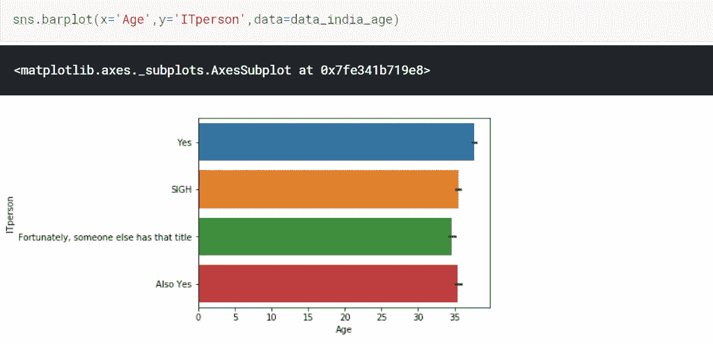

# 软件业的未来:当前趋势展望。

> 原文：<https://medium.com/analytics-vidhya/the-future-of-software-industry-a-look-into-the-current-trends-97a957af7866?source=collection_archive---------12----------------------->

## 软件行业的详细数据分析——当前和未来可能的趋势

微软的联合创始人比尔·盖茨曾经说过:“软件是艺术和工程的伟大结合。”今天，这种艺术与科学的结合无处不在，应用于各种日常产品中。软件在创新过程中的重要性已经被这些行业中引用基于软件的技术的专利所衡量。在过去的几十年里，这一比例大幅上升。

软件在每一项领先技术中都扮演着重要的角色。

软件业在 20 世纪 60 年代初迅速发展，几乎是在计算机首次批量销售之后。大学、政府和商业客户创造了对软件的需求。国内和国际公司在这些国家迅速成长为全球领先的软件外包服务目的地的过程中发挥着至关重要的作用。我的这个博客是关于软件行业数据集的分析，这样我们就可以了解它的未来和当前趋势。

开始了…

下表显示了数据集的前六行，从而让我们了解它是什么类型的数据集。以及数据集中包含哪些属性。整个数据集由 88883 行和 85 列组成。尽管这是一个相当大的数据集！

数据集概述

数据分析的第**阶段**包括**从数据集中提出正确的问题**。可能的问题可以是，

1.  数据集中的哪些行和列是分析所必需的？
2.  不同数据之间有什么关联？
3.  哪些数据不是分析所必需的？
4.  需要数据预处理吗？

**第二阶段**被称为**数据角力或数据芒廷**。它包括三个步骤:

*   *获取数据*

对于本博客中使用的数据集，我们正在导入分析所需的库。

我们现在正在读取 csv 文件“survey_results_public.csv”。现在可以看到数据的属性。

*   *评估数据*

现在，我们正在找出数据集中存在的行数和列数。还检查数据集各列的数据类型。

命令 dataset_name.columns 给出了数据集中出现的列的名称。从本博客中使用的数据集来看，发现列名使用起来有点复杂，数据集的数据类型是“object”。

查找数据集中存在的列

查找数据类型

*   *数据清理*

在此过程中，我们将删除对我们的分析不重要的列。例如，我删除了“货币符号”、“货币 Desc”、“薪酬合计”、“薪酬频率”、“转换薪酬”、“工作周小时数”、“工作计划”、“工作挑战”、“远程工作”、“工作地点”、“Imp Syn”、“代码修订”、“代码修订小时数”、“单元测试”等列。删除列后，内存使用也会减少。

删除对我们的分析不重要的列。

第三阶段被称为**探索性数据分析(EDA)** 。这是一种分析数据的统计方法。

对于这个数据集，我们将找出拥有最多开发人员(年龄超过 25 岁)的国家。在公司工作的开发人员负责计算机操作系统或应用软件程序的设计、测试和维护，如文字处理或数据库管理系统。因此，开发者在软件产业中扮演着重要的角色，同时也促进了国家的发展。

其次，我们还找出了公民学习编码(年龄在 20 岁以上)最多的国家。学习编码的人，可以认为他们将加入软件行业，因为编码是软件行业的一个重要来源。因此，这种学习者可能被认为是软件行业未来的栋梁。

我也做过**探索性数据分析(EDA)** 关于软件产业最发达的两个国家，即美国和印度。

“教育水平”对“年龄”的条形图显示了有多少人学习了适合软件行业的课程，从而可以促进其发展。

使用热图可以显示堆栈溢出参数之间的相关性。

“编码年数”与“年龄”的关系图显示了有多少人在编码方面经验丰富，从而可以为软件行业服务。

图表显示的参数，如“数据库工作过”，“数据库明年的需求”，“编程语言明年的需求”，在分析中也起着重要的作用。

数据分析的**第四阶段**是**得出结论。从这个数据集中，可以得出结论，在软件行业获得更多发展的国家是美国、印度和德国，因为他们有很大比例的开发人员和编码人员。**

在美国，受雇的开发人员的比例也很高，因此对行业的发展做出了贡献，这可以从下面的条形图中看出。

可以考虑的是，由于这些数据库管理系统的趋势相当高，软件行业将在未来几年内致力于“Microsoft SQL Server”、“SQLlite”、“PostgreSQL”数据库。

对诸如“Python”、“C#”、“Ruby”、“VBL”、“Java”等编程语言的需求越来越多，因此可以得出结论，软件行业将会招聘学习这些语言的人，行业的工作流程将基于这些编程语言。

在印度，可以看到，年满 40 岁的开发人员主要是从行业中退休，达到这个年龄的开发人员比例更高。可以预见的是，将会有一个巨大的职位空缺，因此将会有一个机会给正在学习编码的学生和那些主要将编码作为业余爱好的人，让他们加入软件行业。

“it 人员”的数量在印度也更多，因此可以得出结论，这些人将有助于 IT 行业的发展，从而为国家的技术发展做出贡献。

数据分析的最后一步是**传达结果/数据故事。**它是关于将你的数据和视觉效果与叙事和其他故事主题(如类比)融合在一起，这样它会比其他方式更能引起你的观众的共鸣。最重要的是，你需要良好的沟通技巧。

**结论**

给定的数据集非常大，难以分析。像美国、英国、印度、德国这样的国家是软件业最发达的国家，而且随着对开发人员、编码人员的需求也越来越高，软件业还将继续增长。许多开发人员正在退休，这意味着未来的编码人员和开发人员将有机会加入这个行业。对诸如“Python”、“Java”、“Ruby”、“C#”等编程语言的狂热相当高，这意味着软件行业将继续致力于这些语言，这表明未来的编码人员和开发人员必须掌握这些语言的知识，才能在软件行业立足。数据库管理系统的发展趋势包括“Microsoft SQL Server”、“SQLlite”、“PostgreSQL”，这也表明软件行业将更多地以这种数据库为基础。“安卓”、“iOS”、“Windows”、“Linux”、“Docker”、“MacOS”将是这个行业继续努力的平台。还可以看出，社交媒体的使用更多发生在 15-30 岁之间。Angular.js '，' ASP.net '，' jQuery '是未来几年软件行业对 web 框架的渴望。

编程在软件行业中起着重要的作用。

因此，可以考虑到，在未来几年中，软件行业将会越来越多。该行业支持了 1000 多万个工作岗位，推动了 50 多个国家的经济发展。印度的软件开发行业比大多数国家起步都要早，因为它拥有无穷无尽的年轻开发人员和软件工程师。所以，如果你愿意在这个行业立足，建议学习上面提到的语言和数据库系统。你还必须具备出色的听说能力，以及批判性思维和团队合作能力。祝你好运！

感谢阅读:)

以防万一，如果你在考虑入行的话！

由，

钱德里玛·萨卡。