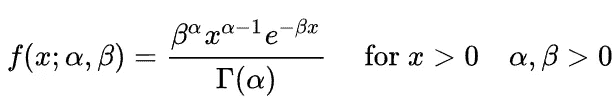
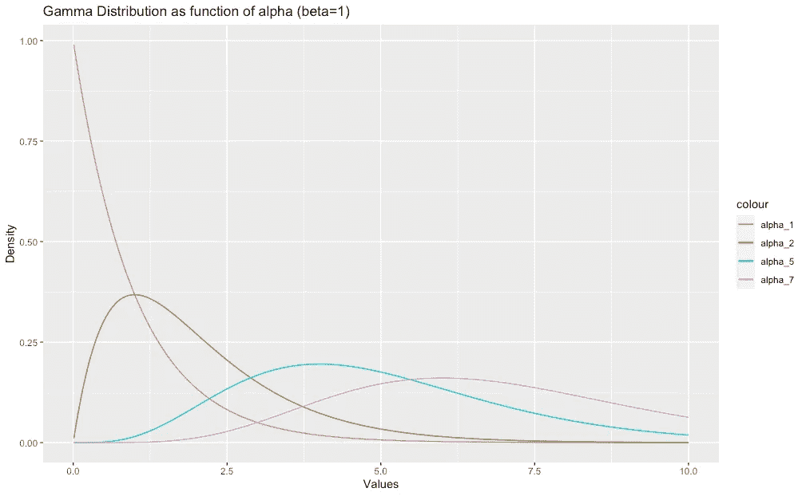
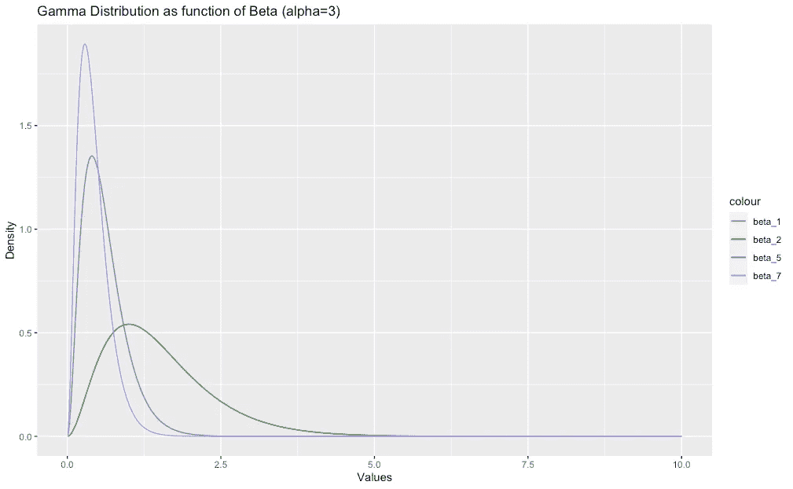
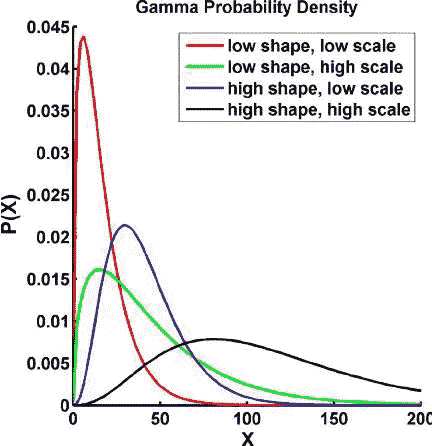
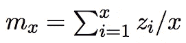
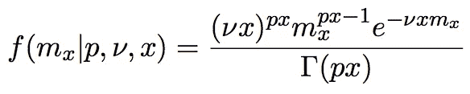
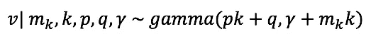
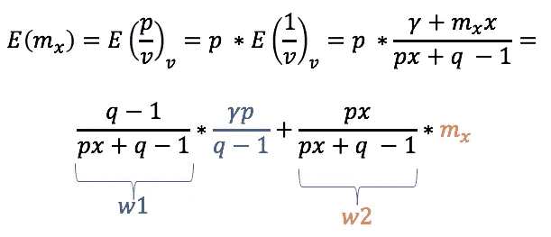
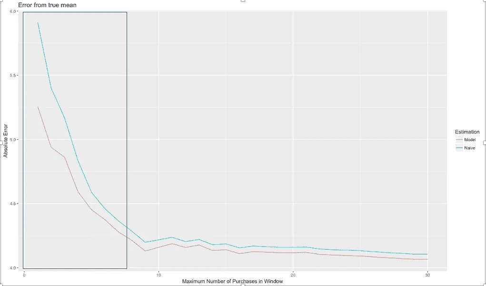

# 用伽玛分布预测收入

> 原文：<https://medium.com/analytics-vidhya/the-gamma-distribution-and-its-applications-in-the-mobile-app-industry-2ba891d8b7f4?source=collection_archive---------6----------------------->

大家好！
今天，我们将从移动应用行业的角度来回顾伽玛分布。
我在构建我的第一个生命周期价值模型时第一次使用了这种分布，我认为这是在公司工作的任何数据科学家都应该知道的一种基本分布，这种分布涉及收集用户信息，尤其是最重要的信息，即这些用户为您的公司带来的收入。

# **伽玛分布**

伽玛分布是一个双参数连续概率分布族。
伽玛分布的概率密度函数可以表示为:

它有两个参数， **alpha** -代表*形状*参数， **beta-** 代表*比例*参数，它的支撑只由正值组成。
我通常不喜欢在不解释的情况下抛出定义，所以我为那些想知道为什么这些参数被称为“形状”和“比例”的好奇者增加了一小段关于这两个参数的内容。如果您愿意，可以随意进入下一部分。

*形状和比例参数* 那么这两个参数到底是什么意思呢？
我们可以通过一个例子来看。我们从α开始。
要查看更改 alpha 对 pdf 函数的影响，让我们查看下图:

在这里，我们看到了为什么阿尔法得到了它的名字作为形状参数-越大的阿尔法-更多的 pdf 将其形状向右移动。
如果我们将 alpha 设为 3(随机选择)，并将 beta 设为我们的变量，图像将会是:

所以我们看到β负责密度函数的振幅。从数学上来说，这很容易说明，但是因为这不是我这篇文章的主要目标，我们将转到更有趣的部分。
关于伽马分布的更多信息，你可以阅读 Aerin Kim 关于这个主题的伟大文章。

# **动机**

Gamma 发行版有很多应用，但与移动应用领域最相关的应用是…预测收入！

更准确地说，我们将使用伽玛分布来预测您的用户的每笔交易的预期收入。

**为什么是伽马？** 首先，手头的变量是连续的，我们只得到每个用户的预期收益的正值(在这种情况下我们会忽略非付费用户，他们的预期收益实际上是 0，对我们来说没那么有趣:)。
选择伽马分布的另一个原因是它的曲线。让我们看看伽玛分布产生的以下曲线:

如果你正在开发一个 FTP(免费游戏)应用程序，你的每用户收入直方图看起来将非常类似于上图中的红色曲线。有很多“低支付者”，即购买量较小的支付者，只有极少数“高消费者”，即平均交易金额较大的支付者。
这就是我们在这种情况下选择伽玛的原因。
**为什么不直接计算平均值？**
正如我们在统计学的第一课中所知，当我们试图估计某个随机变量的期望值时，简单平均值可以用作随机变量期望值的无偏估计量。嗯，在我们的情况下……可能不是这样的。
假设用户购买了 1 次，金额为 1.99 美元。你会说这个用户的预期交易价值是 1.99 美元吗？
仅通过一次观察，很难对期望值做出很好的估计，而且考虑到我们的大多数用户不会购买很多东西，我们将需要使用某种先验知识来消除这些方法的偏差。

# 形成期望

对于具有 x 个事务的给定用户，设 z1，z2，…zn 表示每笔交易的美元价值。
我们假设每笔交易的价值围绕用户(未观察到的)平均交易价值 E(M)随机变化。
在这种情况下，客户观察到的平均交易价值将为:

我们假设 Zi 是 iid 伽马分布变量，具有形状参数 *p* 和比例参数 *v* 。
利用涉及伽马分布的两个标准关系:

***我*** 。x iidγ(p，ν)个随机变量之和为分布γ，形状参数为 px，尺度参数为ν。
***ii*** 。乘以标量 1/x 的伽马(px，ν)随机变量本身是具有形状参数 *px* 和比例参数 *νx* 的分布伽马

结合这两个已知的性质，我们得到平均观察事务值， *mx，*也是以这个 *px* 为形状参数， *vx* 为尺度参数的伽玛分布。它的 pdf 可以表示为:

好了，我们已经处理了观察到的部分，但是请记住，我们还需要考虑用户交易数量较少的情况，输入贝叶斯定理来帮助我们！

**添加先验信息**

为了说明跨用户的潜在平均交易值的异质性，我们假设ν的值根据具有形状参数 *q* 和比例参数 *γ的伽马分布分布在整个群体中。* 

在应用 Bayes 定理找到 v 的后验分布后，我们得到 v 是伽玛分布，具有:

v 的后验分布

从这里，我们可以找到用户交易价值的后验期望值:

mx 的后验期望值

我们可以看到，期望值可以用加权平均来解释。
**w1** 是分配给我们先验知识的权重，其中 **w2** 是分配给实际数据的权重。
我们掌握的证据越多，即 *x* 越大，则 **w2** 相对于 **w2** 越大，这导致我们更相信实际数据，即我们之前覆盖的平均交易统计。
所以对于有很多交易的用户来说，简单均值和后验期望会显示出接近相同的值。就是交易不多的用户会把后验预期推得比简单均值好很多。

# **性能**

那么与简单均值相比，后验期望有多好呢？
让我们用下图来回顾一下这两个估计器的性能:

两种估计量的性能

在 Y 轴上，这是绝对误差度量，即从“实际”期望值到估计的期望交易值的绝对误差。
“真实”在这里指的是一个用户在应用中使用一年后的平均交易价值——所以它捕捉到了用户一生中在应用中的大部分交易。
在 X 轴上，它是发生估算时用户进行的最大购买次数。
例如，图中第一个点显示了后验期望(红色)和朴素均值(青色)的表现，在仅给定 1 笔交易的情况下，尽力估计用户的真实期望交易值。关于第二点，他们正在做同样的事情，但是现在他们要处理≤2 个事务，等等。

我们可以看到，后验预期的力量体现在低付费用户身上，他们没有很多信息可以利用，所以先验知识在这个区域协助我们。随着我们有更多的证据，这两个估计量不出所料地彼此接近。

# **总结**

在本文中，我介绍了一种方法来估计移动应用领域中用户的预期交易价值。
这篇文章中我遗漏的主要内容是关于如何实现参数估计以达到后验期望的数学过程。
这是一个相当全面的解释，但简而言之，人们需要创建似然函数，并尝试通过梯度下降或其他类型的数值优化算法来优化它。
我希望您发现它很有用，并在日常工作中尝试一下。

迈克尔