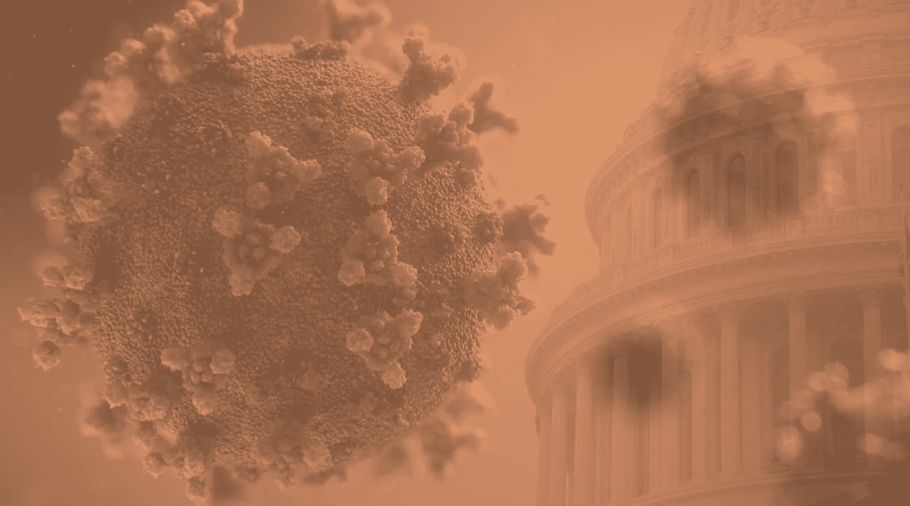

# 政府将冠状病毒政策建立在一个有严重缺陷的预测模型上

> 原文：<https://medium.com/analytics-vidhya/the-government-is-basing-coronavirus-policy-on-a-seriously-flawed-model-9b8df5dac560?source=collection_archive---------14----------------------->

[背景图像 1](https://unsplash.com/photos/rnr8D3FNUNY) 、[背景图像 2](https://unsplash.com/photos/5DDYHjk_KMU) 。两张图片都来自 Unsplash。

## IHME 模式有几个大问题

白宫和许多其他政府一直将许多冠状病毒政策和指导主要基于一个模型——IHME，或健康指标和评估研究所。这种被称为白宫“首选模式”的模式…