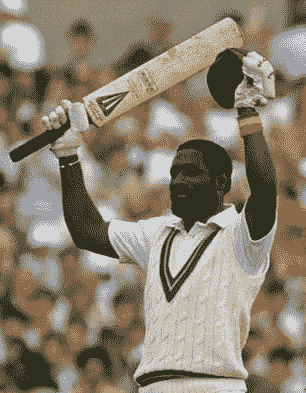

# 一天中最伟大的比赛赢家国际:第一部分

> 原文：<https://medium.com/analytics-vidhya/the-greatest-match-winners-in-one-day-internationals-part-1-61c7ae448111?source=collection_archive---------8----------------------->

## 对胜利贡献最大的击球手排名

维·理查兹，老特拉福德，1984 年 5 月 31 日

1984 年 5 月，曼彻斯特的一个阳光明媚的早晨。老特拉福德的看台上挤满了观看西印度群岛队和东道主英格兰队第一场为期一天的比赛的观众。西印度群岛仍在疗伤，决心重建…