# Python 中的 groupby 方法

> 原文：<https://medium.com/analytics-vidhya/the-groupby-method-in-python-4b3c24e4a9e5?source=collection_archive---------15----------------------->

**python 中关于 groupby 方法的一切。**


马哈拉施特拉邦迪韦加尔海滩，来源:-互联网

大家好，希望你们都过得好。

在本文中，我们将了解 python 中 groupby 方法的所有内容。所以把这篇文章一直读到最后，你会知道我们可以多么容易地使用 groupby 方法处理数据来发现有趣的见解。

先决条件:Python 的熊猫库的基础知识

**目标** :-假设我们有一个印度的 GDP 数据集，其中包含像邦、区(北、南、东、西)等特征。我们希望按区域计算 GDP，即我们希望**按**区域对 GDP **进行分组。这里 groupby 方法来帮助我们。**

目录:-

1.  什么是 groupby 方法？
2.  何处使用 groupby 方法
3.  用一个例子演示

groupby 特性允许您基于列将行分组在一起，并对它们执行特定的功能(如求和、平均、计数)。我们需要使用 groupby 特性来对表中的一些行进行分组，然后对它们执行特定的功能(比如均值、计数)。

让我们来看一个例子…

在本次演示中，我们将使用数据集信用风险。你可以从[这里](https://github.com/Dnp1995/Datasets/blob/main/credit_risk_train_data.csv)下载。

该数据集包括申请银行贷款的申请人的信息。

首先，我们将导入所有必需的库并加载数据集

```
import numpy as np
import pandas as pd
from IPython.core.interactiveshell import InteractiveShell
InteractiveShell.ast_node_interactivity='all'
df=pd.red_csv('credit_risk_train_data')
```

混洗数据集并制作一个简单的过滤器“prop”来分组“Property_Area”要素

```
df=df.sample(frac=1.radom_state=123)
df.head()
```

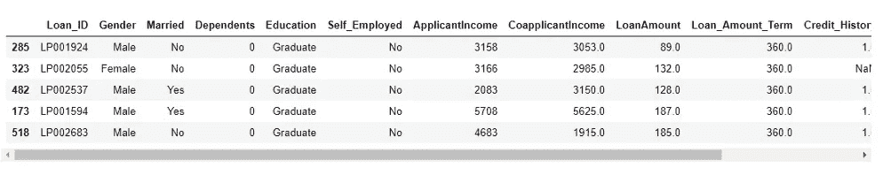

```
prop=df.groupby('Property_Area')
```

现在，我们将找到第一次出现的属性，下面的代码将告诉您如何做到这一点，但在此之前，我们将看到' Property_Area '属性的频率分布。

```
df['Property_Area'].value_counts()
```

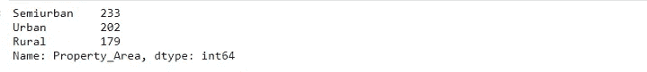

现在，我们希望在数据集中找到第一个出现的 Property_Area 属性。

```
prop.first()
```

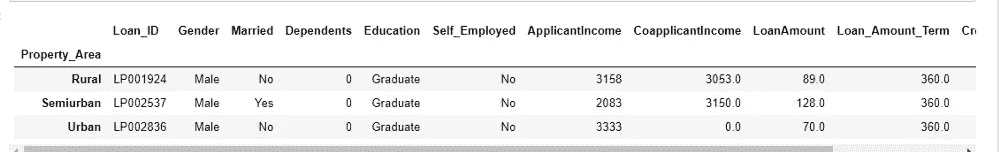

从上表中，我们了解到 applicant-Loan_ID=LP001924 是数据集中第一个财产面积位于农村的申请人。同样，申请人 Loan_ID=LP002537 是数据集中的第一个申请人，其 Property_Area 位于农村

同样，我们可以找到最后出现的属性。

```
prop.last()
```

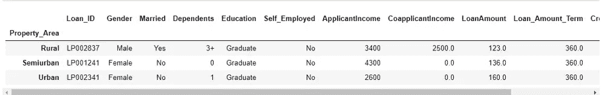

现在，有时我们需要从原始数据集中提取一个样本来研究它。下面的代码将向您展示使用 groupby 方法从大型数据集中提取所需样本是多么容易。我们将提取‘Property _ Area’为‘Urban’的行/观测值。

```
prop.get_group('Urban').head()
```

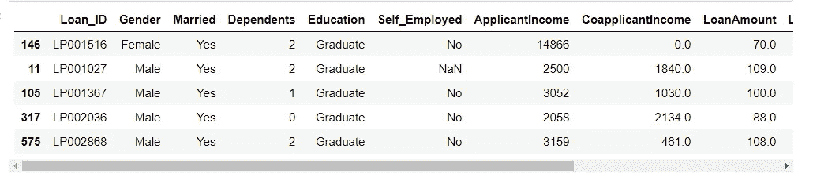

让我们反复检查我们是否是真实的

```
df[df['Property_Area']=='urban'].head()
```

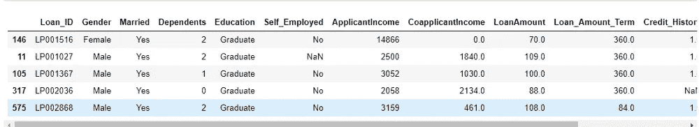

以上两个表都返回相同的一组观察值，所以我们是真实的。

现在我们要找到对应于属性的索引号行。

```
prop.groups
```

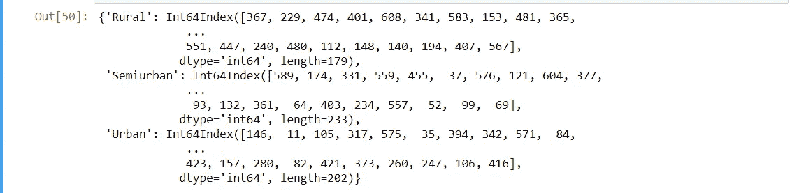

现在，我们将寻找具有另一个特征的特定属性的数值变量的平均值

```
prop.mean()
```

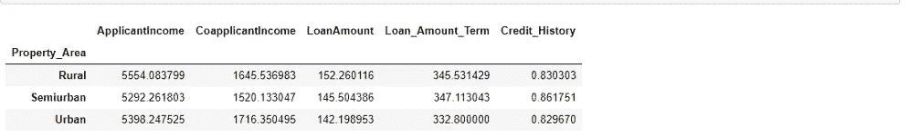

因此，上表给出了与农村、半城市和城市属性相对应的申请人的平均收入

**使用 groupby 方法的数据可视化:-**

我们还可以借助 groupby 方法来可视化我们的数据。

```
prop.size().sort_values(ascending=True).plot(kind='barh')
```

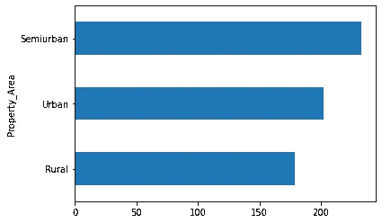

```
prop[['ApplicantIncome','LoanAmount']].mean().plot(kind='bar')
```

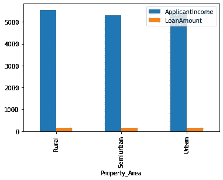

```
prop['Loan_Status'].count().plot.pie(subplots=True)
```

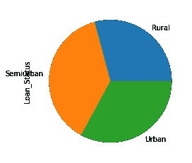

所以，这里我们可以看到来自半城市的申请人有更多的贷款批准。

到目前为止，我们只是做了一个属性区域的分组。现在，我们将了解如何对多个要素的数据进行分组

**多重分组** :-

根据特征“性别”和“属性 _ 面积”对数据集进行分组。

```
prop=df.groupby(['Gender','Property_Area'])
```

现在我们要根据'性别'来计算属性['农村'，'房产'，'半城市'，'城市']的出现频率。

类似地，正如我们在上面所做的，我们将根据属性计算['ApplicantIncome '，' CoapplicantIncome '，' LoanAmount']的总和。

```
prop.sum()
```

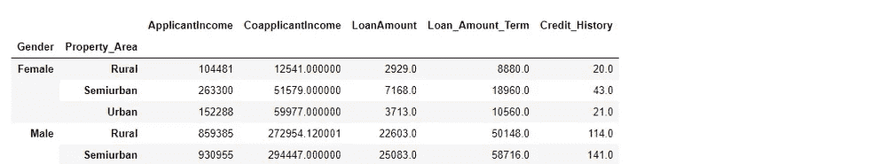

现在，我们将使用聚合函数对数据进行更多的统计计算

```
prop.agg({'LoanAmount':'mean','ApplicantIncome':'sum'})
```

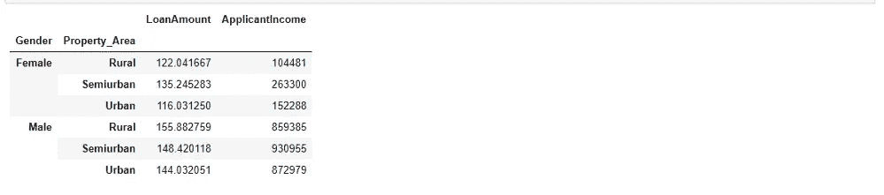

从上表可以看出，LoanAmount 一栏给出了女性申请人对应每个 Property_Area 的平均值。申请人收入一栏列出了与每个财产领域相对应的女性申请人的总收入。所以聚合函数以简单的表格形式给出复杂的数据，我们很容易理解。

到目前为止，我们已经研究了一些聚合函数，比如均值、众数和总和。它们对一组数据执行统计操作。浏览一下 Pandas 包中的所有集合函数:

*   count()-非空观察值的数量
*   Sum()-值的总和
*   Mean()-值的平均值
*   median()-数值的算术中值
*   min()-最小值
*   max() —最大值
*   mode() —模式
*   std() —标准偏差
*   var() —方差

```
prop.agg(['size','sum','mean'])
```

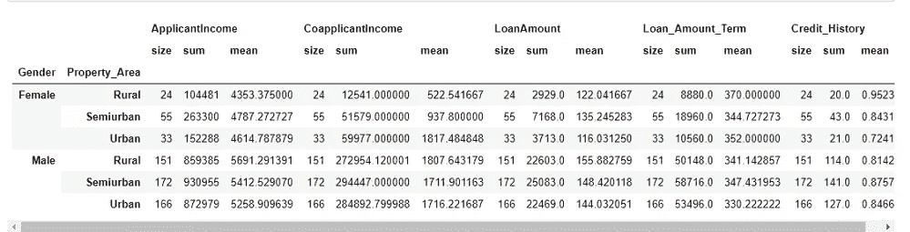

简而言之，我们可以说 Groupby 方法对于捕捉对数据和模式的洞察非常有用。使用 groupby 方法，我们只需几行代码就可以从我们的数据集中获得有效且有影响力的见解。

谢谢大家！

如果你有任何疑问或想要更多的见解，请通过 [LinkedIn](https://www.linkedin.com/in/dhiraj-patil-analyst) 联系我。

**喜欢文章就鼓掌评论！**