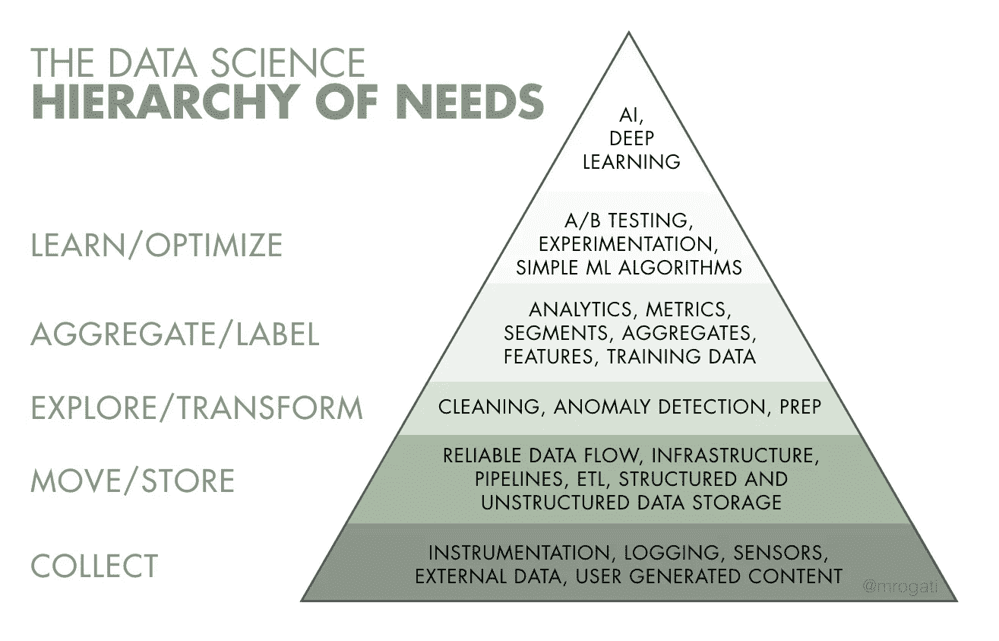

# 机器学习系统的隐藏部分

> 原文：<https://medium.com/analytics-vidhya/the-hidden-part-of-machine-learning-systems-e0a2614f01e7?source=collection_archive---------17----------------------->

约翰·巴克利在 [Unsplash](https://unsplash.com/s/photos/complex?utm_source=unsplash&utm_medium=referral&utm_content=creditCopyText) 上拍摄的照片

# 介绍

几个月来，我们一直在讨论用于训练数据的算法。用于浅层学习的随机森林或梯度增强树。用于深度学习的多感知器层或卷积神经网络。

在一个机器学习项目中，有比这些算法更多的东西。我们经常忘记谈论这些事情。

# 机器学习是机器学习系统的一小部分

在[机器学习系统中隐藏的技术债务](https://papers.nips.cc/paper/5656-hidden-technical-debt-in-machine-learning-systems.pdf)中，作者解释说，机器学习是机器学习系统的一小部分。

只有一小部分真实世界的 ML 系统由 ML 代码组成，如中间的小黑框所示。所需的周边基础设施庞大而复杂。”

[人工智能需求层次](https://hackernoon.com/the-ai-hierarchy-of-needs-18f111fcc007)文章解释说，要构建一个合理稳定的人工智能系统，你必须获得强大的基础。

“在有效利用人工智能和机器学习之前，你需要为你的数据打下坚实的基础。”

**除了机器学习算法，我们还花时间准备数据(特征工程)、验证模型、构建强大的基础设施等。**

# **模型验证**

我不会详尽或精确。我只想强调一些关于我们用来训练数据的算法的概念。

你根据度量标准选择一个模型。每个用例都有自己的度量标准。这取决于你试图预测或发现什么。

**分类问题**

在分类问题中，您试图预测一个离散值(例如蓝色或绿色)。您可以使用准确性的度量标准(真实结果占总数的比例)。

但是您可能对其他东西感兴趣，比如精度的度量。

**回归问题**

在回归问题中，你试图预测一个连续的值(例如从 0 到无穷大)。

你可以用 R2。它说明了算法设置如何解释结果。你也可以计算残差，另一种度量。

度量帮助您选择算法。那么，如何获得这些指标呢？

**测试/训练验证**

您可以将数据分成两组。你用称为“训练集”的第一组来计算算法。您可以通过用第二组名为“测试集”的测试结果(算法设置)来获得指标。

**K 交叉验证**

你做的和测试/训练验证完全一样，但是要做 K 次。它会产生不同的指标。你用它们的平均值。

# 数据准备

我们通常不会给机器学习算法原始数据。出于性能或效率的目的，我们准备它们。

**缺失值**

你可以面对缺失的价值观。在这种情况下，您可以删除列或原始值，计算缺失值的平均值、中值或众数等。

**将分类值转换为数值**

来自框架或库的算法一般不接受范畴值作为特征。例如，蓝色、绿色、红色是分类值，而 0、1、2 不是。然后，您必须将分类值转换成数值。

您可以使用 one-hot-encoder(为每个类别分配一个向量)。您也可以使用字符串索引(为每个类别分配一个编号)。

**提取表象**

还可以从数据中提取新的特征，这是自然语言处理(NLP)中的一个重要课题。“单词嵌入”概念是一种表示单词的方法。使用这种方法，彼此接近的单词(“猫”和“猫科动物”)具有彼此接近的向量。

# 除了模型验证和数据准备

**脏数据**

有时候，你不仅要处理丢失的值，还要处理不干净的值。

**超参数**

我们也花时间调整超参数。神经网络的层数是一个超参数。

**可解释性**

我们越来越需要解释为什么我们选择的算法是最好的。我们必须解释黑盒。“可解释性”正在成为一个巨大而具有挑战性的问题。

# 结论

除了机器学习算法，我还强调了一些关于我们用来训练数据的算法的概念。

如果你想更多地了解这些主题，这里有一些链接。

*   [如何处理缺失数据，阿尔维拉·斯瓦林，2018 年 1 月 31 日](https://towardsdatascience.com/how-to-handle-missing-data-8646b18db0d4)
*   [单词嵌入，维基百科](https://en.wikipedia.org/wiki/Word_embedding)
*   [ELMo，BERT，Word2vec，GloVe 的单词嵌入有什么主要区别？Quora](https://www.quora.com/What-are-the-main-differences-between-the-word-embeddings-of-ELMo-BERT-Word2vec-and-GloVe)
*   [BERT 解释道:NLP 的艺术语言模型](https://towardsdatascience.com/bert-explained-state-of-the-art-language-model-for-nlp-f8b21a9b6270)，Rani Horev，2018 年 11 月 10 日
*   [对词汇表征的有效估计 inVector Space](https://arxiv.org/pdf/1301.3781.pdf) ，托马斯·米科洛、程凯、格雷格·科拉多、杰弗里·迪恩，2013 年 9 月 7 日
*   [机器学习中为什么一键式编码数据？](https://machinelearningmastery.com/why-one-hot-encode-data-in-machine-learning/)，杰森·布朗利，2018 年 7 月 28 日
*   [标签编码器 vs 机器学习中的一个热门编码器，](/@contactsunny/label-encoder-vs-one-hot-encoder-in-machine-learning-3fc273365621) S [unny Srinidhi](/@contactsunny?source=post_page-----3fc273365621----------------------) ，2018 年 7 月 30 日
*   [“我为什么要相信你？”:解释任何分类器的预测，](https://arxiv.org/abs/1602.04938)
    马尔科·图利奥·里贝罗，萨梅尔·辛格，卡洛斯·盖斯特林，2016 年 2 月 16 日
*   [人工智能需求层次](https://hackernoon.com/the-ai-hierarchy-of-needs-18f111fcc007)，莫妮卡·罗加蒂，2017 年 6 月 12 日
*   [准确度、精确度、召回率& F1 得分:性能指标解释](https://blog.exsilio.com/all/accuracy-precision-recall-f1-score-interpretation-of-performance-measures/)，雷努卡·乔希，2016 年 9 月 9 日
*   [为什么以及如何交叉验证模型？](https://towardsdatascience.com/why-and-how-to-cross-validate-a-model-d6424b45261f)桑杰。m 2018 年 11 月 13 日
*   机器学习系统中隐藏的技术债务