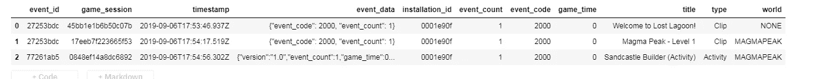
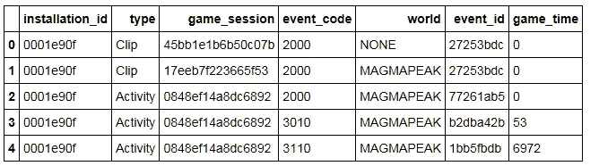

# 数据科学的搭便车指南

> 原文：<https://medium.com/analytics-vidhya/the-hitchhikers-guide-to-data-science-76a7a53e1a1a?source=collection_archive---------26----------------------->


如果你是一个旅行者和探险者，要遵循的一条黄金法则就是脚步轻盈。我试图列出一些数据科学家可以从他们的旅行爱好者同伴那里学到的东西。为了有效地做到这一点，我从***Kaggle*******2019 数据科学碗*** 中挑选了一个数据集进行研究，以进行类比。*

*首先看看训练数据…*

**【该数据集由 PBS KIDS Measure Up 游戏分析提供！app。在这个应用程序中，孩子们可以在地图上导航并完成各种级别，这些级别可以是活动、视频剪辑、游戏或评估。每项评估都旨在测试孩子对某一套测量相关技能的理解程度。]**

*[](https://www.kaggle.com/c/data-science-bowl-2019/data) [## 2019 数据科学碗

### 下载数千个项目的开放数据集+在一个平台上共享项目。探索热门话题，如政府…

www.kaggle.com](https://www.kaggle.com/c/data-science-bowl-2019/data) 

那么，我们能从我们的探险者伙伴身上学到什么以及如何学到呢:)* 

1.  ***选择合适的箱包***

**

*你不能带着沉重的行李箱“背包”穿越欧洲。我的意思是你可以，但这将从本质上削弱整个背包旅行的体验。*

*同样，一旦导入数据，请确保它是最佳的数据类型。将数据类型从 *int64* 改为 *int16* 可以将消耗的内存减少到原来的四分之一。*

***之前:***

```
*import pandas as pd
train = pd.read_csv("../Data_Science_Bowl/train.csv")train.dtypes
event_id           object
game_session       object
timestamp          object
event_data         object
installation_id    object
event_count         int64
event_code          int64
game_time           int64
title              object
type               object
world              object
dtype: object
train.info(memory_usage=’deep’)
dtypes: int64(3), object(8)*
```

> ***内存使用量:8.1 GB***

***之后:***

```
*### Reduce sizetrain[‘event_id’] =train[‘event_id’].astype(‘category’)
train[‘game_session’] =train[‘game_session’].astype(‘category’)
train[‘timestamp’]=pd.to_datetime(train[‘timestamp’], format=”%Y-%m-%dT%H:%M:%S.%fZ”)train[‘installation_id’]=train[‘installation_id’].astype(‘category’)
train[‘event_count’]=train[‘event_count’].astype(‘int64’)
train[‘event_code’] =train[‘event_code’].astype(‘category’)
train[‘game_time’] =train[‘game_time’].astype(‘int64’)train[‘title’] = train[‘title’].astype(‘category’)
train[‘type’] =train[‘type’].astype(‘category’)
train[‘world’] =train[‘world’].astype(‘category’)train.info(memory_usage=’deep’)
dtypes: category(7), datetime64[ns](1), int64(2), object(1)*
```

> ***内存使用量:3.1 GB***

*如果你只是简单地选择数据类型的最佳组合，你最终会选择正确的行李类型！:)*

***2。不要带任何你不需要的东西***

**

*一旦您对数据稍微熟悉一些，您很可能会发现有些列并不像您先前认为的那样有用。去掉你不需要的列和行。*

***之后:***

```
*### Reduce sizetrain=train[[‘installation_id’,’type’,’game_session’,’event_code’,’world’,’event_id’,’game_time’]]
train.info(memory_usage=’deep’)
dtypes: category(6), int64(1)*
```

**

> ***内存使用量:238.3 MB***

***3。远离你的水瓶***

**

*很有可能会多次导入数据集。以正确的格式保存数据集将使您在每次加载数据时免于烦恼和痛苦。您还可以保存中间数据帧，以进一步缩短旅行时间。相信我，这是一次性投资。*

***之前:***

```
*import time
start_time = time.time()
train = pd.read_csv(“../Data_Science_Bowl/train.csv”)
print(“ — — %s seconds — -” % (time.time() — start_time))*
```

> ***-70.595842018127 秒-***

***之后:***

```
*train.to_pickle(“../Data_Science_Bowl/train.pkl”)start_time = time.time()
train = pd.read_pickle(“../Data_Science_Bowl/train.pkl”)
print(“ — — %s seconds — -” % (time.time() — start_time))*
```

> ***- 13.541353940963745 秒-***

***4。选择正确的轨道***

**

*总是找到聪明的方法来最小化你的“For 循环”,否则它可能会让你陷入麻烦。*

***之前:***

```
*for user in list_users:
   for asst in asst_lst:
        # next steps*
```

> ***嵌套 For 循环***

***之后:***

```
*for asst in asst_lst:
   user=train.at[int(asst), 'installation_id']
   # next steps*
```

> ***单 For 循环***

***5。把你的东西放在正确的地方***

**

*务必不要使用数据框来保存单个数据位，而是使用字典。如果需要的话，可以在以后将字典合并到数据框中。*

***之前:***

```
*train.at[index, ‘column_name’]= value*
```

***之后:***

```
*Dict_values = {}Dict_values.update( {index : [value]})*
```

# *希望这有助于使您的旅程更加愉快。一路顺风！*

**