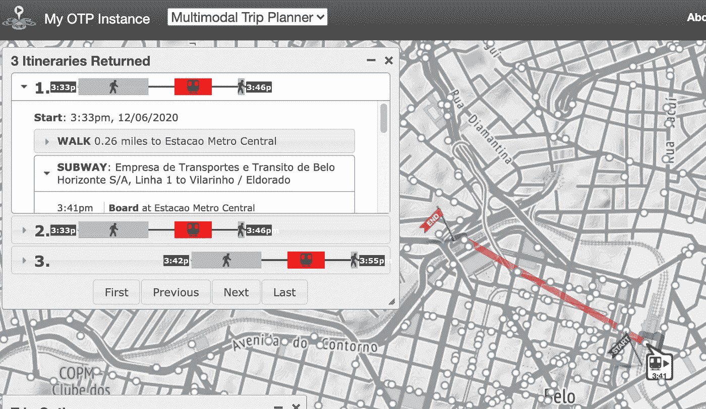

# 用 python 编写的 GTFS 搭便车指南

> 原文：<https://medium.com/analytics-vidhya/the-hitchhikers-guide-to-gtfs-with-python-e9790090952a?source=collection_archive---------4----------------------->

## 别慌，只是公交数据

最初，GTFS 标准是由谷歌创建的。这让很多人非常愤怒，并被广泛认为是一个糟糕的举动。

自 2004 年发布以来,《通用公共交通供给规范》( GTFS)彻底改变了我们处理公共交通数据的方式。它定义了公共交通时刻表和相关地理信息的通用格式。GTFS 提要由一系列收集在 ZIP 文件中的文本文件组成。每个文件都模拟了交通信息的一个特定方面:[站点、路线、行程和其他时间表数据](https://developers.google.com/transit/gtfs/reference)。

组成 GTFS 提要的 txt 强制和可选文件。

GTFS feeds 允许公共交通机构发布他们的交通数据，开发人员编写应用程序，以可互操作的方式使用这些数据。在[开放移动数据网站](https://transitfeeds.com/)上可以公开获得这些信息。

**但是让我们面对它**，如果你曾经处理过 GTFS 数据集，你就会知道**总是会有**缺失字段或跳过停靠点，这使得它很难投入实际使用。

正因为如此，我们可以使用各种编程语言的许多模块来纠正错误、填补空白，并为您当地交通机构的破损 GTFS 数据集生成缺失文件。

我最近承担了为许多 transit feeds 做这件事的任务，并想与世界分享我所学到的东西。因此，无论您是尝试在 OpenTripPlanner 中获取路径、构建自己的 GTFS 还是仅仅运行公共交通分析，这里都有一些 python 中的脚本可供您增强数据集。

在本文中，我们将讨论 GTFS 订阅源中最常见的一些问题，例如:

1.  验证和查找 GTFS 提要中的错误
2.  从头开始创建 shapes.txt 文件
3.  插值空白停止时间
4.  将两个 GTFS 馈送合并在一起
5.  向 routes.txt 文件中的线条添加颜色
6.  构建和修改 calendar.txt 文件
7.  直观检查地图中的结果

# *了解 GTFS 的最新动态*

有一些工具可以很好地识别 GTFS 提要的问题。最受欢迎的两个是 [WRI 城市的 GTFS 经理](https://static-gtfs-manager.herokuapp.com/)和[谷歌的提要验证器](https://developers.google.com/transit/gtfs/guides/tools)。这些接口的问题是很难记录和复制对提要所做的更改，尽管它们的接口很棒。

所以我们将使用名为 [**gtfs-kit**](https://pypi.org/project/gtfs-kit/) 的 python 包。这个包拥有快速修复提要所需的所有功能，但最重要的是，它有一个`.validate()`方法。此外，您还可以在 Jupyter 笔记本中使用它，让复制和与他人分享结果变得更加容易。

 [## gtfs 套件

### GTFS 工具包是一个 Python 3.6+工具包，用于分析内存中的通用交通供给规范(GTFS)数据，而无需…

pypi.org](https://pypi.org/project/gtfs-kit/) 

这里有一个如何开始的快速示例。我们将使用来自巴西萨尔瓦多市的 GTFS。它并不完全是参宿四，但是如果你考虑到宇宙的大小，也不会太远。在这个要点中，我们将导入 gtfs-kit 模块，声明压缩的 gtfs 提要的路径，用`.read_feed()`函数读取它，然后验证它。

输出应该像这样，告诉您在哪里寻找错误或不一致。

该函数将警告我们的最常见错误之一是缺少 **shapes.txt** 文件。从指定 GTFS 提要中每个文件的图表中，您会注意到这是少数几个具有空间信息的文件之一，但也是一个可选文件。对 gtfs-kit 来说不是。没有 ***shapes 文件*** 这个工具就无法工作，所以我们将求助于所有 ***shapefiles*** 的*母舰*，Esri 本身。

Arthur Dent 经常在清晨醒来，突然意识到他必须购买价值数千美元的 ArcGIS Desktop 许可。

# Arcpy，宇宙和一切

ArcGIS 平台是地理空间软件行业中的超级新星，在过去几年中受到了一些严重的打击。像 Mapbox 和 Carto 这样的平台正在快速发展，QGIS 也越来越受欢迎。但是 Esri 有办法让我们回到 ArcGIS。这一次，他们设法在 ArcGIS Pro 转换工具箱中加入了一个非常有用的工具箱，专门用于处理 GTFS 源。

其中一个工具是 [**从 GTFS** 生成形状](https://pro.arcgis.com/en/pro-app/latest/tool-reference/conversion/generate-shapes-features-from-gtfs.htm)。此工具非常依赖于 ArcGIS 网络数据集来连接给定道路网络上的行程停靠点。

 [## 从 GTFS 生成形状要素(转换)

### 生成公共交通系统中车辆行驶路径的估计。该工具的输出可以…

pro.arcgis.com](https://pro.arcgis.com/en/pro-app/latest/tool-reference/conversion/generate-shapes-features-from-gtfs.htm) 

要使用它，您需要一个没有 shape.txt 文件和道路网络空间数据的有效 GTFS 源。获取网络最简单的方法是使用 [**HOTOSM 导出工具**](https://export.hotosm.org/en/v3/) 进行 OSM 提取，然后从头开始创建和构建 [**网络数据集**](https://pro.arcgis.com/en/pro-app/latest/tool-reference/network-analyst/create-network-dataset.htm) 。准备好地理数据库后，您可以执行如下操作:

确保未选中出行模式“1-地铁”,这样该工具会将此模式的形状计算为直线，而不是地铁车辆在表面上行驶。

在 ArcGIS Pro 中，结果将如下所示

# 时间是一种幻觉。停止时间加倍如此。

除了 ArcGIS 中的 GTFS 本地工具，我们还可以使用 GIS 社区开发的脚本。这就是[插值空白停靠时间](https://github.com/Esri/public-transit-tools/tree/master/interpolate-blank-stop-times)工具的情况，这是一组 python 脚本，使用 arcpy 来估计只有初始出发时间和最终到达时间的行程中的停靠时间，这是 GTFS 数据集中一个非常常见的问题。例如，让我们使用 **gtfs-kit** 模块来检查萨尔瓦多地铁系统 1 号线的行程。

Gtfs-kit 将每个 txt 文件分配给一个 pandas 数据帧，这非常实用。在这里，我们通过 trip_id 过滤 stop_times 数据帧(也就是说，从 L1 路线出发的一次单程旅行)，毫不奇怪，所有的中间站点都是空白的。

只填写最初的出发时间和最终的到达时间。

使用这些脚本真的没有什么吸引力，所以我不会在这里包含要点，因为它们相当长。你可以在下面的资源库中找到我自己的 Jupyter 笔记本版本。只需在 ArcGIS 或 python 环境中使用 arcpy 运行它们。

 [## guilhermeiablo/gtfswithpython

### Permalink GitHub 是 5000 多万开发人员的家园，他们一起工作来托管和审查代码、管理项目以及…

github.com](https://github.com/guilhermeiablo/gtfswithpython/blob/main/NB2_EstimateStopTimes.ipynb) 

运行该脚本后，当我们检查完全相同的 1 号线地铁行程时，我们会发现所有的停靠时间都已被填入。不过，请对此有所保留，因为这是一个简单的线性插值，而不是将道路网络考虑在内的实际时间。

现在所有的到达和离开时间都填好了。神奇！

# Java。基本无害。

既然我们已经使用 arcpy 增强了我们的 GTFS feed，让我们回到 gtfs-kit，看看它如何看待 if。gtfs-kit 模块会将我们的 gtfs 识别为有效，但仍会指出错误和警告。

我希望会有一个错误 42，所以我可以在这里做一个双关语。叹气。

这完全没问题，但是当您发现自己必须一次验证多个提要时，这就变得棘手了。这并不罕见，因为许多运输机构向同一城市提供不止一个 feed，按**流域、运营商甚至运输模式**划分。

所以抓紧你的毛巾，因为我们将不得不从 python 绕道走 **Java 旁路**。这是因为目前可用于合并两个或更多 GTFS 提要的最佳工具是 Java 独有的 [**onebusaway**](http://developer.onebusaway.org/modules/onebusaway-gtfs-modules/current/onebusaway-gtfs-merge-cli.html) gtfs 模块。

 [## onebusaway-gtfs-modules - GTFS 合并命令行应用程序

### 注意:该工具正在开发中！该文档可能不是最新的。onebusaway-gtfs-merge-cli…

developer.onebusaway.org](http://developer.onebusaway.org/modules/onebusaway-gtfs-modules/current/onebusaway-gtfs-merge-cli.html) 

为了使用它，您需要安装 Java 1.6 运行时来运行客户端。一旦你有了，就把。jar 文件和您想要合并到同一个文件夹中的两个 GTFS 提要，访问它并在您的终端窗口中运行如下内容:

> `java -jar onebusaway-gtfs-merge-cli.jar --duplicateDetection=fuzzy gtfs1.zip gtfs2.zip gtfsmerge.zip`

## 一旦你按下回车键，就会有很多事情发生。

gtfs-merge 工具将做出类似于"*的决定，是否应该将两个非常接近的停靠点视为同一个停靠点？*"，"*ID 相同的路由是否应视为重复？*”，以此类推。

好消息是:**模糊重复检测**选项确保了如果两个条目有共同的元素(例如，停靠点名称或位置、路线简称、行程停靠点序列)，那么它们被认为是相同的。这是更宽松的匹配政策，高度依赖于匹配的 GTFS 条目的类型。

# 好吧，怀斯盖先生…如果你这么聪明，你告诉我们它应该是什么颜色。

现在，我们已经有了一个单一的、功能性的 GTFS 提要，让我们来看看一些非常重要而又次要的细节。一个想到的是公交路线的颜色。世界上几乎每个运输机构都用特定的颜色来标识其路线。几乎每个人都懒得在他们的 GTFS 订阅中填写这些信息。让我们为此写一个脚本。

GTFS 以十六进制格式存储与路线相关的颜色。所以我们首先调用一个颜色选择器小部件来选择我们想要的颜色。

现在你知道了你想要的颜色的正确代码，你需要做的就是将正确的过滤器应用到你的路线数据帧。在下面的例子中，我们将根据路线名称、代理 ID 和路线类型进行过滤。

不要忘记不要包含十六进制代码中的#号。

这将反映在路由软件上，如 OpenTripPlanner。这里你可以看到，当线路 1 是旅程的一部分时，它实际上显示为红色。我们还可以选择将 text_color 字段更改为白色，并在主色和叠加文本之间进行更好的对比。

# 任何事情都会发生。不过，它不一定按照时间顺序来做。

可能是因为 **gtfs-kit** 对结果很满意，看不到更多的错误，但是如果您碰巧正在考虑使用 GTFS feed 来生成使用 [**OpenTripPlanner**](https://www.opentripplanner.org/) 的路线，那么您的 feed 会有一个更加挑剔的客户。

OpenTripPlanner——如果你不知道这是什么，可以把它看作一个可以安装在你的机器上的开源 google maps routing api 不会为没有日历的旅行生成旅行。

阿瑟·登特，等到你不得不决定一条公共汽车路线是否在星期天运行的时候。

也就是说，所有的旅行都应该在 calendar.txt 文件中，说明一周中的**天**这些特定的停止时间是有效的。例如，这有助于区分在周末特定时间运行的公共汽车。

因此，要创建一个日历文件，我们将使用 trips 数据帧作为基础，因为我们需要所有的 trips IDs，然后删除不必要的字段并添加强制字段。你可以通过查看谷歌的 GTFS 参考页面找到哪些是哪些。

# 终极答案

改变颜色并将日历数据框添加到我们的提要中只是使用 **gtfs-kit** 所能做的事情的冰山一角。如果您决定使用它，您必须对一些字段进行微小的修改，删除重复的条目，等等。在这个过程中，您可能希望使用模块的映射功能来检查您的停留和行程是否有意义。

map_routes()函数的输出将在您的笔记本中创建一个传单地图。

# 再见，谢谢所有的鱼

这一块就到此为止！我们已经用 python 成功地丰富和清理了一个 GTFS feed，我们可以在未来复制这种方式。你可以在我的 Github 页面找到整个工作流程。如果你有问题或建议，不要犹豫，随时给我写信！

另外，如果你喜欢这篇文章，考虑给我买一杯咖啡，这样我会继续写更多这样的文章！

 [## 古伊列梅·亚布洛诺夫斯基正在传播空间数据科学

### 嘿👋我刚刚在这里创建了一个页面。你现在可以给我买杯咖啡了！

www.buymeacoffee.com](https://www.buymeacoffee.com/guilhermeiablo)  [## guilhermeiablo/gtfswithpython

### 清理和增强 GTFS feeds 的 python 脚本集 GitHub 是 5000 多万开发者的家园，他们一起工作…

github.com](https://github.com/guilhermeiablo/gtfswithpython)  [## 古伊列梅·亚布洛诺夫斯基-地理空间数据科学家…

### 我对如何重新利用专注于领域的学科的技术和论述充满热情…

www.linkedin.com](https://www.linkedin.com/in/guilhermeiablo/) 

我打赌你已经预见到了。