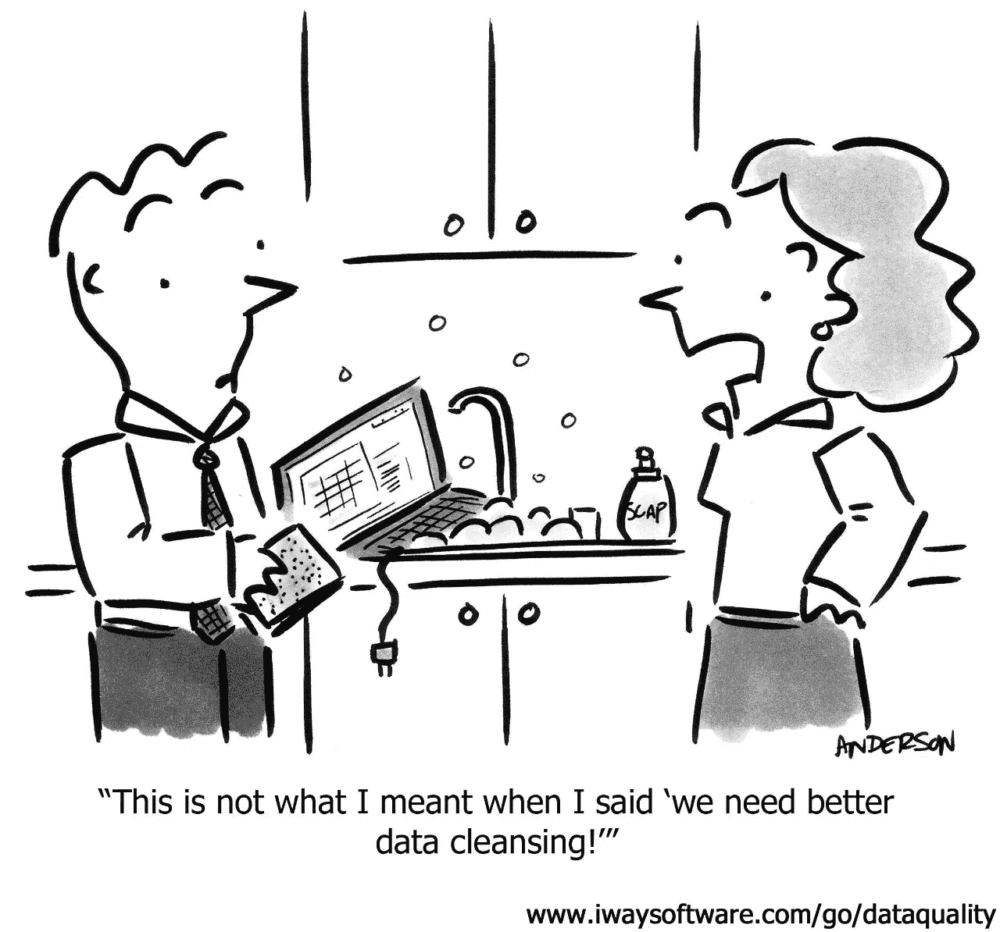

# 数据清理的必要性

> 原文：<https://medium.com/analytics-vidhya/the-imperative-of-data-cleansing-b97aa7557f76?source=collection_archive---------22----------------------->

## 更好的数据胜过更好的算法

[来源](https://uweccsdatamining101weka.files.wordpress.com/2018/04/datacartoon.jpg)

D **数据清理**或**数据清理**是从记录集、[表](https://en.wikipedia.org/wiki/Table_(database))或[数据库](https://en.wikipedia.org/wiki/Database)中检测并纠正(或删除)损坏或不准确的[记录](https://en.wikipedia.org/wiki/Storage_record)的过程，是指识别数据中不完整、不正确、不准确或不相关的部分，然后替换、修改或删除[脏的](https://en.wikipedia.org/wiki/Dirty_data)或粗糙的数据。[维基百科]