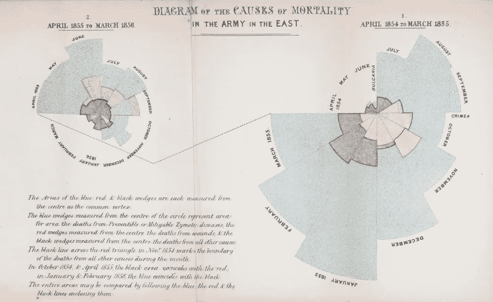
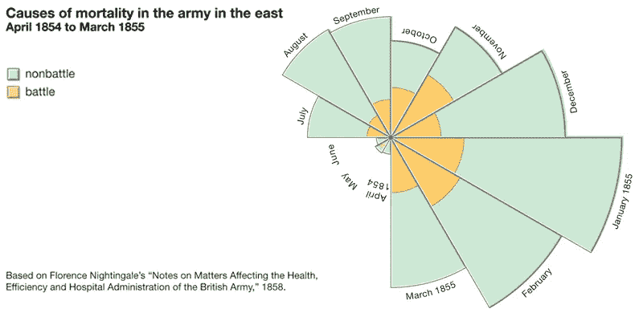
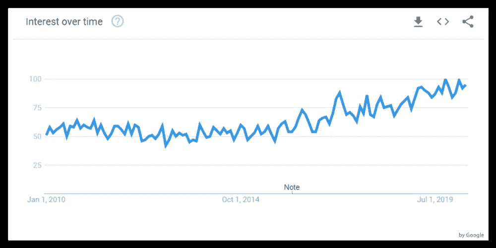

# 数据可视化的重要性

> 原文：<https://medium.com/analytics-vidhya/the-importance-of-data-visualization-bba9fcaa67a3?source=collection_archive---------23----------------------->

它是将手头的原始数据转换成简单易懂的图像-照片-图形的过程，以便快速、有效和准确地做出决策。

大家都知道我出生的地理上的这个名字，[弗洛伦斯·南丁格尔](https://en.wikipedia.org/wiki/Florence_Nightingale)。在我写这篇文章并了解她之前，她一直是一名护士。但与此同时，一位统计学家和我们的头条新闻都进行了研究，这些研究几乎可以算作数据可视化的第一个例子。

**在 1843 年克里米亚战争**进行的时候**弗洛伦斯·南丁格尔**是一名护士，她从战争中死去的人那里收集一些数据，这些是她数据的照片。上图用一张 [**极坐标图**](https://en.wikipedia.org/wiki/Pie_chart#Polar_area_diagram) 代表她的数据。

据我们所知，这张图表是用来显示军队医院中的死亡人数的。在 1853 年至 1856 年的克里米亚战争期间，1854 年，弗洛伦斯·南丁格尔在军营医院当护士，那里治疗受伤的英国士兵。

陆军医院的统计数据以及这些数据对大英帝国的直观呈现，在那个时期产生了很大的影响。

## 那么这个图表告诉我们什么呢？

红色区域表示战争伤害，蓝色区域表示死于可预防疾病的士兵，黑色区域表示死于其他原因的士兵。图表记录了当时面对俄国的进攻，更多的士兵死于霍乱、伤寒和痢疾。(右侧代表第一年，自体侧代表第二年)这种情况使当时的决策者确信，医院应该采取更多的措施。

## 近年来的数据可视化

在过去的 30 年里，全球范围内的数据量显著增加。这种数据增长的最大因素可以说是使原始数据和数据量有意义的软件增加了，并且易于访问。有时，理解和解释这些收集的原始技术知识是非常困难的。这就是数据可视化发挥作用的地方。

# 什么是数据可视化？

*数据可视化是数据的图形化表示。它包括生成图像，这些图像将所表示的数据之间的关系传达给图像的观看者。这种通信是通过在可视化的创建中使用图形标记和数据值之间的系统映射来实现的。这种映射确定了数据值的可视化表示方式，确定了图形标记的属性(如尺寸或颜色)将如何变化以及变化到何种程度，以反映数据值的变化。*【[来源](https://en.wikipedia.org/wiki/Data_visualization)

简而言之，数据可视化；它是将手头的原始数据转换成简单易懂的图像-照片-图形的过程，以便快速、有效和准确地做出决策。
它还有一种力量，让我们看到隐藏在数字中的故事，并引发我们分享和传播这些故事。

数据可视化——尤其是——在 2008 年全球经济危机之后的近几年变得非常重要，数据可视化这个词在谷歌搜索中的份额显著增加。查看谷歌趋势数据，我们发现这些搜索在 2010-2020 年的图表中每天都在增加。

**数据可视化**工作区本身有单独的标题。一般来说，可视化研究分为静态和交互式。数据的呈现方式；数据分析会影响可视化工作的成功，包括使用的首选技术、图表类型、大小和颜色。然而，数据可视化的成功不仅仅是设计知识、艺术触觉，还需要融入基本的统计知识。

此外，可视化研究中使用的软件工具也非常重要。选定的工具；**无论是基于代码的** (Python，R，js，D3)，**基于 web 的**还是独立的(如 Tableau，Power BI，Looker)，可视化工作的成功与否将取决于工具提供或不提供的可能性和便利性。

另一方面，尽管这些工具中有很大一部分是开源(免费)或半付费(免费增值)计划，但数据可视化通常是一个需要一定预算的工作空间。数据可视化工具的数量与日俱增。然而，大多数这些工具(尤其是那些提供额外设施的工具)都提供付费解决方案。这也包括在开始或测试阶段提供免费使用的数据包装器。

尽管有这些困难，保持数据可视化活力的是免费或免费增值工具资源的存在。

虽然它们的数量很少，但许多都不为人知或尚未被发现。因为我认为这是一个问题(因为这篇文章比我想象的要长)，所以我在下一篇文章中简单地编译了一些数据可视化工具，它们都是免费的，并且不需要代码信息。

# 结论

数据可视化是一个很大的 IT 领域，有许多工具和工作规程。当你把你的梦想世界加入到视野的宽度中时，在可视化的海洋中航行真的是一种享受。

yazúnún**türke**versiyonu I CIN |[tüklaynúz/Click it](/p/dd4ff0754343/)| for**土耳其**版本。

来源:

https://www . science news . org/article/Florence-nightingale-passive-统计师
https://www . data ceutics . com/blog/2018/4/27/a-passive-统计师-Florence-nightingale
https://www . science museum . org . uk/sites/default/files/styles/embedded _ image/public/2018-12/e 2015.0127 . JPEG？itok = kys 1 nap
https://www . Britannica . com/biography/Florence-Nightingale/homech-and-legacy