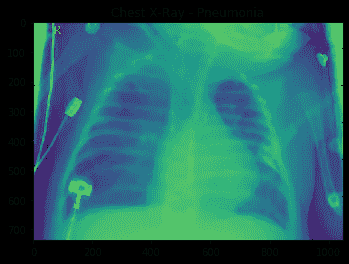
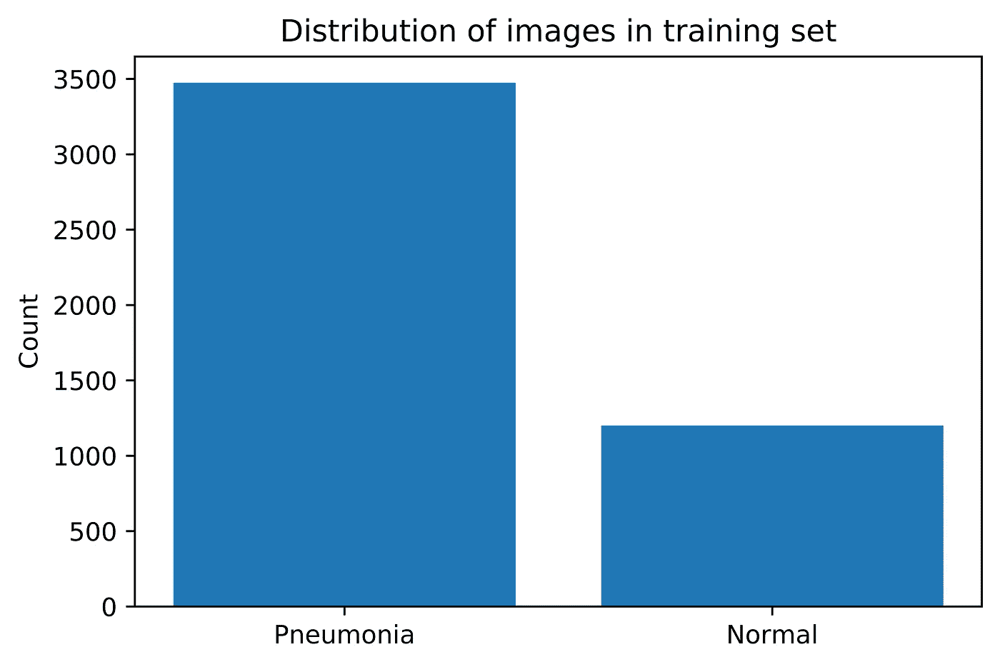
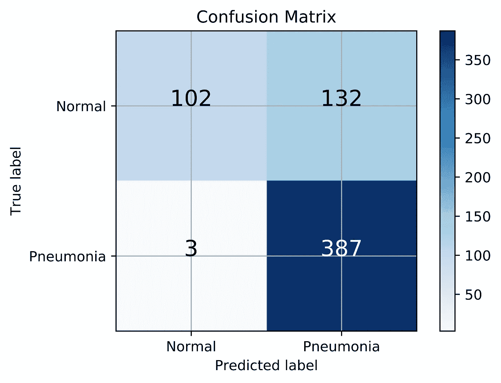

# 领域知识的重要性

> 原文：<https://medium.com/analytics-vidhya/the-importance-of-domain-knowledge-40d57ae0a91b?source=collection_archive---------23----------------------->

使用深度学习对 x 射线图像进行分类

在这个项目中，我选择应用深度学习将胸部 x 光图像分类为属于肺炎患者或健康患者。从这次经历中得到的关键收获是领域知识对你决策的重要性。应用一个模型相对简单，但是真正的价值来自于对你的决定的质疑和仔细的评估。

数据集是从 Kaggle 获得的，可以在这里下载[。它包含 5860 张图片。第一步是将数据分为训练集、验证集和测试集。下面是第一个决定，在这里**领域知识**开始发挥作用。根据行业和数据类型，不同的拆分是首选。我们选择了大约 80%的训练，10%的验证和 10%的测试。](https://www.kaggle.com/paultimothymooney/chest-xray-pneumonia)

然后，我们研究了图像的分布，发现肺炎患者的 x 光图像几乎是健康患者的 3 倍。

这是**领域知识**会有所帮助的下一个领域。数据失衡多少才算合理？我们有多容易获得更多的数据来进行补偿？目前，我们没有做出任何调整，但这是一个我们会进一步调查的途径。

对于预处理，我们将数据缩放到 100 x 100 像素，因为我们希望能够使用 CPU 在本地运行模型。这样做，我们失去了一些长宽比。

预处理完成后，我尝试了各种神经网络模型。一个关键问题是决定使用哪种指标进行评估。这里**领域知识**将再次指导一个有用的和可实现的模型所需的精度水平。我们还需要考虑其他指标，如召回率和 F1 分数。尤其重要的是尽量减少假阴性，因为在这些情况下，模型预测患者是健康的，而实际上他们患有肺炎。

最后，所选择的模型是一个具有脱落层的卷积神经网络，混淆矩阵如下(基于看不见的测试数据)。

只有 3 个假阴性，我们的模型有很高的召回率，从而最大限度地提高了患者的安全性。

虽然我们更喜欢整体更高的准确性，但我们的重点是召回，因为这一指标对于患者安全和最小化法律风险尤为重要。

我们建议采取以下行动:

1 —收集更多数据，这种分类是在大约 5k 个图像的小样本上进行的，用作概念验证

2 —利用过采样技术解决类不平衡问题，以提高性能

3 —使用此工具支持医疗专业人员，同时进一步改进