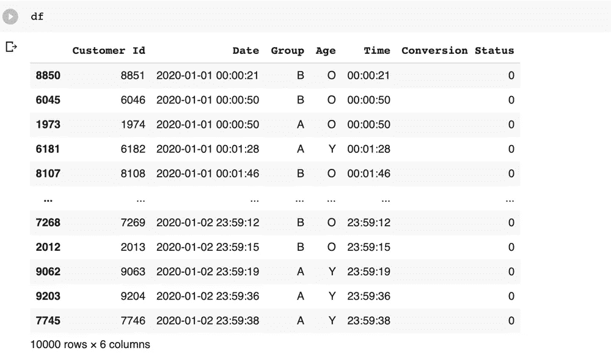

# 分层的重要性！

> 原文：<https://medium.com/analytics-vidhya/the-importance-of-stratification-c1f96d8184c8?source=collection_archive---------16----------------------->

在我的上一篇[帖子](/swlh/the-trap-of-a-b-testing-for-too-long-a4706066a692)中，我经历了一个实验，这个实验向我们展示了数据随时间的变化是如何导致从已经运行了很长时间的 A/B 测试中做出推论的问题。

然而，时间并不是导致错误推断的唯一因素。通常情况下，有其他变量会导致错误的推断，这就是数据分层概念发挥作用的时候。让我们看一下这个 A/B 测试的例子，看看分层是如何让我们得到正确的结果的。

# 看着这些数据

该数据由 10000 个数据点组成，包括客户 ID、访问网站的人的年龄分类、访问时间和转换状态。

让我们继续对数据进行分析。

# 数据分析

# 实验 1

一家公司首先要检查的是 A 组和 b 组之间的点击率比较。让我们这样做:

从图表中，我们可以看到 B 的点击率略低于 A。基于这一点，公司可以假设 B 在这一人群中的表现不如 A。然而，这是正确的决定吗？我们再做一些分析。

# 实验二

数据集给了我们一个因素——年龄。让我们执行一个基本的分析，看看它在数据集中代表了什么。

我们看到 A 组和 B 组的老人数量都比年轻人多很多。这可能会导致针对特定人群的过采样这一由来已久的情况。然而，过度采样会导致错误的推断吗？

为了回答这个问题，我们从我们的数据集中抽取样本，现在 A 组和 b 组的老年人和年轻人数量相等。

然后，我们执行与之前相同的实验来比较两组的点击率。

这里发生了什么？突然之间，B 的表现开始比 a 好得多。但是是什么导致这种情况没有在整个人群中出现呢？为什么在两个年龄组中取样数量相等会导致初始评估的翻转？

让我们更深入地了解每个年龄组，找出正在发生的事情。

# 实验三

现在让我们将初始数据集分成两部分。一个只有年轻人，一个只有老年人。将它们分成两个数据集后，让我们分别在这两个数据集上进行第一个实验。

**老年人**

**年轻人**

啊哈！我们找到了。我们的推论全都错置的原因是‘A’对老年人更有效，而‘B’对年轻人更有效。

基于这一发现，我们可以得出最后的推论。

> 第一个实验告诉我们“A”总体上更好的原因是老年人的数量比年轻人多得多。
> 
> **第二个实验显示 B 更好的原因是 B 对年轻人比 A 更有效，而 A 对老年人比 B 更有效。**
> 
> ***这就是为什么对变量进行数据分层是如此重要的一步。它使我们能够深入了解一种特定的治疗方法如何对不同层次的人群产生影响，并且我们可以避免陷入混淆变量的陷阱，在这种情况下，就是年龄。***

**感谢您通读！**

**—阿比吉特·克里希南·梅农**

**你可以在这里找到进行这些实验的 Jupyter 笔记本** [**！**](https://colab.research.google.com/drive/1d7kytjnvpHsGbJRgEA29ra8M_iAnLFK1?usp=sharing)

*原载于 2020 年 7 月 30 日 https://www.abhijitkmenon.com**T21*[。](https://www.abhijitkmenon.com/post/the-importance-of-stratification)