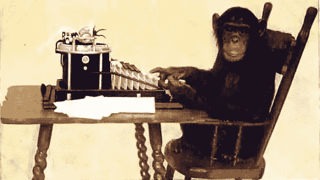
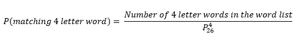
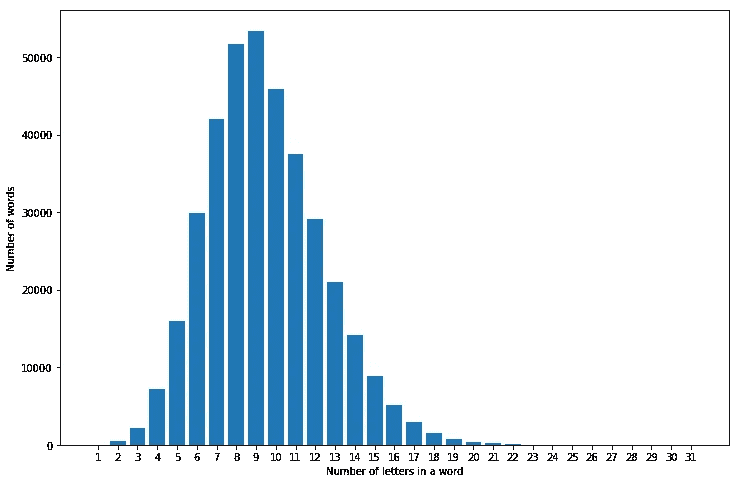
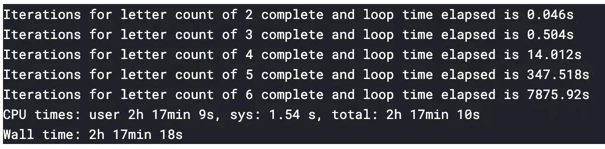
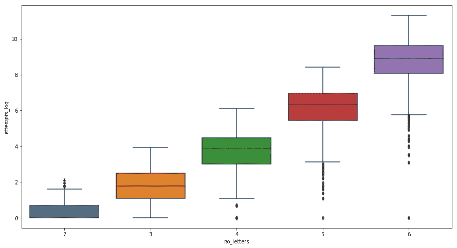
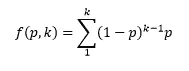

# 无限猴子定理

> 原文：<https://medium.com/analytics-vidhya/the-infinite-monkey-theorem-4a56dd0015e3?source=collection_archive---------3----------------------->



[https://en . Wikipedia . org/wiki/Infinite _ monkey _ theory _ in _ popular _ culture](https://en.wikipedia.org/wiki/Infinite_monkey_theorem_in_popular_culture)

几天前，我从朋友那里知道了什么是“无限猴子定理”。

互联网上是怎么说的:

> 无限猴子定理指出，一只猴子在打字机键盘上随机敲击键盘无限长时间，几乎肯定会打出给定的文本，如威廉·莎士比亚全集。

我很好奇。在我一头扎进万维网和它成千上万的观点之前，我想在某种程度上测试一下。

## 数学

好吧，让我们来谈谈最基本的。说猴子在英文键盘上打字。暂时忽略标点符号键或数字键(但不要忽略空格键)。

现代英语字母表中有 26 个字母。这些不同长度的字母组成了英语单词。根据我在这个测试中使用的单词列表，有 7186 个四个字母的单词。如果打字的猴子随机敲击键盘上的四个键，那么它是这个列表中匹配的四个字母单词的概率是多少？



它是单词表中 4 个字母单词的总数除以从 26 个字母中抽取的 4 个字母排列的总数。

这个概率结果是 7186/(26！/22!) = 0.02.如果猴子随机敲击四个键，它有 2%的机会造出一个有意义的四个字母的单词。

## 探索和编写脚本

我在[这里](https://github.com/dwyl/english-words)的一个文本文件里找到了一个英文单词列表。我不确定它是否和英语词典中的单词列表一样好，但是它符合这个测试的目的。要用的文件是 *words_alpha.txt* 。在将所有的单词加载到一个列表中后，我根据每个单词的字母数将它们分开。

```
word_counts = {}
for i in range(1,max_len+1):
    word_counts[i] = []
for i in range(len(words)):
    for key in word_counts.keys():
    if len(words[i]) == key:
        word_counts[key].append(words[i])
```

你有没有想过不同字母数的单词分布？它看起来是这样的:



下一步是随机生成给定字符长度的字母序列。你说用 4 个字符生成一个序列，你得到 4 个字符的输出。一个函数会一直从字母表中随机选择字母，直到达到字符限制(输入)。

```
def generate_string(n, max_len=max_len):
    word = []
    if n <= max_len:
        for i in range(n):
            word.append(word_counts[1][np.random.randint(0, len(word_counts[1]))])
            #word_counts[1] holds the alphabet
    else:
        print("Letter count exceeds")
    return ''.join(word)
```

*   **上面的 max_len** 是从网上取来的单词列表中一个单词的最多字符数。是 31！
*   有 31 个字母的单词是:*二氯二苯三氯乙烷*

如你所见，生成的随机序列不是一个单词。要找到匹配的单词需要一些试验。为了实现这一点，我一直在生成字符串，直到找到匹配为止。

```
def generate_word(word_list, n):
    gen_word = ''
    count = 0
    while gen_word not in word_list:
        gen_word = generate_string(n)
        count += 1
    return gen_word, count
```

这是一个有趣的练习。两个、三个或四个字母的单词似乎很容易预测。上面的直方图指出，字数随着字符长度的增加而增加，直到 9 个字符，然后下降。这种下降并没有真正增加匹配随机字符串的概率；一个词的字符越多，概率越低。

这里有一个例子:

```
In [11]:
s = generate_word(four_letter_words, 4)
print(s[0])
print("Number of attempts: {}".format(s[1]))Out [11]:
girl
Number of attempts: 23
```

在这里，我试图记录寻找第一个匹配的尝试次数。我想这有点像网上约会。我对 2、3、4、5 和 6 个字母单词分别做了 1000 次，并记录了第一次成功匹配的尝试次数。

```
%%time
attempts = {}
for i in range(2,7):
    start = timeit.default_timer()
    attempts[i] = []
    for j in range(1000):
        s = generate_word(word_counts[i], i)
        attempts[i].append(s[1])
    stop = timeit.default_timer()
    print("Iterations for letter count of {} complete and loop time elapsed is {}s".format(i, round((stop-start),3)))
```



看看计算时间(对于我能负担的计算能力)。**您可以看到，生成第一个匹配的时间随着字符长度呈指数增长。**

对于不同的字符长度，平均需要尝试多少次才能找到成功的单词匹配？“尝试次数”轴是对数轴。



**随着字符长度的增加，尝试生成匹配单词的次数也会增加。**

猴子可以用 RNN，对不对？现在是 2019 年，但它仍然是一只猴子，因此继续以随机键盘敲击的蛮力创作莎士比亚的作品。

既然我们已经看到了部分迭代的作用，那么是时候将更多的数学知识带入图片中了。我们知道成功的概率，但为了准确，我们必须考虑达到成功匹配所需的迭代次数。

为此，我们使用几何概率分布。假设本周每天下雨的可能性为 20%。从现在起整整三天后可能下雨的概率是 0.8 * 0.8 * 0.2。这就是原则。



在 scipy.stats.geom 的帮助下实现它。在这里，成功确实意味着找到匹配的单词，因此最终的概率只是总和，而不是从 1 中减去。

```
def calc_permutations(l, n=26):
    return factorial(n)/factorial(n-l)def calc_probability(nl, npl):
    return nl/npldef prob_success(k, l):
    p = calc_probability(len(word_counts[l]), calc_permutations(l))
    total = 0
    for i in range(k):
        total += geom.pmf(k, p)
    return total
```

## 存在还是毁灭

现在，为了将所有这些联系在一起，我将尝试估计生成与这一小节的标题完全相同的序列的概率:*“生存还是毁灭”*下面的函数将完成这一任务。

```
def generate_sentence_by_word(string):
    sentence = string.split()
    print("Sentence array: {}".format(sentence))
    letter_count = [len(w) for w in sentence]
    print("Letter count array: {}".format(letter_count))
    generated_sentence = []
    sentence_attempts = []
    success_probs = []
    for i in range(len(letter_count)):
        s = generate_word([sentence[i]], letter_count[i])
        if s[0] == sentence[i]:
            generated_sentence.append(s[0])
            sentence_attempts.append(s[1])
            success_probs.append(prob_success(s[1], letter_count[i]))
            print("Generated word {} in {} attempts".format(s[0], s[1]))
    print("Generation complete: {}".format(" ".join(generated_sentence)))
    return generated_sentence, sentence_attempts, success_probs
```

假设运行这个只需要 5 秒钟，想象一下一只半机械人猴子每秒钟可以打 8000 个单词。你可能已经发现了——上面的函数有点小问题。它得到一个单词匹配，然后继续下一个。这个定理没有说明这一点。为了遵守这个定理，生成的字母序列(带空格)必须按照这个顺序与莎士比亚的作品完全匹配。

即使对于上面生成的序列，让我们假设您给猴子一个逐字匹配的机会。即使这样，得到正确序列的概率也只有 10^-12 量级。那真的很小。这么小。

```
Generated word "to" in 314 attempts.
Generated word "be" in 170 attempts.
Generated word "or" in 2215 attempts.
Generated word "not" in 9605 attempts.
Generated word "to" in 125 attempts.
Generated word "be" in 494 attempts.
```

那好吧。

```
def generate_full_sentence(string):
    letter_count = [len(w) for w in string.split()]
    print("Letter count array: {}".format(letter_count))
    generated_sentence = []
    count = 0
    while " ".join(generated_sentence) != string:
        for i in range(len(letter_count)):
            generated_sentence.append(generate_string(letter_count[i]))
        count += 1
        if count%10000 == 0:
            print("Trial no {}".format(count))
    return generated_sentence, count
```

这让我的电脑死机了好几次！所以我从 Google Cloud 剥离了一个增强的虚拟机，有 8 个 CPU 和 52GB 内存。

```
Sentence array: ['to', 'be', 'or', 'not', 'to', 'be']
Letter count array: [2, 2, 2, 3, 2, 2]
Trial no 10000
Trial no 20000
Trial no 30000
.
.
.
Trial no 710000
Trial no 720000
.
.
Trial no 1000000
```

在这一点上，它已经运行了大约两天，我杀了它。在一百万次尝试后，没有运气产生完全相同的序列，“*成为或不成为*”。

所以我认为，一只猴子真的需要无限长的时间才能创作出一幅莎士比亚的作品。似乎有争议的是复制完全相同的作品的想法——这很难理解，但数学是成立的！