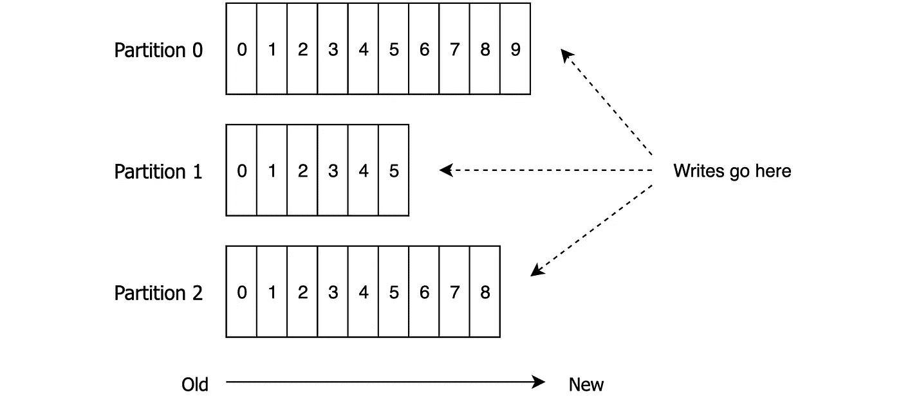
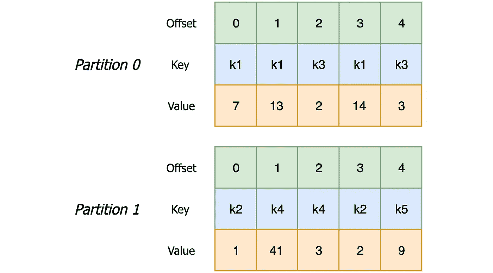
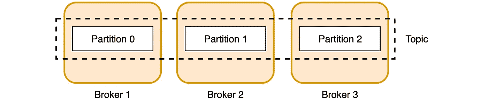
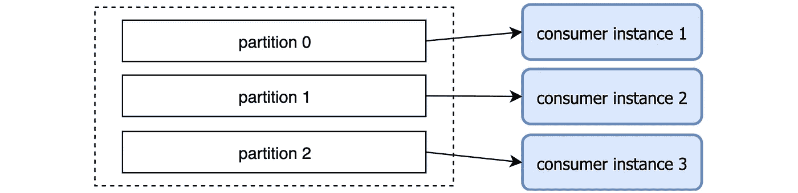
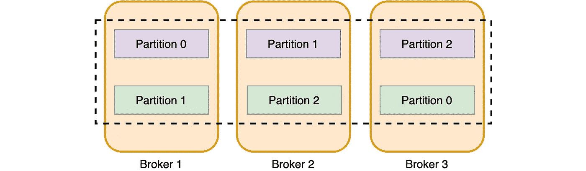

# 卡夫卡主题和分区介绍

> 原文：<https://medium.com/analytics-vidhya/the-introduction-to-kafka-topics-and-partitions-ec97dd7ecfbe?source=collection_archive---------5----------------------->

阿帕奇卡夫卡中有几样东西和主题一样重要。当你试图遵循任何关于如何使用卡夫卡的教程时，你会立即遇到这种情况。所以让我们看看…

# 阿帕奇卡夫卡中的一个话题是什么？

卡夫卡的信息是按主题组织的。主题是消息生产者和消费者之间的命名逻辑通道。该名称通常用于描述主题包含的数据。

一个主题的例子可能是一个包含来自建筑物内所有温度传感器的读数的主题，称为*‘温度读数’*，或者一个包含来自公司停车场的车辆的 GPS 位置的主题，称为*‘车辆位置’*。

生产者向主题中写入消息，消费者从主题中读取消息。这样我们就把它们解耦了，因为生产者可以向主题写消息，而不需要等待消费者。然后，消费者可以按照自己的节奏使用消息。这就是所谓的发布-订阅模式。

# 卡夫卡唱片

在卡夫卡的行话中，信息被称为**记录**。每个记录由一个键和值组成，其中键不是必需的。

记录的键用于记录分区，但是我们很快就会谈到这一点。

记录的值将包含您要发送给消费者的数据。在我们的*温度读数*主题中，一个值可能是一个 JSON 对象，包含传感器 id、温度值和读数的时间戳。在我们的 *vehicle_location* 主题中，该值可能是一个二进制对象，包含车辆 id、当前纬度和经度以及发送位置的时间。

# 记录的保留

Kafka 区别于其他消息系统的一点是，记录一旦被消费就不会从主题中删除。这允许多个消费者消费相同的记录，也允许相同的消费者一次又一次地读取记录。

"那么，记录什么时候从主题中移除？"你可能会问。经过一段时间后，它们会被移除。默认情况下，Kafka 会将主题中的记录保留 7 天。可以按主题配置保留时间。

# 划分

一个主题将有一个或多个分区。分区是一种非常简单的数据结构。它是只追加的记录序列，完全按照追加时间排序。

让我们打开包装。如果我们说分区从左边开始，那么新记录将总是被添加到最后一个记录的右边。在上面的例子中，一条新记录将被添加到第四条记录之后。这允许消费者按照产生记录的顺序读取记录(在我们的例子中，从左到右)。

*仅追加*表示记录一旦写入就不能修改。

结构化提交日志的概念与应用程序日志并无二致。新的一行总是被附加在文件的末尾，并且一旦一行被写入日志，它就不能被改变。

一旦记录被写入一个分区，它就会被分配一个**偏移量**——一个顺序 id，显示该记录在分区中的位置，并在分区中唯一地标识该记录。

当我们将所有这些放在一起时，主题看起来像这样:

具有 3 个分区的主题剖析

这里有一些事情需要记住:

*   记录总是被添加到分区的末尾。这意味着，在同一个分区中，偏移量越小的记录越老
*   偏移(和记录的顺序)只在分区内有意义
*   由生产者发送到特定主题分区的消息将按照它们被发送的顺序被附加
*   使用者实例按照记录在分区中的存储顺序查看记录
*   具有相同键的记录将总是出现在相同的分区中(下一节将详细介绍)

# 记录和分区之间的链接

正如我在关于 Kafka 记录的部分中提到的，密钥用于分区。默认情况下，Kafka producer 依靠记录的键来决定将记录写入哪个分区。对于具有相同键的两个记录，生成器将总是选择相同的分区。

为什么这很重要？

有时，我们需要按照唱片制作的顺序将唱片交付给消费者。例如，当客户从您的网上商店购买了一本电子书，然后取消了购买，您希望这些事件按照它们被创建的顺序到达。如果您在购买事件之前收到取消事件，取消将被视为无效而拒绝(因为该购买在系统中尚不存在)，然后系统将注册购买，将产品交付给客户(并让您赔钱)。

因此，要解决这个问题并确保排序，您可以使用一个客户 id 作为这些 Kafka 记录的键。这将确保给定客户的所有购买事件都在同一个分区中结束。

如何根据键将记录分布到分区

因此，具有相同键的记录会出现在相同的分区中。但是请注意，一个分区可以包含具有多个键的记录，所以您不需要为分区的数量而疯狂:)。

上面你可以看到一个有两个分区的主题的例子。记录的键是字符串类型，而记录的值是整数类型。在这个例子中，您会注意到所有带有 k1 和 k3 键的记录是如何被写入分区 0 的，而带有 k2、k4 和 k5 键的记录被发送到分区 1。

# 当记录键为空时会发生什么？

正如我之前提到的，在创建 Kafka 记录时，指定一个键并不是强制性的。如果键为空，生产者将以循环方式选择一个分区。所以，如果你不需要订购唱片，你就不需要把钥匙放在卡夫卡的唱片里。

# 好吧，但是我们为什么需要分区呢？

在卡夫卡那里，分割有几个目的。

从 Kafka broker 的角度来看，分区允许单个主题分布在多个服务器上。这样，在一个主题中可以存储比单个服务器所能容纳的更多的数据。如果您设想您需要在一个主题中存储 10TB 的数据，并且您有 3 个代理，一种选择是创建一个带有一个分区的主题，并将所有 10TB 的数据存储在一个代理上。另一种选择是创建一个包含 3 个分区的主题，并将 10 TB 的数据分布在所有代理上。

跨代理的主题分区

从消费者的角度来看，分区是一个并行单元。

怎么样，现在？

这里有一个例子来解释这一点:假设一个制片人每秒钟向我们前面提到的主题 *vehicle_location* 发送 2000 条记录。现在，假设我们有一个微服务在消耗数据，它正在对每条消息进行大量计算，每秒只能处理 1.000 条消息。

在这种情况下，我们的消费者将不断落后，永远无法赶上生产者。那么，我们如何解决这个问题呢？

我们可以创建一个包含 3 个分区的主题。这样，我们在每个分区上每秒可以收到大约 700 条消息。然后，我们将启动 3 个消费者微服务实例，每个实例从一个分区中读取数据。

作为并行单元的分区

现在，每个消费者实例每秒处理 700 条消息，所有实例加在一起很容易跟上生产者。当我们说一个分区是一个并行单元时，这就是我们的意思:一个主题拥有的分区越多，可以并行完成的处理就越多。如何做到这一点是另一篇文章的主题。现在，理解分区如何帮助就足够了。

# 主题复制

卡夫卡是一个分布式的容错系统。实现这一点的方法之一是跨代理复制数据。当我们创建一个主题时，我们需要指定的事情之一是一个*复制因子*。这告诉 Kafka 它应该跨代理复制分区的次数，以避免在停机时数据丢失。请注意，复制因子不能大于代理的数量，否则，您分发的数据不会像将数据复制到同一硬盘上的另一个位置那样多🙂

复制因子为 2 的主题

下面是一个主题示例，它有三个分区，复制因子为 2(意味着每个分区都是重复的)。这显示了分区(紫色)及其副本(绿色)在代理之间的可能分布。Kafka 将确保相同的分区永远不会出现在同一个代理上。这是考虑到服务器停机而不丢失数据所必需的。

此外，Kafka 保证“对于复制因子为 N 的主题，它将容忍多达 N-1 个服务器故障，而不会丢失提交给日志的任何记录”。因此，在我们的复制因子为 2 的示例中，我们可能会失去任何一个代理，但我们仍然拥有所有可用于读写的分区。

# 分区领导者和追随者

对于每个分区，将有一个代理是该分区的**领导者**。在我们的例子中，紫色分区的代理是该分区的领导者。其他经纪人将成为**的追随者**(绿色分区)。因此，在上面的例子中，代理 1 是分区 0 的领导者，是分区 1 的跟随者。

所有的读写都指向一个分区领导者，而从者只是复制数据以与领导者保持同步。与领导者同步的追随者被称为**同步复制品** (ISR)。如果分区的领导者离线，一个同步副本将被选为新领导者，所有生产者和消费者将开始与新领导者对话。

这就是卡夫卡主题和分区的基础。如果理解这些概念需要一些时间，也不用担心。如果需要的话，你可以随意将这篇文章加入书签，稍后再回来阅读。

如果你喜欢这篇文章，别忘了分享！

# 你想了解更多关于卡夫卡的知识吗？

我创建了一个卡夫卡迷你课程，你可以完全免费获得**。[在编码港](https://codingharbour.com/)报名。**

***原载于*[*https://codingharbour.com*](https://codingharbour.com/apache-kafka/the-introduction-to-kafka-topics-and-partitions/)*。***