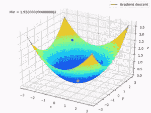

# 深度学习背后的直觉

> 原文：<https://medium.com/analytics-vidhya/the-intuition-behind-deep-learning-7c884b54ee5e?source=collection_archive---------30----------------------->

你好，世界！！！这是 ***数据科学教程*** 中的另一篇文章。我很高兴在这里欢迎你。写这篇文章的主要意图是解释数据科学中的核心概念。阅读这篇文章也会激发你学习更多关于数据科学的知识。

**在这篇文章中，我将解释深度学习背后的核心概念。**

人脑是这个世界上最伟大的工具。人类大脑的力量是难以置信的，它像魔术一样工作。大脑是一切事物的全部创造力和创新背后的基础。它可以处理很多复杂的事情。但是我们如何管理人脑无法处理的任务呢？我们需要像人脑一样强大的东西。

我们已经知道，许多机器做复杂而困难的事情，而人却做不到。 ***那么我们可以把人脑和机器结合起来吗？*** 这就是深度学习概念的来源，并发挥着重要作用。让我解释一下这背后的想法。

# 什么是深度学习？

深度学习是机器学习的一个子领域。(如果你对机器学习感兴趣，可以看看我的文章《迄今为止的机器学习之旅》)。深度学习的目的是“ ***模仿人脑如何工作*** ”。基本上在深度学习中，我们将 ***在机器中重建人脑架构。***

# 什么是感知器？它是如何工作的？

# 神经元

它没有眼睛的头部是神经元。它通过周围被称为树突的触角和被称为轴突的尾巴与其他神经元相连。通过这些电流，电信号形成了我们对周围世界的感知。它有树突，树突是输入信号的接收器，然后这些输入信号相加并转化为胞体内的输出信号。最后，这些信号通过轴突传递给其他神经元。类似地,“感知器”接收多个输入，这些输入在单元体内相加，然后应用各种变换和函数。然后通过轴突，它提供一个输出。对于“感知器”来说，还可以有一个称为**偏差**的输入。虽然重量决定了分类器线的**斜率**，但偏差允许我们向左或向右移动线。

为了简单起见，

*   树突:信号的接收器
*   轴突:信号的传递者

先说神经元内部的过程。下面显示了我们案例中神经元的简单版本。

它是如何工作的？

左侧的输入(树突)代表传入中间主神经元的信号。在人类神经元中，这些包括嗅觉和触觉。在我们的神经网络中，这些输入是独立变量。它们沿着突触向下传播，穿过绿色的大圆圈，然后从另一端作为输出值出现。

信息进入输入层，然后这些信号到达神经元。然后神经元被激活。现在，神经元发生了什么，神经元是如何被激活的？我们来讨论一下这个。

首先，在神经元内部

1.  **将每个权重和输入变量的乘积相加**

然后，

**2。对第一步**的结果应用激活功能

# 有哪些激活功能？

现在是时候了解“激活功能”了。激活功能将输入转化为输出。激活函数通过计算加权和并进一步加上偏差来决定神经元是否应该被激活。这些函数的目的是将非线性引入神经元的输出。下面提到的一些激活功能。

1.  阈函数

这是一个非黑即白的二元函数。

2.Sigmoid 函数

我们使用 sigmoid 函数是因为它存在于 **(0 到 1)之间。**因此，它特别适用于我们必须**预测概率**作为输出的模型。既然任何事情的概率只存在于 **0 到 1 的范围内，** sigmoid 就是正确的选择。

3.整流器功能

ReLU(整流线性单元)是目前世界上使用最多的激活功能。因为它几乎用于所有网络。

4.双曲线函数

tanh 也像逻辑 s 形但更好。tanh 函数的范围是从(-1 到 1)。tanh 也是 s 形的(s 形)。

# 成本\损失函数

现在我们来谈谈神经网络中的成本/损失函数。成本函数是神经网络相对于给定训练样本和预期输出的准确度的度量。在深度学习中，目标是最小化成本函数。为此，我们使用梯度下降的概念。

# 什么是梯度下降？

[梯度下降](https://en.wikipedia.org/wiki/Gradient_descent)是一种优化算法，用于通过沿梯度负值定义的最陡下降方向迭代移动来最小化某个函数。

*   **随机梯度下降:**仅使用单个训练样本计算梯度并更新参数。
*   **批量梯度下降:**计算整个数据集的梯度，每次迭代只执行一次更新。
*   **小批量梯度下降:**小批量梯度是随机梯度下降的变体，其中使用小批量样本而不是单个训练样本。这是最流行的优化算法之一。

# 深度学习中的前向传播和反向传播是如何工作的？

让我用几个简单的步骤来解释一下。

1.  首先，将权重随机初始化为接近 0 的小数值。(因为均匀分布处理这个)
2.  在输入图层中输入数据集的第一个观测值，每个要素代表一个输入结点。
3.  **正向传播:**从左到右，神经元按照它们的激活函数和权重被激活。然后传播激活，直到得到预测的结果。
4.  将预测结果与相应的实际结果进行比较，并测量产生的误差。
5.  **反向传播:**从右到左，误差反向传播。然后根据它们对误差的影响程度来更新权重。
6.  重复步骤 1 至 5，并在每次观察后更新权重(随机梯度下降)，或者重复步骤 1 至 5，但在一批观察后更新权重(批量梯度下降)。
7.  当整个训练集通过神经网络时，就产生了一个新纪元。重做更多的纪元。

# 深度学习算法及其应用有哪些？

我想和大家分享一些常用的深度学习算法及其应用。深度学习也有像机器学习一样的有监督和无监督的算法。他们是，

***监督式深度学习算法***

1.  人工神经网络(ANN)——回归和分类
2.  卷积神经网络(CNN) —计算机视觉
3.  递归神经网络(RNN) —时间序列分析

***无监督深度学习算法***

1.  自组织地图-特征检测
2.  深度玻尔兹曼机器—推荐系统
3.  自动编码器-推荐系统

在深入挖掘深度学习概念之前，对大脑有一个简要的了解是很重要的。

# 对人类大脑的快速观察

深度学习背后的整个概念是试图模仿人脑，获得与人脑类似的功能，并利用进化已经为我们开发的东西。因此，让我们看看人类的大脑，看看这一切是否有意义。那么，让我们来看看。这里我们有大脑。

人脑有三个部分。所以，我们有**大脑**，它是这个彩色部分的全部。然后我们有在那里下面的**小脑**，那是小小的大脑。大脑中有数百万个神经元。
然后我们在那里有**脑干**(围绕脊髓)，它连接大脑和器官以及我们的胳膊和腿等等。这是大脑的三个主要部分。

大脑有四个脑叶，它们在这里被着色。所以，它有**额叶**、**颞叶**、**顶叶**，还有**枕叶**。现在，我们如何连接这些组件？

嗯，ANN 是深度学习的开始，它们代表长期记忆。所以，我们必须把它们放在颞叶，因为颞叶负责长期记忆。**人工神经网络可以通过先前的经验或先前的冲动，以及先前的观察来学习，这非常有价值。**

大脑非常复杂，当然，其他部分也负责记忆，但我们将简化事情，说 ANN 就像颞叶。然后， **CNN** 就简单多了，是视觉，**对图像和物体的识别**等等，所以那是**枕叶。**

RNNs 怎么样？你会发现 RNN 就像短期记忆。他们可以记住在之前的几次观察中发生的事情，并将这些知识应用到未来。所以，那就是**额叶**。那里有很多短期记忆，当然还有额叶，比如快速崩溃。额叶还负责个性、行为、运动皮层、工作记忆和许多其他事情。但是就我们的目的而言，我们主要寻找的是短暂的记忆。

# 神经网络的结果是什么？

现在我们来谈谈神经网络的结果(y)。

它们可以是:

*   连续的(例如:价格)
*   二进制(例如:是或否)
*   绝对的。

# 最后的想法！！！

在本文中，我们讨论了深度学习的核心概念，并确定了神经网络中的主要组件。然后，我们将深度学习算法与大脑部分进行了映射，因为这是所有深度学习结构创建的方式。所以我想现在你对深度学习有了基本的概念。在以后的文章中，我将深入讨论监督深度学习算法。

下次见。

在那之前享受深度学习吧！