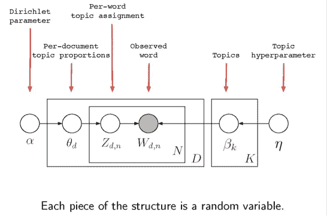
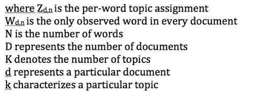
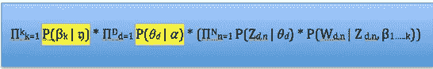
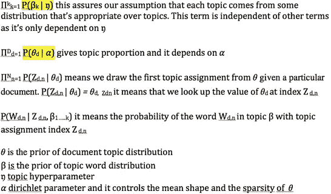
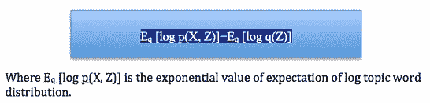
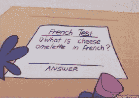
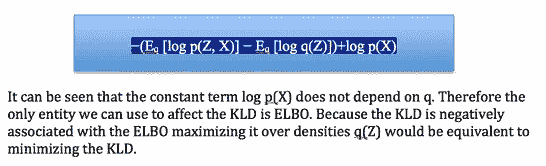
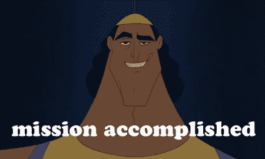

# 潜在狄利克雷分配背后的直觉

> 原文：<https://medium.com/analytics-vidhya/the-intuition-behind-latent-dirichlet-allocation-lda-fb1e1fb01543?source=collection_archive---------10----------------------->

## 知道如何理解 LDA 的假设

我知道 LDA 用于主题建模，也知道我必须如何接收文本数据以及我可以预期的结果。但我不明白的是，哪一个数学部分负责寻找潜在或未知的主题，并且非常有兴趣了解达成模型以拟合数据的逻辑，发现潜在主题涉及的其他逻辑步骤，以及用于优化解决方案的算法。

关于这个话题，我已知的未知有很多，所以我决定写一篇文章来澄清其中的一些。在浏览了研究论文、视频和其他信息来源后，我对主题是如何被发现的有了理解，我愿意与像你一样的其他机器学习爱好者分享。

当我们进行以下技术测试时，请耐心等待；会值得的！

我的问题是:

什么是狄利克雷，为什么在 LDA 中使用狄利克雷？

模型中的不同变量代表什么？

**什么是狄利克雷？**

原来狄利克雷分布是贝塔分布扩展到多维的推广。什么是贝塔分布？它是随机变量的单变量分布，范围为 0 到 1，参数为α和β。β也是概率为 p 的二项分布的共轭先验，那么 p 的后验分布也是β分布，参数为 alpha_dash=alpha+成功次数，beta_dash= beta+失败次数。同样，当我们假设一个狄利克雷分布作为先验时，在 LDA 的情况下，后验分布也将是狄利克雷分布。

**为什么在 LDA 中使用 Dirichlet？**

多项式分布是二项式分布的推广，它模拟 n 次试验的结果，其中每次试验的结果都有一个分类分布。并且它适合于 LDA 为不同文档的结果建模的当前环境，其中每个文档的结果具有不同的主题。在 LDA 中，我们希望每个文档的主题混合比例从某种分布中提取，最好是从概率分布中提取，这样它的总和就是 1。所以在目前的情况下，我们想要概率的概率。因此，我们希望对多项式进行先验分布。我们选择狄利克雷，因为它是多项式分布的共轭先验。如果我们的似然是一个具有狄利克雷先验的多项式，那么后验也是如上所述的狄利克雷。

**算法问题**

我们主要对解决第一个问题感兴趣:

1.生成隐藏的潜在主题结构的术语的分布或主题是什么？

此外，我们还可能有兴趣回答以下问题:

2.对于每个主题:在这些假设下生成文档的主题是什么？

3.对于每个文档:与该文档相关联的主题的分布情况如何？

4.对于每个单词:哪个主题产生了每个单词？

**模型和假设**

在回答我之前没有回答的第二个问题之前，理解模型和整个概念背后的假设是相当重要的:模型中的不同变量代表什么？

让我们先来看看这个模型:

LDA 的概念很吸引人，因为我们开始计算后验概率，以找到隐藏的主题结构，但在一种反直觉的风格中，我们认为如果这些隐藏的变量被观察到，我们将如何建模和处理。我们假设一个生成概率模型来拟合数据，并尝试使用给定观察值的后验推断来推断隐藏变量的条件分布。然后，我们将会发现隐藏的主题结构的文件，我们没有获得。

我们首先假设一个文档展示了多个主题，并且每个文档都是一个语料库范围内的主题的混合。我们还隐含地假设文档中的单词不遵循任何顺序。现实中并不是这样，因为文档没有意义。但是它对我们的目标起作用。我们可以这样想，比如说，如果我们有几个随机的词:摇摆，尾巴，忠诚，朋友，动物，家养的，那么我们就能算出这些词代表了狗的整体。

因此，我们遵循一个生成过程，并理解它不必精确地描述文档是如何产生的，因为它只需要有意义来实现我们的目标，即推断出后验。

其他值得注意的假设是:

*   每个文档都是通过选择一些主题比例来实现的
*   每个单词都来自其中一个主题
*   每一个题目都包含了每一个单词的概率。例如，单词 tiger 在野生动物和高尔夫话题中出现的概率都很高。同时，这个词在股票交易话题中出现的概率可能很低。

**模型中的不同变量代表什么？**

为了理解上一节中提到的不同变量和不同假设，让我们详细讨论观察到的和隐藏的随机变量的联合分布的以下公式:

用黄色标记的项目来自狄利克雷分布。

**LDA 的后验推断**

它被用于许多应用中，如信息检索、协作过滤、文档相似性和可视化跨学科文档。在这篇文章中，我们将看到如何变分贝叶斯(将被称为 VB)方法是用来推断棘手的后验分布。理解 VB 方法是相当重要的，因为它推断后验分布部分，也携带关于隐藏变量的信息增益。

有两类推理方法:精确推理和近似推理算法。精确推理算法包括强力推理，近似推理算法包括循环信念传播。循环信念传播的关键思想是在循环图或非树上引入消息传递。变分推理就是这样一种近似推理算法，我们将看到用 VB 方法来实现变分推理。

VB 的思想如下:

*   我们在潜在变量上选择一个分布族，它有自己的一组参数
*   然后选择一个最接近后验分布的近似分布(我们称之为近似分布 q)
*   接下来，找到 q 的参数设置
*   我们在 q 的密度上优化算法以找到最佳近似
*   最后，我们可以用拟合参数的近似分布 q 代替后验分布

现在我们已经打开了宝盒，我们可以使用 q 来研究隐藏变量的后验分布，这就是我们如何能够在主题建模用例中找到隐藏的主题。需要注意的一点是，该过程并不提供主题名称，而是将相关的单词和它们相关的概率值组合在一起。通过对相关术语进行分组，揭示了隐藏的主题结构。

**推理问题**

计算后验分布被称为推理问题，它有两个方面:

1.我们必须找出一种方法来计算边际可能性，因为它将进一步包括在计算我们的主要目标，后验分布。

2.来找出棘手的后验分布。

为了用 VB 方法实现推理，了解什么是 Kullback-Leibler 散度(将称为 KLD)是有意义的。为什么？

好吧，回想一下，我们手头有两个分布:

*   通过将 LDA 模型拟合到我们的数据，我们假设的生成概率分布
*   我们期望从 LDA 得到的真实后验分布的近似分布(q)

我们的目标是得到最接近真实后验分布的近似分布，这样我们就可以更多地了解后验。KLD 是一种广泛用于计算两个分布接近程度的方法。还不要累，因为它会变得有趣！我们必须最小化 KLD，以便更接近真实的后验。

但是事实证明我们实际上不能最小化这个量，所以我们通过詹森不等式假设一个凹函数(我知道没错！)并添加一个常数。该函数被称为证据下限(简称 ELBO)。回想一下,“证据”是一个术语，用于观察的边际可能性(或其对数)。假设 X 为观察变量，Z 为隐藏变量，ELBO 可以写成:

测验时间到了；准备好了吗？

问题:你在上面的等式中看到的第二个期望项是什么？

提示:该术语是一种信息度量，它只考虑观察到特定事件的概率，因此它封装的信息是关于潜在概率分布的信息。

而答案是:**熵**

从近似推理算法中消息传递的思想来理解熵的包含是相当清楚的。

我们可以证明 KLD 等于负的 ELBO 加上一个常数，如下所示:

**最后，优化**

我们使用优化算法用它的参数迭代地更新 q。Sklearn 使用期望最大化(EM)算法。E-step 通过最小化到 p(α和β固定)的 KL-散度(我们已经看到这是如何实现的)来估计 q 中的变分参数γ和φ。M 步使γ和φ固定的对数似然的下限最大化(在α和β上)。ELBO 收敛到局部最小值，从而允许我们使用得到的 q 作为真实后验概率的代理。

**参考**

[http://www.jmlr.org/papers/volume3/blei03a/blei03a.pdf](http://www.jmlr.org/papers/volume3/blei03a/blei03a.pdf)

[https://www.seas.upenn.edu/~cis520/lectures/LDA.pdf](https://www.seas.upenn.edu/~cis520/lectures/LDA.pdf)

[https://www . cs . CMU . edu/~ epxing/Class/1070815/notes/10708 _ scribe _ lecture 13 . pdf](https://www.cs.cmu.edu/~epxing/Class/1070815/notes/10708_scribe_lecture13.pdf)

[http://users . umi ACS . UMD . edu/~ xyang 35/files/understanding-variable-lower . pdf](http://users.umiacs.umd.edu/~xyang35/files/understanding-variational-lower.pdf)

[https://stats . stack exchange . com/questions/193465/what-the-gradient-log-normalizer](https://stats.stackexchange.com/questions/193465/what-is-the-gradient-log-normalizer)

​

​

​

​

​