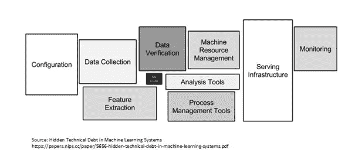
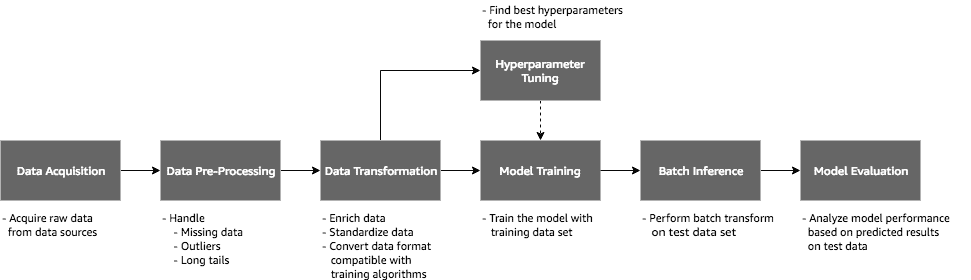

# 从开发到生产的旅程第 1 部分:用“正确的方法”构建

> 原文：<https://medium.com/analytics-vidhya/the-journey-from-development-to-production-part-1-building-with-the-right-approach-4ad5f67ce0de?source=collection_archive---------9----------------------->

## 这是一个关于如何快速开发 ML 系统的系列，也是最大化生产准备的系列。这将是一个三部分系列。

# 为什么是这个系列？

构建一个 ML 系统/应用不仅仅是开发一个“伟大”的模型，它只是很小的一部分。上图很好的解释了这一点。尽管我强烈建议你阅读这篇文章，但我还是避免了解释它的诱惑。

所以回到问题。“伟大的”ML 系统/应用不一定是“伟大的模型”，而是“良好的支持生态系统”。如果支持生态系统也是好的，那么即使一个平庸的表演模型也可以转变成一个好的系统。因此，在这个过程中，我们将讨论如何建立这样一个生态系统。

# 第一部分:用“正确的方法”建造

## 让我们谈谈所谓的“正确的方法”，好吗？

在继续之前，我建议你浏览一下杰瑞米·霍华德的这篇文章

**我们将讨论两个主要概念**

1.  *微服务*
2.  *包装*

# 微服务

微服务不需要介绍，因为它已经证明了它在遗留软件开发中的巨大潜力(尽管如果你不知道它，那么先简单了解一下)。

# 微服务架构优势

*   作为微服务构建的软件可以分解为多个组件服务，这样每个服务都可以独立部署和重新部署，而不会影响应用程序的完整性。这意味着微服务架构为开发人员提供了独立开发和部署服务的自由。
*   更好的故障隔离；如果一个微服务失败，其他微服务将继续工作。
*   微服务架构支持持续交付。
*   易于理解，因为它们代表一小部分功能，对于开发人员来说易于修改，因此它们可以帮助新的团队成员快速提高工作效率。
*   代码是围绕业务功能组织的。
*   可伸缩性、可重用性以及效率是它迄今为止最大的优势。
*   很好地使用容器，例如 Docker。
*   微服务简化了安全监控，因为应用程序的各个部分是隔离的。安全问题可能发生在一个部分，而不会影响到项目的其他部分。
*   增加组织内各个开发团队的自主性，因为想法可以被实现和部署，而不必与更广泛的 IT 交付功能协调。

这个列表还会继续下去，但是你一定已经明白了它的意思。

## 微服务将如何帮助 ML 开发？

所有上述观点在 ML 开发中都是有效的。

让我们讨论两个通用场景(这是我在公司看到的两个最常见的场景)

1.  **构建可重用的端到端管道:**

对任何开发人员来说，最糟糕的诅咒就是通过重写来复制某些东西。为什么使用必须要求重写而不是老派的*ctrl+c*&*ctrl+v .*所以如果旧代码是单片的，那么它可能与“其他定制的”或“特定的”过程紧密耦合，我们不能从中破坏一些东西&以*普通的形式使用它。*

请看下图，除了模型训练和超参数调整之外，所有其他流程都可以重复用于其他管道。所以通过隔离所有的进程&然后开发将使它们高度可移植&非常容易重用。

## 重要提示:

*   每一个流程或服务都必须是通用的和参数化的，否则它将违背微服务的宗旨。
*   例如，相对路径的使用，共同的一致性，共同的设计语言等等

通用 ML 管道

**2。协作:**

微服务有效实现协作。在一个由多个开发人员组成的团队中，我们可以将过程彼此分开和隔离，然后在有限的时间内设计它们。

例如，一个人从事训练逻辑，另一个人从事推理逻辑；多人在同一管道的多个流程上工作(如图所示)；可以有无限多的场景。

Git 是一个非常重要的工具，我将在下一部分介绍它。

# 包装

是微服务的直接应用。对于包装，我们可以像 docker 一样使用容器技术(如果你不使用 Docker，我会坚持把所有东西都放下&首先学习 Docker)。对我来说，Docker 是 2010 年代最重要的发明之一。包装和码头携手并进。

# 包装优势

*   **ROI:** 打包的本质是运行相同的应用程序需要更少的资源。Docker 允许工程团队规模更小，效率更高。
*   **标准化和生产效率:**包装容器确保多个开发和发布周期的一致性，标准化您的环境。打包提供了可重复的开发、构建、测试和生产环境。跨整个管道的标准化服务基础设施允许每个团队成员在生产对等环境中工作。
*   **CI 效率:**打包使您能够构建容器映像，并在部署过程的每个步骤中使用相同的映像。这样做的一个巨大好处是能够分离不相关的步骤并并行运行它们。从构建到生产的时间长度可以显著加快。
*   **兼容性和可维护性:**一劳永逸地消除“它在我的机器上工作”的问题。就 Docker 而言，奇偶校验意味着无论您的映像在哪个服务器或哪个笔记本电脑上运行，它们都是相同的。对于您的开发人员来说，这意味着花在设置环境、调试特定于环境的问题上的时间更少，并且代码库更易于移植和设置。奇偶校验还意味着您的生产基础设施将更加可靠，更易于维护。
*   **快速部署:** Docker 设法将部署时间减少到几秒钟。这是因为它为每个进程创建一个容器，而不是引导操作系统。数据可以被创建和销毁，而不用担心重新创建数据的成本会高于可承受的水平。
*   **多云平台:**Docker 最大的好处之一就是可移植性。所有主要的云计算提供商，如 AWS、GCP 等。接受 Docker 的可用性并增加个人支持。Docker 容器可以在任何云中运行。
*   **隔离:**打包确保您的应用程序和资源被隔离。Docker 确保每个容器都有自己的资源，这些资源与其他容器相隔离。您可以为运行完全不同堆栈的独立进程设置不同的容器。

除了这些好处，Docker 还确保每个应用程序只使用分配给它们的资源。某个特定的应用程序不会使用您所有的可用资源，这通常会导致其他应用程序的性能下降或完全停机。

因此，当我们将微服务和打包结合起来时，我们得到了高度可移植、模块化、可重用的代码。

我甚至为它准备了一句俏皮话:*打破它→打包它→继续前进。*

这是第一部分的结尾。在下一部分，我们将看到*项目治理*

 [## 从开发到生产的旅程第 2 部分:项目治理

### 项目治理&合规性是开发任何解决问题的 ML 系统中最重要的因素。在这里我将…

medium.com](/@desardaakash/the-journey-from-development-to-production-part-2-project-governance-822daf922b15) 

感谢[杰瑞米·霍华德](https://medium.com/u/34ab754f8c5e?source=post_page-----4ad5f67ce0de--------------------------------)牛逼的创业指南。