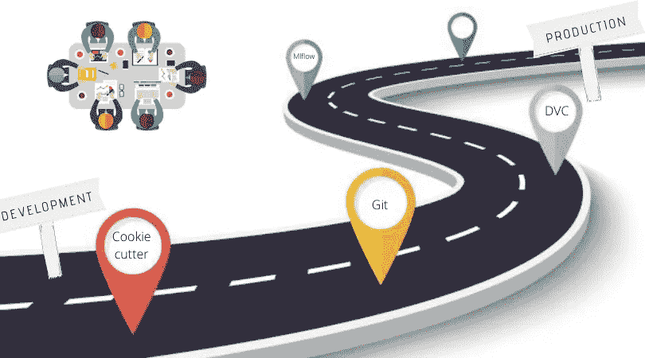
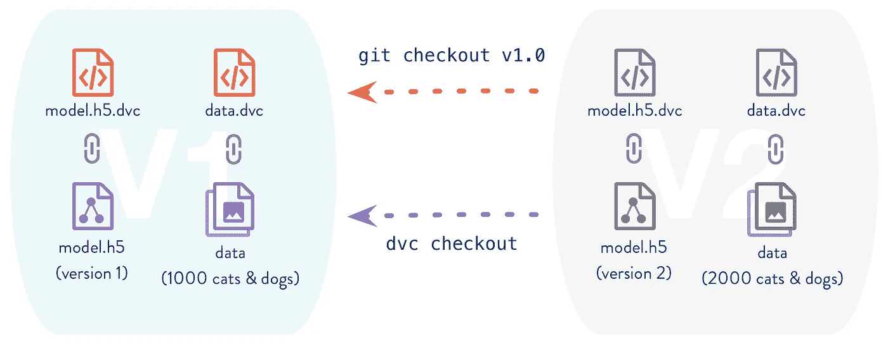

# 从开发到生产的旅程第 2 部分:项目治理

> 原文：<https://medium.com/analytics-vidhya/the-journey-from-development-to-production-part-2-project-governance-822daf922b15?source=collection_archive---------13----------------------->

## 项目治理&合规性是开发任何解决问题的 ML 系统中最重要的因素。在这里我将分享所有的 ToDos 和 FOSS 工具。



这是系列文章的第二部分 ***从开发到生产的旅程，*** 如果您还没有阅读第 1 部分，那么我强烈建议您先阅读它，因为它解释了在任何有效的项目治理中我们需要什么方法&头脑。

[](/@desardaakash/the-journey-from-development-to-production-part-1-building-with-the-right-approach-4ad5f67ce0de) [## 从开发到生产的旅程第 1 部分:用“正确的方法”构建

### 这是一个关于如何快速开发 ML 系统的系列，也是最大化生产准备的系列。这将是一个…

medium.com](/@desardaakash/the-journey-from-development-to-production-part-1-building-with-the-right-approach-4ad5f67ce0de) 

## 什么是项目治理？为什么它如此重要？这似乎太没技术含量了？

事实上，项目治理与技术无关，但是相信我，适应它会给任何 ML 项目带来巨大的收益。(我们都在我的工作中……:))

***项目治理是***

*   监督职能涵盖项目生命周期，为项目经理和团队提供管理和控制项目的结构、流程、决策模型和工具，同时确保项目的成功交付。这是一个至关重要的因素，尤其是对于复杂和高风险的项目。
*   它定义、记录并传达一致的项目实践，以提供控制项目并确保其成功的综合方法。它包含了一个项目决策的框架，定义了完成项目的角色、职责和责任，并控制了项目经理的效率。

它已经在其他领域证明了它的有效性，所以机器学习领域也不例外

## 如何适应有效的项目治理？

## 1.治理模式:

*   基于项目的范围、时间表、复杂性、风险、涉众和对组织的重要性，组织应该制定项目治理所需的关键元素的基线。
*   应该有一个主要的工具，它基于上面的一些指标来决定您的治理框架需要什么样的改变，以及哪些组件是强制性的。

## 2.问责制和责任:

*   定义责任和职责是项目经理的核心任务。问责和责任分配不当将对本组织的运作效力产生负面影响。
*   在定义这两个因素时，项目经理不仅需要定义谁负责，还需要定义谁负责、咨询和通知项目的每个可交付成果。

## 3.项目初始化:

*   合作中最可怕的陷阱之一是“困惑陷阱”。当每个人都有不同的项目结构时，就会出现这种情况。至少 30%的时间将被浪费在理解项目上，而不是实际的执行上。每个团队成员必须遵循相同的项目结构。
*   使用 [***Cookiecutter 数据科学***](https://drivendata.github.io/cookiecutter-data-science/) ***。*** 这是一个逻辑合理、标准化但灵活的项目结构，用于进行和共享数据科学工作。使用&非常简单，他们也有很好的文档。

```
# Install
pip install cookiecutter# Init is as simple as 
cookiecutter [https://github.com/drivendata/cookiecutter-data-science](https://github.com/drivendata/cookiecutter-data-science)
```

## 4.Git 运营与合规:

*   Git 是 21 世纪软件开发中最重要的创新。使用 Git (&任何遥控器，如 GitHub 或 GitLab 等)来跟踪你的项目。(*注意:我假设你理解 Git 或者对它有一个基本的概念，如果没有，那么请把所有的东西留在后面&学习它。*)
*   正如我在第 1 部分中提到的，Git 使我们能够轻松地适应微服务。

你可以有一个独立的分支，用于训练、推理和服务。这样每个团队成员都可以独立工作，但同时又可以合作


**应该遵循的一些最佳实践:**

*   每个人都必须指定:
    →git config[user . Name](http://user.name/)" Your Name "
    →git config user . email "[email@something.com](mailto:email@quantiphi.com)"
    →大型文件(如重量文件、大型 csv、图像等)不应包含在回购中。
    →主分支应始终无 bug 并准备运行。
    →每个变更或提交的记录应该是直观的。

**git 日志记录惯例:**
→每次提交都必须包含一些信息性消息。

*   编写 git 提交消息的约定:

→{流程逻辑/代码/文件夹结构重构/更改/(任何类似种类的主动消息)} <*不超过五个字* >对于{ class:class name/method:method method name/file }<*提及{branch}中的所有层级* >

***类似*** 的特例

*   **合并分支:**分支必须通过某种测试。

→编写 git 提交消息的惯例:{任何一个或两个主要逻辑的总结}

*   **解决问题:**{问题编号/问题名称}
    →提交消息不应超过 50 个字符(包括空格)
    →使用命令性语言

***号外:阅读这篇牛逼的*** [***博客***](https://chris.beams.io/posts/git-commit/) ***上写的有效提交消息。***

## 5.数据 VCS 使用 [DVC](http://pip install cookiecutter) :

*   数据是任何 ML 系统的关键组成部分之一。因此，像我们的代码一样对它们进行版本控制是非常重要的。但是数据很大(以 GBs、Tbs 等为单位),这使得它无法使用 Git 对它们进行版本控制。于是就有了[](http://pip install cookiecutter)**来解救我们。我建议你先浏览一下他们的文档，这是最好的文档之一。**
*   **DVC 与云存储(如 AWS s3、GCP 存储等)以及本地存储配合得非常好(& easy)。**

****

**DVC 教程(不用说，这将是基础知识，在这里我的目标是给你一个简单的想法。您可以在他们的文档中找到更多高级主题和教程)**

```
**# Step 0: Install
pip install dvc
pip install dvc[gs] #If install fo gcp storage or likewise# Step 1: Setup
# DVC a Git enabled project 
git init .
dvc init# Step 2: Add remote; Remote is just a backend to store DVC versioned data
dvc remote add -d myremote /location/on/disk #Local Remote
dvc remote add -d myremote gs://some/bucket #GCP storage# Step 3: Adding Data to DVC
dvc add ./data
#additional steps for cloud storage
dvc push**
```

*   **我们还可以与他人共享 DVC 版本数据**

```
**# Sharing data
git clone some-repo-having-dvc@someremote.git
dvc fetch**
```

*   **数据 VCS 的最大好处是时间旅行。我知道，为不同的数据维护不同的文件夹是非常痛苦的。用不同的变量分离和合并它们，就像超参数调谐一样，是一种蛮力。但这可以通过使用 ***数据时间旅行在瞬间完成。*****

## **实现数据时间旅行的一些专业技巧**

**有多种方法可以做到这一点，但我会分享最适合我们的方法。**

****

**→我们将使用 Git 和 DVC**

**→让我们假设您每两周(或任何日期，不重要)添加一次新数据。*我假设你理解‘git tag’***

```
**# Step 1: Add data to dvc
dvc add ./data#git tag to version data 
git tag <date> # date can be replace by anything, it's just that date make it easy to backtrack it# Step 2: Assumming you have added new data to same ./data
dvc add ./data
git tag <new date># Step 3: Assuming new data diddn't work for & older data was good
git checkout <date>
dvc checkout
# Thats it you just did a time travel with just two steps...**
```

**→代替 git 标记，我们也可以使用 git 分支，但是考虑到您已经有很多微服务分支，这会使它变得更加混乱。**

**→ **可选:**总是尝试在主分支中使用 DVC。如果你想使用某种实验数据然后创建一个新的分支&然后使用它。请勿干扰主分支的良好数据**

**注意:关于 DVC 还有很多要讨论的。所以我会专门为 DVC 写一篇博客**

## **6.使用 [MLflow](https://mlflow.org) 进行 ML 作业跟踪:**

*   **这一部分是可选的，但是如果你把它结合到你的项目中，它会被证明是非常重要的。**
*   **MLFlow 不完全是项目治理的一部分，但更像 ML 工作跟踪(像跟踪培训)，比较结果，重现旧的结果，等等。所以我认为它可能在项目治理中找不到空间，但是在整体开发中会起到重要的作用。**
*   **所以我会坚持让你去找他们的医生，探索一下。将它集成到您的项目中非常容易。他们也有非常直观的文档和很好的教程。**

## **让我们回顾一下第一部分和第二部分的故事，好吗？**

1.  **在动手之前，首先要有一个涉及所有利益相关者的生命周期。**
2.  **使用微服务方法开发**
3.  **打包每个服务(使用 docker 之类的容器技术)**
4.  **治理项目，快速开发，但有效协作**
5.  **用 git 跟踪代码，用 DVC 跟踪数据，用 MLflow 做实验。**