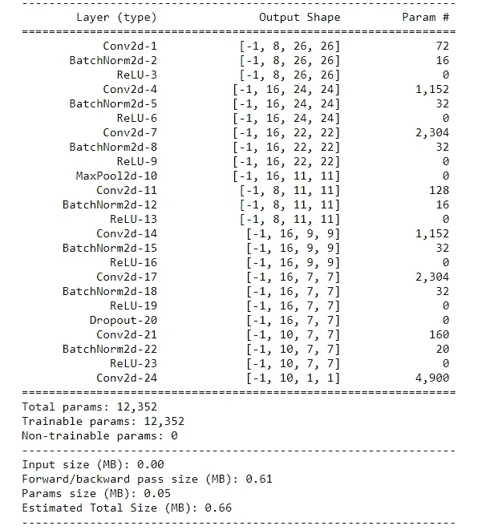

# 深度神经网络模型之旅。

> 原文：<https://medium.com/analytics-vidhya/the-journey-of-a-deep-neural-network-model-3a7697c88f7b?source=collection_archive---------13----------------------->


# 第一轮

在第一轮中，我们将使用 Pytorch 为我们的 DNN 设置基本的代码设置。


代码链接:-

[](https://github.com/rashutyagi/Journey-of-a-DNN/blob/master/Round%20-%201%20Code%20Setup.ipynb) [## 拉舒塔吉/DNN 之旅

### permalink dissolve GitHub 是 4000 多万开发人员的家园，他们一起工作来托管和审查代码，管理…

github.com](https://github.com/rashutyagi/Journey-of-a-DNN/blob/master/Round%20-%201%20Code%20Setup.ipynb) 

# 结果:-


## 1.)最佳训练准确率:99.99%

## 2.)最佳测试准确率:99.41%

## 3.)参数数量:630 万。

## 正如我们可以看到的，我们的最佳训练精度为 99.99%，最佳测试精度仅为 99.41%，这意味着我们的模型无法进一步推进，因为它已经实现了 99.4%的如此高的训练精度，并且与测试精度有很大的差距，因此模型过度拟合。

## 此外，请注意，对于这样一个简单的用例，我们使用了 630 万个参数，因此我们可以说，对于这样一个问题，它是一个极其沉重的模型。

## 转到第二轮，我们尝试进一步改进。

# 第二轮

在第一轮中，我们使用了类似的任何东西，如通道数和层数，我们必须记住，我们需要检查参数的数量，因此让我们在这一轮中尝试为我们的模型创建基本框架。

代码链接:-

[](https://github.com/rashutyagi/Journey-of-a-DNN/blob/master/Round%20-%202%20Basic%20Skeleton..ipynb) [## 拉舒塔吉/DNN 之旅

### permalink dissolve GitHub 是 4000 多万开发人员的家园，他们一起工作来托管和审查代码，管理…

github.com](https://github.com/rashutyagi/Journey-of-a-DNN/blob/master/Round%20-%202%20Basic%20Skeleton..ipynb) 

## 结果:-

## 1.)最佳训练准确率:99.41%

## 2.)最佳测试准确率:99.01%

## 3.)参数数量:194000

## 该模型的参数数量仍然很多，因此模型仍然很大，尽管我们已经减少了过拟合，但模型中仍然存在一些过拟合。

通过过度拟合，我的意思是测试精度和训练精度之间的差异有点高，并且训练精度被推得如此之高，以至于进一步增加它将无助于增加测试精度。

## 转到第 3 轮，我们尝试进一步改进。

# 第三轮

在这一轮中，我们将尝试建立一个具有更少参数的更轻的模型，并且可以通过减少模型的容量来减少参数的数量，这意味着减少层中的通道数量。


代码链接:-

[](https://github.com/rashutyagi/Journey-of-a-DNN/blob/master/Round%20-%203%20Lighter%20Model.ipynb) [## 拉舒塔吉/DNN 之旅

### permalink dissolve GitHub 使上下文切换变得容易。阅读渲染文档，查看历史记录…

github.com](https://github.com/rashutyagi/Journey-of-a-DNN/blob/master/Round%20-%203%20Lighter%20Model.ipynb) 

## 结果:-

## 1.)最佳训练准确率:98.92%

## 2.)最佳测试准确率:98.87%

## 3.)参数数量:10，790

## 这里的参数数量太少，而且我们的模型在这些参数上也表现得很好。模型中完全没有过拟合，如果我们将模型推得更远一点，精度可以提高。

## 转到第 4 轮，我们将尝试进一步改进。

# 第 4 轮:-

现在我们将应用一个叫做批量标准化的概念。我们将发现用于加速深度学习神经网络训练的**批量归一化**方法**。**


代码链接:-

[](https://github.com/rashutyagi/Journey-of-a-DNN/blob/master/Round%20-%204%20Applying%20Batch%20Normalization..ipynb) [## 拉舒塔吉/DNN 之旅

### permalink dissolve GitHub 是 4000 多万开发人员的家园，他们一起工作来托管和审查代码，管理…

github.com](https://github.com/rashutyagi/Journey-of-a-DNN/blob/master/Round%20-%204%20Applying%20Batch%20Normalization..ipynb) 

## 结果:-

## 1.)最佳训练准确率:99.90%

## 2.)最佳测试准确度:99.25%

## 3.)参数数量:10，760

## 这里的参数数量太少，而且我们的模型在这些参数上也表现得很好。但是在模型中存在过度拟合，因为我们可以看到这次训练和测试精度之间的差距非常大。而且训练准确率不能再推一点，才能让我们的测试准确率达到 99.4%。

## 为了消除过度拟合，我们使用正则化技术。

## 转到第 5 轮，我们尝试进一步改进。

# 第 5 轮:-

正如我们在第 4 轮模型中看到的，我们的模型中有很多过度拟合，因此我们的直接步骤是减少过度拟合，以更好地概括我们的模型，从而减少训练和测试准确性之间的差距。

为了处理过度拟合，我们使用正则化的概念。有各种各样的正规化技术，其中一种就是我们将在第五轮中使用的“辍学”技术。


辍学。


# **代码链接:-**

[](https://github.com/rashutyagi/Journey-of-a-DNN/blob/master/Round%20-%205%20Bringing%20In%20Regularization.ipynb) [## 拉舒塔吉/DNN 之旅

### permalink dissolve GitHub 是 4000 多万开发人员的家园，他们一起工作来托管和审查代码，管理…

github.com](https://github.com/rashutyagi/Journey-of-a-DNN/blob/master/Round%20-%205%20Bringing%20In%20Regularization.ipynb) 

# 结果:-

# 1.)最佳训练准确率:99.53%

# 2.)最佳测试准确率:99.35%

# 3.)参数数量:12，352

# 正规化在这里确实起了作用，但这不是我们应该采取的理想方式。我们不是上帝。

# 该模型可以进一步推进，但以目前的产能，这是不可能的。我们还可以看到，近一半的参数位于我们使用 7*7 内核的层中，因为这里我们使用了一个非常大的内核，而不是我们应该使用的全局平均池(GAP)层。

# 转到第 6 轮，我们将尝试进一步改进。

# 第 6 轮:-

在上一轮中，辍学者没有问题，但我们应用他们的方式有问题，这个问题是故意这样做的，以便更多地关注它，并将在即将到来的几轮中得到改善。

现在，由于我们希望减少参数的数量，也希望我们的精度进一步提高，我们需要关注一件事，即在第 5 轮中，我们可以看到大约 50%的参数将用于最后一个卷积层的计算，我们使用了 7*7 的巨大内核大小，因此我们的直接步骤是以某种方式处理这一问题

为了处理这个大内核卷积问题，我们将使用全局平均池(GAP)的概念。


# 代码链接:-

[](https://github.com/rashutyagi/Journey-of-a-DNN/blob/master/Round%20-%206%20Global%20Average%20Pooling.ipynb) [## 拉舒塔吉/DNN 之旅

### permalink dissolve GitHub 是 4000 多万开发人员的家园，他们一起工作来托管和审查代码，管理…

github.com](https://github.com/rashutyagi/Journey-of-a-DNN/blob/master/Round%20-%206%20Global%20Average%20Pooling.ipynb) 

## 结果:-

## 1.)最佳训练准确率:98.92%

## 2.)最佳测试准确率:98.88%

## 3.)参数数量:5688

## 现在看到上面的结果决不能得出间隙层降低精度的结论，因为我们不能将 11000 参数模型的精度与 6000 参数模型的精度进行比较。

## 正规化在这里确实起了作用，但这不是我们应该采取的理想方式。我们不是上帝。我们很快就会看到正确的方法。

## 该模型可以被进一步推进，但是对于当前的容量(通道数量)，这是不可能的。

## 转到第 7 轮，我们尝试进一步改进。

# 第 7 轮:-

现在，在这一轮中，我们将尝试增加模型的容量，通过模型的容量，我们的意思是说，我们在层中接近的通道数量现在将进一步增加，并将比较准确性。

我们将增加到 32 个通道，因为我们必须记住在增加通道数量后参数数量会大幅增加，因此为了将参数数量保持在 10，000 以下，我们将增加到 32 个通道。


# 代码链接:-

[](https://github.com/rashutyagi/Journey-of-a-DNN/blob/master/Round%20-%207%20Increasing%20the%20capacity%20of%20our%20model.ipynb) [## 拉舒塔吉/DNN 之旅

### permalink dissolve GitHub 是 4000 多万开发人员的家园，他们一起工作来托管和审查代码，管理…

github.com](https://github.com/rashutyagi/Journey-of-a-DNN/blob/master/Round%20-%207%20Increasing%20the%20capacity%20of%20our%20model.ipynb) 

## 结果:-

## 1.)最佳训练准确率:99.71%

## 2.)最佳测试准确率:99.30%

## 3.)参数数量:9896

## 正规化在这里确实起了作用，但没有我们希望的那么好，这是因为这不是我们应该采取的理想方式，靠我们自己在任何地方申请退学我们不是上帝。

## 转到第 8 轮，我们将尝试进一步改进。

# 第 8 轮:-

现在，在这一轮中，我们将以正确的方式应用辍学正则化技术，正确的方式是不要在您选择的任何层之后应用它，因为我们永远无法知道它应该在哪里应用，因此我们遵循我们在除了最后一层之外的每一层之后应用的方法，然后与之前相比获得更好的结果。

第二件最重要的事情是，我们在最后应用间隙层，这不是一个好主意，因为这样一来，每个层都开始像一个热点矢量一样工作，这反过来意味着每个通道将开始表示数据集的一个类，这是我们不希望的，我们希望多个通道能够表示我们的单个类，因此我们也在间隙层后应用卷积。


此外，请记住，一旦我们的卷积覆盖了图像中的图案所需的感受野，我们就应该应用最大池来表示某些东西(就像在 MNIST 数据集中，当您缩放和查看数据集图像时，我使用它需要 5 个像素，因此我在第二次卷积后应用了最大池，在那里它已经达到了 5*5 的感受野)


代码链接:-

[](https://github.com/rashutyagi/Journey-of-a-DNN/blob/master/Round%20-%208%20Some%20more%20changes%20.ipynb) [## 拉舒塔吉/DNN 之旅

### permalink dissolve GitHub 是 4000 多万开发人员的家园，他们一起工作来托管和审查代码，管理…

github.com](https://github.com/rashutyagi/Journey-of-a-DNN/blob/master/Round%20-%208%20Some%20more%20changes%20.ipynb) 

## 结果:-

## 1.)最佳训练准确率:99.36%

## 2.)最佳测试准确率:99.36%

## 3.)参数数量:13，848

## 正则化在这里工作得非常完美，因为我们根本没有过度拟合。

## 转到第 9 轮，我们尝试进一步改进。

# 第 9 轮:-

直到我们的模型 8，我们达到了良好的准确性，但我们希望看到它更频繁。因此，我们将应用的下一个概念是图像增强的概念，简单来说，这意味着我们将通过在训练数据中引入旋转等变换来使训练数据更难学习。反过来，这有助于使我们的模型更加通用。

当涉及更复杂的数据集和包含大量类的数据集时，图像增强是一个非常重要的概念。

我们将把我们的训练数据图像旋转几度，然后将它们发送到训练中。


如果你认不出我，你的 DNN 就没用了！训练更努力的家伙使用图像增强 91 狗黑帮！

# 代码链接:-

[](https://github.com/rashutyagi/Journey-of-a-DNN/blob/master/Round%20-%209%20Introducing%20Image%20Augmentation%20.ipynb) [## 拉舒塔吉/DNN 之旅

### permalink dissolve GitHub 是 4000 多万开发人员的家园，他们一起工作来托管和审查代码，管理…

github.com](https://github.com/rashutyagi/Journey-of-a-DNN/blob/master/Round%20-%209%20Introducing%20Image%20Augmentation%20.ipynb) 

## 结果:-

## 1.)最佳训练准确率:98.88%

## 2.)最佳测试准确率:99.41%

## 3.)参数数量:9896

## 正则化在这里工作得非常完美，因为我们根本没有过度拟合。

## 但我们可以看到一点点拟合不足，因为我们知道我们已经使我们的训练数据更难，因此训练精度预计会变低。我们在测试数据中可能没有这样硬的图像，因此测试精度是好的。

## 转到第 10 轮，我们将尝试进一步改进

# 第十轮(决赛):-

这是我们最后的模型，我们使用了最后的技术

“学习率调度程序”。它的目的是在每一定数量的时期之后降低学习率，它也有助于我们的模型损失更快地收敛到它的最小可能。

使用这种方法后，我们将尝试用尽可能少的参数和时期获得尽可能高的精度。


代码链接:-

[](https://github.com/rashutyagi/Journey-of-a-DNN/blob/master/Round%2010%20Final.ipynb) [## 拉舒塔吉/DNN 之旅

### permalink dissolve GitHub 是 4000 多万开发人员的家园，他们一起工作来托管和审查代码，管理…

github.com](https://github.com/rashutyagi/Journey-of-a-DNN/blob/master/Round%2010%20Final.ipynb) 

## 结果:-

## 1.)最佳训练准确率:99.97%

## 2.)最佳测试准确率:99.44%

## 3.)参数数量:9896

## 在我们的最终模型中，我们在第 12 个时期使用 9896 个参数获得了 99.44%的测试准确度。

最终模型历元日志(20 个历元):-

```
EPOCH: 0Loss=0.1162916049361229 Batch_id=468 Accuracy=91.29: 100%|███████████████████████████| 469/469 [00:07<00:00, 80.91it/s]Test set: Average loss: 0.0481, Accuracy: 9862/10000 (98.62%)

EPOCH: 1Loss=0.05616094172000885 Batch_id=468 Accuracy=97.64: 100%|██████████████████████████| 469/469 [00:07<00:00, 61.17it/s]Test set: Average loss: 0.0513, Accuracy: 9836/10000 (98.36%)

EPOCH: 2Loss=0.11810651421546936 Batch_id=468 Accuracy=98.03: 100%|██████████████████████████| 469/469 [00:12<00:00, 80.33it/s]Test set: Average loss: 0.0314, Accuracy: 9899/10000 (98.99%)

EPOCH: 3Loss=0.021130084991455078 Batch_id=468 Accuracy=98.24: 100%|█████████████████████████| 469/469 [00:07<00:00, 80.65it/s]Test set: Average loss: 0.0363, Accuracy: 9887/10000 (98.87%)

EPOCH: 4Loss=0.10834845155477524 Batch_id=468 Accuracy=98.39: 100%|██████████████████████████| 469/469 [00:07<00:00, 62.83it/s]Test set: Average loss: 0.0300, Accuracy: 9914/10000 (99.14%)

EPOCH: 5Loss=0.03899098560214043 Batch_id=468 Accuracy=98.48: 100%|██████████████████████████| 469/469 [00:07<00:00, 62.47it/s]Test set: Average loss: 0.0252, Accuracy: 9920/10000 (99.20%)

EPOCH: 6Loss=0.022102728486061096 Batch_id=468 Accuracy=98.58: 100%|█████████████████████████| 469/469 [00:07<00:00, 60.85it/s]Test set: Average loss: 0.0258, Accuracy: 9919/10000 (99.19%)

EPOCH: 7Loss=0.0121208680793643 Batch_id=468 Accuracy=98.63: 100%|███████████████████████████| 469/469 [00:07<00:00, 61.30it/s]Test set: Average loss: 0.0216, Accuracy: 9935/10000 (99.35%)

EPOCH: 8Loss=0.030048644170165062 Batch_id=468 Accuracy=98.77: 100%|█████████████████████████| 469/469 [00:12<00:00, 37.28it/s]Test set: Average loss: 0.0210, Accuracy: 9930/10000 (99.30%)

EPOCH: 9Loss=0.002635945798829198 Batch_id=468 Accuracy=98.78: 100%|█████████████████████████| 469/469 [00:07<00:00, 60.36it/s]Test set: Average loss: 0.0225, Accuracy: 9924/10000 (99.24%)

EPOCH: 10Loss=0.03299098461866379 Batch_id=468 Accuracy=98.72: 100%|██████████████████████████| 469/469 [00:12<00:00, 37.86it/s]Test set: Average loss: 0.0260, Accuracy: 9921/10000 (99.21%)

EPOCH: 11Loss=0.03195049613714218 Batch_id=468 Accuracy=98.73: 100%|██████████████████████████| 469/469 [00:07<00:00, 61.06it/s]Test set: Average loss: 0.0217, Accuracy: 9926/10000 (99.26%)

EPOCH: 12Loss=0.04026757553219795 Batch_id=468 Accuracy=98.86: 100%|██████████████████████████| 469/469 [00:07<00:00, 59.72it/s]Test set: Average loss: 0.0181, Accuracy: 9944/10000 (99.44%)

EPOCH: 13Loss=0.0159068014472723 Batch_id=468 Accuracy=98.83: 100%|███████████████████████████| 469/469 [00:07<00:00, 60.81it/s]Test set: Average loss: 0.0215, Accuracy: 9927/10000 (99.27%)

EPOCH: 14Loss=0.011734549887478352 Batch_id=468 Accuracy=98.89: 100%|█████████████████████████| 469/469 [00:07<00:00, 60.12it/s]Test set: Average loss: 0.0227, Accuracy: 9928/10000 (99.28%)

EPOCH: 15Loss=0.031209371984004974 Batch_id=468 Accuracy=98.91: 100%|█████████████████████████| 469/469 [00:08<00:00, 58.46it/s]Test set: Average loss: 0.0237, Accuracy: 9920/10000 (99.20%)

EPOCH: 16Loss=0.049311209470033646 Batch_id=468 Accuracy=98.88: 100%|█████████████████████████| 469/469 [00:07<00:00, 59.71it/s]Test set: Average loss: 0.0240, Accuracy: 9918/10000 (99.18%)

EPOCH: 17Loss=0.05350984260439873 Batch_id=468 Accuracy=98.92: 100%|██████████████████████████| 469/469 [00:07<00:00, 80.45it/s]Test set: Average loss: 0.0185, Accuracy: 9943/10000 (99.43%)

EPOCH: 18Loss=0.0037606756668537855 Batch_id=468 Accuracy=98.93: 100%|████████████████████████| 469/469 [00:12<00:00, 37.66it/s]Test set: Average loss: 0.0192, Accuracy: 9944/10000 (99.44%)

EPOCH: 19Loss=0.03514719009399414 Batch_id=468 Accuracy=98.97: 100%|██████████████████████████| 469/469 [00:07<00:00, 60.26it/s]Test set: Average loss: 0.0240, Accuracy: 9923/10000 (99.23%)
```


如果你在构建 DNN 时没有像上面所示的那样非常仔细地遵循每一个步骤，你会把这只猫当成狗，她会难过，所以不要让她难过，要始终遵循网络训练的基本原则。

# 谢谢你！